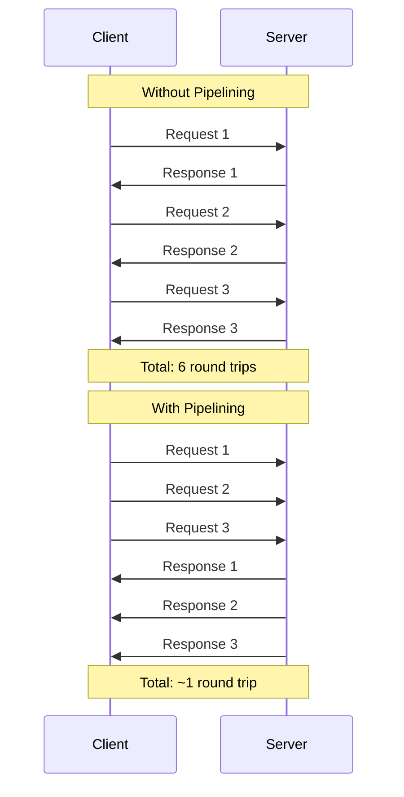

# How to Configure Request Pipelining

Author: [nawazdhandala](https://www.github.com/nawazdhandala)

Tags: Pipelining, HTTP/2, Performance, Networking, Redis, Backend, Optimization

Description: Learn how to configure request pipelining to maximize throughput and reduce latency. This guide covers HTTP/2 multiplexing, Redis pipelining, and database request batching with practical examples.

---

> Request pipelining allows multiple requests to be sent without waiting for each response. Instead of the traditional request-response-request-response pattern, pipelining enables request-request-request-response-response-response. This can dramatically improve throughput, especially for high-latency connections.

This guide shows you how to implement and configure pipelining across different protocols and systems.

---

## How Pipelining Works



Benefits of pipelining:
- Reduced latency (fewer round trips)
- Higher throughput (better network utilization)
- More efficient use of connections

---

## HTTP/2 Multiplexing

HTTP/2 provides built-in request pipelining through multiplexing. Multiple requests can be sent over a single connection without head-of-line blocking.

### Enabling HTTP/2 in Python

```python
# httpx_http2.py
import httpx
import asyncio
from typing import List, Dict
import time

class HTTP2Client:
    """HTTP/2 client with multiplexing for parallel requests"""

    def __init__(self, base_url: str, max_connections: int = 100):
        # httpx supports HTTP/2 natively
        self.client = httpx.AsyncClient(
            base_url=base_url,
            http2=True,  # Enable HTTP/2
            limits=httpx.Limits(
                max_connections=max_connections,
                max_keepalive_connections=20,
            ),
            timeout=httpx.Timeout(30.0)
        )

    async def get(self, path: str) -> Dict:
        """Single GET request"""
        response = await self.client.get(path)
        response.raise_for_status()
        return response.json()

    async def get_many(self, paths: List[str]) -> List[Dict]:
        """
        Fetch multiple paths concurrently.
        HTTP/2 multiplexes these over a single connection.
        """
        tasks = [self.get(path) for path in paths]
        return await asyncio.gather(*tasks)

    async def close(self):
        await self.client.aclose()


# Benchmark HTTP/1.1 vs HTTP/2
async def benchmark():
    paths = [f"/items/{i}" for i in range(100)]

    # HTTP/1.1
    http1_client = httpx.AsyncClient(
        base_url="https://api.example.com",
        http2=False
    )
    start = time.perf_counter()
    await asyncio.gather(*[http1_client.get(p) for p in paths])
    http1_time = time.perf_counter() - start
    await http1_client.aclose()

    # HTTP/2
    http2_client = httpx.AsyncClient(
        base_url="https://api.example.com",
        http2=True
    )
    start = time.perf_counter()
    await asyncio.gather(*[http2_client.get(p) for p in paths])
    http2_time = time.perf_counter() - start
    await http2_client.aclose()

    print(f"HTTP/1.1: {http1_time:.2f}s")
    print(f"HTTP/2: {http2_time:.2f}s")
    print(f"Speedup: {http1_time/http2_time:.2f}x")

asyncio.run(benchmark())
```

### Node.js HTTP/2 Client

```javascript
// http2-client.js
const http2 = require('http2');

class HTTP2Client {
  constructor(baseUrl) {
    this.baseUrl = baseUrl;
    this.client = null;
  }

  connect() {
    return new Promise((resolve, reject) => {
      this.client = http2.connect(this.baseUrl);

      this.client.on('connect', () => {
        console.log('HTTP/2 connection established');
        resolve();
      });

      this.client.on('error', reject);
    });
  }

  async get(path) {
    return new Promise((resolve, reject) => {
      const req = this.client.request({
        ':path': path,
        ':method': 'GET',
      });

      let data = '';
      req.on('data', chunk => data += chunk);
      req.on('end', () => resolve(JSON.parse(data)));
      req.on('error', reject);

      req.end();
    });
  }

  async getMany(paths) {
    // All requests multiplexed over single connection
    return Promise.all(paths.map(path => this.get(path)));
  }

  close() {
    if (this.client) {
      this.client.close();
    }
  }
}

// Usage
async function main() {
  const client = new HTTP2Client('https://api.example.com');
  await client.connect();

  const paths = Array.from({ length: 100 }, (_, i) => `/items/${i}`);

  console.time('HTTP/2 fetch');
  const results = await client.getMany(paths);
  console.timeEnd('HTTP/2 fetch');

  console.log(`Fetched ${results.length} items`);
  client.close();
}

main();
```

### Go HTTP/2 Client

```go
// http2_client.go
package main

import (
    "crypto/tls"
    "io"
    "net/http"
    "sync"
    "time"

    "golang.org/x/net/http2"
)

// Create HTTP/2 client
func createHTTP2Client() *http.Client {
    transport := &http2.Transport{
        TLSClientConfig: &tls.Config{
            InsecureSkipVerify: false,
        },
        AllowHTTP:          false,
        DisableCompression: false,
        // Connection settings
        ReadIdleTimeout:  30 * time.Second,
        PingTimeout:      15 * time.Second,
        WriteByteTimeout: 10 * time.Second,
    }

    return &http.Client{
        Transport: transport,
        Timeout:   30 * time.Second,
    }
}

// Fetch multiple URLs concurrently over HTTP/2
func fetchMany(client *http.Client, urls []string) ([][]byte, error) {
    results := make([][]byte, len(urls))
    errors := make([]error, len(urls))

    var wg sync.WaitGroup
    for i, url := range urls {
        wg.Add(1)
        go func(idx int, u string) {
            defer wg.Done()
            resp, err := client.Get(u)
            if err != nil {
                errors[idx] = err
                return
            }
            defer resp.Body.Close()
            results[idx], errors[idx] = io.ReadAll(resp.Body)
        }(i, url)
    }

    wg.Wait()

    // Check for errors
    for _, err := range errors {
        if err != nil {
            return nil, err
        }
    }

    return results, nil
}
```

---

## Redis Pipelining

Redis pipelining sends multiple commands without waiting for individual responses.

### Python Redis Pipeline

```python
# redis_pipeline.py
import redis
import time
from typing import List, Tuple, Any

class RedisPipeline:
    """Redis client with pipelining for batch operations"""

    def __init__(self, redis_url: str = "redis://localhost:6379"):
        self.redis = redis.from_url(redis_url)

    def set_many_sequential(self, items: List[Tuple[str, Any]]) -> float:
        """Slow: Set items one at a time"""
        start = time.perf_counter()
        for key, value in items:
            self.redis.set(key, value)
        return time.perf_counter() - start

    def set_many_pipeline(self, items: List[Tuple[str, Any]]) -> float:
        """Fast: Set items using pipeline"""
        start = time.perf_counter()

        # Create pipeline
        pipe = self.redis.pipeline(transaction=False)

        # Queue all commands
        for key, value in items:
            pipe.set(key, value)

        # Execute all at once
        pipe.execute()

        return time.perf_counter() - start

    def get_many_pipeline(self, keys: List[str]) -> List[Any]:
        """Get multiple keys using pipeline"""
        pipe = self.redis.pipeline(transaction=False)

        for key in keys:
            pipe.get(key)

        return pipe.execute()

    def mixed_operations_pipeline(self):
        """Mix different operations in a single pipeline"""
        pipe = self.redis.pipeline(transaction=False)

        # Queue various operations
        pipe.set("user:1:name", "Alice")
        pipe.incr("user:1:visits")
        pipe.lpush("recent_users", "user:1")
        pipe.expire("user:1:session", 3600)
        pipe.get("user:1:name")

        # Execute all and get results
        results = pipe.execute()
        return {
            'set_result': results[0],
            'visits': results[1],
            'list_length': results[2],
            'expire_result': results[3],
            'name': results[4]
        }

    def batch_pipeline(self, items: List[Tuple[str, Any]],
                       batch_size: int = 1000) -> int:
        """Process items in batched pipelines to avoid memory issues"""
        total = 0

        for i in range(0, len(items), batch_size):
            batch = items[i:i + batch_size]
            pipe = self.redis.pipeline(transaction=False)

            for key, value in batch:
                pipe.set(key, value)

            pipe.execute()
            total += len(batch)

        return total


# Benchmark
client = RedisPipeline()
items = [(f"key:{i}", f"value:{i}") for i in range(10000)]

sequential_time = client.set_many_sequential(items[:100])
pipeline_time = client.set_many_pipeline(items[:100])

print(f"Sequential (100 items): {sequential_time*1000:.2f}ms")
print(f"Pipeline (100 items): {pipeline_time*1000:.2f}ms")
print(f"Speedup: {sequential_time/pipeline_time:.1f}x")
```

### Node.js Redis Pipeline

```javascript
// redis-pipeline.js
const Redis = require('ioredis');

class RedisPipelineClient {
  constructor(url = 'redis://localhost:6379') {
    this.redis = new Redis(url);
  }

  async setManySequential(items) {
    const start = Date.now();
    for (const [key, value] of items) {
      await this.redis.set(key, value);
    }
    return Date.now() - start;
  }

  async setManyPipeline(items) {
    const start = Date.now();

    // Create pipeline
    const pipeline = this.redis.pipeline();

    // Queue commands
    for (const [key, value] of items) {
      pipeline.set(key, value);
    }

    // Execute all
    await pipeline.exec();

    return Date.now() - start;
  }

  async getManyPipeline(keys) {
    const pipeline = this.redis.pipeline();

    for (const key of keys) {
      pipeline.get(key);
    }

    const results = await pipeline.exec();
    return results.map(([err, value]) => value);
  }

  async mixedOperations() {
    const pipeline = this.redis.pipeline();

    pipeline.set('user:1:name', 'Alice');
    pipeline.incr('user:1:visits');
    pipeline.lpush('recent_users', 'user:1');
    pipeline.expire('user:1:session', 3600);
    pipeline.get('user:1:name');

    const results = await pipeline.exec();
    return {
      setResult: results[0][1],
      visits: results[1][1],
      listLength: results[2][1],
      expireResult: results[3][1],
      name: results[4][1]
    };
  }

  async close() {
    await this.redis.quit();
  }
}

// Usage
async function main() {
  const client = new RedisPipelineClient();

  const items = Array.from({ length: 1000 }, (_, i) => [`key:${i}`, `value:${i}`]);

  const sequentialTime = await client.setManySequential(items.slice(0, 100));
  const pipelineTime = await client.setManyPipeline(items.slice(0, 100));

  console.log(`Sequential: ${sequentialTime}ms`);
  console.log(`Pipeline: ${pipelineTime}ms`);
  console.log(`Speedup: ${(sequentialTime / pipelineTime).toFixed(1)}x`);

  await client.close();
}

main();
```

---

## Database Query Pipelining

### PostgreSQL Asynchronous Queries

```python
# postgres_pipeline.py
import asyncpg
import asyncio
from typing import List, Tuple, Any

class AsyncPostgresClient:
    """PostgreSQL client with query pipelining"""

    def __init__(self, dsn: str):
        self.dsn = dsn
        self.pool = None

    async def connect(self, min_size: int = 5, max_size: int = 20):
        self.pool = await asyncpg.create_pool(
            dsn=self.dsn,
            min_size=min_size,
            max_size=max_size,
            command_timeout=30
        )

    async def query_sequential(self, queries: List[Tuple[str, tuple]]) -> List[Any]:
        """Execute queries one at a time"""
        results = []
        async with self.pool.acquire() as conn:
            for query, params in queries:
                result = await conn.fetch(query, *params)
                results.append(result)
        return results

    async def query_pipeline(self, queries: List[Tuple[str, tuple]]) -> List[Any]:
        """Execute queries concurrently (pipelined)"""
        async with self.pool.acquire() as conn:
            # Prepare statements
            prepared = []
            for query, params in queries:
                stmt = await conn.prepare(query)
                prepared.append((stmt, params))

            # Execute all concurrently
            tasks = [stmt.fetch(*params) for stmt, params in prepared]
            return await asyncio.gather(*tasks)

    async def multi_table_fetch(self, user_id: int) -> dict:
        """Fetch from multiple tables concurrently"""
        queries = [
            ("SELECT * FROM users WHERE id = $1", (user_id,)),
            ("SELECT * FROM orders WHERE user_id = $1", (user_id,)),
            ("SELECT * FROM preferences WHERE user_id = $1", (user_id,)),
        ]

        results = await self.query_pipeline(queries)
        return {
            'user': results[0][0] if results[0] else None,
            'orders': list(results[1]),
            'preferences': results[2][0] if results[2] else None,
        }

    async def close(self):
        if self.pool:
            await self.pool.close()


# Usage
async def main():
    client = AsyncPostgresClient("postgresql://localhost/mydb")
    await client.connect()

    # Fetch user data from multiple tables concurrently
    user_data = await client.multi_table_fetch(user_id=123)
    print(user_data)

    await client.close()

asyncio.run(main())
```

---

## gRPC Streaming for Pipelining

```python
# grpc_streaming.py
import grpc
import asyncio
from typing import AsyncIterator, List

class GRPCStreamingClient:
    """gRPC client with bidirectional streaming for request pipelining"""

    def __init__(self, channel: grpc.aio.Channel, stub_class):
        self.stub = stub_class(channel)

    async def batch_unary(self, requests: List) -> List:
        """Send multiple unary requests concurrently"""
        tasks = [self.stub.ProcessItem(req) for req in requests]
        return await asyncio.gather(*tasks)

    async def server_streaming(self, request) -> AsyncIterator:
        """Server streaming - single request, multiple responses"""
        async for response in self.stub.StreamItems(request):
            yield response

    async def client_streaming(self, requests: AsyncIterator):
        """Client streaming - multiple requests, single response"""
        return await self.stub.BatchProcess(requests)

    async def bidirectional_streaming(self, requests: AsyncIterator) -> AsyncIterator:
        """
        Bidirectional streaming - true pipelining.
        Send requests and receive responses concurrently.
        """
        async for response in self.stub.ProcessStream(requests):
            yield response


# Usage for bidirectional streaming
async def process_items(client, items):
    async def request_generator():
        for item in items:
            yield ProcessRequest(item=item)

    results = []
    async for response in client.bidirectional_streaming(request_generator()):
        results.append(response)
        # Can process responses as they arrive

    return results
```

---

## Monitoring Pipeline Performance

```python
# pipeline_metrics.py
from prometheus_client import Histogram, Counter
import time
from functools import wraps

# Metrics
pipeline_batch_size = Histogram(
    'pipeline_batch_size',
    'Number of requests in pipeline batch',
    ['operation'],
    buckets=[1, 5, 10, 50, 100, 500, 1000]
)

pipeline_duration = Histogram(
    'pipeline_duration_seconds',
    'Time to execute pipeline',
    ['operation'],
    buckets=[0.001, 0.005, 0.01, 0.05, 0.1, 0.5, 1]
)

pipeline_requests_total = Counter(
    'pipeline_requests_total',
    'Total requests processed via pipeline',
    ['operation']
)

def monitored_pipeline(operation: str):
    """Decorator to monitor pipeline operations"""
    def decorator(func):
        @wraps(func)
        async def wrapper(items, *args, **kwargs):
            batch_size = len(items)
            pipeline_batch_size.labels(operation=operation).observe(batch_size)

            start = time.perf_counter()
            result = await func(items, *args, **kwargs)
            duration = time.perf_counter() - start

            pipeline_duration.labels(operation=operation).observe(duration)
            pipeline_requests_total.labels(operation=operation).inc(batch_size)

            return result
        return wrapper
    return decorator

# Usage
@monitored_pipeline('redis_set')
async def pipeline_set(items):
    pipe = redis.pipeline()
    for key, value in items:
        pipe.set(key, value)
    return await pipe.execute()
```

---

## Best Practices Summary

| Protocol | Pipelining Method | Max Batch Size |
|----------|------------------|----------------|
| HTTP/2 | Multiplexing | 100-1000 concurrent streams |
| Redis | Pipeline commands | 1000-10000 commands |
| PostgreSQL | Async queries | 10-100 concurrent queries |
| gRPC | Streaming | Based on message size |

---

## When to Use Pipelining

Use pipelining when:
- High latency connections (remote services, cross-region)
- Batch operations (bulk inserts, cache warming)
- Independent requests (no dependencies between requests)
- Read-heavy workloads

Avoid pipelining when:
- Requests depend on previous responses
- Memory constraints (pipelining buffers responses)
- Order matters and cannot be reordered
- Single, latency-sensitive request

---

## Conclusion

Request pipelining is a powerful technique for improving throughput:

1. **Use HTTP/2**: Built-in multiplexing for web requests
2. **Pipeline Redis commands**: Massive speedup for batch operations
3. **Parallel database queries**: Fetch from multiple tables concurrently
4. **Monitor batch sizes**: Track pipeline efficiency
5. **Choose appropriate batch sizes**: Balance throughput vs memory

Pipelining can provide 10-100x throughput improvements for batch operations with minimal code changes.

---

*Need to monitor your service performance? [OneUptime](https://oneuptime.com) provides latency monitoring with request batching insights and throughput tracking.*
