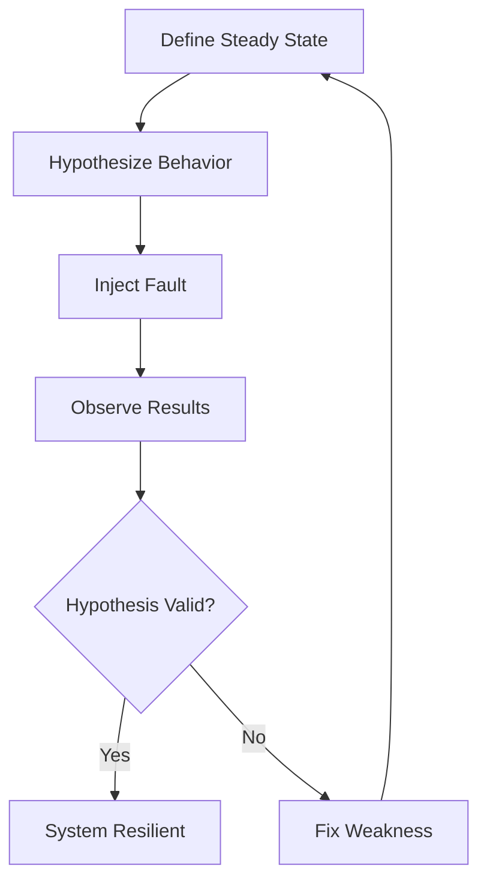

# How to Configure Resilience Testing

Author: [nawazdhandala](https://github.com/nawazdhandala)

Tags: Chaos Engineering, Resilience Testing, Fault Injection, Kubernetes, DevOps

Description: Learn to implement resilience testing with chaos engineering principles, injecting faults like network failures, resource exhaustion, and service outages to validate system behavior under stress.

---

Resilience testing verifies that your system handles failures gracefully. By intentionally injecting faults like network partitions, service crashes, and resource exhaustion, you discover weaknesses before they cause production incidents. This guide covers implementing resilience testing using chaos engineering tools and practices.

## Chaos Engineering Principles

The chaos engineering approach follows a scientific method:



## Chaos Mesh Installation

Chaos Mesh is a Kubernetes-native chaos engineering platform. Install it:

```bash
# Add Chaos Mesh Helm repository
helm repo add chaos-mesh https://charts.chaos-mesh.org

# Create namespace
kubectl create ns chaos-mesh

# Install Chaos Mesh
helm install chaos-mesh chaos-mesh/chaos-mesh \
    --namespace=chaos-mesh \
    --set chaosDaemon.runtime=containerd \
    --set chaosDaemon.socketPath=/run/containerd/containerd.sock
```

## Network Fault Injection

Test how your services handle network issues:

```yaml
# network-delay.yaml
# Inject 100ms latency into traffic to the database
apiVersion: chaos-mesh.org/v1alpha1
kind: NetworkChaos
metadata:
  name: database-latency
  namespace: production
spec:
  action: delay
  mode: all
  selector:
    namespaces:
      - production
    labelSelectors:
      app: api-server
  delay:
    latency: "100ms"
    correlation: "25"
    jitter: "10ms"
  direction: to
  target:
    selector:
      namespaces:
        - production
      labelSelectors:
        app: postgres
    mode: all
  duration: "5m"
```

Test network partition between services:

```yaml
# network-partition.yaml
# Simulate network partition between order and inventory services
apiVersion: chaos-mesh.org/v1alpha1
kind: NetworkChaos
metadata:
  name: order-inventory-partition
  namespace: production
spec:
  action: partition
  mode: all
  selector:
    namespaces:
      - production
    labelSelectors:
      app: order-service
  direction: both
  target:
    selector:
      namespaces:
        - production
      labelSelectors:
        app: inventory-service
    mode: all
  duration: "3m"
```

## Pod Failure Experiments

Test pod crash recovery:

```yaml
# pod-failure.yaml
# Kill random pods to test recovery
apiVersion: chaos-mesh.org/v1alpha1
kind: PodChaos
metadata:
  name: api-pod-failure
  namespace: production
spec:
  action: pod-kill
  mode: one
  selector:
    namespaces:
      - production
    labelSelectors:
      app: api-server
  # Run every 10 minutes
  scheduler:
    cron: "*/10 * * * *"
```

Container kill within a pod:

```yaml
# container-kill.yaml
apiVersion: chaos-mesh.org/v1alpha1
kind: PodChaos
metadata:
  name: sidecar-failure
  namespace: production
spec:
  action: container-kill
  mode: one
  selector:
    namespaces:
      - production
    labelSelectors:
      app: api-server
  containerNames:
    - envoy-proxy
  duration: "30s"
```

## Stress Testing

Inject CPU and memory pressure:

```yaml
# cpu-stress.yaml
# Consume CPU resources to test behavior under load
apiVersion: chaos-mesh.org/v1alpha1
kind: StressChaos
metadata:
  name: cpu-stress-test
  namespace: production
spec:
  mode: all
  selector:
    namespaces:
      - production
    labelSelectors:
      app: compute-service
  stressors:
    cpu:
      workers: 2
      load: 80  # 80% CPU utilization
  duration: "5m"
---
# memory-stress.yaml
# Consume memory to test OOM handling
apiVersion: chaos-mesh.org/v1alpha1
kind: StressChaos
metadata:
  name: memory-stress-test
  namespace: production
spec:
  mode: one
  selector:
    namespaces:
      - production
    labelSelectors:
      app: api-server
  stressors:
    memory:
      workers: 1
      size: "512MB"
  duration: "3m"
```

## DNS Fault Injection

Test DNS resolution failures:

```yaml
# dns-failure.yaml
apiVersion: chaos-mesh.org/v1alpha1
kind: DNSChaos
metadata:
  name: external-api-dns-failure
  namespace: production
spec:
  action: error
  mode: all
  selector:
    namespaces:
      - production
    labelSelectors:
      app: payment-service
  patterns:
    - "api.stripe.com"
    - "api.paypal.com"
  duration: "2m"
```

## Automated Resilience Tests

Create a test framework that runs chaos experiments and validates behavior:

```typescript
// resilience-test.ts
import { KubeConfig, CustomObjectsApi } from '@kubernetes/client-node';
import axios from 'axios';

interface ChaosExperiment {
    name: string;
    manifest: object;
    duration: number; // seconds
    validation: () => Promise<boolean>;
}

class ResilienceTestRunner {
    private k8sApi: CustomObjectsApi;
    private baseUrl: string;

    constructor(baseUrl: string) {
        const kc = new KubeConfig();
        kc.loadFromDefault();
        this.k8sApi = kc.makeApiClient(CustomObjectsApi);
        this.baseUrl = baseUrl;
    }

    // Apply chaos experiment to cluster
    async applyExperiment(experiment: ChaosExperiment): Promise<void> {
        const manifest = experiment.manifest as any;

        await this.k8sApi.createNamespacedCustomObject(
            'chaos-mesh.org',
            'v1alpha1',
            manifest.metadata.namespace,
            this.getResourcePlural(manifest.kind),
            manifest
        );

        console.log(`Applied experiment: ${experiment.name}`);
    }

    // Delete chaos experiment
    async deleteExperiment(experiment: ChaosExperiment): Promise<void> {
        const manifest = experiment.manifest as any;

        await this.k8sApi.deleteNamespacedCustomObject(
            'chaos-mesh.org',
            'v1alpha1',
            manifest.metadata.namespace,
            this.getResourcePlural(manifest.kind),
            manifest.metadata.name
        );

        console.log(`Deleted experiment: ${experiment.name}`);
    }

    private getResourcePlural(kind: string): string {
        const plurals: Record<string, string> = {
            'NetworkChaos': 'networkchaos',
            'PodChaos': 'podchaos',
            'StressChaos': 'stresschaos',
            'DNSChaos': 'dnschaos',
        };
        return plurals[kind] || kind.toLowerCase();
    }

    // Run experiment with validation
    async runExperiment(experiment: ChaosExperiment): Promise<{
        name: string;
        passed: boolean;
        error?: string;
    }> {
        console.log(`\nRunning experiment: ${experiment.name}`);

        try {
            // Apply chaos
            await this.applyExperiment(experiment);

            // Wait for chaos to take effect
            await this.sleep(5000);

            // Run validation during chaos
            const validationPassed = await experiment.validation();

            // Wait for experiment duration
            await this.sleep(experiment.duration * 1000);

            // Clean up
            await this.deleteExperiment(experiment);

            // Wait for recovery
            await this.sleep(10000);

            // Verify system recovered
            const recoveryPassed = await this.verifyRecovery();

            return {
                name: experiment.name,
                passed: validationPassed && recoveryPassed,
            };
        } catch (error: any) {
            // Clean up on error
            try {
                await this.deleteExperiment(experiment);
            } catch {}

            return {
                name: experiment.name,
                passed: false,
                error: error.message,
            };
        }
    }

    // Check if API is responding correctly
    async verifyRecovery(): Promise<boolean> {
        try {
            const response = await axios.get(`${this.baseUrl}/health`, {
                timeout: 5000,
            });
            return response.status === 200;
        } catch {
            return false;
        }
    }

    private sleep(ms: number): Promise<void> {
        return new Promise(resolve => setTimeout(resolve, ms));
    }
}

// Define experiments
const experiments: ChaosExperiment[] = [
    {
        name: 'Database Latency',
        manifest: {
            apiVersion: 'chaos-mesh.org/v1alpha1',
            kind: 'NetworkChaos',
            metadata: {
                name: 'db-latency-test',
                namespace: 'production',
            },
            spec: {
                action: 'delay',
                mode: 'all',
                selector: {
                    namespaces: ['production'],
                    labelSelectors: { app: 'api-server' },
                },
                delay: { latency: '200ms' },
                direction: 'to',
                target: {
                    selector: {
                        namespaces: ['production'],
                        labelSelectors: { app: 'postgres' },
                    },
                    mode: 'all',
                },
                duration: '60s',
            },
        },
        duration: 60,
        validation: async () => {
            // API should still respond, just slower
            const start = Date.now();
            const response = await axios.get('http://api.example.com/products');
            const duration = Date.now() - start;

            // Should respond but with increased latency
            return response.status === 200 && duration < 5000;
        },
    },
    {
        name: 'Pod Crash Recovery',
        manifest: {
            apiVersion: 'chaos-mesh.org/v1alpha1',
            kind: 'PodChaos',
            metadata: {
                name: 'pod-kill-test',
                namespace: 'production',
            },
            spec: {
                action: 'pod-kill',
                mode: 'one',
                selector: {
                    namespaces: ['production'],
                    labelSelectors: { app: 'api-server' },
                },
            },
        },
        duration: 30,
        validation: async () => {
            // With multiple replicas, should still be available
            let successCount = 0;
            for (let i = 0; i < 10; i++) {
                try {
                    const response = await axios.get('http://api.example.com/health');
                    if (response.status === 200) successCount++;
                } catch {}
                await new Promise(r => setTimeout(r, 1000));
            }
            // At least 70% success rate during failure
            return successCount >= 7;
        },
    },
];

// Run all experiments
async function runAllExperiments() {
    const runner = new ResilienceTestRunner('http://api.example.com');
    const results = [];

    for (const experiment of experiments) {
        const result = await runner.runExperiment(experiment);
        results.push(result);
    }

    console.log('\n=== Resilience Test Results ===\n');

    let passed = 0;
    let failed = 0;

    for (const result of results) {
        if (result.passed) {
            console.log(`PASS: ${result.name}`);
            passed++;
        } else {
            console.log(`FAIL: ${result.name}`);
            if (result.error) {
                console.log(`  Error: ${result.error}`);
            }
            failed++;
        }
    }

    console.log(`\nTotal: ${passed} passed, ${failed} failed`);
    process.exit(failed > 0 ? 1 : 0);
}

runAllExperiments();
```

## Steady State Monitoring

Define and monitor steady state metrics:

```yaml
# prometheus-rules.yaml
groups:
  - name: steady-state
    rules:
      # Define steady state for API availability
      - record: steady_state:api_availability
        expr: |
          sum(rate(http_requests_total{status=~"2.."}[5m])) /
          sum(rate(http_requests_total[5m]))

      # Alert when steady state is violated
      - alert: SteadyStateViolation
        expr: steady_state:api_availability < 0.99
        for: 1m
        labels:
          severity: critical
        annotations:
          summary: "API availability dropped below steady state"
          description: "Current availability: {{ $value | humanizePercentage }}"
```

## CI/CD Integration

Run resilience tests in staging before production deployments:

```yaml
# .github/workflows/resilience-tests.yaml
name: Resilience Tests

on:
  push:
    branches: [main]
  schedule:
    # Weekly resilience test
    - cron: '0 3 * * 0'

jobs:
  resilience-test:
    runs-on: ubuntu-latest
    steps:
      - uses: actions/checkout@v4

      - name: Setup kubectl
        uses: azure/setup-kubectl@v3

      - name: Configure kubeconfig
        run: |
          echo "${{ secrets.STAGING_KUBECONFIG }}" > kubeconfig
          export KUBECONFIG=kubeconfig

      - name: Verify Chaos Mesh installed
        run: kubectl get pods -n chaos-mesh

      - name: Run resilience tests
        run: npx ts-node resilience-tests/run-all.ts
        env:
          TARGET_URL: ${{ secrets.STAGING_URL }}

      - name: Upload results
        if: always()
        uses: actions/upload-artifact@v4
        with:
          name: resilience-results
          path: results/
```

## Summary

| Fault Type | Tests | Expected Behavior |
|------------|-------|-------------------|
| **Network latency** | Timeout handling | Graceful degradation |
| **Network partition** | Circuit breakers | Fail fast, cached responses |
| **Pod failure** | High availability | No user-visible errors |
| **CPU/Memory stress** | Resource limits | Autoscaling, throttling |
| **DNS failure** | External dependencies | Fallback behavior |

Start with simple experiments on non-critical paths, then gradually increase scope as confidence grows. Always run resilience tests in staging environments that mirror production.
