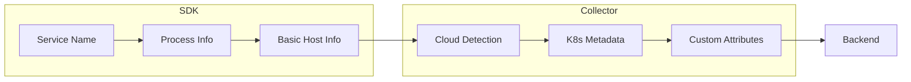

# How to Implement Resource Detection in OpenTelemetry

Author: [nawazdhandala](https://www.github.com/nawazdhandala)

Tags: OpenTelemetry, Resource Detection, Observability, Cloud, Kubernetes, AWS, GCP, Azure, Telemetry

Description: Learn how to automatically detect and attach resource attributes in OpenTelemetry to identify the source of telemetry data across cloud environments and container orchestrators.

---

Resource attributes describe the entity producing telemetry: the service name, host, container, cloud instance, and Kubernetes pod. Accurate resource detection is essential for filtering, grouping, and correlating telemetry across your infrastructure. This guide covers implementing resource detection in both the OpenTelemetry Collector and application SDKs.

## What Are Resources?

In OpenTelemetry, a resource represents the entity that generates telemetry data. Resources have attributes that describe that entity. For example:

```
service.name: checkout-service
service.version: 1.2.3
host.name: ip-10-0-1-42
container.id: a1b2c3d4e5f6
k8s.pod.name: checkout-service-7d8b9c-x4k2q
cloud.provider: aws
cloud.region: us-east-1
```

These attributes appear on every span, metric, and log from that service, making it easy to filter and correlate data.

## Resource Detection in the Collector

The OpenTelemetry Collector can detect resources automatically using the `resourcedetection` processor.

### Basic Configuration

```yaml
processors:
  resourcedetection:
    detectors:
      - env
      - system
    timeout: 5s
    override: false
```

### Available Detectors

The `resourcedetection` processor supports multiple detection sources:

```yaml
processors:
  resourcedetection:
    detectors:
      # Read from environment variables
      - env

      # Host system information
      - system

      # Docker container metadata
      - docker

      # Kubernetes metadata
      - k8s_node

      # AWS EC2 and ECS
      - ec2
      - ecs

      # Google Cloud
      - gcp

      # Azure
      - azure

      # Heroku
      - heroku

      # Consul
      - consul
```

### Cloud Provider Detection

**AWS Detection**

```yaml
processors:
  resourcedetection/aws:
    detectors: [env, ec2, ecs]
    timeout: 5s
    override: false

    ec2:
      # Tags to include as resource attributes
      tags:
        - Name
        - Environment
        - Team

    ecs:
      # Include ECS resource attributes
      resource_attributes:
        aws.ecs.cluster.arn:
          enabled: true
        aws.ecs.task.arn:
          enabled: true
        aws.ecs.container.arn:
          enabled: true
```

Detected attributes include:
- `cloud.provider: aws`
- `cloud.platform: aws_ec2` or `aws_ecs`
- `cloud.region: us-east-1`
- `cloud.availability_zone: us-east-1a`
- `cloud.account.id: 123456789012`
- `host.id: i-0abc123def456`
- `host.type: m5.large`
- `host.name: ip-10-0-1-42`

**GCP Detection**

```yaml
processors:
  resourcedetection/gcp:
    detectors: [env, gcp]
    timeout: 5s

    gcp:
      resource_attributes:
        gcp.project_id:
          enabled: true
        gcp.instance_id:
          enabled: true
        gcp.zone:
          enabled: true
```

Detected attributes include:
- `cloud.provider: gcp`
- `cloud.platform: gcp_compute_engine`
- `cloud.region: us-central1`
- `cloud.availability_zone: us-central1-a`
- `gcp.project_id: my-project`
- `host.id: 1234567890`

**Azure Detection**

```yaml
processors:
  resourcedetection/azure:
    detectors: [env, azure]
    timeout: 5s

    azure:
      resource_attributes:
        azure.vm.name:
          enabled: true
        azure.vm.size:
          enabled: true
        azure.resourcegroup.name:
          enabled: true
```

### Kubernetes Detection

For Kubernetes environments, combine container and node detection:

```yaml
processors:
  resourcedetection/k8s:
    detectors: [env, k8s_node]
    timeout: 5s

    k8s_node:
      # Authentication context
      auth_type: serviceAccount
      # Or use kubeconfig
      # auth_type: kubeConfig
      # context: my-cluster
```

For full pod and container metadata, use the `k8sattributes` processor:

```yaml
processors:
  k8sattributes:
    auth_type: serviceAccount
    passthrough: false

    # Extract these pod labels as attributes
    extract:
      metadata:
        - k8s.pod.name
        - k8s.pod.uid
        - k8s.namespace.name
        - k8s.deployment.name
        - k8s.node.name

      labels:
        - tag_name: app
          key: app.kubernetes.io/name
          from: pod
        - tag_name: version
          key: app.kubernetes.io/version
          from: pod

      annotations:
        - tag_name: owner
          key: team
          from: namespace

    # Filter which pods to process
    filter:
      namespace: default

    # Pod association rules
    pod_association:
      - sources:
          - from: resource_attribute
            name: k8s.pod.ip
      - sources:
          - from: resource_attribute
            name: k8s.pod.uid
```

### System Detection

The system detector collects host-level information:

```yaml
processors:
  resourcedetection/system:
    detectors: [system]

    system:
      hostname_sources:
        - dns
        - os
        - cname

      resource_attributes:
        host.name:
          enabled: true
        host.id:
          enabled: true
        host.arch:
          enabled: true
        os.type:
          enabled: true
        os.description:
          enabled: true
```

### Environment Variable Detection

Read resource attributes from environment variables:

```yaml
processors:
  resourcedetection/env:
    detectors: [env]
```

This reads from `OTEL_RESOURCE_ATTRIBUTES`:

```bash
export OTEL_RESOURCE_ATTRIBUTES="service.name=checkout-service,deployment.environment=production,service.version=1.2.3"
```

## Resource Detection in SDKs

Application SDKs can also perform resource detection, running before telemetry reaches the collector.

### Node.js Resource Detection

```javascript
const { NodeSDK } = require('@opentelemetry/sdk-node');
const { Resource } = require('@opentelemetry/resources');
const { SemanticResourceAttributes } = require('@opentelemetry/semantic-conventions');
const {
  envDetector,
  hostDetector,
  osDetector,
  processDetector,
} = require('@opentelemetry/resources');
const { awsEc2Detector } = require('@opentelemetry/resource-detector-aws');
const { containerDetector } = require('@opentelemetry/resource-detector-container');

// Create resource with manual and detected attributes
const resource = Resource.default()
  .merge(new Resource({
    [SemanticResourceAttributes.SERVICE_NAME]: 'checkout-service',
    [SemanticResourceAttributes.SERVICE_VERSION]: process.env.APP_VERSION || '1.0.0',
    [SemanticResourceAttributes.DEPLOYMENT_ENVIRONMENT]: process.env.ENVIRONMENT || 'development',
  }));

const sdk = new NodeSDK({
  resource,
  // Resource detectors run at startup
  resourceDetectors: [
    envDetector,
    hostDetector,
    osDetector,
    processDetector,
    containerDetector,
    awsEc2Detector,  // Only works on EC2
  ],
});

sdk.start();
```

### Python Resource Detection

```python
from opentelemetry import trace
from opentelemetry.sdk.trace import TracerProvider
from opentelemetry.sdk.resources import Resource, get_aggregated_resources
from opentelemetry.sdk.resources import (
    ProcessResourceDetector,
    OTELResourceDetector,
)
from opentelemetry.resourcedetector.aws import AwsEc2ResourceDetector

# Manual resource attributes
manual_resource = Resource.create({
    "service.name": "checkout-service",
    "service.version": "1.2.3",
    "deployment.environment": "production",
})

# Combine with detected resources
detected_resource = get_aggregated_resources([
    OTELResourceDetector(),
    ProcessResourceDetector(),
    AwsEc2ResourceDetector(),  # Only works on EC2
])

# Merge resources (manual takes precedence)
resource = manual_resource.merge(detected_resource)

# Create tracer provider with resource
provider = TracerProvider(resource=resource)
trace.set_tracer_provider(provider)
```

### Go Resource Detection

```go
package main

import (
    "context"

    "go.opentelemetry.io/otel"
    "go.opentelemetry.io/otel/sdk/resource"
    "go.opentelemetry.io/otel/sdk/trace"
    semconv "go.opentelemetry.io/otel/semconv/v1.17.0"

    // Resource detectors
    "go.opentelemetry.io/contrib/detectors/aws/ec2"
    "go.opentelemetry.io/contrib/detectors/gcp"
)

func initResource(ctx context.Context) (*resource.Resource, error) {
    // Start with manual attributes
    res, err := resource.New(ctx,
        // Add service information
        resource.WithAttributes(
            semconv.ServiceName("checkout-service"),
            semconv.ServiceVersion("1.2.3"),
            semconv.DeploymentEnvironment("production"),
        ),
        // Enable automatic detection
        resource.WithFromEnv(),
        resource.WithHost(),
        resource.WithProcess(),
        resource.WithContainer(),
        resource.WithOS(),
        // Cloud detectors (will no-op if not in that environment)
        resource.WithDetectors(
            ec2.NewResourceDetector(),
            gcp.NewDetector(),
        ),
    )
    if err != nil {
        return nil, err
    }
    return res, nil
}
```

### Java Resource Detection

```java
import io.opentelemetry.sdk.OpenTelemetrySdk;
import io.opentelemetry.sdk.resources.Resource;
import io.opentelemetry.sdk.trace.SdkTracerProvider;
import io.opentelemetry.semconv.resource.attributes.ResourceAttributes;
import io.opentelemetry.sdk.autoconfigure.spi.ResourceProvider;
import io.opentelemetry.contrib.aws.resource.Ec2Resource;
import io.opentelemetry.contrib.gcp.resource.GCPResource;

public class ResourceConfig {
    public static Resource createResource() {
        // Manual attributes
        Resource manual = Resource.builder()
            .put(ResourceAttributes.SERVICE_NAME, "checkout-service")
            .put(ResourceAttributes.SERVICE_VERSION, "1.2.3")
            .put(ResourceAttributes.DEPLOYMENT_ENVIRONMENT, "production")
            .build();

        // Merge with detected resources
        Resource detected = Resource.getDefault()
            .merge(Ec2Resource.get())     // AWS EC2 detection
            .merge(GCPResource.get());    // GCP detection

        return manual.merge(detected);
    }
}
```

## Combining Collector and SDK Detection

A common pattern is to perform basic detection in the SDK and enrich in the collector:



**SDK Configuration** (runs in application):
```javascript
const resource = new Resource({
  [SemanticResourceAttributes.SERVICE_NAME]: 'checkout-service',
  [SemanticResourceAttributes.SERVICE_VERSION]: '1.2.3',
});
```

**Collector Configuration** (enriches data):
```yaml
processors:
  resourcedetection:
    detectors: [env, ec2, ecs, gcp, azure, k8s_node]
    override: false  # Don't override SDK-set values

  k8sattributes:
    extract:
      metadata:
        - k8s.pod.name
        - k8s.namespace.name
        - k8s.deployment.name

service:
  pipelines:
    traces:
      processors: [resourcedetection, k8sattributes, batch]
```

## Complete Production Example

Here is a complete collector configuration for a Kubernetes environment on AWS:

```yaml
receivers:
  otlp:
    protocols:
      grpc:
        endpoint: 0.0.0.0:4317

processors:
  memory_limiter:
    check_interval: 5s
    limit_mib: 2048

  resourcedetection:
    detectors: [env, system, ec2, ecs]
    timeout: 5s
    override: false

    system:
      hostname_sources: [dns, os]

    ec2:
      tags:
        - Name
        - Environment
        - Team

  k8sattributes:
    auth_type: serviceAccount
    extract:
      metadata:
        - k8s.pod.name
        - k8s.pod.uid
        - k8s.namespace.name
        - k8s.deployment.name
        - k8s.node.name
        - k8s.container.name
      labels:
        - tag_name: app
          key: app.kubernetes.io/name
          from: pod
        - tag_name: version
          key: app.kubernetes.io/version
          from: pod
    pod_association:
      - sources:
          - from: resource_attribute
            name: k8s.pod.ip

  resource:
    attributes:
      - key: collector.version
        value: "1.0.0"
        action: insert

  batch:
    send_batch_size: 1024
    timeout: 5s

exporters:
  otlphttp:
    endpoint: "https://backend.example.com"

service:
  pipelines:
    traces:
      receivers: [otlp]
      processors:
        - memory_limiter
        - resourcedetection
        - k8sattributes
        - resource
        - batch
      exporters: [otlphttp]
```

## Troubleshooting Resource Detection

### Detection Not Working

1. Check timeout settings. Cloud metadata endpoints can be slow.
2. Verify network access to metadata endpoints (169.254.169.254 for AWS/GCP).
3. Check IAM permissions for cloud resource tags.
4. For Kubernetes, verify service account permissions.

### Duplicate Attributes

Set `override: false` to prevent collector detection from overwriting SDK-set values:

```yaml
processors:
  resourcedetection:
    override: false
```

### Viewing Detected Resources

Use the debug exporter to see what resources are detected:

```yaml
exporters:
  debug:
    verbosity: detailed

service:
  pipelines:
    traces:
      receivers: [otlp]
      processors: [resourcedetection]
      exporters: [debug]
```

## Conclusion

Proper resource detection transforms raw telemetry into actionable data. By automatically identifying the source of each span, metric, and log, you can filter by service, correlate across infrastructure, and debug issues faster. Start with basic detection (environment variables, service name), add cloud-specific detectors for your platform, and layer in Kubernetes metadata if applicable. The combination of SDK and collector detection provides both speed (SDK) and completeness (collector).
