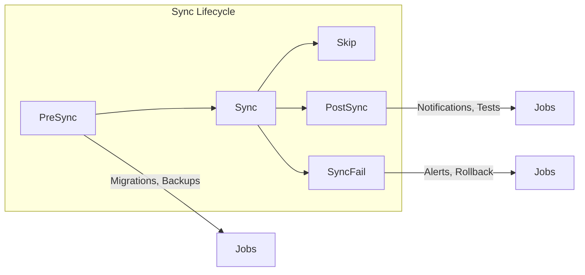

# How to Configure Resource Hooks in ArgoCD

Author: [nawazdhandala](https://www.github.com/nawazdhandala)

Tags: ArgoCD, Resource Hooks, Kubernetes, GitOps, Automation, Jobs

Description: Learn how to use ArgoCD resource hooks to run jobs and scripts at specific points during the sync lifecycle, including database migrations, notifications, and validation tasks.

---

Sometimes you need to run tasks at specific points in the deployment process. Database migrations before the app starts. Slack notifications after deployment. Smoke tests to verify everything works. ArgoCD resource hooks let you define these tasks declaratively.

## Understanding Hook Phases

ArgoCD hooks run at specific phases during the sync operation:



| Phase | When It Runs | Use Case |
|-------|-------------|----------|
| PreSync | Before main resources sync | Database migrations, backups |
| Sync | During main sync | Custom ordering |
| PostSync | After successful sync | Notifications, smoke tests |
| SyncFail | After failed sync | Alerts, cleanup |
| Skip | Never runs (documentation) | Placeholder resources |

## Creating a Basic Hook

Add the hook annotation to any Kubernetes resource:

```yaml
# pre-sync-migration.yaml
apiVersion: batch/v1
kind: Job
metadata:
  name: db-migrate
  annotations:
    # Run before main sync
    argocd.argoproj.io/hook: PreSync
spec:
  template:
    spec:
      containers:
        - name: migrate
          image: myapp:latest
          command: ["./migrate.sh"]
          env:
            - name: DATABASE_URL
              valueFrom:
                secretKeyRef:
                  name: db-credentials
                  key: url
      restartPolicy: Never
  backoffLimit: 3
```

## Hook Delete Policies

Control what happens to hooks after they run:

```yaml
apiVersion: batch/v1
kind: Job
metadata:
  name: db-migrate
  annotations:
    argocd.argoproj.io/hook: PreSync
    # Delete the job after it succeeds
    argocd.argoproj.io/hook-delete-policy: HookSucceeded
spec:
  template:
    spec:
      containers:
        - name: migrate
          image: myapp:latest
          command: ["./migrate.sh"]
      restartPolicy: Never
```

Available delete policies:

| Policy | Behavior |
|--------|----------|
| HookSucceeded | Delete after hook succeeds |
| HookFailed | Delete after hook fails |
| BeforeHookCreation | Delete existing hook before creating new one |

Combine policies as needed:

```yaml
annotations:
  argocd.argoproj.io/hook-delete-policy: HookSucceeded,BeforeHookCreation
```

## PreSync Hooks

PreSync hooks run before ArgoCD applies the main resources. Common uses include database migrations, backups, and validation.

### Database Migration

```yaml
apiVersion: batch/v1
kind: Job
metadata:
  name: db-migrate-{{ .Values.image.tag | replace "." "-" }}
  annotations:
    argocd.argoproj.io/hook: PreSync
    argocd.argoproj.io/hook-delete-policy: BeforeHookCreation
    # Run before other PreSync hooks
    argocd.argoproj.io/sync-wave: "-1"
spec:
  ttlSecondsAfterFinished: 3600
  template:
    spec:
      containers:
        - name: migrate
          image: myapp:{{ .Values.image.tag }}
          command:
            - /bin/sh
            - -c
            - |
              echo "Running migrations..."
              ./manage.py migrate --noinput
              echo "Migrations complete"
          env:
            - name: DATABASE_URL
              valueFrom:
                secretKeyRef:
                  name: app-secrets
                  key: database-url
          resources:
            requests:
              cpu: 100m
              memory: 256Mi
            limits:
              cpu: 500m
              memory: 512Mi
      restartPolicy: Never
  backoffLimit: 3
```

### Pre-Deployment Backup

```yaml
apiVersion: batch/v1
kind: Job
metadata:
  name: pre-deploy-backup
  annotations:
    argocd.argoproj.io/hook: PreSync
    argocd.argoproj.io/hook-delete-policy: HookSucceeded
spec:
  template:
    spec:
      containers:
        - name: backup
          image: postgres:15
          command:
            - /bin/sh
            - -c
            - |
              TIMESTAMP=$(date +%Y%m%d_%H%M%S)
              pg_dump $DATABASE_URL > /backups/backup_$TIMESTAMP.sql
              echo "Backup created: backup_$TIMESTAMP.sql"
          env:
            - name: DATABASE_URL
              valueFrom:
                secretKeyRef:
                  name: db-credentials
                  key: url
          volumeMounts:
            - name: backups
              mountPath: /backups
      volumes:
        - name: backups
          persistentVolumeClaim:
            claimName: backup-storage
      restartPolicy: Never
```

## PostSync Hooks

PostSync hooks run after all resources are synced and healthy. Use them for notifications, smoke tests, and cache warming.

### Slack Notification

```yaml
apiVersion: batch/v1
kind: Job
metadata:
  name: notify-deployment
  annotations:
    argocd.argoproj.io/hook: PostSync
    argocd.argoproj.io/hook-delete-policy: HookSucceeded
spec:
  template:
    spec:
      containers:
        - name: notify
          image: curlimages/curl:latest
          command:
            - /bin/sh
            - -c
            - |
              curl -X POST $SLACK_WEBHOOK \
                -H 'Content-Type: application/json' \
                -d '{
                  "text": "Deployment successful!",
                  "attachments": [{
                    "color": "good",
                    "fields": [{
                      "title": "Application",
                      "value": "myapp",
                      "short": true
                    }, {
                      "title": "Environment",
                      "value": "production",
                      "short": true
                    }]
                  }]
                }'
          env:
            - name: SLACK_WEBHOOK
              valueFrom:
                secretKeyRef:
                  name: slack-credentials
                  key: webhook-url
      restartPolicy: Never
```

### Smoke Test

```yaml
apiVersion: batch/v1
kind: Job
metadata:
  name: smoke-test
  annotations:
    argocd.argoproj.io/hook: PostSync
    argocd.argoproj.io/hook-delete-policy: HookSucceeded
spec:
  template:
    spec:
      containers:
        - name: test
          image: curlimages/curl:latest
          command:
            - /bin/sh
            - -c
            - |
              echo "Running smoke tests..."

              # Test health endpoint
              HTTP_CODE=$(curl -s -o /dev/null -w "%{http_code}" http://myapp:8080/health)
              if [ "$HTTP_CODE" != "200" ]; then
                echo "Health check failed: $HTTP_CODE"
                exit 1
              fi

              # Test API endpoint
              HTTP_CODE=$(curl -s -o /dev/null -w "%{http_code}" http://myapp:8080/api/v1/status)
              if [ "$HTTP_CODE" != "200" ]; then
                echo "API check failed: $HTTP_CODE"
                exit 1
              fi

              echo "All smoke tests passed!"
      restartPolicy: Never
  backoffLimit: 2
```

### Cache Warming

```yaml
apiVersion: batch/v1
kind: Job
metadata:
  name: warm-cache
  annotations:
    argocd.argoproj.io/hook: PostSync
    argocd.argoproj.io/hook-delete-policy: HookSucceeded
spec:
  template:
    spec:
      containers:
        - name: warmer
          image: myapp:latest
          command:
            - /bin/sh
            - -c
            - |
              echo "Warming caches..."
              ./cache-warmer --endpoints /api/products,/api/categories
              echo "Cache warming complete"
      restartPolicy: Never
```

## SyncFail Hooks

SyncFail hooks run when the sync operation fails. Use them to send alerts or trigger rollbacks.

### Failure Notification

```yaml
apiVersion: batch/v1
kind: Job
metadata:
  name: notify-failure
  annotations:
    argocd.argoproj.io/hook: SyncFail
    argocd.argoproj.io/hook-delete-policy: HookSucceeded
spec:
  template:
    spec:
      containers:
        - name: notify
          image: curlimages/curl:latest
          command:
            - /bin/sh
            - -c
            - |
              curl -X POST $PAGERDUTY_URL \
                -H 'Content-Type: application/json' \
                -H "Authorization: Token token=$PAGERDUTY_TOKEN" \
                -d '{
                  "routing_key": "'$ROUTING_KEY'",
                  "event_action": "trigger",
                  "payload": {
                    "summary": "ArgoCD deployment failed for myapp",
                    "severity": "critical",
                    "source": "argocd"
                  }
                }'
          env:
            - name: PAGERDUTY_TOKEN
              valueFrom:
                secretKeyRef:
                  name: pagerduty-credentials
                  key: token
            - name: ROUTING_KEY
              valueFrom:
                secretKeyRef:
                  name: pagerduty-credentials
                  key: routing-key
      restartPolicy: Never
```

## Hook Weights

Control the order of hooks within the same phase:

```yaml
# Runs first (lower weight)
apiVersion: batch/v1
kind: Job
metadata:
  name: backup-database
  annotations:
    argocd.argoproj.io/hook: PreSync
    argocd.argoproj.io/sync-wave: "-5"

---
# Runs second
apiVersion: batch/v1
kind: Job
metadata:
  name: migrate-database
  annotations:
    argocd.argoproj.io/hook: PreSync
    argocd.argoproj.io/sync-wave: "0"

---
# Runs third (higher weight)
apiVersion: batch/v1
kind: Job
metadata:
  name: seed-database
  annotations:
    argocd.argoproj.io/hook: PreSync
    argocd.argoproj.io/sync-wave: "5"
```

## Using Non-Job Resources as Hooks

Any resource can be a hook, not just Jobs:

### Pod Hook

```yaml
apiVersion: v1
kind: Pod
metadata:
  name: quick-task
  annotations:
    argocd.argoproj.io/hook: PostSync
    argocd.argoproj.io/hook-delete-policy: HookSucceeded
spec:
  containers:
    - name: task
      image: busybox
      command: ["echo", "Quick task done"]
  restartPolicy: Never
```

### ConfigMap Hook

Create configuration before other resources:

```yaml
apiVersion: v1
kind: ConfigMap
metadata:
  name: generated-config
  annotations:
    argocd.argoproj.io/hook: PreSync
    argocd.argoproj.io/hook-delete-policy: BeforeHookCreation
data:
  config.json: |
    {
      "version": "{{ .Values.version }}",
      "timestamp": "{{ now | date "2006-01-02T15:04:05Z07:00" }}"
    }
```

## Debugging Hooks

### Check Hook Status

```bash
# List all hooks for an application
argocd app resources myapp | grep Hook

# Get detailed hook status
kubectl get jobs -n myapp

# View hook logs
kubectl logs job/db-migrate -n myapp
```

### Common Issues

**Hook stuck in Pending:**
```bash
# Check for resource issues
kubectl describe job/db-migrate -n myapp
kubectl get events -n myapp --sort-by='.lastTimestamp'
```

**Hook runs repeatedly:**
- Add `BeforeHookCreation` delete policy
- Use unique names with version tags

**Hook blocks sync:**
- Verify the job completes successfully
- Check `backoffLimit` and `activeDeadlineSeconds`

```yaml
spec:
  # Give up after 3 failures
  backoffLimit: 3
  # Timeout after 10 minutes
  activeDeadlineSeconds: 600
```

---

Resource hooks extend ArgoCD beyond simple manifest application. They let you build complete deployment pipelines with migrations, tests, and notifications, all defined declaratively in Git. Start with a simple PreSync migration hook, then add PostSync notifications as your workflow matures.
