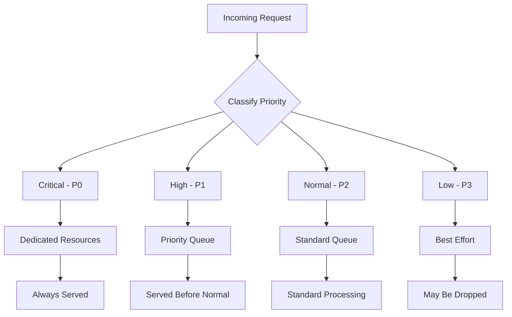

# How to Implement Resource Prioritization

Author: [nawazdhandala](https://www.github.com/nawazdhandala)

Tags: Resource Prioritization, Performance, Quality of Service, Backend, Kubernetes, Rate Limiting

Description: Learn how to implement resource prioritization to ensure critical requests get served during high load. This guide covers priority queues, request classification, and resource allocation strategies with practical examples.

---

> Not all requests are equal. A payment transaction is more important than loading analytics data. During high load, systems should prioritize critical operations over non-essential ones. This guide shows you how to implement resource prioritization effectively.

Resource prioritization ensures that your most important functionality remains available even when the system is under stress.

---

## Priority Classification



---

## Priority Queue Implementation

### Python Priority Queue

```python
# priority_queue.py
import asyncio
import heapq
from dataclasses import dataclass, field
from typing import Any, Callable, Optional
from enum import IntEnum
import time
import logging

logger = logging.getLogger(__name__)

class Priority(IntEnum):
    CRITICAL = 0   # Health checks, payments
    HIGH = 1       # User authentication
    NORMAL = 2     # Regular API calls
    LOW = 3        # Analytics, background tasks
    BULK = 4       # Batch operations

@dataclass(order=True)
class PrioritizedTask:
    priority: int
    timestamp: float = field(compare=True)
    task: Any = field(compare=False)
    task_id: str = field(compare=False, default="")

class PriorityTaskQueue:
    """Priority queue for request processing"""

    def __init__(self, max_size: int = 10000):
        self.max_size = max_size
        self.queue: list = []
        self.lock = asyncio.Lock()
        self.not_empty = asyncio.Event()
        self.counts = {p: 0 for p in Priority}

    async def put(self, task: Any, priority: Priority = Priority.NORMAL,
                  task_id: str = "") -> bool:
        """Add task to queue with priority"""
        async with self.lock:
            # Check capacity - might reject low priority
            if len(self.queue) >= self.max_size:
                if priority >= Priority.NORMAL:
                    logger.warning(f"Queue full, rejecting {priority.name} task")
                    return False
                else:
                    # Remove lowest priority task
                    self._remove_lowest_priority()

            item = PrioritizedTask(
                priority=priority.value,
                timestamp=time.time(),
                task=task,
                task_id=task_id
            )
            heapq.heappush(self.queue, item)
            self.counts[priority] += 1
            self.not_empty.set()
            return True

    async def get(self, timeout: Optional[float] = None) -> Optional[Any]:
        """Get highest priority task"""
        try:
            await asyncio.wait_for(self.not_empty.wait(), timeout=timeout)
        except asyncio.TimeoutError:
            return None

        async with self.lock:
            if not self.queue:
                self.not_empty.clear()
                return None

            item = heapq.heappop(self.queue)
            priority = Priority(item.priority)
            self.counts[priority] -= 1

            if not self.queue:
                self.not_empty.clear()

            return item.task

    def _remove_lowest_priority(self):
        """Remove lowest priority task to make room"""
        # Find and remove the lowest priority (highest number) task
        if not self.queue:
            return

        lowest_idx = 0
        lowest_priority = self.queue[0].priority

        for i, item in enumerate(self.queue):
            if item.priority > lowest_priority:
                lowest_idx = i
                lowest_priority = item.priority

        removed = self.queue.pop(lowest_idx)
        heapq.heapify(self.queue)
        self.counts[Priority(removed.priority)] -= 1

    def get_stats(self) -> dict:
        return {
            'total': len(self.queue),
            'by_priority': {p.name: self.counts[p] for p in Priority}
        }


# Worker pool with priority queue
class PriorityWorkerPool:
    """Worker pool that processes tasks by priority"""

    def __init__(self, num_workers: int, queue: PriorityTaskQueue):
        self.num_workers = num_workers
        self.queue = queue
        self.workers = []
        self._running = False

    async def start(self):
        """Start worker tasks"""
        self._running = True
        self.workers = [
            asyncio.create_task(self._worker(i))
            for i in range(self.num_workers)
        ]

    async def stop(self):
        """Stop all workers"""
        self._running = False
        for worker in self.workers:
            worker.cancel()

    async def _worker(self, worker_id: int):
        """Worker loop"""
        while self._running:
            task = await self.queue.get(timeout=1.0)
            if task:
                try:
                    await task()
                except Exception as e:
                    logger.error(f"Worker {worker_id} task error: {e}")


# Usage
queue = PriorityTaskQueue(max_size=1000)
pool = PriorityWorkerPool(num_workers=10, queue=queue)

async def process_payment(payment_id: str):
    # High priority task
    pass

async def log_analytics(event: dict):
    # Low priority task
    pass

# Submit tasks
await queue.put(
    lambda: process_payment("pay_123"),
    priority=Priority.CRITICAL
)

await queue.put(
    lambda: log_analytics({"event": "page_view"}),
    priority=Priority.LOW
)
```

---

## HTTP Request Prioritization

### FastAPI Priority Middleware

```python
# priority_middleware.py
from fastapi import FastAPI, Request, HTTPException
from fastapi.responses import JSONResponse
from starlette.middleware.base import BaseHTTPMiddleware
import asyncio
from typing import Callable
import time

app = FastAPI()

class RequestPrioritizer:
    """Prioritize HTTP requests based on path and headers"""

    # Priority rules by path prefix
    PATH_PRIORITIES = {
        '/health': Priority.CRITICAL,
        '/api/payments': Priority.CRITICAL,
        '/api/auth': Priority.HIGH,
        '/api/users': Priority.NORMAL,
        '/api/analytics': Priority.LOW,
        '/api/export': Priority.BULK,
    }

    def __init__(self, queue_size: int = 1000, workers: int = 50):
        self.queues = {p: asyncio.Queue(maxsize=queue_size // len(Priority))
                       for p in Priority}
        self.workers = workers
        self.semaphores = {
            Priority.CRITICAL: asyncio.Semaphore(workers // 2),  # 50% capacity
            Priority.HIGH: asyncio.Semaphore(workers // 4),       # 25% capacity
            Priority.NORMAL: asyncio.Semaphore(workers // 4),     # 20% capacity
            Priority.LOW: asyncio.Semaphore(workers // 10),       # 5% capacity
            Priority.BULK: asyncio.Semaphore(workers // 20),      # Reserved
        }

    def get_priority(self, request: Request) -> Priority:
        """Determine request priority"""
        # Check header override
        priority_header = request.headers.get('X-Priority')
        if priority_header:
            try:
                return Priority[priority_header.upper()]
            except KeyError:
                pass

        # Check path
        path = request.url.path
        for prefix, priority in self.PATH_PRIORITIES.items():
            if path.startswith(prefix):
                return priority

        return Priority.NORMAL

    async def acquire(self, priority: Priority) -> bool:
        """Acquire processing slot for priority level"""
        # Critical always gets through
        if priority == Priority.CRITICAL:
            return await self.semaphores[priority].acquire()

        # Others might be rejected if too busy
        try:
            return await asyncio.wait_for(
                self.semaphores[priority].acquire(),
                timeout=0.1  # Quick timeout
            )
        except asyncio.TimeoutError:
            return False

    def release(self, priority: Priority):
        """Release processing slot"""
        self.semaphores[priority].release()


prioritizer = RequestPrioritizer(workers=100)

class PriorityMiddleware(BaseHTTPMiddleware):
    async def dispatch(self, request: Request, call_next):
        priority = prioritizer.get_priority(request)

        # Try to acquire slot
        acquired = await prioritizer.acquire(priority)
        if not acquired:
            return JSONResponse(
                status_code=503,
                content={
                    "error": "Server busy",
                    "priority": priority.name,
                    "message": "Higher priority requests are being processed"
                },
                headers={"Retry-After": "5"}
            )

        try:
            # Add priority to request state
            request.state.priority = priority
            response = await call_next(request)
            return response
        finally:
            prioritizer.release(priority)

app.add_middleware(PriorityMiddleware)
```

---

## Database Connection Prioritization

```python
# db_priority.py
import asyncpg
import asyncio
from typing import Optional, Any
from contextlib import asynccontextmanager

class PrioritizedConnectionPool:
    """Database connection pool with priority-based allocation"""

    def __init__(self, dsn: str, min_size: int = 10, max_size: int = 50):
        self.dsn = dsn
        self.min_size = min_size
        self.max_size = max_size
        self.pool: asyncpg.Pool = None

        # Reserve connections by priority
        # Critical: 40%, High: 30%, Normal: 20%, Low: 10%
        self.reserved = {
            Priority.CRITICAL: int(max_size * 0.4),
            Priority.HIGH: int(max_size * 0.3),
            Priority.NORMAL: int(max_size * 0.2),
            Priority.LOW: int(max_size * 0.1),
        }

        # Semaphores for each priority level
        self.semaphores = {
            p: asyncio.Semaphore(count)
            for p, count in self.reserved.items()
        }

    async def initialize(self):
        """Create the connection pool"""
        self.pool = await asyncpg.create_pool(
            dsn=self.dsn,
            min_size=self.min_size,
            max_size=self.max_size
        )

    @asynccontextmanager
    async def connection(self, priority: Priority = Priority.NORMAL,
                         timeout: float = 30.0):
        """Get a connection with priority-based allocation"""
        # Try to get semaphore for this priority
        # Higher priority can also use lower priority slots
        acquired_priority = None

        for p in Priority:
            if p.value <= priority.value:
                try:
                    await asyncio.wait_for(
                        self.semaphores[p].acquire(),
                        timeout=0.1 if p != priority else timeout
                    )
                    acquired_priority = p
                    break
                except asyncio.TimeoutError:
                    continue

        if acquired_priority is None:
            raise asyncio.TimeoutError(
                f"No connection available for priority {priority.name}"
            )

        try:
            async with self.pool.acquire() as conn:
                yield conn
        finally:
            self.semaphores[acquired_priority].release()

    async def execute(self, query: str, *args,
                      priority: Priority = Priority.NORMAL) -> Any:
        """Execute query with priority"""
        async with self.connection(priority) as conn:
            return await conn.execute(query, *args)

    async def fetch(self, query: str, *args,
                    priority: Priority = Priority.NORMAL) -> list:
        """Fetch with priority"""
        async with self.connection(priority) as conn:
            return await conn.fetch(query, *args)


# Usage
db = PrioritizedConnectionPool("postgresql://localhost/mydb", max_size=50)
await db.initialize()

# Critical query (payment)
await db.fetch(
    "SELECT * FROM orders WHERE id = $1",
    order_id,
    priority=Priority.CRITICAL
)

# Low priority query (analytics)
await db.fetch(
    "SELECT COUNT(*) FROM page_views WHERE date = $1",
    today,
    priority=Priority.LOW
)
```

---

## CPU Resource Prioritization

### Process Priority with nice

```python
# process_priority.py
import os
import subprocess
from enum import IntEnum

class ProcessPriority(IntEnum):
    REALTIME = -20
    HIGH = -10
    NORMAL = 0
    LOW = 10
    IDLE = 19

def set_process_priority(priority: ProcessPriority):
    """Set current process priority (Linux/macOS)"""
    try:
        os.nice(priority.value - os.nice(0))
    except PermissionError:
        # Need root for negative nice values
        pass

def run_with_priority(command: list, priority: ProcessPriority):
    """Run command with specific priority"""
    if os.name == 'posix':
        # Use nice on Linux/macOS
        nice_cmd = ['nice', '-n', str(priority.value)] + command
        return subprocess.run(nice_cmd)
    else:
        return subprocess.run(command)


# Usage
# High priority task
set_process_priority(ProcessPriority.HIGH)
process_payment()

# Low priority background task
run_with_priority(['python', 'backup.py'], ProcessPriority.LOW)
```

### Thread Pool with Priority

```python
# priority_threadpool.py
import threading
import queue
from concurrent.futures import ThreadPoolExecutor
from typing import Callable, Any
import time

class PriorityThreadPool:
    """Thread pool with priority-based task scheduling"""

    def __init__(self, num_workers: int):
        self.task_queue = queue.PriorityQueue()
        self.workers = []
        self.running = True
        self.task_counter = 0
        self.lock = threading.Lock()

        # Start workers
        for i in range(num_workers):
            t = threading.Thread(target=self._worker, daemon=True)
            t.start()
            self.workers.append(t)

    def submit(self, fn: Callable, priority: Priority = Priority.NORMAL,
               *args, **kwargs) -> None:
        """Submit task with priority"""
        with self.lock:
            self.task_counter += 1
            counter = self.task_counter

        # Lower priority value = higher priority
        # Use counter as tiebreaker for FIFO within same priority
        self.task_queue.put((priority.value, counter, fn, args, kwargs))

    def _worker(self):
        """Worker thread"""
        while self.running:
            try:
                priority, counter, fn, args, kwargs = self.task_queue.get(timeout=1)
                try:
                    fn(*args, **kwargs)
                except Exception as e:
                    print(f"Task error: {e}")
                finally:
                    self.task_queue.task_done()
            except queue.Empty:
                continue

    def shutdown(self, wait: bool = True):
        """Shutdown the pool"""
        self.running = False
        if wait:
            self.task_queue.join()


# Usage
pool = PriorityThreadPool(num_workers=10)

# Critical task - processed first
pool.submit(process_payment, Priority.CRITICAL, payment_id="pay_123")

# Low priority task - processed last
pool.submit(send_analytics, Priority.LOW, event="page_view")
```

---

## Kubernetes Resource Prioritization

### Priority Classes

```yaml
# priority-classes.yaml
apiVersion: scheduling.k8s.io/v1
kind: PriorityClass
metadata:
  name: critical-priority
value: 1000000
globalDefault: false
description: "Critical system components"
preemptionPolicy: PreemptLowerPriority

---
apiVersion: scheduling.k8s.io/v1
kind: PriorityClass
metadata:
  name: high-priority
value: 100000
globalDefault: false
description: "High priority applications"

---
apiVersion: scheduling.k8s.io/v1
kind: PriorityClass
metadata:
  name: default-priority
value: 10000
globalDefault: true
description: "Default priority"

---
apiVersion: scheduling.k8s.io/v1
kind: PriorityClass
metadata:
  name: low-priority
value: 1000
globalDefault: false
description: "Low priority batch jobs"
preemptionPolicy: Never
```

### Deployment with Priority

```yaml
# payment-service.yaml
apiVersion: apps/v1
kind: Deployment
metadata:
  name: payment-service
spec:
  replicas: 3
  template:
    spec:
      priorityClassName: critical-priority
      containers:
      - name: payment
        image: payment-service:latest
        resources:
          requests:
            cpu: "500m"
            memory: "512Mi"
          limits:
            cpu: "1000m"
            memory: "1Gi"

---
# analytics-service.yaml
apiVersion: apps/v1
kind: Deployment
metadata:
  name: analytics-service
spec:
  replicas: 2
  template:
    spec:
      priorityClassName: low-priority
      containers:
      - name: analytics
        image: analytics-service:latest
        resources:
          requests:
            cpu: "100m"
            memory: "256Mi"
          limits:
            cpu: "500m"
            memory: "512Mi"
```

---

## Monitoring Priority Metrics

```python
# priority_metrics.py
from prometheus_client import Counter, Histogram, Gauge

# Metrics by priority
requests_by_priority = Counter(
    'requests_total',
    'Requests by priority',
    ['priority', 'status']
)

latency_by_priority = Histogram(
    'request_latency_seconds',
    'Latency by priority',
    ['priority'],
    buckets=[0.01, 0.05, 0.1, 0.25, 0.5, 1, 2.5, 5]
)

queue_depth_by_priority = Gauge(
    'queue_depth',
    'Queue depth by priority',
    ['priority']
)

# Track in middleware
@app.middleware("http")
async def priority_metrics_middleware(request: Request, call_next):
    priority = request.state.priority

    start = time.perf_counter()
    try:
        response = await call_next(request)
        requests_by_priority.labels(
            priority=priority.name, status='success'
        ).inc()
        return response
    except Exception:
        requests_by_priority.labels(
            priority=priority.name, status='error'
        ).inc()
        raise
    finally:
        duration = time.perf_counter() - start
        latency_by_priority.labels(priority=priority.name).observe(duration)
```

---

## Best Practices Summary

| Resource | Prioritization Method | Typical Split |
|----------|----------------------|---------------|
| HTTP Requests | Priority queues, semaphores | 40/30/20/10% |
| Database | Connection reservation | Similar |
| CPU | Process nice, cgroups | Variable |
| Memory | Kubernetes limits | By pod class |
| Network | QoS classes | DSCP marking |

---

## Conclusion

Resource prioritization ensures critical functionality during high load:

1. **Classify requests**: Define clear priority levels
2. **Allocate resources**: Reserve capacity for high priority
3. **Implement queuing**: Process by priority, not arrival order
4. **Monitor by priority**: Track latency and success rates
5. **Test under load**: Verify prioritization works as expected

The goal is graceful degradation where critical paths remain responsive while non-essential work waits or is dropped.

---

*Need to monitor your service priorities? [OneUptime](https://oneuptime.com) provides monitoring with priority-based alerting and SLA tracking by request type.*
