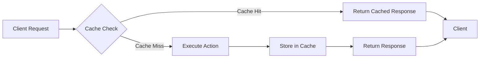

# How to Implement Response Caching in ASP.NET Core

Author: [nawazdhandala](https://www.github.com/nawazdhandala)

Tags: ASP.NET Core, Caching, Performance, .NET, C#, Web API

Description: Learn how to implement response caching in ASP.NET Core to improve application performance. This guide covers in-memory caching, distributed caching with Redis, cache profiles, and cache invalidation strategies.

---

Response caching is one of the most effective ways to improve the performance of your ASP.NET Core applications. By storing responses and serving them from cache instead of regenerating them for every request, you can significantly reduce server load and improve response times.

This guide walks through various caching strategies available in ASP.NET Core, from simple in-memory caching to distributed caching with Redis.

## Understanding Response Caching

Before diving into implementation, it helps to understand the different types of caching available in ASP.NET Core:



ASP.NET Core provides three main caching approaches:

1. **Response Caching Middleware** - Caches HTTP responses based on headers
2. **In-Memory Caching** - Stores data in the application's memory
3. **Distributed Caching** - Uses external stores like Redis or SQL Server

## Setting Up Response Caching Middleware

The response caching middleware caches responses based on HTTP cache headers. Start by adding the middleware to your application:

```csharp
// Program.cs
var builder = WebApplication.CreateBuilder(args);

// Add response caching services
builder.Services.AddResponseCaching(options =>
{
    // Maximum size of the response body that can be cached (100 MB)
    options.MaximumBodySize = 100 * 1024 * 1024;

    // Use case-sensitive paths for cache keys
    options.UseCaseSensitivePaths = true;
});

var app = builder.Build();

// Add response caching middleware (must be before endpoints)
app.UseResponseCaching();

app.MapControllers();
app.Run();
```

Now apply caching to your controllers using the `ResponseCache` attribute:

```csharp
[ApiController]
[Route("api/[controller]")]
public class ProductsController : ControllerBase
{
    private readonly IProductService _productService;

    public ProductsController(IProductService productService)
    {
        _productService = productService;
    }

    // Cache this response for 60 seconds
    [HttpGet]
    [ResponseCache(Duration = 60, Location = ResponseCacheLocation.Any)]
    public async Task<ActionResult<IEnumerable<Product>>> GetProducts()
    {
        var products = await _productService.GetAllAsync();
        return Ok(products);
    }

    // Cache with query string variation
    [HttpGet("{id}")]
    [ResponseCache(Duration = 120, VaryByQueryKeys = new[] { "includeDetails" })]
    public async Task<ActionResult<Product>> GetProduct(int id, bool includeDetails = false)
    {
        var product = await _productService.GetByIdAsync(id, includeDetails);

        if (product == null)
            return NotFound();

        return Ok(product);
    }

    // Disable caching for this endpoint
    [HttpPost]
    [ResponseCache(Duration = 0, Location = ResponseCacheLocation.None, NoStore = true)]
    public async Task<ActionResult<Product>> CreateProduct(ProductDto dto)
    {
        var product = await _productService.CreateAsync(dto);
        return CreatedAtAction(nameof(GetProduct), new { id = product.Id }, product);
    }
}
```

## Using Cache Profiles

Cache profiles let you define caching settings in one place and reuse them across multiple endpoints:

```csharp
// Program.cs
builder.Services.AddControllers(options =>
{
    // Define reusable cache profiles
    options.CacheProfiles.Add("Default", new CacheProfile
    {
        Duration = 60,
        Location = ResponseCacheLocation.Any
    });

    options.CacheProfiles.Add("LongCache", new CacheProfile
    {
        Duration = 3600, // 1 hour
        Location = ResponseCacheLocation.Any,
        VaryByHeader = "Accept-Encoding"
    });

    options.CacheProfiles.Add("NoCache", new CacheProfile
    {
        Duration = 0,
        Location = ResponseCacheLocation.None,
        NoStore = true
    });
});
```

Apply profiles to your controllers:

```csharp
[ApiController]
[Route("api/[controller]")]
public class CategoriesController : ControllerBase
{
    // Use the Default profile (60 seconds)
    [HttpGet]
    [ResponseCache(CacheProfileName = "Default")]
    public async Task<ActionResult<IEnumerable<Category>>> GetCategories()
    {
        // Implementation
    }

    // Use the LongCache profile (1 hour) for rarely changing data
    [HttpGet("static")]
    [ResponseCache(CacheProfileName = "LongCache")]
    public ActionResult<IEnumerable<string>> GetStaticData()
    {
        return Ok(new[] { "Option1", "Option2", "Option3" });
    }
}
```

## In-Memory Caching

For more control over caching, use the `IMemoryCache` interface. This is useful when you need to cache data that does not map directly to HTTP responses:

```csharp
// Program.cs
builder.Services.AddMemoryCache();
```

Create a service that uses memory caching:

```csharp
public interface IProductCacheService
{
    Task<Product?> GetProductAsync(int id);
    Task<IEnumerable<Product>> GetAllProductsAsync();
    void InvalidateProduct(int id);
    void InvalidateAllProducts();
}

public class ProductCacheService : IProductCacheService
{
    private readonly IMemoryCache _cache;
    private readonly IProductRepository _repository;
    private readonly ILogger<ProductCacheService> _logger;

    // Cache key constants
    private const string AllProductsKey = "products_all";
    private const string ProductKeyPrefix = "product_";

    // Keep track of all cache keys for invalidation
    private static readonly HashSet<string> CacheKeys = new();
    private static readonly object LockObject = new();

    public ProductCacheService(
        IMemoryCache cache,
        IProductRepository repository,
        ILogger<ProductCacheService> logger)
    {
        _cache = cache;
        _repository = repository;
        _logger = logger;
    }

    public async Task<Product?> GetProductAsync(int id)
    {
        var cacheKey = $"{ProductKeyPrefix}{id}";

        // Try to get from cache first
        if (_cache.TryGetValue(cacheKey, out Product? cachedProduct))
        {
            _logger.LogDebug("Cache hit for product {ProductId}", id);
            return cachedProduct;
        }

        _logger.LogDebug("Cache miss for product {ProductId}", id);

        // Fetch from database
        var product = await _repository.GetByIdAsync(id);

        if (product != null)
        {
            // Configure cache entry options
            var cacheOptions = new MemoryCacheEntryOptions()
                .SetAbsoluteExpiration(TimeSpan.FromMinutes(10))
                .SetSlidingExpiration(TimeSpan.FromMinutes(2))
                .SetPriority(CacheItemPriority.Normal)
                .RegisterPostEvictionCallback(OnCacheEviction);

            _cache.Set(cacheKey, product, cacheOptions);
            TrackCacheKey(cacheKey);
        }

        return product;
    }

    public async Task<IEnumerable<Product>> GetAllProductsAsync()
    {
        if (_cache.TryGetValue(AllProductsKey, out IEnumerable<Product>? cachedProducts))
        {
            return cachedProducts!;
        }

        var products = await _repository.GetAllAsync();

        var cacheOptions = new MemoryCacheEntryOptions()
            .SetAbsoluteExpiration(TimeSpan.FromMinutes(5))
            .SetPriority(CacheItemPriority.High);

        _cache.Set(AllProductsKey, products, cacheOptions);
        TrackCacheKey(AllProductsKey);

        return products;
    }

    public void InvalidateProduct(int id)
    {
        var cacheKey = $"{ProductKeyPrefix}{id}";
        _cache.Remove(cacheKey);
        _cache.Remove(AllProductsKey); // Also invalidate the list

        _logger.LogInformation("Invalidated cache for product {ProductId}", id);
    }

    public void InvalidateAllProducts()
    {
        lock (LockObject)
        {
            foreach (var key in CacheKeys.Where(k => k.StartsWith(ProductKeyPrefix) || k == AllProductsKey))
            {
                _cache.Remove(key);
            }
            CacheKeys.RemoveWhere(k => k.StartsWith(ProductKeyPrefix) || k == AllProductsKey);
        }

        _logger.LogInformation("Invalidated all product cache entries");
    }

    private void TrackCacheKey(string key)
    {
        lock (LockObject)
        {
            CacheKeys.Add(key);
        }
    }

    private void OnCacheEviction(object key, object? value, EvictionReason reason, object? state)
    {
        _logger.LogDebug("Cache entry {Key} was evicted due to {Reason}", key, reason);

        lock (LockObject)
        {
            CacheKeys.Remove(key.ToString()!);
        }
    }
}
```

## Distributed Caching with Redis

For applications running on multiple servers, use distributed caching. Redis is a popular choice:

```bash
dotnet add package Microsoft.Extensions.Caching.StackExchangeRedis
```

Configure Redis caching:

```csharp
// Program.cs
builder.Services.AddStackExchangeRedisCache(options =>
{
    options.Configuration = builder.Configuration.GetConnectionString("Redis");
    options.InstanceName = "MyApp_";
});
```

Create a distributed cache service:

```csharp
public class DistributedProductCacheService : IProductCacheService
{
    private readonly IDistributedCache _cache;
    private readonly IProductRepository _repository;
    private readonly ILogger<DistributedProductCacheService> _logger;

    private static readonly JsonSerializerOptions JsonOptions = new()
    {
        PropertyNamingPolicy = JsonNamingPolicy.CamelCase
    };

    public DistributedProductCacheService(
        IDistributedCache cache,
        IProductRepository repository,
        ILogger<DistributedProductCacheService> logger)
    {
        _cache = cache;
        _repository = repository;
        _logger = logger;
    }

    public async Task<Product?> GetProductAsync(int id)
    {
        var cacheKey = $"product:{id}";

        // Try to get from cache
        var cachedData = await _cache.GetStringAsync(cacheKey);

        if (!string.IsNullOrEmpty(cachedData))
        {
            _logger.LogDebug("Cache hit for product {ProductId}", id);
            return JsonSerializer.Deserialize<Product>(cachedData, JsonOptions);
        }

        _logger.LogDebug("Cache miss for product {ProductId}", id);

        // Fetch from database
        var product = await _repository.GetByIdAsync(id);

        if (product != null)
        {
            var options = new DistributedCacheEntryOptions
            {
                AbsoluteExpirationRelativeToNow = TimeSpan.FromMinutes(10),
                SlidingExpiration = TimeSpan.FromMinutes(2)
            };

            var serialized = JsonSerializer.Serialize(product, JsonOptions);
            await _cache.SetStringAsync(cacheKey, serialized, options);
        }

        return product;
    }

    public async Task<IEnumerable<Product>> GetAllProductsAsync()
    {
        var cacheKey = "products:all";

        var cachedData = await _cache.GetStringAsync(cacheKey);

        if (!string.IsNullOrEmpty(cachedData))
        {
            return JsonSerializer.Deserialize<IEnumerable<Product>>(cachedData, JsonOptions)!;
        }

        var products = await _repository.GetAllAsync();

        var options = new DistributedCacheEntryOptions
        {
            AbsoluteExpirationRelativeToNow = TimeSpan.FromMinutes(5)
        };

        var serialized = JsonSerializer.Serialize(products, JsonOptions);
        await _cache.SetStringAsync(cacheKey, serialized, options);

        return products;
    }

    public void InvalidateProduct(int id)
    {
        // Run synchronously for simplicity, but could be async
        _cache.Remove($"product:{id}");
        _cache.Remove("products:all");

        _logger.LogInformation("Invalidated cache for product {ProductId}", id);
    }

    public void InvalidateAllProducts()
    {
        // Note: Redis requires SCAN or pattern-based deletion for bulk operations
        // For production, consider using Redis directly with StackExchange.Redis
        _cache.Remove("products:all");

        _logger.LogInformation("Invalidated products list cache");
    }
}
```

## Output Caching (ASP.NET Core 7+)

ASP.NET Core 7 introduced output caching, which provides more control than response caching:

```csharp
// Program.cs
builder.Services.AddOutputCache(options =>
{
    // Default policy
    options.AddBasePolicy(builder => builder.Expire(TimeSpan.FromSeconds(30)));

    // Named policies
    options.AddPolicy("Products", builder =>
        builder.Expire(TimeSpan.FromMinutes(5))
               .Tag("products"));

    options.AddPolicy("ByUser", builder =>
        builder.SetVaryByHeader("Authorization")
               .Expire(TimeSpan.FromMinutes(1)));
});

var app = builder.Build();
app.UseOutputCache();
```

Use output caching in controllers:

```csharp
[ApiController]
[Route("api/[controller]")]
public class ProductsController : ControllerBase
{
    private readonly IOutputCacheStore _cacheStore;

    public ProductsController(IOutputCacheStore cacheStore)
    {
        _cacheStore = cacheStore;
    }

    [HttpGet]
    [OutputCache(PolicyName = "Products")]
    public async Task<ActionResult<IEnumerable<Product>>> GetProducts()
    {
        // Implementation
    }

    [HttpPost]
    public async Task<ActionResult<Product>> CreateProduct(ProductDto dto)
    {
        var product = await _productService.CreateAsync(dto);

        // Invalidate cache by tag
        await _cacheStore.EvictByTagAsync("products", default);

        return CreatedAtAction(nameof(GetProducts), new { id = product.Id }, product);
    }
}
```

## Cache Invalidation Patterns

Proper cache invalidation is critical for data consistency. Here are common patterns:

```csharp
public class CacheInvalidationService
{
    private readonly IMemoryCache _memoryCache;
    private readonly IDistributedCache _distributedCache;
    private readonly ILogger<CacheInvalidationService> _logger;

    public CacheInvalidationService(
        IMemoryCache memoryCache,
        IDistributedCache distributedCache,
        ILogger<CacheInvalidationService> logger)
    {
        _memoryCache = memoryCache;
        _distributedCache = distributedCache;
        _logger = logger;
    }

    // Time-based expiration (already shown in cache options)

    // Event-based invalidation
    public async Task OnProductUpdatedAsync(int productId)
    {
        // Invalidate specific product cache
        _memoryCache.Remove($"product_{productId}");
        await _distributedCache.RemoveAsync($"product:{productId}");

        // Invalidate related caches
        _memoryCache.Remove("products_all");
        await _distributedCache.RemoveAsync("products:all");

        _logger.LogInformation("Cache invalidated for product {ProductId}", productId);
    }

    // Version-based invalidation using cache keys
    public string GetVersionedCacheKey(string baseKey, int version)
    {
        return $"{baseKey}_v{version}";
    }
}
```

## Best Practices

When implementing caching in ASP.NET Core, keep these guidelines in mind:

1. **Cache appropriate data** - Static or slowly changing data benefits most from caching
2. **Set reasonable expiration times** - Balance freshness with performance gains
3. **Use sliding expiration carefully** - Can keep stale data alive indefinitely with constant access
4. **Implement cache invalidation** - Always have a strategy for clearing outdated cache entries
5. **Monitor cache hit rates** - Track metrics to ensure caching is effective
6. **Consider memory limits** - Set size limits to prevent memory exhaustion

## Summary

| Caching Type | Use Case | Scope |
|-------------|----------|-------|
| Response Caching | HTTP responses with cache headers | Single server or CDN |
| In-Memory Cache | Application data, computed results | Single server |
| Distributed Cache | Multi-server deployments | Cluster-wide |
| Output Cache | Fine-grained HTTP response control | Single server or distributed |

Response caching in ASP.NET Core provides multiple options depending on your needs. For simple scenarios, the response caching middleware works well. For more control, use in-memory or distributed caching. The newer output caching in ASP.NET Core 7+ offers the best of both worlds with tag-based invalidation and policy support.

Start with simple caching and add complexity only when needed. Monitor your cache hit rates and adjust expiration times based on your application's data change patterns.
