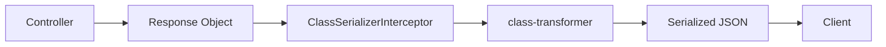

# How to Customize Response Serialization in NestJS

Author: [nawazdhandala](https://www.github.com/nawazdhandala)

Tags: NestJS, TypeScript, Node.js, API, Serialization, REST

Description: Learn how to customize response serialization in NestJS to control what data is exposed in your API responses. This guide covers class-transformer, interceptors, and advanced serialization patterns.

---

API responses should expose only the data that clients need, while hiding sensitive fields like passwords, internal IDs, or audit metadata. NestJS provides powerful serialization tools built on class-transformer that give you fine-grained control over response shaping. In this guide, we will explore how to customize response serialization for production APIs.

## Understanding Serialization in NestJS

NestJS uses the class-transformer library to transform plain objects into class instances and vice versa. When combined with the built-in ClassSerializerInterceptor, you can declaratively control which fields are included in responses.



## Setting Up Serialization

First, install the required dependencies and configure the interceptor globally.

```bash
npm install class-transformer class-validator
```

```typescript
// src/main.ts

import { NestFactory, Reflector } from '@nestjs/core';
import { ClassSerializerInterceptor, ValidationPipe } from '@nestjs/common';
import { AppModule } from './app.module';

async function bootstrap() {
  const app = await NestFactory.create(AppModule);

  // Enable global serialization
  app.useGlobalInterceptors(
    new ClassSerializerInterceptor(app.get(Reflector), {
      // Exclude properties that are not explicitly exposed
      strategy: 'excludeAll',
      // Transform nested objects
      enableImplicitConversion: true,
    })
  );

  // Enable validation
  app.useGlobalPipes(
    new ValidationPipe({
      transform: true,
      whitelist: true,
    })
  );

  await app.listen(3000);
}

bootstrap();
```

## Basic Entity Serialization

Create entities with serialization decorators to control field exposure.

```typescript
// src/users/entities/user.entity.ts

import { Exclude, Expose, Transform, Type } from 'class-transformer';

export class User {
  @Expose()
  id: string;

  @Expose()
  email: string;

  @Expose()
  name: string;

  // Never include password in responses
  @Exclude()
  password: string;

  // Internal field, excluded from responses
  @Exclude()
  internalNotes: string;

  @Expose()
  role: string;

  @Expose()
  @Transform(({ value }) => value?.toISOString())
  createdAt: Date;

  @Expose()
  @Transform(({ value }) => value?.toISOString())
  updatedAt: Date;

  // Exclude audit fields from regular responses
  @Exclude()
  lastLoginIp: string;

  @Exclude()
  failedLoginAttempts: number;

  constructor(partial: Partial<User>) {
    Object.assign(this, partial);
  }
}
```

```typescript
// src/users/users.controller.ts

import { Controller, Get, Param } from '@nestjs/common';
import { UsersService } from './users.service';
import { User } from './entities/user.entity';

@Controller('users')
export class UsersController {
  constructor(private readonly usersService: UsersService) {}

  @Get(':id')
  async findOne(@Param('id') id: string): Promise<User> {
    const userData = await this.usersService.findById(id);
    // Return an instance of User class for serialization to work
    return new User(userData);
  }

  @Get()
  async findAll(): Promise<User[]> {
    const users = await this.usersService.findAll();
    return users.map((user) => new User(user));
  }
}
```

## Using Serialization Groups

Groups allow you to expose different fields based on the context, such as admin views versus public views.

```typescript
// src/users/entities/user.entity.ts

import { Exclude, Expose, Transform } from 'class-transformer';

// Define group constants
export const SerializationGroups = {
  PUBLIC: 'public',
  ADMIN: 'admin',
  OWNER: 'owner',
} as const;

export class User {
  @Expose({ groups: [SerializationGroups.PUBLIC, SerializationGroups.ADMIN, SerializationGroups.OWNER] })
  id: string;

  @Expose({ groups: [SerializationGroups.PUBLIC, SerializationGroups.ADMIN, SerializationGroups.OWNER] })
  email: string;

  @Expose({ groups: [SerializationGroups.PUBLIC, SerializationGroups.ADMIN, SerializationGroups.OWNER] })
  name: string;

  @Exclude()
  password: string;

  // Only visible to admins
  @Expose({ groups: [SerializationGroups.ADMIN] })
  role: string;

  // Only visible to the owner and admins
  @Expose({ groups: [SerializationGroups.ADMIN, SerializationGroups.OWNER] })
  phoneNumber: string;

  // Only visible to admins
  @Expose({ groups: [SerializationGroups.ADMIN] })
  lastLoginIp: string;

  @Expose({ groups: [SerializationGroups.ADMIN] })
  failedLoginAttempts: number;

  @Expose({ groups: [SerializationGroups.PUBLIC, SerializationGroups.ADMIN, SerializationGroups.OWNER] })
  @Transform(({ value }) => value?.toISOString())
  createdAt: Date;

  constructor(partial: Partial<User>) {
    Object.assign(this, partial);
  }
}
```

Create a custom decorator to specify serialization groups.

```typescript
// src/common/decorators/serialize.decorator.ts

import { SetMetadata } from '@nestjs/common';

export const SERIALIZE_GROUPS_KEY = 'serialize_groups';

export const SerializeGroups = (...groups: string[]) =>
  SetMetadata(SERIALIZE_GROUPS_KEY, groups);
```

Build a custom interceptor that uses the groups.

```typescript
// src/common/interceptors/serialize.interceptor.ts

import {
  Injectable,
  NestInterceptor,
  ExecutionContext,
  CallHandler,
} from '@nestjs/common';
import { Reflector } from '@nestjs/core';
import { Observable } from 'rxjs';
import { map } from 'rxjs/operators';
import { instanceToPlain } from 'class-transformer';
import { SERIALIZE_GROUPS_KEY } from '../decorators/serialize.decorator';

@Injectable()
export class SerializeInterceptor implements NestInterceptor {
  constructor(private reflector: Reflector) {}

  intercept(context: ExecutionContext, next: CallHandler): Observable<unknown> {
    // Get groups from decorator
    const groups = this.reflector.getAllAndOverride<string[]>(
      SERIALIZE_GROUPS_KEY,
      [context.getHandler(), context.getClass()]
    ) || [];

    return next.handle().pipe(
      map((data) => {
        if (data === null || data === undefined) {
          return data;
        }

        return instanceToPlain(data, {
          groups,
          excludeExtraneousValues: true,
        });
      })
    );
  }
}
```

Use the decorator in controllers.

```typescript
// src/users/users.controller.ts

import { Controller, Get, Param, UseInterceptors } from '@nestjs/common';
import { UsersService } from './users.service';
import { User, SerializationGroups } from './entities/user.entity';
import { SerializeGroups } from '../common/decorators/serialize.decorator';
import { SerializeInterceptor } from '../common/interceptors/serialize.interceptor';

@Controller('users')
@UseInterceptors(SerializeInterceptor)
export class UsersController {
  constructor(private readonly usersService: UsersService) {}

  // Public endpoint - minimal data
  @Get(':id')
  @SerializeGroups(SerializationGroups.PUBLIC)
  async findOne(@Param('id') id: string): Promise<User> {
    const userData = await this.usersService.findById(id);
    return new User(userData);
  }

  // Owner endpoint - includes personal data
  @Get(':id/profile')
  @SerializeGroups(SerializationGroups.OWNER)
  async getProfile(@Param('id') id: string): Promise<User> {
    const userData = await this.usersService.findById(id);
    return new User(userData);
  }
}

// src/admin/users.controller.ts

@Controller('admin/users')
@UseInterceptors(SerializeInterceptor)
export class AdminUsersController {
  constructor(private readonly usersService: UsersService) {}

  // Admin endpoint - includes all fields
  @Get(':id')
  @SerializeGroups(SerializationGroups.ADMIN)
  async findOne(@Param('id') id: string): Promise<User> {
    const userData = await this.usersService.findById(id);
    return new User(userData);
  }
}
```

## Custom Transformations

Use the Transform decorator for complex field transformations.

```typescript
// src/orders/entities/order.entity.ts

import { Expose, Transform, Type } from 'class-transformer';
import { User } from '../../users/entities/user.entity';

export class OrderItem {
  @Expose()
  id: string;

  @Expose()
  productId: string;

  @Expose()
  productName: string;

  @Expose()
  quantity: number;

  @Expose()
  @Transform(({ value }) => parseFloat(value).toFixed(2))
  unitPrice: string;

  @Expose()
  @Transform(({ obj }) => (parseFloat(obj.unitPrice) * obj.quantity).toFixed(2))
  totalPrice: string;

  constructor(partial: Partial<OrderItem>) {
    Object.assign(this, partial);
  }
}

export class Order {
  @Expose()
  id: string;

  @Expose()
  orderNumber: string;

  // Transform enum to human-readable string
  @Expose()
  @Transform(({ value }) => {
    const statusMap: Record<string, string> = {
      PENDING: 'Pending',
      CONFIRMED: 'Confirmed',
      SHIPPED: 'Shipped',
      DELIVERED: 'Delivered',
      CANCELLED: 'Cancelled',
    };
    return statusMap[value] || value;
  })
  status: string;

  // Nested serialization
  @Expose()
  @Type(() => OrderItem)
  items: OrderItem[];

  // Include only specific user fields
  @Expose()
  @Type(() => User)
  @Transform(({ value }) => {
    if (!value) return null;
    return new User({
      id: value.id,
      name: value.name,
      email: value.email,
    });
  })
  customer: User;

  @Expose()
  @Transform(({ value }) => parseFloat(value).toFixed(2))
  subtotal: string;

  @Expose()
  @Transform(({ value }) => parseFloat(value).toFixed(2))
  tax: string;

  @Expose()
  @Transform(({ value }) => parseFloat(value).toFixed(2))
  total: string;

  // Format date as ISO string
  @Expose()
  @Transform(({ value }) => value?.toISOString())
  createdAt: string;

  // Computed field
  @Expose()
  @Transform(({ obj }) => obj.items?.length || 0)
  itemCount: number;

  constructor(partial: Partial<Order>) {
    Object.assign(this, partial);
    if (partial.items) {
      this.items = partial.items.map((item) => new OrderItem(item));
    }
    if (partial.customer) {
      this.customer = new User(partial.customer);
    }
  }
}
```

## Response DTOs for Different Contexts

Create separate DTOs for different API responses.

```typescript
// src/users/dto/user-response.dto.ts

import { Expose, Transform, Type } from 'class-transformer';

// Minimal user info for lists
export class UserListItemDto {
  @Expose()
  id: string;

  @Expose()
  name: string;

  @Expose()
  @Transform(({ value }) => value?.toISOString())
  createdAt: string;

  constructor(partial: Partial<UserListItemDto>) {
    Object.assign(this, partial);
  }
}

// Detailed user info for single user view
export class UserDetailDto {
  @Expose()
  id: string;

  @Expose()
  email: string;

  @Expose()
  name: string;

  @Expose()
  bio: string;

  @Expose()
  avatarUrl: string;

  @Expose()
  @Transform(({ value }) => value?.toISOString())
  createdAt: string;

  @Expose()
  @Transform(({ value }) => value?.toISOString())
  updatedAt: string;

  constructor(partial: Partial<UserDetailDto>) {
    Object.assign(this, partial);
  }
}

// User info embedded in other responses
export class UserEmbeddedDto {
  @Expose()
  id: string;

  @Expose()
  name: string;

  @Expose()
  avatarUrl: string;

  constructor(partial: Partial<UserEmbeddedDto>) {
    Object.assign(this, partial);
  }
}
```

```typescript
// src/users/users.controller.ts

import { Controller, Get, Param, UseInterceptors, ClassSerializerInterceptor } from '@nestjs/common';
import { UsersService } from './users.service';
import { UserListItemDto, UserDetailDto } from './dto/user-response.dto';

@Controller('users')
@UseInterceptors(ClassSerializerInterceptor)
export class UsersController {
  constructor(private readonly usersService: UsersService) {}

  @Get()
  async findAll(): Promise<UserListItemDto[]> {
    const users = await this.usersService.findAll();
    return users.map((user) => new UserListItemDto(user));
  }

  @Get(':id')
  async findOne(@Param('id') id: string): Promise<UserDetailDto> {
    const user = await this.usersService.findById(id);
    return new UserDetailDto(user);
  }
}
```

## Paginated Response Wrapper

Create a generic wrapper for paginated responses.

```typescript
// src/common/dto/paginated-response.dto.ts

import { Expose, Type } from 'class-transformer';

export class PaginationMeta {
  @Expose()
  page: number;

  @Expose()
  perPage: number;

  @Expose()
  totalItems: number;

  @Expose()
  totalPages: number;

  @Expose()
  hasNextPage: boolean;

  @Expose()
  hasPreviousPage: boolean;

  constructor(partial: Partial<PaginationMeta>) {
    Object.assign(this, partial);
  }
}

export class PaginatedResponse<T> {
  @Expose()
  data: T[];

  @Expose()
  @Type(() => PaginationMeta)
  meta: PaginationMeta;

  constructor(data: T[], meta: Partial<PaginationMeta>) {
    this.data = data;
    this.meta = new PaginationMeta({
      ...meta,
      totalPages: Math.ceil((meta.totalItems || 0) / (meta.perPage || 10)),
      hasNextPage: (meta.page || 1) < Math.ceil((meta.totalItems || 0) / (meta.perPage || 10)),
      hasPreviousPage: (meta.page || 1) > 1,
    });
  }
}
```

```typescript
// src/users/users.controller.ts

import { Controller, Get, Query, UseInterceptors, ClassSerializerInterceptor } from '@nestjs/common';
import { UsersService } from './users.service';
import { UserListItemDto } from './dto/user-response.dto';
import { PaginatedResponse } from '../common/dto/paginated-response.dto';

@Controller('users')
@UseInterceptors(ClassSerializerInterceptor)
export class UsersController {
  constructor(private readonly usersService: UsersService) {}

  @Get()
  async findAll(
    @Query('page') page = 1,
    @Query('perPage') perPage = 10
  ): Promise<PaginatedResponse<UserListItemDto>> {
    const { users, total } = await this.usersService.findPaginated(page, perPage);

    const data = users.map((user) => new UserListItemDto(user));

    return new PaginatedResponse(data, {
      page,
      perPage,
      totalItems: total,
    });
  }
}
```

## Handling Circular References

When entities reference each other, you need to handle circular serialization.

```typescript
// src/posts/entities/post.entity.ts

import { Expose, Transform, Type } from 'class-transformer';
import { UserEmbeddedDto } from '../../users/dto/user-response.dto';

export class Comment {
  @Expose()
  id: string;

  @Expose()
  content: string;

  @Expose()
  @Type(() => UserEmbeddedDto)
  author: UserEmbeddedDto;

  @Expose()
  @Transform(({ value }) => value?.toISOString())
  createdAt: string;

  // Avoid circular reference - do not include post here
  // Instead, use postId if needed
  @Expose()
  postId: string;

  constructor(partial: Partial<Comment>) {
    Object.assign(this, partial);
    if (partial.author) {
      this.author = new UserEmbeddedDto(partial.author);
    }
  }
}

export class Post {
  @Expose()
  id: string;

  @Expose()
  title: string;

  @Expose()
  content: string;

  @Expose()
  @Type(() => UserEmbeddedDto)
  author: UserEmbeddedDto;

  // Limit nested comments to avoid deep serialization
  @Expose()
  @Type(() => Comment)
  @Transform(({ value }) => value?.slice(0, 10)) // Only first 10 comments
  comments: Comment[];

  @Expose()
  commentCount: number;

  @Expose()
  @Transform(({ value }) => value?.toISOString())
  createdAt: string;

  constructor(partial: Partial<Post>) {
    Object.assign(this, partial);
    if (partial.author) {
      this.author = new UserEmbeddedDto(partial.author);
    }
    if (partial.comments) {
      this.comments = partial.comments.map((c) => new Comment(c));
    }
  }
}
```

## Custom Serializer for Complex Logic

When decorators are not enough, create custom serialization logic.

```typescript
// src/common/serializers/base.serializer.ts

export abstract class BaseSerializer<TEntity, TOutput> {
  abstract serialize(entity: TEntity): TOutput;

  serializeMany(entities: TEntity[]): TOutput[] {
    return entities.map((entity) => this.serialize(entity));
  }
}

// src/users/serializers/user.serializer.ts

import { Injectable } from '@nestjs/common';
import { BaseSerializer } from '../../common/serializers/base.serializer';
import { User } from '../entities/user.entity';

interface SerializedUser {
  id: string;
  email: string;
  name: string;
  displayName: string;
  initials: string;
  memberSince: string;
  isActive: boolean;
}

@Injectable()
export class UserSerializer extends BaseSerializer<User, SerializedUser> {
  serialize(user: User): SerializedUser {
    return {
      id: user.id,
      email: user.email,
      name: user.name,
      displayName: this.getDisplayName(user),
      initials: this.getInitials(user),
      memberSince: this.formatMemberSince(user.createdAt),
      isActive: this.isActive(user),
    };
  }

  private getDisplayName(user: User): string {
    return user.name || user.email.split('@')[0];
  }

  private getInitials(user: User): string {
    const name = user.name || user.email;
    return name
      .split(' ')
      .map((part) => part[0])
      .join('')
      .toUpperCase()
      .slice(0, 2);
  }

  private formatMemberSince(date: Date): string {
    const now = new Date();
    const diffMs = now.getTime() - date.getTime();
    const diffDays = Math.floor(diffMs / (1000 * 60 * 60 * 24));

    if (diffDays < 30) return `${diffDays} days`;
    if (diffDays < 365) return `${Math.floor(diffDays / 30)} months`;
    return `${Math.floor(diffDays / 365)} years`;
  }

  private isActive(user: User): boolean {
    // Custom logic to determine if user is active
    const thirtyDaysAgo = new Date();
    thirtyDaysAgo.setDate(thirtyDaysAgo.getDate() - 30);
    return user.updatedAt > thirtyDaysAgo;
  }
}
```

```typescript
// src/users/users.controller.ts

import { Controller, Get, Param } from '@nestjs/common';
import { UsersService } from './users.service';
import { UserSerializer } from './serializers/user.serializer';

@Controller('users')
export class UsersController {
  constructor(
    private readonly usersService: UsersService,
    private readonly userSerializer: UserSerializer
  ) {}

  @Get(':id')
  async findOne(@Param('id') id: string) {
    const user = await this.usersService.findById(id);
    return this.userSerializer.serialize(user);
  }

  @Get()
  async findAll() {
    const users = await this.usersService.findAll();
    return this.userSerializer.serializeMany(users);
  }
}
```

## Summary

Response serialization in NestJS gives you complete control over your API output.

| Technique | Use Case |
|-----------|----------|
| @Exclude/@Expose | Simple field visibility control |
| Serialization Groups | Context-dependent field exposure |
| @Transform | Field value transformation |
| @Type | Nested object serialization |
| Custom DTOs | Different response shapes per endpoint |
| Custom Serializers | Complex business logic in serialization |

Key takeaways:

1. Always use `excludeAll` strategy to explicitly expose fields
2. Use groups to handle different permission levels
3. Create separate DTOs for list vs detail views
4. Handle circular references by limiting depth
5. Return class instances, not plain objects, for serialization to work
6. Consider custom serializers for complex transformation logic

Proper response serialization keeps your API secure and ensures clients receive exactly the data they need.
