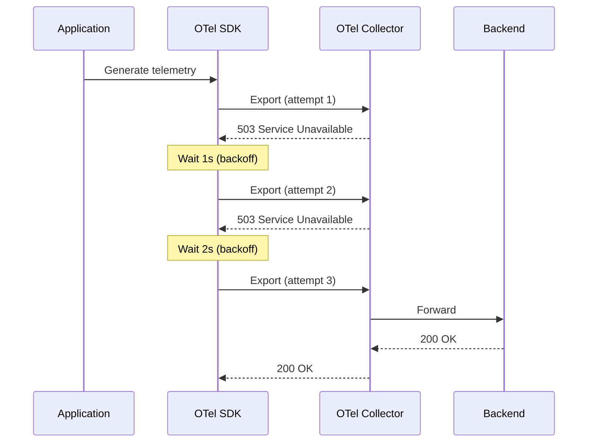

# How to Configure Retry Policies in OpenTelemetry

Author: [nawazdhandala](https://www.github.com/nawazdhandala)

Tags: OpenTelemetry, Retry Policies, Reliability, Telemetry Export, Collector Configuration, Observability

Description: Learn how to configure retry policies in OpenTelemetry to handle transient failures when exporting telemetry data. This guide covers SDK and Collector retry configurations with practical examples.

---

When exporting telemetry data from your applications, network hiccups and backend unavailability are inevitable. Without proper retry policies, you lose valuable telemetry during these transient failures. OpenTelemetry provides retry mechanisms at multiple levels to ensure your data makes it through.

This guide covers how to configure retry policies in both the OpenTelemetry SDK and the OpenTelemetry Collector.

## Why Retry Policies Matter

Telemetry export can fail for many reasons:

- Network timeouts
- Backend service temporarily unavailable
- Rate limiting
- DNS resolution failures
- TLS handshake issues

Without retries, each of these failures results in lost data. With proper retry configuration, transient issues resolve themselves and your telemetry pipeline remains resilient.



## SDK-Level Retry Configuration

### Node.js SDK

The OTLP exporters in Node.js support retry configuration through the `OTLPExporterNodeConfigBase` options.

```javascript
// tracing.js
const { NodeSDK } = require('@opentelemetry/sdk-node');
const { OTLPTraceExporter } = require('@opentelemetry/exporter-trace-otlp-http');
const { OTLPMetricExporter } = require('@opentelemetry/exporter-metrics-otlp-http');
const { PeriodicExportingMetricReader } = require('@opentelemetry/sdk-metrics');

// Configure trace exporter with retry settings
const traceExporter = new OTLPTraceExporter({
  url: process.env.OTEL_EXPORTER_OTLP_ENDPOINT + '/v1/traces',
  headers: {
    'x-oneuptime-token': process.env.ONEUPTIME_TOKEN
  },
  // Timeout for each export attempt in milliseconds
  timeoutMillis: 30000,
  // Number of concurrent export operations
  concurrencyLimit: 10
});

// Configure metric exporter
const metricExporter = new OTLPMetricExporter({
  url: process.env.OTEL_EXPORTER_OTLP_ENDPOINT + '/v1/metrics',
  headers: {
    'x-oneuptime-token': process.env.ONEUPTIME_TOKEN
  },
  timeoutMillis: 30000
});

const sdk = new NodeSDK({
  traceExporter,
  metricReader: new PeriodicExportingMetricReader({
    exporter: metricExporter,
    exportIntervalMillis: 60000 // Export metrics every minute
  })
});

sdk.start();
```

### Python SDK

In Python, configure retry behavior using environment variables or programmatically:

```python
# tracing_config.py
import os
from opentelemetry import trace
from opentelemetry.sdk.trace import TracerProvider
from opentelemetry.sdk.trace.export import BatchSpanProcessor
from opentelemetry.exporter.otlp.proto.grpc.trace_exporter import OTLPSpanExporter
from opentelemetry.sdk.resources import Resource

# Resource configuration
resource = Resource.create({
    "service.name": "payment-service",
    "deployment.environment": os.getenv("DEPLOY_ENV", "development")
})

# Create trace provider
provider = TracerProvider(resource=resource)

# Configure OTLP exporter with retry settings
# The gRPC exporter has built-in retry with exponential backoff
exporter = OTLPSpanExporter(
    endpoint=os.getenv("OTEL_EXPORTER_OTLP_ENDPOINT", "localhost:4317"),
    # Timeout in seconds for each export attempt
    timeout=30
)

# BatchSpanProcessor handles batching and export scheduling
# It has its own retry logic for failed exports
processor = BatchSpanProcessor(
    exporter,
    max_queue_size=2048,        # Maximum spans to queue
    schedule_delay_millis=5000,  # How often to export batches
    max_export_batch_size=512,   # Maximum spans per export
    export_timeout_millis=30000  # Timeout for batch export
)

provider.add_span_processor(processor)
trace.set_tracer_provider(provider)
```

### Environment Variable Configuration

Both Node.js and Python SDKs respect standard OpenTelemetry environment variables:

```bash
# Export endpoint
export OTEL_EXPORTER_OTLP_ENDPOINT="https://collector.example.com:4317"

# Timeout for export operations (in milliseconds)
export OTEL_EXPORTER_OTLP_TIMEOUT=30000

# Headers for authentication
export OTEL_EXPORTER_OTLP_HEADERS="x-oneuptime-token=your-token-here"

# Batch processor configuration
export OTEL_BSP_MAX_QUEUE_SIZE=2048
export OTEL_BSP_SCHEDULE_DELAY=5000
export OTEL_BSP_MAX_EXPORT_BATCH_SIZE=512
export OTEL_BSP_EXPORT_TIMEOUT=30000
```

## Collector-Level Retry Configuration

The OpenTelemetry Collector provides more sophisticated retry handling through the `retry_on_failure` and `sending_queue` configurations.

### Basic Retry Configuration

```yaml
# otel-collector-config.yaml
exporters:
  otlphttp:
    endpoint: "https://oneuptime.com/otlp"
    headers:
      "x-oneuptime-token": "${ONEUPTIME_TOKEN}"

    # Retry configuration
    retry_on_failure:
      enabled: true
      initial_interval: 5s    # First retry after 5 seconds
      max_interval: 30s       # Maximum time between retries
      max_elapsed_time: 300s  # Stop retrying after 5 minutes

    # Sending queue for buffering during failures
    sending_queue:
      enabled: true
      num_consumers: 10       # Parallel export workers
      queue_size: 5000        # Maximum items to queue
```

### Understanding Exponential Backoff

The retry mechanism uses exponential backoff with jitter. Here is how the intervals progress:

| Retry Attempt | Base Interval | With Jitter (example) |
|---------------|---------------|----------------------|
| 1             | 5s            | 4.2s                 |
| 2             | 10s           | 11.3s                |
| 3             | 20s           | 18.7s                |
| 4             | 30s (capped)  | 28.1s                |
| 5             | 30s (capped)  | 31.5s                |

### Full Collector Configuration with Retry

```yaml
# otel-collector-config.yaml
receivers:
  otlp:
    protocols:
      grpc:
        endpoint: 0.0.0.0:4317
      http:
        endpoint: 0.0.0.0:4318

processors:
  # Memory limiter prevents out-of-memory situations
  memory_limiter:
    check_interval: 5s
    limit_mib: 512
    spike_limit_mib: 128

  # Batch processor for efficient export
  batch:
    send_batch_size: 1000
    send_batch_max_size: 1500
    timeout: 10s

exporters:
  # Primary exporter with aggressive retry
  otlphttp/primary:
    endpoint: "https://primary-backend.example.com"
    headers:
      "Authorization": "Bearer ${PRIMARY_TOKEN}"
    retry_on_failure:
      enabled: true
      initial_interval: 1s
      max_interval: 30s
      max_elapsed_time: 300s
    sending_queue:
      enabled: true
      num_consumers: 10
      queue_size: 10000
    timeout: 30s

  # Backup exporter for failover
  otlphttp/backup:
    endpoint: "https://backup-backend.example.com"
    headers:
      "Authorization": "Bearer ${BACKUP_TOKEN}"
    retry_on_failure:
      enabled: true
      initial_interval: 5s
      max_interval: 60s
      max_elapsed_time: 600s
    sending_queue:
      enabled: true
      num_consumers: 5
      queue_size: 5000

service:
  pipelines:
    traces:
      receivers: [otlp]
      processors: [memory_limiter, batch]
      exporters: [otlphttp/primary, otlphttp/backup]

    metrics:
      receivers: [otlp]
      processors: [memory_limiter, batch]
      exporters: [otlphttp/primary]

    logs:
      receivers: [otlp]
      processors: [memory_limiter, batch]
      exporters: [otlphttp/primary]
```

## Handling Specific HTTP Status Codes

The Collector handles different HTTP status codes differently:

| Status Code | Behavior |
|-------------|----------|
| 2xx         | Success, no retry needed |
| 429         | Rate limited, retry with backoff |
| 500-503     | Server error, retry with backoff |
| 400-499     | Client error (except 429), no retry |

### Custom Retry Behavior

For more control, you can use the `headers_setter` extension to add retry-specific headers:

```yaml
extensions:
  headers_setter:
    headers:
      - action: insert
        key: X-Retry-Count
        from_context: retry_count

exporters:
  otlphttp:
    endpoint: "https://backend.example.com"
    retry_on_failure:
      enabled: true
      initial_interval: 2s
      max_interval: 60s
      max_elapsed_time: 600s
```

## Monitoring Retry Behavior

Enable internal metrics to monitor your retry behavior:

```yaml
service:
  telemetry:
    metrics:
      level: detailed
      address: 0.0.0.0:8888

  pipelines:
    # Your existing pipelines
```

Key metrics to watch:

- `otelcol_exporter_send_failed_spans` - Failed span exports
- `otelcol_exporter_send_failed_metric_points` - Failed metric exports
- `otelcol_exporter_queue_size` - Current queue size
- `otelcol_exporter_queue_capacity` - Maximum queue capacity

## Best Practices

1. **Start with conservative settings**: Begin with longer intervals and adjust based on observed behavior.

2. **Size queues appropriately**: Queue size should handle expected burst duration. If your backend can be down for 5 minutes and you generate 100 spans/second, you need a queue of at least 30,000.

3. **Set reasonable max_elapsed_time**: Do not retry indefinitely. At some point, the data becomes stale and should be dropped.

4. **Monitor queue metrics**: Alert when queue size approaches capacity. This indicates either undersized queues or persistent backend issues.

5. **Use memory limiters**: Always configure memory limiters to prevent the Collector from consuming too much memory during extended outages.

## Common Issues and Solutions

**Queue filling up during outages**: Increase `queue_size` or decrease telemetry volume through sampling.

**High CPU during retry storms**: Reduce `num_consumers` and increase `initial_interval`.

**Data loss during restarts**: Consider using the file storage extension for persistent queuing:

```yaml
extensions:
  file_storage:
    directory: /var/lib/otelcol/queue
    timeout: 10s

exporters:
  otlphttp:
    sending_queue:
      enabled: true
      storage: file_storage
```

## Summary

Retry policies are essential for building a resilient telemetry pipeline. Configure them at both the SDK level (for application-to-collector communication) and the Collector level (for collector-to-backend communication). Use exponential backoff to avoid overwhelming recovering services, size your queues to handle expected outage durations, and always monitor retry metrics to catch issues before they cause data loss.

The combination of proper retry configuration and persistent queuing ensures your telemetry data survives transient failures and reaches its destination.
