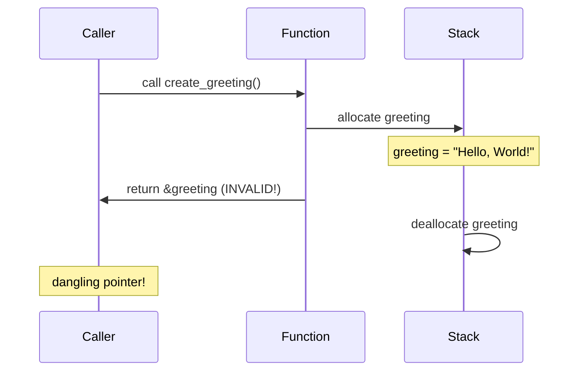

# How to Return Reference to Local Variable in Rust

Author: [nawazdhandala](https://www.github.com/nawazdhandala)

Tags: Rust, Lifetimes, Ownership, References, Memory Safety

Description: Learn why Rust prevents returning references to local variables and discover the correct patterns for returning data from functions including owned values, Cow, and static references.

---

One of the most common errors Rust beginners encounter is attempting to return a reference to a local variable. The compiler rejects this pattern because it would create a dangling pointer. This guide explains why this happens and shows you the correct alternatives.

## Understanding the Error

When you try to return a reference to something created inside a function, the compiler stops you:

```rust
// This won't compile
fn create_greeting() -> &str {
    let greeting = String::from("Hello, World!");
    &greeting  // Error: cannot return reference to local variable
}
```

The error message looks like this:

```
error[E0515]: cannot return reference to local variable `greeting`
 --> src/main.rs:3:5
  |
3 |     &greeting
  |     ^^^^^^^^^ returns a reference to data owned by the current function
```

## Why Rust Prevents This

The variable `greeting` is allocated on the stack within `create_greeting`. When the function returns, its stack frame is deallocated, and `greeting` no longer exists. If Rust allowed returning a reference to it, the caller would have a pointer to invalid memory.



## Solution 1: Return an Owned Value

The simplest solution is to return the owned data instead of a reference. The caller becomes the owner.

```rust
// Return the owned String instead of a reference
fn create_greeting() -> String {
    let greeting = String::from("Hello, World!");
    greeting  // Ownership transferred to caller
}

fn main() {
    let message = create_greeting();
    println!("{}", message);  // Works fine
}
```

This pattern is idiomatic Rust. The move is cheap (just copying the String's pointer, length, and capacity), and the caller now owns the data.

## Solution 2: Accept a Reference Parameter

If you need to work with a subset of existing data, pass a reference in and return a reference out. The lifetime of the returned reference is tied to the input.

```rust
// Return a reference derived from the input
// The lifetime 'a connects input and output lifetimes
fn find_word<'a>(text: &'a str, word: &str) -> Option<&'a str> {
    if let Some(start) = text.find(word) {
        Some(&text[start..start + word.len()])
    } else {
        None
    }
}

fn main() {
    let document = String::from("The quick brown fox jumps");

    // The returned reference is valid as long as document exists
    if let Some(found) = find_word(&document, "quick") {
        println!("Found: {}", found);
    }
}
```

The lifetime annotation `'a` tells the compiler that the returned reference lives as long as the input `text`.

## Solution 3: Return a Static Reference

If your data can be a compile-time constant, return a `'static` reference.

```rust
// Return a static string literal
// Static data lives for the entire program duration
fn get_default_config() -> &'static str {
    "default_configuration"
}

// Return static reference based on condition
fn get_status_message(code: u32) -> &'static str {
    match code {
        200 => "OK",
        404 => "Not Found",
        500 => "Internal Server Error",
        _ => "Unknown Status",
    }
}

fn main() {
    let config = get_default_config();
    let status = get_status_message(404);

    println!("Config: {}", config);
    println!("Status: {}", status);
}
```

String literals have type `&'static str` because they are embedded in the binary.

## Solution 4: Use Cow for Flexibility

When you sometimes need to return borrowed data and sometimes owned data, use `Cow` (Clone on Write).

```rust
use std::borrow::Cow;

// Cow allows returning either borrowed or owned data
// Avoids allocation when borrowed data suffices
fn normalize_path(path: &str) -> Cow<str> {
    if path.starts_with('/') {
        // Return borrowed data - no allocation
        Cow::Borrowed(path)
    } else {
        // Return owned data - allocation needed
        Cow::Owned(format!("/{}", path))
    }
}

fn process_input(input: &str) -> Cow<str> {
    if input.chars().all(|c| c.is_ascii()) {
        // No transformation needed, borrow the input
        Cow::Borrowed(input)
    } else {
        // Need to transform, create owned version
        let cleaned: String = input
            .chars()
            .filter(|c| c.is_ascii())
            .collect();
        Cow::Owned(cleaned)
    }
}

fn main() {
    let path1 = normalize_path("/home/user");  // Borrowed
    let path2 = normalize_path("relative/path");  // Owned

    // Both can be used identically
    println!("{}", path1);
    println!("{}", path2);

    // Check if allocation occurred
    match &path1 {
        Cow::Borrowed(_) => println!("path1 was borrowed"),
        Cow::Owned(_) => println!("path1 was owned"),
    }
}
```

## Solution 5: Use an Output Parameter

Pass a mutable reference to a buffer that the function fills.

```rust
// Fill a caller-provided buffer
// Useful when caller controls the allocation
fn read_data_into(buffer: &mut String) -> Result<usize, std::io::Error> {
    buffer.clear();
    buffer.push_str("Data from somewhere");
    Ok(buffer.len())
}

fn format_into(buffer: &mut String, name: &str, value: i32) {
    use std::fmt::Write;
    buffer.clear();
    write!(buffer, "{}: {}", name, value).unwrap();
}

fn main() {
    let mut buffer = String::with_capacity(1024);

    // Reuse the same buffer for multiple operations
    read_data_into(&mut buffer).unwrap();
    println!("{}", buffer);

    format_into(&mut buffer, "count", 42);
    println!("{}", buffer);
}
```

This pattern avoids repeated allocations when performing many operations.

## Solution 6: Box for Heap Allocation

Return heap-allocated data when the size is large or determined at runtime.

```rust
// Return boxed data for heap allocation
fn create_large_array() -> Box<[u8; 1_000_000]> {
    // Allocated directly on heap, not stack
    Box::new([0u8; 1_000_000])
}

// Return boxed trait object for dynamic dispatch
fn create_processor(kind: &str) -> Box<dyn Processor> {
    match kind {
        "fast" => Box::new(FastProcessor),
        _ => Box::new(DefaultProcessor),
    }
}

trait Processor {
    fn process(&self, data: &str) -> String;
}

struct FastProcessor;
struct DefaultProcessor;

impl Processor for FastProcessor {
    fn process(&self, data: &str) -> String {
        format!("Fast: {}", data)
    }
}

impl Processor for DefaultProcessor {
    fn process(&self, data: &str) -> String {
        format!("Default: {}", data)
    }
}
```

## Common Patterns Summary

| Scenario | Solution |
|----------|----------|
| Return newly created data | Return owned value (`String`, `Vec<T>`, etc.) |
| Return subset of input | Return reference with lifetime parameter |
| Return constant data | Return `&'static` reference |
| Sometimes borrow, sometimes own | Use `Cow<T>` |
| Caller controls allocation | Use output parameter |
| Large data or trait objects | Use `Box<T>` |

## The Struct Case

Returning references from struct methods follows the same rules:

```rust
struct Document {
    title: String,
    content: String,
}

impl Document {
    // Correct: return reference tied to self's lifetime
    fn title(&self) -> &str {
        &self.title
    }

    // Correct: return owned value
    fn generate_summary(&self) -> String {
        format!("{}: {} chars", self.title, self.content.len())
    }

    // Wrong: cannot return reference to local variable
    // fn get_header(&self) -> &str {
    //     let header = format!("=== {} ===", self.title);
    //     &header  // Error!
    // }

    // Correct: return owned value instead
    fn get_header(&self) -> String {
        format!("=== {} ===", self.title)
    }
}
```

## Summary

Rust prevents returning references to local variables because they would become dangling pointers. Instead, return owned values, tie reference lifetimes to inputs, use `Cow` for flexibility, or employ static references for constants. These patterns ensure memory safety while providing the flexibility you need.
