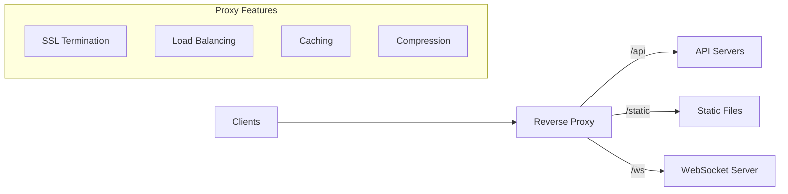

# How to Implement Reverse Proxy Patterns

Author: [nawazdhandala](https://www.github.com/nawazdhandala)

Tags: Reverse Proxy, Nginx, HAProxy, Load Balancing, Networking, DevOps

Description: A comprehensive guide to implementing reverse proxy patterns, covering load balancing, SSL termination, caching, WebSocket proxying, and advanced routing with Nginx and HAProxy.

---

Reverse proxies sit between clients and your backend servers, handling tasks like load balancing, SSL termination, and request routing. This guide covers common reverse proxy patterns and their implementation with Nginx and HAProxy.

## Reverse Proxy Architecture



## Basic Nginx Reverse Proxy

### Simple Proxy Configuration

```nginx
# /etc/nginx/sites-available/proxy.conf

upstream backend {
    server 10.0.1.100:8080;
    server 10.0.1.101:8080;
    server 10.0.1.102:8080;
}

server {
    listen 80;
    server_name api.example.com;

    location / {
        proxy_pass http://backend;

        # Pass original client information
        proxy_set_header Host $host;
        proxy_set_header X-Real-IP $remote_addr;
        proxy_set_header X-Forwarded-For $proxy_add_x_forwarded_for;
        proxy_set_header X-Forwarded-Proto $scheme;

        # Timeouts
        proxy_connect_timeout 5s;
        proxy_send_timeout 60s;
        proxy_read_timeout 60s;

        # Buffer settings
        proxy_buffering on;
        proxy_buffer_size 4k;
        proxy_buffers 8 4k;
    }
}
```

### SSL Termination

```nginx
server {
    listen 443 ssl http2;
    server_name api.example.com;

    ssl_certificate /etc/ssl/certs/api.example.com.crt;
    ssl_certificate_key /etc/ssl/private/api.example.com.key;
    ssl_protocols TLSv1.2 TLSv1.3;
    ssl_ciphers HIGH:!aNULL:!MD5;

    # HSTS
    add_header Strict-Transport-Security "max-age=31536000" always;

    location / {
        proxy_pass http://backend;

        # Tell backend the original protocol
        proxy_set_header X-Forwarded-Proto https;
        proxy_set_header X-Forwarded-SSL on;

        # Standard proxy headers
        proxy_set_header Host $host;
        proxy_set_header X-Real-IP $remote_addr;
        proxy_set_header X-Forwarded-For $proxy_add_x_forwarded_for;
    }
}

# Redirect HTTP to HTTPS
server {
    listen 80;
    server_name api.example.com;
    return 301 https://$server_name$request_uri;
}
```

## Load Balancing Patterns

### Round Robin with Weights

```nginx
upstream backend {
    server 10.0.1.100:8080 weight=5;   # Handles 5x traffic
    server 10.0.1.101:8080 weight=3;   # Handles 3x traffic
    server 10.0.1.102:8080 weight=2;   # Handles 2x traffic
}
```

### Least Connections

```nginx
upstream backend {
    least_conn;
    server 10.0.1.100:8080;
    server 10.0.1.101:8080;
    server 10.0.1.102:8080;
}
```

### IP Hash (Session Persistence)

```nginx
upstream backend {
    ip_hash;
    server 10.0.1.100:8080;
    server 10.0.1.101:8080;
    server 10.0.1.102:8080;
}
```

### Consistent Hash

```nginx
upstream backend {
    hash $request_uri consistent;
    server 10.0.1.100:8080;
    server 10.0.1.101:8080;
    server 10.0.1.102:8080;
}
```

## Path-Based Routing

```nginx
server {
    listen 443 ssl http2;
    server_name example.com;

    # API requests to API servers
    location /api/ {
        proxy_pass http://api_backend/;

        proxy_set_header Host $host;
        proxy_set_header X-Real-IP $remote_addr;
    }

    # WebSocket connections
    location /ws/ {
        proxy_pass http://websocket_backend/;

        proxy_http_version 1.1;
        proxy_set_header Upgrade $http_upgrade;
        proxy_set_header Connection "upgrade";
        proxy_set_header Host $host;

        # Longer timeouts for WebSocket
        proxy_read_timeout 3600s;
        proxy_send_timeout 3600s;
    }

    # Admin panel
    location /admin/ {
        # Restrict to internal IPs
        allow 10.0.0.0/8;
        deny all;

        proxy_pass http://admin_backend/;
        proxy_set_header Host $host;
    }

    # Static files - serve directly
    location /static/ {
        alias /var/www/static/;
        expires 1y;
        add_header Cache-Control "public, immutable";
    }

    # Default - frontend app
    location / {
        proxy_pass http://frontend_backend;
        proxy_set_header Host $host;
    }
}

upstream api_backend {
    server 10.0.1.100:8080;
    server 10.0.1.101:8080;
}

upstream websocket_backend {
    server 10.0.2.100:8080;
    server 10.0.2.101:8080;
}

upstream admin_backend {
    server 10.0.3.100:8080;
}

upstream frontend_backend {
    server 10.0.4.100:3000;
    server 10.0.4.101:3000;
}
```

## WebSocket Proxying

```nginx
# WebSocket-specific configuration
map $http_upgrade $connection_upgrade {
    default upgrade;
    ''      close;
}

upstream websocket {
    # Sticky sessions for WebSocket
    ip_hash;
    server 10.0.1.100:8080;
    server 10.0.1.101:8080;
}

server {
    listen 443 ssl http2;
    server_name ws.example.com;

    location / {
        proxy_pass http://websocket;

        # WebSocket specific headers
        proxy_http_version 1.1;
        proxy_set_header Upgrade $http_upgrade;
        proxy_set_header Connection $connection_upgrade;

        # Standard headers
        proxy_set_header Host $host;
        proxy_set_header X-Real-IP $remote_addr;
        proxy_set_header X-Forwarded-For $proxy_add_x_forwarded_for;
        proxy_set_header X-Forwarded-Proto $scheme;

        # Timeouts for long-lived connections
        proxy_read_timeout 86400;
        proxy_send_timeout 86400;

        # Disable buffering for real-time
        proxy_buffering off;
    }
}
```

## HAProxy Configuration

### Basic HAProxy Setup

```haproxy
# /etc/haproxy/haproxy.cfg

global
    log /dev/log local0
    maxconn 50000
    user haproxy
    group haproxy
    daemon
    stats socket /var/run/haproxy.sock mode 660 level admin

defaults
    log global
    mode http
    option httplog
    option dontlognull
    option http-server-close
    option forwardfor except 127.0.0.0/8
    timeout connect 5s
    timeout client 30s
    timeout server 30s
    errorfile 503 /etc/haproxy/errors/503.http

frontend http_front
    bind *:80
    bind *:443 ssl crt /etc/ssl/certs/example.com.pem alpn h2,http/1.1

    # Redirect HTTP to HTTPS
    http-request redirect scheme https unless { ssl_fc }

    # ACLs for routing
    acl is_api path_beg /api
    acl is_ws hdr(Upgrade) -i websocket
    acl is_admin path_beg /admin

    # Route based on ACLs
    use_backend api_servers if is_api
    use_backend ws_servers if is_ws
    use_backend admin_servers if is_admin
    default_backend web_servers

backend api_servers
    balance roundrobin
    option httpchk GET /health
    http-check expect status 200

    server api1 10.0.1.100:8080 check inter 5s fall 3 rise 2
    server api2 10.0.1.101:8080 check inter 5s fall 3 rise 2
    server api3 10.0.1.102:8080 check inter 5s fall 3 rise 2 backup

backend ws_servers
    balance source  # Session persistence for WebSocket
    timeout server 3600s
    timeout tunnel 3600s

    server ws1 10.0.2.100:8080 check
    server ws2 10.0.2.101:8080 check

backend admin_servers
    # Restrict to specific IPs
    acl internal_ip src 10.0.0.0/8 172.16.0.0/12
    http-request deny unless internal_ip

    server admin1 10.0.3.100:8080 check

backend web_servers
    balance leastconn
    option httpchk GET /
    cookie SERVERID insert indirect nocache

    server web1 10.0.4.100:3000 check cookie web1
    server web2 10.0.4.101:3000 check cookie web2
```

### HAProxy Stats Dashboard

```haproxy
frontend stats
    bind *:8404
    stats enable
    stats uri /stats
    stats refresh 10s
    stats admin if LOCALHOST
    stats auth admin:password
```

## Caching with Reverse Proxy

```nginx
# Proxy cache configuration
proxy_cache_path /var/cache/nginx levels=1:2 keys_zone=api_cache:100m
                 max_size=10g inactive=60m use_temp_path=off;

server {
    listen 443 ssl http2;
    server_name api.example.com;

    location /api/products {
        proxy_pass http://backend;

        # Enable caching
        proxy_cache api_cache;
        proxy_cache_valid 200 10m;
        proxy_cache_valid 404 1m;
        proxy_cache_use_stale error timeout updating;
        proxy_cache_background_update on;
        proxy_cache_lock on;

        # Cache key
        proxy_cache_key "$scheme$request_method$host$request_uri";

        # Add cache status header
        add_header X-Cache-Status $upstream_cache_status;

        # Bypass cache for authenticated requests
        proxy_cache_bypass $http_authorization;
        proxy_no_cache $http_authorization;
    }

    location /api/users {
        proxy_pass http://backend;

        # No caching for user-specific data
        proxy_no_cache 1;
        proxy_cache_bypass 1;
    }
}
```

## Request/Response Manipulation

```nginx
server {
    listen 443 ssl http2;
    server_name api.example.com;

    # Add security headers
    add_header X-Frame-Options "SAMEORIGIN" always;
    add_header X-Content-Type-Options "nosniff" always;
    add_header X-XSS-Protection "1; mode=block" always;

    location /api/ {
        proxy_pass http://backend;

        # Remove internal headers before proxying
        proxy_set_header X-Internal-Token "";

        # Add request ID
        set $request_id $request_id;
        proxy_set_header X-Request-ID $request_id;

        # Hide upstream server info
        proxy_hide_header X-Powered-By;
        proxy_hide_header Server;

        # Modify response headers
        more_set_headers "Server: API Gateway";
    }

    # Rewrite URLs in responses
    location /legacy/ {
        proxy_pass http://legacy_backend/;

        # Rewrite URLs in HTML responses
        sub_filter 'http://legacy.internal' 'https://api.example.com/legacy';
        sub_filter_once off;
        sub_filter_types text/html application/json;
    }
}
```

## Rate Limiting

```nginx
# Define rate limit zones
limit_req_zone $binary_remote_addr zone=api_limit:10m rate=10r/s;
limit_req_zone $http_x_api_key zone=key_limit:10m rate=100r/s;

server {
    listen 443 ssl http2;
    server_name api.example.com;

    location /api/ {
        # Apply rate limiting
        limit_req zone=api_limit burst=20 nodelay;

        # Custom error for rate limit
        limit_req_status 429;

        proxy_pass http://backend;
    }

    # Higher limits for authenticated users
    location /api/premium/ {
        limit_req zone=key_limit burst=200 nodelay;

        proxy_pass http://backend;
    }
}
```

## Health Checks and Failover

```nginx
upstream backend {
    server 10.0.1.100:8080 max_fails=3 fail_timeout=30s;
    server 10.0.1.101:8080 max_fails=3 fail_timeout=30s;
    server 10.0.1.102:8080 backup;

    # Keep connections alive
    keepalive 32;
}

server {
    location / {
        proxy_pass http://backend;

        # Retry on specific errors
        proxy_next_upstream error timeout http_502 http_503 http_504;
        proxy_next_upstream_timeout 10s;
        proxy_next_upstream_tries 3;

        # Keep-alive to upstream
        proxy_http_version 1.1;
        proxy_set_header Connection "";
    }
}
```

## Monitoring Script

```bash
#!/bin/bash
# proxy-monitor.sh

echo "=== Nginx Status ==="
curl -s http://localhost/nginx_status

echo -e "\n=== Backend Health ==="
for server in 10.0.1.100 10.0.1.101 10.0.1.102; do
    response=$(curl -s -o /dev/null -w "%{http_code}" http://$server:8080/health)
    echo "$server: HTTP $response"
done

echo -e "\n=== Cache Status ==="
du -sh /var/cache/nginx/

echo -e "\n=== Active Connections ==="
ss -tn state established '( dport = :8080 )' | wc -l

echo -e "\n=== HAProxy Stats ==="
echo "show stat" | socat unix-connect:/var/run/haproxy.sock stdio | cut -d, -f1,2,18,19
```

---

Reverse proxy patterns form the backbone of modern web architectures. Start with basic proxying and SSL termination, then add load balancing and caching as your traffic grows. The key is understanding your traffic patterns and configuring timeouts, buffers, and health checks appropriately for your workload.
