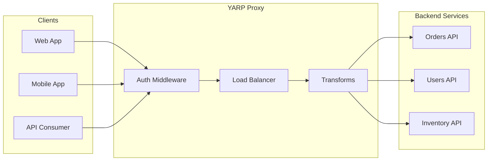

# How to Build a Reverse Proxy with YARP in .NET

Author: [nawazdhandala](https://www.github.com/nawazdhandala)

Tags: .NET, YARP, Reverse Proxy, ASP.NET Core, Load Balancing, Microservices, API Gateway

Description: Learn how to build a high-performance reverse proxy in .NET using YARP (Yet Another Reverse Proxy), including load balancing, request transformation, authentication, and health checks.

---

YARP (Yet Another Reverse Proxy) is a Microsoft library that provides a toolkit for building fast reverse proxy servers in .NET. Unlike traditional proxies like NGINX or HAProxy, YARP gives you full programmatic control over routing, transformation, and load balancing while leveraging the ASP.NET Core pipeline.

## Why YARP?

YARP is designed for scenarios where you need custom proxy logic that integrates with your .NET ecosystem. Common use cases include:

- API gateways with custom authentication
- Backend-for-frontend (BFF) patterns
- Service mesh sidecars
- A/B testing and canary deployments
- Request transformation and aggregation



## Getting Started

### Installation

Add the YARP NuGet package to your project:

```bash
dotnet add package Yarp.ReverseProxy
```

### Basic Configuration

YARP uses a configuration-first approach. You define routes and clusters either in `appsettings.json` or programmatically.

```json
{
  "ReverseProxy": {
    "Routes": {
      "orders-route": {
        "ClusterId": "orders-cluster",
        "Match": {
          "Path": "/api/orders/{**catch-all}"
        },
        "Transforms": [
          { "PathRemovePrefix": "/api/orders" }
        ]
      },
      "users-route": {
        "ClusterId": "users-cluster",
        "Match": {
          "Path": "/api/users/{**catch-all}"
        },
        "Transforms": [
          { "PathRemovePrefix": "/api/users" }
        ]
      }
    },
    "Clusters": {
      "orders-cluster": {
        "Destinations": {
          "orders-1": {
            "Address": "https://orders-service:8080/"
          },
          "orders-2": {
            "Address": "https://orders-service-replica:8080/"
          }
        },
        "LoadBalancingPolicy": "RoundRobin"
      },
      "users-cluster": {
        "Destinations": {
          "users-1": {
            "Address": "https://users-service:8080/"
          }
        }
      }
    }
  }
}
```

### Setting Up the Proxy

```csharp
// Program.cs
var builder = WebApplication.CreateBuilder(args);

// Add YARP services and load configuration from appsettings.json
builder.Services.AddReverseProxy()
    .LoadFromConfig(builder.Configuration.GetSection("ReverseProxy"));

var app = builder.Build();

// Map the reverse proxy endpoints
app.MapReverseProxy();

app.Run();
```

## Load Balancing Strategies

YARP supports multiple load balancing policies out of the box:

```json
{
  "Clusters": {
    "api-cluster": {
      "LoadBalancingPolicy": "RoundRobin",
      "Destinations": {
        "server-1": { "Address": "https://server1:8080/" },
        "server-2": { "Address": "https://server2:8080/" },
        "server-3": { "Address": "https://server3:8080/" }
      }
    }
  }
}
```

Available policies include:
- **RoundRobin**: Distributes requests evenly across all destinations
- **Random**: Selects a random destination
- **LeastRequests**: Routes to the destination with fewest active requests
- **PowerOfTwoChoices**: Picks two random destinations and routes to the one with fewer requests
- **FirstAlphabetical**: Always routes to the first destination (useful for failover)

### Custom Load Balancing

For advanced scenarios, implement a custom load balancing policy:

```csharp
// CustomLoadBalancingPolicy.cs
public class WeightedLoadBalancingPolicy : ILoadBalancingPolicy
{
    public string Name => "Weighted";

    public DestinationState? PickDestination(
        HttpContext context,
        ClusterState cluster,
        IReadOnlyList<DestinationState> availableDestinations)
    {
        if (availableDestinations.Count == 0)
            return null;

        // Calculate total weight
        var totalWeight = availableDestinations.Sum(d =>
            d.Model.Config.Metadata?.GetValueOrDefault("Weight", "1") is string w
                ? int.Parse(w)
                : 1);

        // Pick based on weight
        var random = Random.Shared.Next(totalWeight);
        var accumulated = 0;

        foreach (var destination in availableDestinations)
        {
            var weight = destination.Model.Config.Metadata?.GetValueOrDefault("Weight", "1") is string w
                ? int.Parse(w)
                : 1;
            accumulated += weight;

            if (random < accumulated)
                return destination;
        }

        return availableDestinations[0];
    }
}

// Registration in Program.cs
builder.Services.AddSingleton<ILoadBalancingPolicy, WeightedLoadBalancingPolicy>();
```

## Request Transforms

YARP provides powerful request and response transformation capabilities.

### Built-in Transforms

```json
{
  "Routes": {
    "api-route": {
      "ClusterId": "api-cluster",
      "Match": {
        "Path": "/api/{**remainder}"
      },
      "Transforms": [
        { "PathRemovePrefix": "/api" },
        { "RequestHeader": "X-Forwarded-Host", "Append": "{Host}" },
        { "RequestHeader": "X-Request-Id", "Set": "{Random}" },
        { "ResponseHeader": "X-Proxy-Server", "Set": "YARP", "When": "Always" }
      ]
    }
  }
}
```

### Custom Transform Provider

For complex transformations, create a custom transform provider:

```csharp
// TenantTransformProvider.cs
public class TenantTransformProvider : ITransformProvider
{
    public void ValidateCluster(TransformClusterValidationContext context)
    {
        // Validate cluster configuration
    }

    public void ValidateRoute(TransformRouteValidationContext context)
    {
        // Validate route configuration
    }

    public void Apply(TransformBuilderContext context)
    {
        // Add tenant ID header based on subdomain
        context.AddRequestTransform(async transformContext =>
        {
            var host = transformContext.HttpContext.Request.Host.Host;
            var tenantId = ExtractTenantFromHost(host);

            if (!string.IsNullOrEmpty(tenantId))
            {
                transformContext.ProxyRequest.Headers.Add("X-Tenant-Id", tenantId);
            }
        });

        // Add response timing header
        context.AddResponseTransform(async transformContext =>
        {
            var startTime = transformContext.HttpContext.Items["RequestStartTime"] as DateTime?;
            if (startTime.HasValue)
            {
                var elapsed = DateTime.UtcNow - startTime.Value;
                transformContext.HttpContext.Response.Headers["X-Response-Time"] =
                    $"{elapsed.TotalMilliseconds:F2}ms";
            }
        });
    }

    private string ExtractTenantFromHost(string host)
    {
        var parts = host.Split('.');
        return parts.Length > 2 ? parts[0] : null;
    }
}

// Register the transform provider
builder.Services.AddSingleton<ITransformProvider, TenantTransformProvider>();
```

## Health Checks

YARP integrates with ASP.NET Core health checks to monitor backend destinations:

```json
{
  "Clusters": {
    "api-cluster": {
      "HealthCheck": {
        "Active": {
          "Enabled": true,
          "Interval": "00:00:10",
          "Timeout": "00:00:05",
          "Policy": "ConsecutiveFailures",
          "Path": "/health"
        },
        "Passive": {
          "Enabled": true,
          "Policy": "TransportFailureRate",
          "ReactivationPeriod": "00:02:00"
        }
      },
      "Destinations": {
        "server-1": {
          "Address": "https://server1:8080/",
          "Health": "https://server1:8080/health"
        }
      }
    }
  }
}
```

### Custom Health Check Policy

```csharp
// CustomHealthCheckPolicy.cs
public class CustomHealthCheckPolicy : IActiveHealthCheckPolicy
{
    public string Name => "CustomHealthCheck";

    public void ProbingCompleted(
        ClusterState cluster,
        IReadOnlyList<DestinationProbingResult> probingResults)
    {
        foreach (var result in probingResults)
        {
            DestinationHealth health;

            if (result.Response == null)
            {
                health = DestinationHealth.Unhealthy;
            }
            else if (result.Response.StatusCode == HttpStatusCode.OK)
            {
                // Check response body for detailed health status
                var content = result.Response.Content.ReadAsStringAsync().Result;
                health = content.Contains("\"status\":\"healthy\"")
                    ? DestinationHealth.Healthy
                    : DestinationHealth.Unhealthy;
            }
            else
            {
                health = DestinationHealth.Unhealthy;
            }

            result.Destination.Health.Active = health;
        }
    }
}
```

## Authentication and Authorization

Integrate YARP with ASP.NET Core authentication to secure your proxy:

```csharp
// Program.cs
builder.Services.AddAuthentication(JwtBearerDefaults.AuthenticationScheme)
    .AddJwtBearer(options =>
    {
        options.Authority = "https://auth.example.com";
        options.Audience = "api";
    });

builder.Services.AddAuthorization(options =>
{
    options.AddPolicy("ApiAccess", policy =>
        policy.RequireAuthenticatedUser()
              .RequireClaim("scope", "api.read"));
});

builder.Services.AddReverseProxy()
    .LoadFromConfig(builder.Configuration.GetSection("ReverseProxy"));

var app = builder.Build();

app.UseAuthentication();
app.UseAuthorization();

// Apply authorization to specific routes
app.MapReverseProxy(proxyPipeline =>
{
    proxyPipeline.Use(async (context, next) =>
    {
        // Custom middleware before proxying
        var route = context.GetReverseProxyFeature().Route;

        if (route.Config.Metadata?.ContainsKey("RequireAuth") == true)
        {
            if (!context.User.Identity?.IsAuthenticated == true)
            {
                context.Response.StatusCode = 401;
                return;
            }
        }

        await next();
    });
});
```

## Rate Limiting

Add rate limiting to protect your backend services:

```csharp
// Program.cs
builder.Services.AddRateLimiter(options =>
{
    options.AddFixedWindowLimiter("api-limit", opt =>
    {
        opt.PermitLimit = 100;
        opt.Window = TimeSpan.FromMinutes(1);
        opt.QueueProcessingOrder = QueueProcessingOrder.OldestFirst;
        opt.QueueLimit = 10;
    });

    options.AddSlidingWindowLimiter("premium-limit", opt =>
    {
        opt.PermitLimit = 1000;
        opt.Window = TimeSpan.FromMinutes(1);
        opt.SegmentsPerWindow = 6;
    });
});

builder.Services.AddReverseProxy()
    .LoadFromConfig(builder.Configuration.GetSection("ReverseProxy"));

var app = builder.Build();

app.UseRateLimiter();

app.MapReverseProxy().RequireRateLimiting("api-limit");
```

## Dynamic Configuration

For scenarios where routes and clusters change at runtime, use a custom configuration provider:

```csharp
// DynamicProxyConfigProvider.cs
public class DynamicProxyConfigProvider : IProxyConfigProvider
{
    private readonly IDbContext _dbContext;
    private volatile IProxyConfig _config;

    public DynamicProxyConfigProvider(IDbContext dbContext)
    {
        _dbContext = dbContext;
        _config = LoadConfig();
    }

    public IProxyConfig GetConfig() => _config;

    public void Reload()
    {
        var oldConfig = _config;
        _config = LoadConfig();

        // Signal configuration change
        oldConfig.ChangeToken.OnChange(() => { });
    }

    private IProxyConfig LoadConfig()
    {
        var routes = _dbContext.ProxyRoutes
            .Select(r => new RouteConfig
            {
                RouteId = r.Id,
                ClusterId = r.ClusterId,
                Match = new RouteMatch { Path = r.PathPattern }
            })
            .ToList();

        var clusters = _dbContext.Clusters
            .Select(c => new ClusterConfig
            {
                ClusterId = c.Id,
                Destinations = c.Destinations.ToDictionary(
                    d => d.Id,
                    d => new DestinationConfig { Address = d.Address })
            })
            .ToList();

        return new InMemoryProxyConfig(routes, clusters);
    }
}
```

## Observability

Add telemetry to monitor proxy performance:

```csharp
// Program.cs
builder.Services.AddOpenTelemetry()
    .WithTracing(tracing =>
    {
        tracing
            .AddAspNetCoreInstrumentation()
            .AddHttpClientInstrumentation()
            .AddSource("Yarp.ReverseProxy")
            .AddOtlpExporter();
    })
    .WithMetrics(metrics =>
    {
        metrics
            .AddAspNetCoreInstrumentation()
            .AddHttpClientInstrumentation()
            .AddPrometheusExporter();
    });

// Custom middleware for request logging
app.MapReverseProxy(proxyPipeline =>
{
    proxyPipeline.Use(async (context, next) =>
    {
        var stopwatch = Stopwatch.StartNew();
        var route = context.GetReverseProxyFeature().Route;

        try
        {
            await next();
        }
        finally
        {
            stopwatch.Stop();
            Log.Information(
                "Proxied {Method} {Path} to {Cluster} in {Elapsed}ms with status {Status}",
                context.Request.Method,
                context.Request.Path,
                route.Config.ClusterId,
                stopwatch.ElapsedMilliseconds,
                context.Response.StatusCode);
        }
    });
});
```

## Summary

| Feature | Configuration |
|---------|---------------|
| **Basic Routing** | JSON or code-based configuration |
| **Load Balancing** | RoundRobin, Random, LeastRequests, or custom |
| **Health Checks** | Active probing and passive monitoring |
| **Transforms** | Request/response header and path manipulation |
| **Authentication** | ASP.NET Core middleware integration |
| **Rate Limiting** | Fixed or sliding window policies |

YARP provides a flexible foundation for building reverse proxies in .NET. Its integration with ASP.NET Core means you can leverage familiar patterns for authentication, logging, and configuration while maintaining full control over proxy behavior. For simple use cases, configuration-driven routing works well. For complex scenarios, programmatic APIs let you implement custom load balancing, health checks, and transformations.
