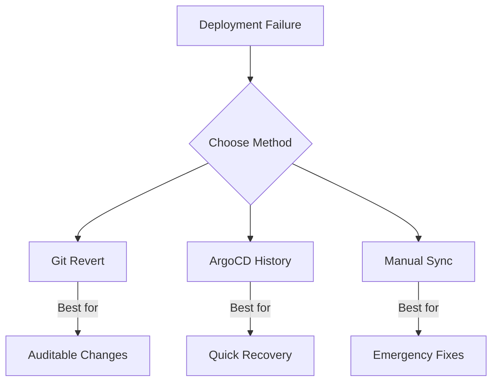

# How to Implement Rollback Strategies in ArgoCD

Author: [nawazdhandala](https://www.github.com/nawazdhandala)

Tags: ArgoCD, Rollback, Kubernetes, GitOps, Recovery, Deployment

Description: Learn different rollback strategies in ArgoCD including Git-based rollbacks, application history, and emergency procedures to quickly recover from failed deployments.

---

Deployments fail. When they do, you need to recover quickly. ArgoCD provides multiple ways to rollback: through Git history, application history, or manual intervention. This guide covers all the strategies so you can choose the right one for each situation.

## Rollback Methods Overview



## Method 1: Git-Based Rollback

The GitOps way to rollback is to revert changes in Git:

```bash
# Find the commit that broke things
git log --oneline -10

# Revert the problematic commit
git revert abc1234

# Push the revert
git push origin main
```

ArgoCD automatically detects the change and syncs:

```bash
# Or manually trigger sync
argocd app sync myapp
```

### Benefits
- Full audit trail
- Change reviewed through PR
- Consistent with GitOps principles

### When to Use
- Non-urgent rollbacks
- When you have time to verify the revert
- When the exact problematic commit is known

## Method 2: ArgoCD History Rollback

ArgoCD keeps a history of synced revisions:

### View Sync History

```bash
# List sync history
argocd app history myapp

# Output:
# ID  DATE                           REVISION
# 1   2026-01-24 10:00:00 +0000 UTC  abc1234
# 2   2026-01-24 14:00:00 +0000 UTC  def5678
# 3   2026-01-25 09:00:00 +0000 UTC  ghi9012 (current)
```

### Rollback to Previous Revision

```bash
# Rollback to specific history ID
argocd app rollback myapp 2

# Or rollback to specific Git revision
argocd app sync myapp --revision def5678
```

### What Happens During Rollback

1. ArgoCD fetches manifests from the specified Git revision
2. Applies those manifests to the cluster
3. Application shows the old revision as current

Note: The Git repository itself is not changed. The Application just points to an older commit.

## Method 3: Manual Sync to Specific Revision

Sync to any Git reference:

```bash
# Sync to specific commit
argocd app sync myapp --revision abc1234

# Sync to specific tag
argocd app sync myapp --revision v1.2.3

# Sync to specific branch
argocd app sync myapp --revision release/1.2
```

## Preventing Auto-Sync After Rollback

If auto-sync is enabled, ArgoCD will try to sync back to HEAD. Disable it temporarily:

```bash
# Disable auto-sync
argocd app set myapp --sync-policy none

# Perform rollback
argocd app rollback myapp 2

# Later, re-enable auto-sync
argocd app set myapp --sync-policy automated --self-heal
```

Or modify the Application:

```yaml
apiVersion: argoproj.io/v1alpha1
kind: Application
metadata:
  name: myapp
spec:
  syncPolicy:
    # Temporarily disabled for rollback
    # automated:
    #   prune: true
    #   selfHeal: true
```

## Rolling Back Helm Releases

For Helm-based applications, rollback works the same way:

```bash
# View history
argocd app history myapp

# Rollback
argocd app rollback myapp 2
```

Or sync to a specific chart version:

```yaml
apiVersion: argoproj.io/v1alpha1
kind: Application
metadata:
  name: myapp
spec:
  source:
    chart: myapp
    # Pin to previous version
    targetRevision: 1.2.3
```

## Partial Rollbacks

Sometimes you only need to rollback one resource:

### Using kubectl

```bash
# Rollback just the deployment
kubectl rollout undo deployment/myapp -n myapp

# Rollback to specific revision
kubectl rollout undo deployment/myapp -n myapp --to-revision=2
```

Warning: This creates drift from Git. Address it by updating Git afterward.

### Using ArgoCD Selective Sync

```bash
# Sync only specific resources
argocd app sync myapp --resource apps:Deployment:myapp
```

## Emergency Rollback Procedures

For critical incidents, speed matters:

### Quick Rollback Script

```bash
#!/bin/bash
# emergency-rollback.sh

APP_NAME=$1
HISTORY_ID=$2

echo "Emergency rollback of $APP_NAME to history $HISTORY_ID"

# Disable auto-sync
argocd app set $APP_NAME --sync-policy none

# Perform rollback
argocd app rollback $APP_NAME $HISTORY_ID

# Wait for sync
argocd app wait $APP_NAME --sync --health

echo "Rollback complete. Remember to:"
echo "1. Investigate the issue"
echo "2. Fix in Git"
echo "3. Re-enable auto-sync"
```

### Declarative Emergency Override

Create a ConfigMap with known-good values:

```yaml
# emergency-override.yaml
apiVersion: v1
kind: ConfigMap
metadata:
  name: emergency-config
  namespace: myapp
data:
  # Known working configuration
  APP_VERSION: "v1.2.3"
  FEATURE_FLAG: "disabled"
```

## Rollback with Argo Rollouts

If using Argo Rollouts for progressive delivery:

```bash
# View rollout status
kubectl argo rollouts get rollout myapp -n myapp

# Abort current rollout (automatic rollback)
kubectl argo rollouts abort myapp -n myapp

# Manual rollback to previous
kubectl argo rollouts undo myapp -n myapp

# Rollback to specific revision
kubectl argo rollouts undo myapp -n myapp --to-revision=2
```

## Configuring Rollback Behavior

### History Limit

Control how many revisions ArgoCD keeps:

```yaml
apiVersion: argoproj.io/v1alpha1
kind: Application
metadata:
  name: myapp
spec:
  # Keep last 10 sync operations
  revisionHistoryLimit: 10
```

### Prune on Rollback

Decide whether to remove resources not in the old revision:

```bash
# Rollback with pruning
argocd app rollback myapp 2 --prune

# Rollback without pruning (safer)
argocd app rollback myapp 2
```

## Post-Rollback Steps

After a successful rollback:

### 1. Verify Application Health

```bash
# Check application status
argocd app get myapp

# Check pod status
kubectl get pods -n myapp
```

### 2. Update Git to Match

```bash
# Revert the problematic changes in Git
git revert <bad-commit>
git push origin main
```

### 3. Re-enable Auto-Sync

```bash
argocd app set myapp --sync-policy automated --self-heal
```

### 4. Document the Incident

Create a post-mortem including:
- What failed
- How it was detected
- Rollback method used
- Time to recovery
- Preventive measures

## Monitoring Rollbacks

### Prometheus Metrics

```yaml
# Alert on frequent rollbacks
groups:
  - name: argocd-rollbacks
    rules:
      - alert: FrequentRollbacks
        expr: |
          increase(argocd_app_sync_total{phase="Succeeded", dest_server=~".*"}[1h]) > 5
        for: 5m
        labels:
          severity: warning
        annotations:
          summary: "Application {{ $labels.name }} has frequent syncs (possible rollbacks)"
```

### Notifications

```yaml
# argocd-notifications-cm
data:
  trigger.on-rollback: |
    - description: Application was rolled back
      send:
        - rollback-alert
      when: app.status.history | length > 1 and app.status.sync.revision != app.status.history[1].revision

  template.rollback-alert: |
    message: |
      Application {{.app.metadata.name}} was rolled back
      Previous revision: {{(index .app.status.history 1).revision}}
      Current revision: {{.app.status.sync.revision}}
```

## Best Practices

### Keep Git as Source of Truth

After any rollback, ensure Git reflects the current state:

```bash
# After emergency kubectl rollback
git checkout main
git pull
# Fix the issue in Git
git commit -m "Revert to working state after incident"
git push
```

### Test Rollbacks

Include rollback testing in your deployment process:

```bash
# Deploy
argocd app sync myapp

# Verify
argocd app wait myapp --health

# Test rollback
argocd app rollback myapp 1
argocd app wait myapp --health

# Restore current version
argocd app sync myapp
```

### Document Rollback Procedures

Create runbooks for common scenarios:

```markdown
## Rollback Runbook: myapp

### Symptoms
- Error rate > 5%
- Latency p99 > 1s

### Quick Rollback
1. `argocd app set myapp --sync-policy none`
2. `argocd app rollback myapp <last-good-id>`
3. Verify in Grafana dashboard
4. Notify #incidents channel

### Post-Rollback
1. Investigate root cause
2. Fix in feature branch
3. Get PR reviewed
4. Re-enable auto-sync
```

Rollbacks are a safety net, not a failure. Having multiple rollback strategies means you can match the recovery approach to the severity and nature of the incident. Practice rollbacks regularly so they become routine operations rather than panic responses.
