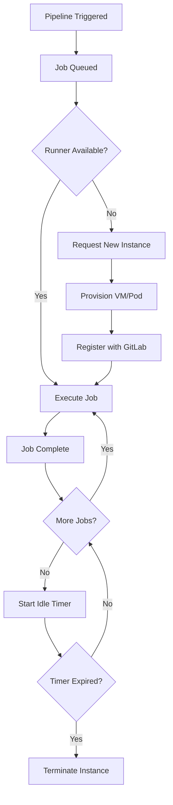

# How to Configure Runner Auto-scaling in GitLab CI

Author: [nawazdhandala](https://www.github.com/nawazdhandala)

Tags: GitLab CI, Runners, Auto-scaling, DevOps, Infrastructure, Cloud

Description: Learn how to configure GitLab CI runners with auto-scaling capabilities to handle variable workloads efficiently while minimizing infrastructure costs.

---

GitLab CI runners handle the actual execution of your pipeline jobs. When your team grows or your pipeline volume increases, a single runner becomes a bottleneck. Auto-scaling runners solve this by dynamically provisioning compute resources based on demand. This guide shows you how to set up auto-scaling runners that grow with your workload and shrink when idle.

## Understanding GitLab Runner Architecture

GitLab Runner operates in several executor modes. For auto-scaling, you'll use either the Docker Machine executor or the Kubernetes executor. Both can spin up new compute instances on demand.

The Docker Machine executor provisions virtual machines in cloud providers like AWS, GCP, or Azure. Each VM runs Docker containers for job execution.

The Kubernetes executor creates pods in a Kubernetes cluster. It scales by adding pods rather than VMs, which is faster and more granular.

## Setting Up Docker Machine Auto-scaling

Docker Machine remains the traditional approach for auto-scaling runners. Let's configure a runner that scales on AWS.

First, install GitLab Runner on a small instance that will serve as the manager.

```bash
# Install GitLab Runner on Ubuntu
curl -L "https://packages.gitlab.com/install/repositories/runner/gitlab-runner/script.deb.sh" | sudo bash
sudo apt install gitlab-runner
```

Register the runner with your GitLab instance.

```bash
# Register runner with Docker Machine executor
sudo gitlab-runner register \
  --non-interactive \
  --url "https://gitlab.example.com/" \
  --registration-token "YOUR_TOKEN" \
  --executor "docker+machine" \
  --docker-image "alpine:latest" \
  --description "auto-scale-runner" \
  --tag-list "docker,aws,autoscale"
```

Now configure the auto-scaling behavior in `/etc/gitlab-runner/config.toml`.

```toml
# GitLab Runner configuration with Docker Machine auto-scaling
concurrent = 50  # Maximum jobs across all runners
check_interval = 0

[[runners]]
  name = "auto-scale-runner"
  url = "https://gitlab.example.com/"
  token = "RUNNER_TOKEN"
  executor = "docker+machine"

  [runners.docker]
    image = "alpine:latest"
    privileged = true  # Required for Docker-in-Docker
    volumes = ["/cache"]

  # Cache configuration for faster builds
  [runners.cache]
    Type = "s3"
    Shared = true
    [runners.cache.s3]
      ServerAddress = "s3.amazonaws.com"
      BucketName = "gitlab-runner-cache"
      BucketLocation = "us-east-1"

  [runners.machine]
    # Idle count defines minimum warm instances
    IdleCount = 2
    # Scale up to this many instances
    MaxBuilds = 100
    # Idle time before terminating instances (seconds)
    IdleTime = 1800
    # Maximum number of machines (hard limit)
    MachineDriver = "amazonec2"
    MachineName = "gitlab-runner-%s"

    # AWS-specific configuration
    MachineOptions = [
      "amazonec2-region=us-east-1",
      "amazonec2-vpc-id=vpc-xxxxx",
      "amazonec2-subnet-id=subnet-xxxxx",
      "amazonec2-instance-type=m5.large",
      "amazonec2-root-size=50",
      "amazonec2-security-group=gitlab-runners",
      "amazonec2-use-private-address=true"
    ]

    # Time-based scaling configuration
    [[runners.machine.autoscaling]]
      Periods = ["* * 9-17 * * mon-fri *"]  # Business hours
      IdleCount = 10
      IdleTime = 1200
      Timezone = "America/New_York"

    [[runners.machine.autoscaling]]
      Periods = ["* * * * * sat,sun *"]  # Weekends
      IdleCount = 0
      IdleTime = 600
      Timezone = "America/New_York"
```

This configuration maintains 2 idle instances by default, scales up to 10 during business hours, and drops to zero on weekends.

## Kubernetes-Based Auto-scaling

For teams already using Kubernetes, the Kubernetes executor offers better integration and faster scaling.

```yaml
# values.yaml for GitLab Runner Helm chart
gitlabUrl: https://gitlab.example.com/
runnerRegistrationToken: "YOUR_TOKEN"

# Number of runner instances (the manager pods)
replicas: 2

# Runner configuration
runners:
  # Run all containers as privileged for Docker builds
  privileged: true

  # Kubernetes namespace for job pods
  namespace: gitlab-runner

  # Default image for jobs
  image: ubuntu:22.04

  # Tags for job matching
  tags: "kubernetes,docker"

  # Concurrent jobs per runner manager
  config: |
    [[runners]]
      [runners.kubernetes]
        namespace = "gitlab-runner"
        image = "ubuntu:22.04"

        # Resource limits for job pods
        cpu_limit = "2"
        memory_limit = "4Gi"
        cpu_request = "500m"
        memory_request = "1Gi"

        # Service account for job pods
        service_account = "gitlab-runner"

        # Pod labels for identification
        [runners.kubernetes.pod_labels]
          "app" = "gitlab-ci-job"

        # Node selector for job pods
        [runners.kubernetes.node_selector]
          "workload" = "ci"

        # Tolerations for dedicated CI nodes
        [[runners.kubernetes.node_tolerations]]
          key = "ci"
          operator = "Exists"
          effect = "NoSchedule"
```

Deploy with Helm:

```bash
# Add GitLab Helm repository
helm repo add gitlab https://charts.gitlab.io

# Install the runner
helm install gitlab-runner gitlab/gitlab-runner \
  --namespace gitlab-runner \
  --create-namespace \
  --values values.yaml
```

For Kubernetes auto-scaling to work, you need a cluster autoscaler configured. The runner creates pods, and the cluster autoscaler provisions nodes to run them.

```yaml
# Cluster Autoscaler configuration for AWS EKS
apiVersion: apps/v1
kind: Deployment
metadata:
  name: cluster-autoscaler
  namespace: kube-system
spec:
  template:
    spec:
      containers:
        - name: cluster-autoscaler
          image: registry.k8s.io/autoscaling/cluster-autoscaler:v1.28.0
          command:
            - ./cluster-autoscaler
            - --v=4
            - --cloud-provider=aws
            - --skip-nodes-with-local-storage=false
            - --expander=least-waste
            - --node-group-auto-discovery=asg:tag=k8s.io/cluster-autoscaler/enabled,k8s.io/cluster-autoscaler/my-cluster
            # Scale down quickly when jobs finish
            - --scale-down-delay-after-add=5m
            - --scale-down-unneeded-time=5m
```

## Auto-scaling Flow

Here's how the auto-scaling process works:



## Cost Optimization Strategies

Auto-scaling reduces costs, but poor configuration can waste money. Apply these strategies.

Use spot instances or preemptible VMs for non-critical jobs.

```toml
# AWS spot instance configuration
MachineOptions = [
  "amazonec2-request-spot-instance=true",
  "amazonec2-spot-price=0.10",
  "amazonec2-instance-type=m5.large"
]
```

Set aggressive idle timeouts during off-hours.

```toml
[[runners.machine.autoscaling]]
  Periods = ["* * 0-8 * * * *"]  # Night hours
  IdleCount = 0
  IdleTime = 300  # 5 minutes
```

Size instances appropriately. Most CI jobs don't need large instances.

```toml
# Use smaller instances for most jobs
MachineOptions = [
  "amazonec2-instance-type=t3.medium"
]
```

Use dedicated node pools in Kubernetes with appropriate instance types.

## Monitoring Runner Performance

Track your runner fleet to identify bottlenecks and optimize costs.

```yaml
# Prometheus ServiceMonitor for GitLab Runner
apiVersion: monitoring.coreos.com/v1
kind: ServiceMonitor
metadata:
  name: gitlab-runner
  namespace: monitoring
spec:
  selector:
    matchLabels:
      app: gitlab-runner
  endpoints:
    - port: metrics
      interval: 30s
  namespaceSelector:
    matchNames:
      - gitlab-runner
```

Key metrics to watch include:

- `gitlab_runner_jobs`: Current running jobs
- `gitlab_runner_autoscaling_machine_states`: Machine states (idle, creating, running)
- `gitlab_runner_job_duration_seconds`: Job execution time

Set alerts for queue buildup.

```yaml
# Prometheus alert for job queue backup
groups:
  - name: gitlab-runner
    rules:
      - alert: GitLabRunnerJobsQueued
        expr: gitlab_runner_jobs_queued > 10
        for: 5m
        labels:
          severity: warning
        annotations:
          summary: Jobs are queuing in GitLab CI
          description: "{{ $value }} jobs waiting in queue for over 5 minutes"
```

## Troubleshooting Common Issues

Auto-scaling introduces complexity. Here are common problems and solutions.

When machines fail to provision, check your cloud provider credentials and network configuration. The runner needs permission to create instances.

```bash
# Test Docker Machine manually
docker-machine create \
  --driver amazonec2 \
  --amazonec2-region us-east-1 \
  --amazonec2-instance-type t3.medium \
  test-machine
```

For Kubernetes, ensure the service account has appropriate permissions.

```yaml
# RBAC for GitLab Runner
apiVersion: rbac.authorization.k8s.io/v1
kind: Role
metadata:
  name: gitlab-runner
  namespace: gitlab-runner
rules:
  - apiGroups: [""]
    resources: ["pods", "pods/exec", "secrets", "configmaps"]
    verbs: ["get", "list", "watch", "create", "delete", "update"]
```

If jobs fail with "no available runner," check your tags match and increase `IdleCount` or `concurrent` settings.

---

Auto-scaling runners transform GitLab CI from a static resource into an elastic system that matches your workload. Start with conservative settings, monitor your queue times and costs, then adjust. The goal is zero wait time for developers without paying for idle capacity.
