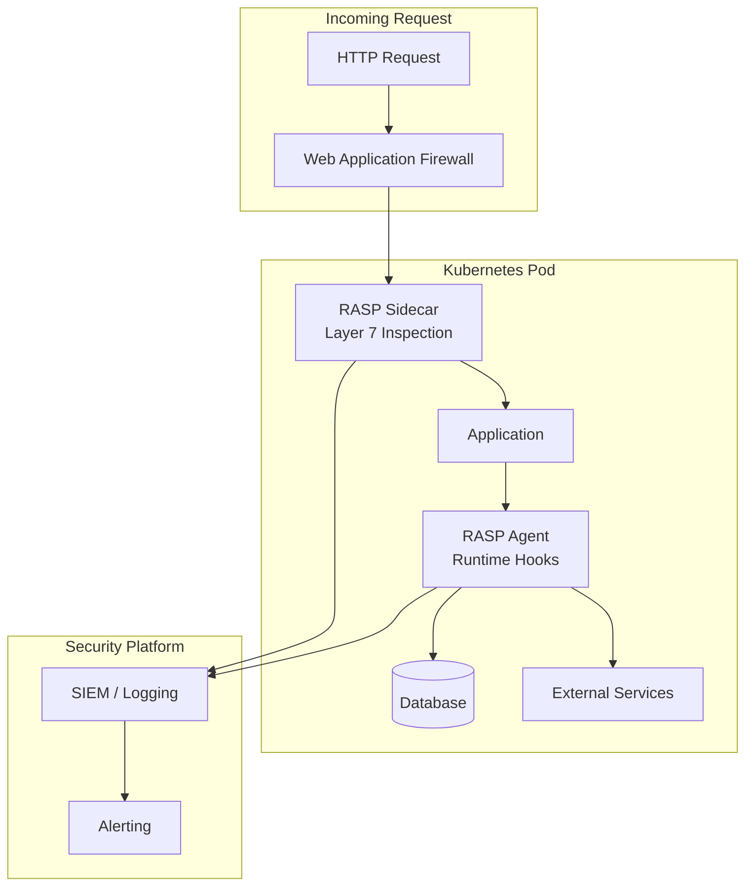

# How to Implement Runtime Application Self-Protection

Author: [nawazdhandala](https://www.github.com/nawazdhandala)

Tags: RASP, Security, Application Security, Kubernetes, Runtime Protection, WAF, Intrusion Detection

Description: Learn how to implement Runtime Application Self-Protection (RASP) in Kubernetes environments. This guide covers agent deployment, security rules, and integration with monitoring systems.

---

> Runtime Application Self-Protection (RASP) embeds security directly into applications, enabling them to detect and block attacks in real-time. Unlike perimeter defenses, RASP operates from within the application context, providing accurate threat detection with minimal false positives.

Traditional security tools operate at the network perimeter, blind to application logic and context. RASP agents understand application behavior and can distinguish between legitimate requests and attacks, making them particularly effective against zero-day exploits and business logic attacks.

---

## Understanding RASP Architecture

RASP operates through instrumentation at the application runtime level:

**Agent-based RASP**: A library or agent loaded into the application runtime that intercepts function calls and network operations.

**Sidecar RASP**: A proxy container that intercepts traffic and inspects requests before they reach the application.

**Hybrid RASP**: Combines agent and sidecar approaches for comprehensive protection.

---

## Architecture Diagram



---

## Prerequisites

Before implementing RASP:

- Kubernetes cluster (v1.21+)
- Application source code or ability to modify container images
- Logging infrastructure (ELK, Splunk, or similar)
- Understanding of application technology stack

---

## Deploying OpenRASP for Java Applications

OpenRASP provides open-source RASP for Java, PHP, and Node.js. Here is how to integrate it with a Java application:

```dockerfile
# Dockerfile with OpenRASP agent
FROM openjdk:17-slim

# Download and extract OpenRASP agent
RUN apt-get update && apt-get install -y curl unzip && \
    curl -L https://github.com/baidu/openrasp/releases/download/v1.3.7/rasp-java.zip \
    -o /tmp/rasp-java.zip && \
    unzip /tmp/rasp-java.zip -d /opt/ && \
    rm /tmp/rasp-java.zip

# Application setup
WORKDIR /app
COPY target/myapp.jar /app/app.jar

# Configure OpenRASP
COPY rasp-config.yaml /opt/rasp/conf/openrasp.yml

# Start with RASP agent
ENTRYPOINT ["java", \
    "-javaagent:/opt/rasp/rasp.jar", \
    "-jar", "/app/app.jar"]
```

Configure the RASP agent:

```yaml
# rasp-config.yaml
# OpenRASP configuration

# Basic settings
app_id: "my-java-app"
app_secret: "your-app-secret"
master_url: "https://rasp-console.example.com"

# Protection mode
# block - block attacks
# log - log only, don't block
block.status_code: 403
block.redirect_url: "/blocked"

# Plugin configuration
plugin:
  timeout:
    millis: 100
  maxstack: 50

# Security rules
security:
  # SQL injection protection
  sql_injection:
    action: block
    min_length: 15
    # Whitelist certain patterns
    whitelist: []

  # Command injection protection
  command_injection:
    action: block
    # Commands that are never allowed
    blacklist:
      - "/bin/sh"
      - "/bin/bash"
      - "wget"
      - "curl"

  # Path traversal protection
  path_traversal:
    action: block
    # Allowed directories
    whitelist:
      - "/app/data"
      - "/tmp"

  # SSRF protection
  ssrf:
    action: block
    # Blocked IP ranges
    blacklist:
      - "127.0.0.0/8"
      - "10.0.0.0/8"
      - "172.16.0.0/12"
      - "192.168.0.0/16"
    # Allowed external hosts
    whitelist:
      - "api.example.com"
      - "payment.provider.com"

  # XXE protection
  xxe:
    action: block

  # File upload protection
  file_upload:
    action: block
    # Blocked extensions
    blacklist:
      - ".php"
      - ".jsp"
      - ".exe"
      - ".sh"

# Logging configuration
log:
  maxbackup: 30
  maxsize: 100
  # Send logs to external system
  syslog:
    enable: true
    url: "udp://siem.example.com:514"
    tag: "rasp"
```

---

## Deploying Falco for Runtime Security

Falco provides kernel-level runtime security for containers:

```yaml
# falco-values.yaml
# Helm values for Falco deployment

driver:
  # Use eBPF driver for better compatibility
  kind: ebpf

# Falco configuration
falco:
  # Output to both syslog and grpc
  jsonOutput: true
  jsonIncludeOutputProperty: true

  # Rule files to load
  rulesFile:
    - /etc/falco/falco_rules.yaml
    - /etc/falco/k8s_audit_rules.yaml
    - /etc/falco/custom_rules.yaml

  # Priority threshold for alerts
  priority: warning

# Custom rules
customRules:
  custom_rules.yaml: |
    # Detect shell spawned in container
    - rule: Shell Spawned in Container
      desc: Detect shell process started in container
      condition: >
        spawned_process and
        container and
        shell_procs and
        not user_known_shell_spawn_activities
      output: >
        Shell spawned in container
        (user=%user.name command=%proc.cmdline container=%container.name
        image=%container.image.repository)
      priority: WARNING
      tags: [container, shell]

    # Detect sensitive file access
    - rule: Read Sensitive File
      desc: Detect reads to sensitive files
      condition: >
        open_read and
        container and
        sensitive_files and
        not trusted_containers
      output: >
        Sensitive file read
        (user=%user.name file=%fd.name container=%container.name)
      priority: ERROR
      tags: [filesystem, sensitive]

    # Detect crypto mining
    - rule: Detect Crypto Mining
      desc: Detect crypto mining activity
      condition: >
        spawned_process and
        container and
        (proc.name in (crypto_mining_procs) or
         proc.cmdline contains "stratum+tcp" or
         proc.cmdline contains "pool." or
         proc.cmdline contains "xmr")
      output: >
        Crypto mining activity detected
        (user=%user.name command=%proc.cmdline container=%container.name)
      priority: CRITICAL
      tags: [container, crypto, mining]

    # Detect outbound connection to suspicious port
    - rule: Suspicious Outbound Connection
      desc: Container connecting to unusual ports
      condition: >
        outbound and
        container and
        fd.sport in (suspicious_ports)
      output: >
        Suspicious outbound connection
        (command=%proc.cmdline connection=%fd.name container=%container.name)
      priority: WARNING
      tags: [network, suspicious]

  # Macro definitions
  macros.yaml: |
    - macro: shell_procs
      condition: proc.name in (bash, sh, zsh, csh, tcsh, dash)

    - macro: sensitive_files
      condition: >
        fd.name startswith /etc/shadow or
        fd.name startswith /etc/passwd or
        fd.name startswith /root/.ssh or
        fd.name startswith /var/run/secrets/kubernetes.io

    - macro: trusted_containers
      condition: >
        container.image.repository in (allowed_images)

    - macro: crypto_mining_procs
      condition: proc.name in (xmrig, cgminer, minerd, cpuminer)

    - macro: suspicious_ports
      condition: fd.sport in (4444, 5555, 6666, 7777, 8888, 9999)

# Falco Sidekick for alert routing
falcosidekick:
  enabled: true
  config:
    slack:
      webhookurl: "https://hooks.slack.com/services/XXX"
      minimumpriority: warning
    prometheus:
      enabled: true
```

Deploy Falco:

```bash
# Add Falco Helm repository
helm repo add falcosecurity https://falcosecurity.github.io/charts
helm repo update

# Install Falco
helm install falco falcosecurity/falco \
  --namespace falco \
  --create-namespace \
  --values falco-values.yaml

# Verify deployment
kubectl get pods -n falco
kubectl logs -n falco -l app.kubernetes.io/name=falco
```

---

## Implementing RASP with Sidecar Injection

Create a mutating webhook for automatic RASP sidecar injection:

```yaml
# rasp-sidecar-injector.yaml
apiVersion: apps/v1
kind: Deployment
metadata:
  name: rasp-sidecar-injector
  namespace: security
spec:
  replicas: 2
  selector:
    matchLabels:
      app: rasp-sidecar-injector
  template:
    metadata:
      labels:
        app: rasp-sidecar-injector
    spec:
      containers:
      - name: injector
        image: security/rasp-injector:1.0
        ports:
        - containerPort: 8443
        env:
        - name: SIDECAR_IMAGE
          value: "security/rasp-proxy:1.0"
        - name: RASP_CONFIG
          valueFrom:
            configMapKeyRef:
              name: rasp-config
              key: config.yaml
        volumeMounts:
        - name: tls
          mountPath: /etc/webhook/certs
          readOnly: true
      volumes:
      - name: tls
        secret:
          secretName: rasp-injector-tls

---
apiVersion: admissionregistration.k8s.io/v1
kind: MutatingWebhookConfiguration
metadata:
  name: rasp-sidecar-injector
webhooks:
- name: rasp.security.io
  clientConfig:
    service:
      name: rasp-sidecar-injector
      namespace: security
      path: /mutate
    caBundle: ${CA_BUNDLE}
  rules:
  - operations: ["CREATE"]
    apiGroups: [""]
    apiVersions: ["v1"]
    resources: ["pods"]
  namespaceSelector:
    matchLabels:
      rasp-injection: enabled
  failurePolicy: Ignore
  sideEffects: None
```

Configure the sidecar proxy:

```yaml
# rasp-sidecar-config.yaml
apiVersion: v1
kind: ConfigMap
metadata:
  name: rasp-sidecar-config
  namespace: security
data:
  config.yaml: |
    # RASP Sidecar Configuration

    # Proxy settings
    proxy:
      listen_port: 8080
      upstream_port: 8081
      read_timeout: 30s
      write_timeout: 30s

    # Security rules
    rules:
      # SQL Injection detection
      sql_injection:
        enabled: true
        patterns:
          - "(?i)(union|select|insert|update|delete|drop).*"
          - "(?i)('|\"|--).*"
          - "(?i)(or|and)\\s+\\d+=\\d+"
        action: block
        log: true

      # XSS detection
      xss:
        enabled: true
        patterns:
          - "<script[^>]*>.*</script>"
          - "javascript:"
          - "onerror="
          - "onload="
        action: block
        log: true

      # Command injection
      command_injection:
        enabled: true
        patterns:
          - "(;|\\||`|\\$\\()"
          - "\\.\\./"
          - "/etc/passwd"
        action: block
        log: true

      # Rate limiting
      rate_limit:
        enabled: true
        requests_per_second: 100
        burst: 200
        action: throttle

      # Request size limits
      size_limits:
        max_body_size: 10485760  # 10MB
        max_header_size: 8192    # 8KB

    # Logging
    logging:
      level: info
      format: json
      output: stdout

    # Metrics
    metrics:
      enabled: true
      port: 9090
      path: /metrics
```

---

## Python RASP Implementation

For Python applications, implement custom RASP middleware:

```python
# rasp_middleware.py
# Runtime Application Self-Protection for Python/Flask

import re
import logging
import hashlib
from functools import wraps
from flask import request, abort, g
import time

logger = logging.getLogger('rasp')

class RASPMiddleware:
    """Runtime Application Self-Protection middleware"""

    def __init__(self, app=None):
        # SQL injection patterns
        self.sql_patterns = [
            r"(?i)(union|select|insert|update|delete|drop)\s+",
            r"(?i)('|\")\s*(or|and)\s*('|\"|\d)",
            r"(?i)--\s*$",
            r"(?i);\s*(drop|delete|update|insert)",
        ]

        # XSS patterns
        self.xss_patterns = [
            r"<script[^>]*>",
            r"javascript\s*:",
            r"on\w+\s*=",
            r"<iframe[^>]*>",
        ]

        # Command injection patterns
        self.cmd_patterns = [
            r"[;&|`$]",
            r"\.\./",
            r"/etc/(passwd|shadow)",
            r"\b(cat|ls|rm|mv|cp|chmod|chown)\b",
        ]

        # Compile patterns for performance
        self.sql_regex = [re.compile(p) for p in self.sql_patterns]
        self.xss_regex = [re.compile(p) for p in self.xss_patterns]
        self.cmd_regex = [re.compile(p) for p in self.cmd_patterns]

        # Rate limiting state
        self.rate_limits = {}
        self.rate_limit_requests = 100
        self.rate_limit_window = 60

        if app is not None:
            self.init_app(app)

    def init_app(self, app):
        """Initialize RASP with Flask app"""
        app.before_request(self.protect_request)
        app.after_request(self.log_response)

    def protect_request(self):
        """Main protection logic executed before each request"""
        start_time = time.time()
        g.rasp_start_time = start_time

        # Get client identifier
        client_id = self._get_client_id()

        # Rate limiting check
        if self._is_rate_limited(client_id):
            logger.warning(f"Rate limit exceeded for {client_id}")
            abort(429, "Too many requests")

        # Check all request parameters
        all_params = self._get_all_params()

        for param_name, param_value in all_params.items():
            # SQL injection check
            if self._detect_sql_injection(param_value):
                self._log_attack('sql_injection', param_name, param_value)
                abort(403, "Forbidden: Potential SQL injection detected")

            # XSS check
            if self._detect_xss(param_value):
                self._log_attack('xss', param_name, param_value)
                abort(403, "Forbidden: Potential XSS detected")

            # Command injection check
            if self._detect_cmd_injection(param_value):
                self._log_attack('cmd_injection', param_name, param_value)
                abort(403, "Forbidden: Potential command injection detected")

    def _get_client_id(self):
        """Generate client identifier for rate limiting"""
        # Use combination of IP and user agent
        ip = request.remote_addr or 'unknown'
        ua = request.user_agent.string or 'unknown'
        return hashlib.sha256(f"{ip}:{ua}".encode()).hexdigest()[:16]

    def _is_rate_limited(self, client_id):
        """Check if client has exceeded rate limit"""
        current_time = time.time()
        window_start = current_time - self.rate_limit_window

        # Clean old entries
        if client_id in self.rate_limits:
            self.rate_limits[client_id] = [
                t for t in self.rate_limits[client_id]
                if t > window_start
            ]
        else:
            self.rate_limits[client_id] = []

        # Check limit
        if len(self.rate_limits[client_id]) >= self.rate_limit_requests:
            return True

        # Record this request
        self.rate_limits[client_id].append(current_time)
        return False

    def _get_all_params(self):
        """Extract all parameters from request"""
        params = {}

        # Query parameters
        for key, value in request.args.items():
            params[f"query:{key}"] = value

        # Form data
        for key, value in request.form.items():
            params[f"form:{key}"] = value

        # JSON body
        if request.is_json and request.json:
            self._flatten_json(request.json, params, "json")

        # Headers (selected)
        for header in ['User-Agent', 'Referer', 'Cookie']:
            if header in request.headers:
                params[f"header:{header}"] = request.headers[header]

        return params

    def _flatten_json(self, obj, params, prefix):
        """Flatten nested JSON for inspection"""
        if isinstance(obj, dict):
            for key, value in obj.items():
                self._flatten_json(value, params, f"{prefix}:{key}")
        elif isinstance(obj, list):
            for i, value in enumerate(obj):
                self._flatten_json(value, params, f"{prefix}[{i}]")
        else:
            params[prefix] = str(obj)

    def _detect_sql_injection(self, value):
        """Detect SQL injection attempts"""
        if not isinstance(value, str):
            return False
        for pattern in self.sql_regex:
            if pattern.search(value):
                return True
        return False

    def _detect_xss(self, value):
        """Detect XSS attempts"""
        if not isinstance(value, str):
            return False
        for pattern in self.xss_regex:
            if pattern.search(value):
                return True
        return False

    def _detect_cmd_injection(self, value):
        """Detect command injection attempts"""
        if not isinstance(value, str):
            return False
        for pattern in self.cmd_regex:
            if pattern.search(value):
                return True
        return False

    def _log_attack(self, attack_type, param_name, param_value):
        """Log detected attack"""
        logger.error({
            "event": "attack_detected",
            "type": attack_type,
            "parameter": param_name,
            "value": param_value[:200],  # Truncate for logging
            "ip": request.remote_addr,
            "path": request.path,
            "method": request.method,
            "user_agent": request.user_agent.string,
        })

    def log_response(self, response):
        """Log response metrics"""
        duration = time.time() - g.rasp_start_time
        logger.info({
            "event": "request_completed",
            "path": request.path,
            "method": request.method,
            "status": response.status_code,
            "duration_ms": round(duration * 1000, 2),
        })
        return response


# Usage in Flask application
from flask import Flask
app = Flask(__name__)
rasp = RASPMiddleware(app)

@app.route('/api/search')
def search():
    # RASP middleware automatically protects this endpoint
    query = request.args.get('q', '')
    return {"results": perform_search(query)}
```

---

## Monitoring and Alerting

Create alerts for RASP events:

```yaml
# rasp-alerts.yaml
apiVersion: monitoring.coreos.com/v1
kind: PrometheusRule
metadata:
  name: rasp-alerts
  namespace: monitoring
spec:
  groups:
  - name: rasp
    rules:
    - alert: HighAttackRate
      expr: |
        sum(rate(rasp_attacks_total[5m])) > 10
      for: 2m
      labels:
        severity: critical
      annotations:
        summary: "High rate of attacks detected"
        description: "RASP is detecting more than 10 attacks per second"

    - alert: SQLInjectionAttempts
      expr: |
        sum(rate(rasp_attacks_total{type="sql_injection"}[5m])) > 1
      for: 1m
      labels:
        severity: warning
      annotations:
        summary: "SQL injection attempts detected"
        description: "Multiple SQL injection attempts in the last 5 minutes"

    - alert: FalcoRuleTriggered
      expr: |
        sum(rate(falco_events{priority="Critical"}[5m])) > 0
      for: 1m
      labels:
        severity: critical
      annotations:
        summary: "Critical Falco rule triggered"
        description: "Falco detected critical security event"
```

---

## Conclusion

Runtime Application Self-Protection provides a critical security layer that operates from within application context. By combining RASP agents, runtime monitoring with Falco, and proper alerting, you create defense in depth that catches attacks traditional perimeter tools miss.

Start with logging mode to understand your application's normal behavior, then progressively enable blocking for confirmed attack patterns. The combination of RASP with existing security tools creates comprehensive protection for your Kubernetes workloads.

---

*Need unified security monitoring for your RASP deployment? [OneUptime](https://oneuptime.com) correlates security events with application performance, helping you understand the impact of attacks and respond effectively to incidents.*
