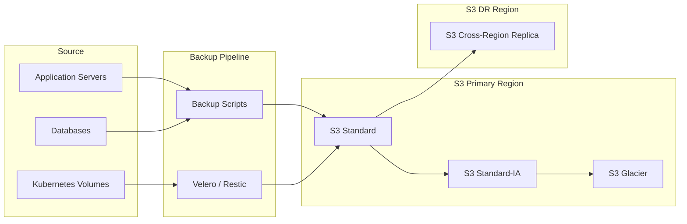

# How to Implement S3 Backup Strategies

Author: [nawazdhandala](https://www.github.com/nawazdhandala)

Tags: AWS, S3, Backup, Disaster Recovery, Cloud Storage

Description: Learn how to build reliable backup strategies using Amazon S3, including versioning, lifecycle policies, cross-region replication, and cost optimization techniques with practical examples.

---

Amazon S3 has become the default destination for backups because of its durability, availability, and flexibility. But simply copying files to S3 is not a strategy. A real backup strategy considers retention, replication, cost optimization, and recovery testing. This guide covers the patterns and configurations that turn S3 from a file dump into a reliable backup system.

## Why S3 for Backups?

S3 offers several advantages for backup storage:

1. **Durability:** 99.999999999% (11 nines) durability across multiple facilities.
2. **Storage classes:** Move data to cheaper tiers as it ages.
3. **Versioning:** Keep multiple versions of objects without managing file names.
4. **Cross-region replication:** Automatic copying to another region for disaster recovery.
5. **Lifecycle policies:** Automate retention and tier transitions.

The tradeoff is cost complexity. Without proper policies, S3 bills can grow unexpectedly.

## S3 Backup Architecture



## Configuring S3 Bucket for Backups

Create a bucket with versioning and encryption:

```bash
# Create the bucket
aws s3 mb s3://company-backups-prod --region us-east-1

# Enable versioning
aws s3api put-bucket-versioning \
    --bucket company-backups-prod \
    --versioning-configuration Status=Enabled

# Enable server-side encryption (SSE-S3)
aws s3api put-bucket-encryption \
    --bucket company-backups-prod \
    --server-side-encryption-configuration '{
        "Rules": [{
            "ApplyServerSideEncryptionByDefault": {
                "SSEAlgorithm": "AES256"
            },
            "BucketKeyEnabled": true
        }]
    }'

# Block public access
aws s3api put-public-access-block \
    --bucket company-backups-prod \
    --public-access-block-configuration '{
        "BlockPublicAcls": true,
        "IgnorePublicAcls": true,
        "BlockPublicPolicy": true,
        "RestrictPublicBuckets": true
    }'
```

## Setting Up Versioning

Versioning keeps every modification to an object, allowing point-in-time recovery:

```bash
# Upload a file
aws s3 cp backup.tar.gz s3://company-backups-prod/daily/

# Update the same file
aws s3 cp backup-v2.tar.gz s3://company-backups-prod/daily/backup.tar.gz

# List all versions
aws s3api list-object-versions \
    --bucket company-backups-prod \
    --prefix daily/backup.tar.gz

# Restore a specific version
aws s3api get-object \
    --bucket company-backups-prod \
    --key daily/backup.tar.gz \
    --version-id "abc123" \
    restored-backup.tar.gz
```

## Lifecycle Policies

Lifecycle policies automate storage class transitions and expiration:

```json
{
    "Rules": [
        {
            "ID": "TransitionToIA",
            "Status": "Enabled",
            "Filter": {
                "Prefix": "daily/"
            },
            "Transitions": [
                {
                    "Days": 30,
                    "StorageClass": "STANDARD_IA"
                }
            ]
        },
        {
            "ID": "TransitionToGlacier",
            "Status": "Enabled",
            "Filter": {
                "Prefix": "daily/"
            },
            "Transitions": [
                {
                    "Days": 90,
                    "StorageClass": "GLACIER"
                }
            ]
        },
        {
            "ID": "ExpireOldVersions",
            "Status": "Enabled",
            "Filter": {
                "Prefix": ""
            },
            "NoncurrentVersionExpiration": {
                "NoncurrentDays": 365
            }
        },
        {
            "ID": "CleanupIncompleteUploads",
            "Status": "Enabled",
            "Filter": {
                "Prefix": ""
            },
            "AbortIncompleteMultipartUpload": {
                "DaysAfterInitiation": 7
            }
        }
    ]
}
```

Apply the lifecycle policy:

```bash
aws s3api put-bucket-lifecycle-configuration \
    --bucket company-backups-prod \
    --lifecycle-configuration file://lifecycle-policy.json
```

## Storage Classes Comparison

| Storage Class | Use Case | Retrieval Time | Cost per GB/month |
|---------------|----------|----------------|-------------------|
| S3 Standard | Frequent access | Instant | $0.023 |
| S3 Standard-IA | Infrequent access (30+ days) | Instant | $0.0125 |
| S3 Glacier Instant | Archive with instant access | Instant | $0.004 |
| S3 Glacier Flexible | Archive, flexible retrieval | 1-12 hours | $0.0036 |
| S3 Glacier Deep Archive | Long-term archive | 12-48 hours | $0.00099 |

Choose based on your recovery time objectives (RTO). Critical backups should stay in Standard or Standard-IA for fast recovery.

## Cross-Region Replication

Replicate backups to another region for disaster recovery:

```bash
# Create destination bucket in another region
aws s3 mb s3://company-backups-dr --region us-west-2

# Enable versioning on destination (required)
aws s3api put-bucket-versioning \
    --bucket company-backups-dr \
    --region us-west-2 \
    --versioning-configuration Status=Enabled
```

Create an IAM role for replication:

```json
{
    "Version": "2012-10-17",
    "Statement": [
        {
            "Effect": "Allow",
            "Action": [
                "s3:GetReplicationConfiguration",
                "s3:ListBucket"
            ],
            "Resource": "arn:aws:s3:::company-backups-prod"
        },
        {
            "Effect": "Allow",
            "Action": [
                "s3:GetObjectVersionForReplication",
                "s3:GetObjectVersionAcl",
                "s3:GetObjectVersionTagging"
            ],
            "Resource": "arn:aws:s3:::company-backups-prod/*"
        },
        {
            "Effect": "Allow",
            "Action": [
                "s3:ReplicateObject",
                "s3:ReplicateDelete",
                "s3:ReplicateTags"
            ],
            "Resource": "arn:aws:s3:::company-backups-dr/*"
        }
    ]
}
```

Configure replication:

```json
{
    "Role": "arn:aws:iam::123456789012:role/S3ReplicationRole",
    "Rules": [
        {
            "ID": "ReplicateAllBackups",
            "Status": "Enabled",
            "Priority": 1,
            "Filter": {},
            "Destination": {
                "Bucket": "arn:aws:s3:::company-backups-dr",
                "StorageClass": "STANDARD_IA"
            },
            "DeleteMarkerReplication": {
                "Status": "Enabled"
            }
        }
    ]
}
```

```bash
aws s3api put-bucket-replication \
    --bucket company-backups-prod \
    --replication-configuration file://replication-config.json
```

## Backup Scripts with AWS CLI

Create a robust backup script:

```bash
#!/bin/bash
# backup-to-s3.sh

set -euo pipefail

# Configuration
BUCKET="company-backups-prod"
PREFIX="servers/$(hostname)"
TIMESTAMP=$(date +%Y-%m-%d-%H%M%S)
BACKUP_DIR="/tmp/backup-${TIMESTAMP}"
LOG_FILE="/var/log/s3-backup.log"

# Logging function
log() {
    echo "[$(date '+%Y-%m-%d %H:%M:%S')] $1" | tee -a "$LOG_FILE"
}

# Error handling
cleanup() {
    rm -rf "$BACKUP_DIR"
}
trap cleanup EXIT

log "Starting backup"

# Create backup directory
mkdir -p "$BACKUP_DIR"

# Dump PostgreSQL database
log "Dumping PostgreSQL database"
pg_dump -h localhost -U appuser -d appdb -F c \
    -f "$BACKUP_DIR/database.dump"

# Archive application files
log "Archiving application files"
tar -czf "$BACKUP_DIR/app-files.tar.gz" \
    --exclude='*.log' \
    --exclude='tmp/*' \
    /var/www/app

# Archive configuration
log "Archiving configuration"
tar -czf "$BACKUP_DIR/config.tar.gz" \
    /etc/nginx \
    /etc/app

# Upload to S3 with metadata
log "Uploading to S3"
for file in "$BACKUP_DIR"/*; do
    filename=$(basename "$file")
    aws s3 cp "$file" "s3://${BUCKET}/${PREFIX}/${TIMESTAMP}/${filename}" \
        --metadata "backup-date=${TIMESTAMP},hostname=$(hostname)" \
        --storage-class STANDARD
done

# Create a latest marker
echo "$TIMESTAMP" | aws s3 cp - "s3://${BUCKET}/${PREFIX}/LATEST"

log "Backup completed successfully"

# Verify upload
log "Verifying backup"
aws s3 ls "s3://${BUCKET}/${PREFIX}/${TIMESTAMP}/"
```

## Using Restic with S3

Restic provides deduplication and encryption on top of S3:

```bash
#!/bin/bash
# restic-s3-backup.sh

export AWS_ACCESS_KEY_ID="your-access-key"
export AWS_SECRET_ACCESS_KEY="your-secret-key"
export RESTIC_REPOSITORY="s3:s3.amazonaws.com/company-backups-prod/restic"
export RESTIC_PASSWORD_FILE="/etc/restic/password"

# Initialize repository (first time only)
# restic init

# Run backup
restic backup /var/www/app /etc \
    --exclude="*.log" \
    --tag automated \
    --tag "$(hostname)"

# Apply retention policy
restic forget \
    --keep-daily 7 \
    --keep-weekly 4 \
    --keep-monthly 12 \
    --prune

# Verify repository integrity (weekly)
if [ "$(date +%u)" -eq 7 ]; then
    restic check --read-data-subset=10%
fi
```

## Monitoring Backup Jobs

Set up CloudWatch alarms for backup monitoring:

```bash
# Create metric filter for backup logs
aws logs create-log-group --log-group-name /backup/s3

# Put log events from backup script
aws logs put-log-events \
    --log-group-name /backup/s3 \
    --log-stream-name "$(hostname)" \
    --log-events timestamp=$(date +%s000),message="Backup completed"

# Create alarm for missing backups
aws cloudwatch put-metric-alarm \
    --alarm-name "MissingDailyBackup" \
    --metric-name "BackupCount" \
    --namespace "CustomBackup" \
    --statistic Sum \
    --period 86400 \
    --threshold 1 \
    --comparison-operator LessThanThreshold \
    --evaluation-periods 1 \
    --alarm-actions "arn:aws:sns:us-east-1:123456789012:backup-alerts"
```

## Cost Optimization Tips

1. **Use Intelligent-Tiering for unpredictable access patterns:**
   ```bash
   aws s3 cp backup.tar.gz s3://bucket/backup.tar.gz \
       --storage-class INTELLIGENT_TIERING
   ```

2. **Enable S3 analytics to find optimization opportunities:**
   ```bash
   aws s3api put-bucket-analytics-configuration \
       --bucket company-backups-prod \
       --id entire-bucket \
       --analytics-configuration '{"Id": "entire-bucket", "StorageClassAnalysis": {}}'
   ```

3. **Delete incomplete multipart uploads:**
   Include the `AbortIncompleteMultipartUpload` lifecycle rule shown earlier.

4. **Use compression before upload:**
   Always compress data before uploading. S3 does not compress for you.

5. **Review and clean up delete markers:**
   ```bash
   aws s3api list-object-versions --bucket company-backups-prod \
       --query 'DeleteMarkers[?IsLatest==`true`]'
   ```

## Recovery Procedures

Document and test your recovery process:

```bash
#!/bin/bash
# restore-from-s3.sh

BUCKET="company-backups-prod"
PREFIX="servers/web-01"
RESTORE_DIR="/tmp/restore"

# Find latest backup
LATEST=$(aws s3 cp "s3://${BUCKET}/${PREFIX}/LATEST" -)
echo "Restoring from backup: $LATEST"

# Download backup files
mkdir -p "$RESTORE_DIR"
aws s3 cp --recursive "s3://${BUCKET}/${PREFIX}/${LATEST}/" "$RESTORE_DIR/"

# Restore database
pg_restore -h localhost -U appuser -d appdb -c "$RESTORE_DIR/database.dump"

# Restore application files
tar -xzf "$RESTORE_DIR/app-files.tar.gz" -C /

echo "Restore completed"
```

## Best Practices

1. **Enable versioning from day one.** You cannot recover from accidental deletion without it.

2. **Use MFA Delete for critical buckets.** Requires multi-factor authentication to permanently delete objects.

3. **Test restores monthly.** Download and verify random backups. Automated verification is even better.

4. **Encrypt everything.** Use SSE-S3 at minimum, SSE-KMS for compliance requirements.

5. **Monitor costs.** Set up billing alerts. S3 costs can surprise you when replication and versioning are enabled.

## Wrapping Up

S3 backup strategies succeed when they combine versioning for point-in-time recovery, lifecycle policies for cost control, and cross-region replication for disaster recovery. The configuration takes a few hours, but the result is a backup system that runs unattended and survives regional outages. Test your restores regularly because a backup strategy you have never validated is just optimism stored in the cloud.
