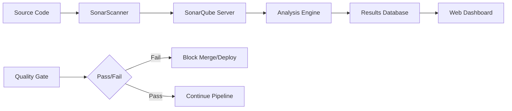

# How to Implement SAST with SonarQube

Author: [nawazdhandala](https://www.github.com/nawazdhandala)

Tags: Security, SAST, SonarQube, Code Quality, Static Analysis, DevSecOps, CI/CD

Description: Learn how to implement Static Application Security Testing with SonarQube to identify security vulnerabilities, code smells, and bugs in your codebase before they reach production.

---

Static Application Security Testing (SAST) examines source code for vulnerabilities without executing it. SonarQube provides comprehensive code analysis covering security issues, bugs, code smells, and technical debt. This guide walks through deployment, scanner configuration, CI/CD integration, and quality gate setup.

## What SonarQube Analyzes

SonarQube scans code for:

- **Security vulnerabilities**: SQL injection, XSS, path traversal, hardcoded credentials
- **Security hotspots**: Code that needs manual security review
- **Bugs**: Null pointer dereferences, resource leaks, incorrect logic
- **Code smells**: Maintainability issues, complexity, duplication
- **Technical debt**: Estimated time to fix all issues

It supports 30+ languages including Java, JavaScript, TypeScript, Python, Go, C#, and more.

## Architecture Overview



## Deploying SonarQube

### Docker Compose (Development)

```yaml
# docker-compose.yml
version: "3.8"

services:
  sonarqube:
    image: sonarqube:10-community
    container_name: sonarqube
    depends_on:
      - postgres
    environment:
      SONAR_JDBC_URL: jdbc:postgresql://postgres:5432/sonarqube
      SONAR_JDBC_USERNAME: sonar
      SONAR_JDBC_PASSWORD: sonar
    volumes:
      - sonarqube_data:/opt/sonarqube/data
      - sonarqube_extensions:/opt/sonarqube/extensions
      - sonarqube_logs:/opt/sonarqube/logs
    ports:
      - "9000:9000"

  postgres:
    image: postgres:15
    container_name: sonarqube-db
    environment:
      POSTGRES_USER: sonar
      POSTGRES_PASSWORD: sonar
      POSTGRES_DB: sonarqube
    volumes:
      - postgres_data:/var/lib/postgresql/data

volumes:
  sonarqube_data:
  sonarqube_extensions:
  sonarqube_logs:
  postgres_data:
```

Start SonarQube:

```bash
# Increase vm.max_map_count (required by Elasticsearch)
sudo sysctl -w vm.max_map_count=524288

docker-compose up -d
```

Access the dashboard at http://localhost:9000 (default credentials: admin/admin).

### Kubernetes with Helm

```bash
# Add the SonarQube Helm repository
helm repo add sonarqube https://SonarSource.github.io/helm-chart-sonarqube
helm repo update

# Install SonarQube
helm install sonarqube sonarqube/sonarqube \
  --namespace sonarqube \
  --create-namespace \
  --set persistence.enabled=true \
  --set postgresql.enabled=true \
  --set service.type=ClusterIP
```

## Configuring Your First Project

1. Log into SonarQube and create a new project
2. Generate a project token (Settings > Security > Generate Token)
3. Choose your analysis method (CI-based or local)

## Running the SonarScanner

### For General Projects

Install the SonarScanner CLI:

```bash
# macOS
brew install sonar-scanner

# Linux
wget https://binaries.sonarsource.com/Distribution/sonar-scanner-cli/sonar-scanner-cli-5.0.1.3006-linux.zip
unzip sonar-scanner-cli-5.0.1.3006-linux.zip
export PATH=$PATH:$PWD/sonar-scanner-5.0.1.3006-linux/bin
```

Create a `sonar-project.properties` file:

```properties
# sonar-project.properties

# Required: Project identification
sonar.projectKey=my-project
sonar.projectName=My Project
sonar.projectVersion=1.0

# Source code location
sonar.sources=src
sonar.tests=tests

# Language-specific settings
sonar.python.coverage.reportPaths=coverage.xml
sonar.javascript.lcov.reportPaths=coverage/lcov.info

# Exclusions
sonar.exclusions=**/node_modules/**,**/vendor/**,**/*.test.js

# Server configuration
sonar.host.url=http://localhost:9000
```

Run the scanner:

```bash
sonar-scanner -Dsonar.token=your_project_token
```

### For Java Projects with Maven

```xml
<!-- pom.xml -->
<properties>
    <sonar.organization>my-org</sonar.organization>
    <sonar.host.url>http://localhost:9000</sonar.host.url>
</properties>

<build>
    <plugins>
        <plugin>
            <groupId>org.sonarsource.scanner.maven</groupId>
            <artifactId>sonar-maven-plugin</artifactId>
            <version>3.10.0.2594</version>
        </plugin>
    </plugins>
</build>
```

Run analysis:

```bash
mvn clean verify sonar:sonar -Dsonar.token=your_project_token
```

### For JavaScript/TypeScript with npm

```json
{
  "scripts": {
    "sonar": "sonar-scanner"
  },
  "devDependencies": {
    "sonarqube-scanner": "^3.3.0"
  }
}
```

Create a scanner configuration:

```javascript
// sonar-project.js
const sonarqubeScanner = require('sonarqube-scanner');

sonarqubeScanner({
  serverUrl: 'http://localhost:9000',
  token: process.env.SONAR_TOKEN,
  options: {
    'sonar.projectKey': 'my-js-project',
    'sonar.sources': 'src',
    'sonar.tests': 'tests',
    'sonar.javascript.lcov.reportPaths': 'coverage/lcov.info',
    'sonar.testExecutionReportPaths': 'test-report.xml'
  }
}, () => process.exit());
```

## CI/CD Integration

### GitHub Actions

```yaml
# .github/workflows/sonarqube.yml
name: SonarQube Analysis

on:
  push:
    branches: [main, develop]
  pull_request:
    branches: [main]

jobs:
  sonarqube:
    runs-on: ubuntu-latest
    steps:
      - name: Checkout code
        uses: actions/checkout@v4
        with:
          fetch-depth: 0  # Full history for better analysis

      - name: Set up JDK 17
        uses: actions/setup-java@v4
        with:
          java-version: 17
          distribution: 'temurin'

      - name: Cache SonarQube packages
        uses: actions/cache@v3
        with:
          path: ~/.sonar/cache
          key: ${{ runner.os }}-sonar
          restore-keys: ${{ runner.os }}-sonar

      - name: Run tests with coverage
        run: npm test -- --coverage

      - name: SonarQube Scan
        uses: sonarsource/sonarqube-scan-action@master
        env:
          SONAR_TOKEN: ${{ secrets.SONAR_TOKEN }}
          SONAR_HOST_URL: ${{ secrets.SONAR_HOST_URL }}
        with:
          args: >
            -Dsonar.projectKey=my-project
            -Dsonar.sources=src
            -Dsonar.tests=tests
            -Dsonar.javascript.lcov.reportPaths=coverage/lcov.info

      - name: SonarQube Quality Gate check
        uses: sonarsource/sonarqube-quality-gate-action@master
        timeout-minutes: 5
        env:
          SONAR_TOKEN: ${{ secrets.SONAR_TOKEN }}
```

### GitLab CI

```yaml
# .gitlab-ci.yml
stages:
  - test
  - analysis

test:
  stage: test
  script:
    - npm ci
    - npm test -- --coverage
  artifacts:
    paths:
      - coverage/

sonarqube:
  stage: analysis
  image:
    name: sonarsource/sonar-scanner-cli:latest
    entrypoint: [""]
  variables:
    SONAR_USER_HOME: "${CI_PROJECT_DIR}/.sonar"
    GIT_DEPTH: 0
  cache:
    key: "${CI_JOB_NAME}"
    paths:
      - .sonar/cache
  script:
    - sonar-scanner
      -Dsonar.projectKey=${CI_PROJECT_NAME}
      -Dsonar.sources=src
      -Dsonar.host.url=${SONAR_HOST_URL}
      -Dsonar.token=${SONAR_TOKEN}
  dependencies:
    - test
```

## Quality Gates

Quality gates define the conditions code must meet to pass. Create a custom gate:

1. Go to **Quality Gates** in SonarQube
2. Create a new gate or copy the default
3. Add conditions:

```
# Example quality gate conditions
- Coverage on new code >= 80%
- Duplicated lines on new code <= 3%
- Maintainability rating >= A
- Reliability rating >= A
- Security rating >= A
- Security hotspots reviewed = 100%
```

Assign the gate to your project under **Project Settings > Quality Gate**.

## Fixing Common Security Issues

SonarQube identifies security vulnerabilities with remediation guidance.

### SQL Injection

```python
# Vulnerable code flagged by SonarQube
def get_user(user_id):
    query = f"SELECT * FROM users WHERE id = {user_id}"  # SQL injection!
    return db.execute(query)

# Fixed code using parameterized queries
def get_user(user_id):
    query = "SELECT * FROM users WHERE id = %s"
    return db.execute(query, (user_id,))
```

### Hardcoded Credentials

```java
// Vulnerable: hardcoded password
public class DatabaseConfig {
    private static final String PASSWORD = "secret123";  // Security hotspot
}

// Fixed: use environment variables
public class DatabaseConfig {
    private static final String PASSWORD = System.getenv("DB_PASSWORD");
}
```

### Path Traversal

```javascript
// Vulnerable: user input directly used in file path
app.get('/file', (req, res) => {
    const filename = req.query.name;
    res.sendFile('/uploads/' + filename);  // Path traversal!
});

// Fixed: validate and sanitize input
const path = require('path');

app.get('/file', (req, res) => {
    const filename = path.basename(req.query.name);  // Strips directory components
    const safePath = path.join('/uploads', filename);

    // Verify the path is still within uploads directory
    if (!safePath.startsWith('/uploads/')) {
        return res.status(400).send('Invalid filename');
    }

    res.sendFile(safePath);
});
```

## Branch Analysis and Pull Request Decoration

Enable branch analysis for feature branches:

```properties
# sonar-project.properties
sonar.branch.name=${BRANCH_NAME}
```

For pull request decoration (comments on PRs):

```properties
sonar.pullrequest.key=${PR_NUMBER}
sonar.pullrequest.branch=${PR_BRANCH}
sonar.pullrequest.base=${PR_TARGET}
```

Configure your ALM integration (GitHub, GitLab, Azure DevOps) in SonarQube under **Administration > DevOps Platform Integrations**.

## Custom Rules and Profiles

Create custom quality profiles for different project types:

1. Go to **Quality Profiles**
2. Copy an existing profile
3. Activate/deactivate rules based on your needs
4. Set severity levels for specific rules

For custom rules, use the SonarQube plugin API or leverage external analyzers.

---

SAST with SonarQube catches vulnerabilities when they are cheapest to fix: during development. Start with the default quality gate, enforce it on all pull requests, and incrementally tighten standards as your codebase improves. Security is a journey, not a destination.
