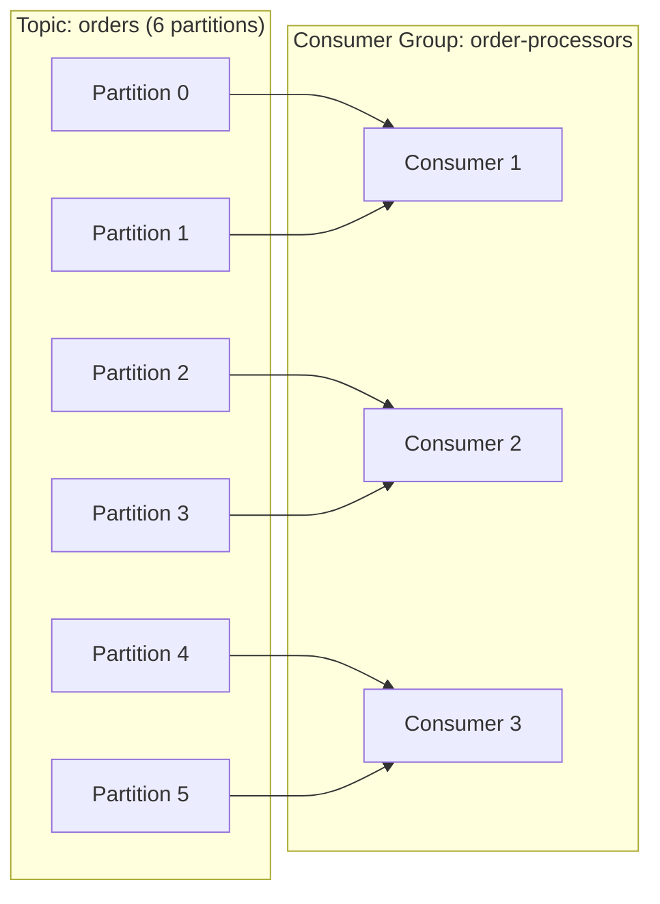

# How to Build Scalable Consumers with Kafka Consumer Groups

Author: [nawazdhandala](https://www.github.com/nawazdhandala)

Tags: Kafka, Consumer Groups, Scalability, Java, Distributed Systems

Description: Learn how to build horizontally scalable Kafka consumers using consumer groups, including partition assignment strategies, rebalancing, and best practices for high-throughput message processing.

---

Consumer groups are the foundation of Kafka's scalability model for message consumption. They allow multiple consumer instances to work together, automatically distributing partitions among themselves. This guide covers how to design and implement consumer groups that scale from a single instance to hundreds of consumers.

## How Consumer Groups Work

When multiple consumers share the same `group.id`, Kafka treats them as a single logical subscriber. Each partition is assigned to exactly one consumer in the group, ensuring no duplicate processing.



With six partitions and three consumers, each consumer handles two partitions. Adding a fourth consumer triggers a rebalance, redistributing partitions evenly.

## Basic Consumer Group Implementation

Here is a Java consumer that processes messages as part of a consumer group.

```java
import org.apache.kafka.clients.consumer.*;
import org.apache.kafka.common.serialization.StringDeserializer;
import java.time.Duration;
import java.util.Collections;
import java.util.Properties;

public class OrderConsumer {

    public static void main(String[] args) {
        Properties props = new Properties();

        // Broker connection
        props.put(ConsumerConfig.BOOTSTRAP_SERVERS_CONFIG, "kafka1:9092,kafka2:9092");

        // Consumer group identity
        props.put(ConsumerConfig.GROUP_ID_CONFIG, "order-processors");

        // Unique instance identifier for debugging
        props.put(ConsumerConfig.CLIENT_ID_CONFIG, "order-processor-" + System.getenv("HOSTNAME"));

        // Deserialization
        props.put(ConsumerConfig.KEY_DESERIALIZER_CLASS_CONFIG, StringDeserializer.class.getName());
        props.put(ConsumerConfig.VALUE_DESERIALIZER_CLASS_CONFIG, StringDeserializer.class.getName());

        // Start from earliest if no committed offset exists
        props.put(ConsumerConfig.AUTO_OFFSET_RESET_CONFIG, "earliest");

        // Disable auto-commit for manual offset control
        props.put(ConsumerConfig.ENABLE_AUTO_COMMIT_CONFIG, "false");

        try (KafkaConsumer<String, String> consumer = new KafkaConsumer<>(props)) {
            // Subscribe to the topic (partition assignment is automatic)
            consumer.subscribe(Collections.singletonList("orders"));

            while (true) {
                // Poll for new records (timeout controls blocking duration)
                ConsumerRecords<String, String> records = consumer.poll(Duration.ofMillis(100));

                for (ConsumerRecord<String, String> record : records) {
                    processOrder(record);
                }

                // Commit offsets after successful processing
                if (!records.isEmpty()) {
                    consumer.commitSync();
                }
            }
        }
    }

    private static void processOrder(ConsumerRecord<String, String> record) {
        System.out.printf("Partition: %d, Offset: %d, Key: %s, Value: %s%n",
            record.partition(), record.offset(), record.key(), record.value());
        // Add your business logic here
    }
}
```

## Choosing a Partition Assignment Strategy

Kafka provides several strategies for distributing partitions among consumers. Configure this with `partition.assignment.strategy`.

### Range Assignor (Default)

Assigns partitions in numeric ranges. Can cause uneven distribution when topic partition counts are not divisible by consumer count.

```java
// Consumer 1 gets partitions 0, 1, 2
// Consumer 2 gets partitions 3, 4, 5
props.put(ConsumerConfig.PARTITION_ASSIGNMENT_STRATEGY_CONFIG,
    "org.apache.kafka.clients.consumer.RangeAssignor");
```

### Round Robin Assignor

Distributes partitions one at a time across consumers. Better balance for multiple topics.

```java
// Consumer 1 gets partitions 0, 2, 4
// Consumer 2 gets partitions 1, 3, 5
props.put(ConsumerConfig.PARTITION_ASSIGNMENT_STRATEGY_CONFIG,
    "org.apache.kafka.clients.consumer.RoundRobinAssignor");
```

### Cooperative Sticky Assignor

Minimizes partition movements during rebalances and supports incremental rebalancing. Best for production use.

```java
// Keeps existing assignments when possible, only moves partitions when necessary
props.put(ConsumerConfig.PARTITION_ASSIGNMENT_STRATEGY_CONFIG,
    "org.apache.kafka.clients.consumer.CooperativeStickyAssignor");
```

## Handling Rebalances Gracefully

Rebalances occur when consumers join or leave the group. Use a `ConsumerRebalanceListener` to handle them properly.

```java
import org.apache.kafka.clients.consumer.ConsumerRebalanceListener;
import org.apache.kafka.common.TopicPartition;
import java.util.Collection;
import java.util.HashMap;
import java.util.Map;

public class RebalanceHandler implements ConsumerRebalanceListener {

    private final KafkaConsumer<String, String> consumer;
    private final Map<TopicPartition, Long> currentOffsets = new HashMap<>();

    public RebalanceHandler(KafkaConsumer<String, String> consumer) {
        this.consumer = consumer;
    }

    // Called before partitions are revoked
    @Override
    public void onPartitionsRevoked(Collection<TopicPartition> partitions) {
        System.out.println("Partitions being revoked: " + partitions);

        // Commit any pending offsets before losing partition ownership
        if (!currentOffsets.isEmpty()) {
            consumer.commitSync(currentOffsets);
            currentOffsets.clear();
        }

        // Clean up any partition-specific resources
        for (TopicPartition partition : partitions) {
            closePartitionResources(partition);
        }
    }

    // Called after new partitions are assigned
    @Override
    public void onPartitionsAssigned(Collection<TopicPartition> partitions) {
        System.out.println("Partitions assigned: " + partitions);

        // Initialize resources for new partitions
        for (TopicPartition partition : partitions) {
            initializePartitionResources(partition);
        }
    }

    // Track offsets for manual commit
    public void trackOffset(TopicPartition partition, long offset) {
        currentOffsets.put(partition, offset + 1);
    }

    private void initializePartitionResources(TopicPartition partition) {
        // Initialize any partition-specific state (caches, connections, etc.)
    }

    private void closePartitionResources(TopicPartition partition) {
        // Clean up partition-specific resources
    }
}
```

Use the listener when subscribing:

```java
RebalanceHandler handler = new RebalanceHandler(consumer);
consumer.subscribe(Collections.singletonList("orders"), handler);

while (true) {
    ConsumerRecords<String, String> records = consumer.poll(Duration.ofMillis(100));

    for (ConsumerRecord<String, String> record : records) {
        processOrder(record);
        // Track offset for commit during rebalance
        handler.trackOffset(
            new TopicPartition(record.topic(), record.partition()),
            record.offset()
        );
    }

    consumer.commitAsync();
}
```

## Tuning for High Throughput

Optimize these settings for maximum message throughput:

```java
// Fetch more data per request (default is 1MB)
props.put(ConsumerConfig.FETCH_MAX_BYTES_CONFIG, 52428800); // 50MB

// Minimum bytes before returning from poll (reduces round trips)
props.put(ConsumerConfig.FETCH_MIN_BYTES_CONFIG, 1048576); // 1MB

// Maximum wait time for fetch.min.bytes to accumulate
props.put(ConsumerConfig.FETCH_MAX_WAIT_MS_CONFIG, 500);

// Maximum records returned per poll
props.put(ConsumerConfig.MAX_POLL_RECORDS_CONFIG, 500);

// Maximum bytes per partition per fetch
props.put(ConsumerConfig.MAX_PARTITION_FETCH_BYTES_CONFIG, 10485760); // 10MB
```

## Avoiding Session Timeouts

If message processing takes too long, the consumer may be kicked from the group. Tune these settings:

```java
// Time before consumer is considered dead (increase for slow processing)
props.put(ConsumerConfig.SESSION_TIMEOUT_MS_CONFIG, 30000); // 30 seconds

// Heartbeat interval (must be less than session timeout)
props.put(ConsumerConfig.HEARTBEAT_INTERVAL_MS_CONFIG, 10000); // 10 seconds

// Maximum time between poll() calls before leaving group
props.put(ConsumerConfig.MAX_POLL_INTERVAL_MS_CONFIG, 300000); // 5 minutes
```

For long-running processing, pause partitions instead of exceeding poll intervals:

```java
while (true) {
    ConsumerRecords<String, String> records = consumer.poll(Duration.ofMillis(100));

    if (!records.isEmpty()) {
        // Pause all assigned partitions during processing
        consumer.pause(consumer.assignment());

        try {
            for (ConsumerRecord<String, String> record : records) {
                processOrderSlowly(record); // May take minutes
            }
            consumer.commitSync();
        } finally {
            // Resume partitions after processing
            consumer.resume(consumer.assignment());
        }
    }
}
```

## Scaling Consumers Dynamically

Scale your consumer group based on lag metrics. Here is a pattern for Kubernetes:

```yaml
# Kubernetes HPA based on consumer lag
apiVersion: autoscaling/v2
kind: HorizontalPodAutoscaler
metadata:
  name: order-consumer-hpa
spec:
  scaleTargetRef:
    apiVersion: apps/v1
    kind: Deployment
    name: order-consumer
  minReplicas: 3
  maxReplicas: 12
  metrics:
  - type: External
    external:
      metric:
        name: kafka_consumergroup_lag
        selector:
          matchLabels:
            consumergroup: order-processors
            topic: orders
      target:
        type: AverageValue
        averageValue: "10000"  # Scale up when lag exceeds 10k per consumer
```

## Monitoring Consumer Groups

Use the Kafka admin CLI to check group status:

```bash
# List all consumer groups
kafka-consumer-groups.sh --bootstrap-server kafka:9092 --list

# Describe group membership and lag
kafka-consumer-groups.sh --bootstrap-server kafka:9092 \
    --group order-processors \
    --describe

# Output shows partition assignments and lag per partition
# GROUP            TOPIC     PARTITION  CURRENT-OFFSET  LOG-END-OFFSET  LAG
# order-processors orders    0          1000            1050            50
# order-processors orders    1          2000            2000            0
```

## Best Practices

1. **Match partition count to parallelism needs**: You cannot have more active consumers than partitions
2. **Use cooperative sticky assignor**: Reduces stop-the-world rebalances
3. **Commit offsets after processing**: Prevents message loss during failures
4. **Set meaningful client IDs**: Makes debugging easier in logs
5. **Monitor consumer lag**: Set alerts for lag exceeding acceptable thresholds
6. **Handle poison messages**: Use dead letter topics for messages that fail repeatedly

---

Consumer groups provide Kafka's horizontal scaling for consumers. Design your partition count based on expected parallelism, use the cooperative sticky assignor for smoother rebalances, and monitor lag to ensure your consumers keep up with producers. With proper configuration, consumer groups can scale from single-instance development to hundreds of production consumers processing millions of messages per second.
