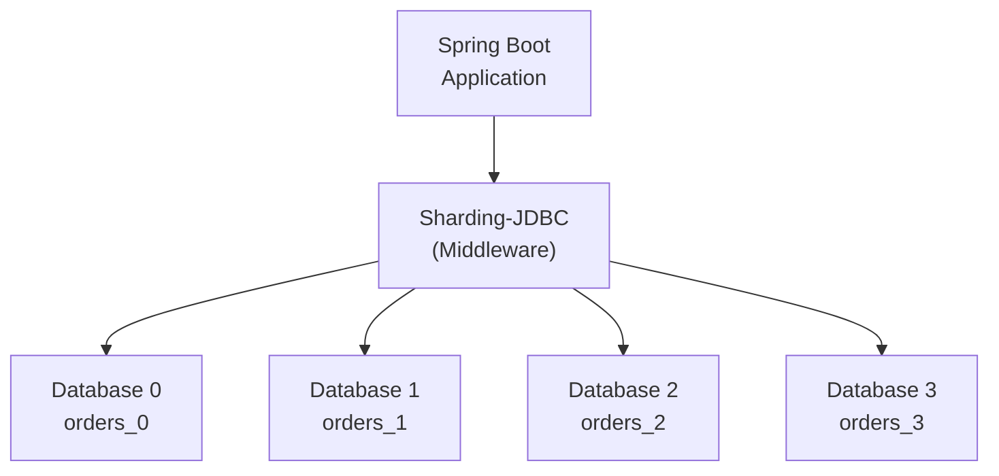

# How to Scale Databases with Sharding-JDBC in Spring Boot

Author: [nawazdhandala](https://www.github.com/nawazdhandala)

Tags: Java, Spring Boot, Sharding, Database, ShardingSphere, Horizontal Scaling, Performance, Distributed Systems

Description: Learn how to implement database sharding in Spring Boot applications using Apache ShardingSphere (Sharding-JDBC). This guide covers configuration, sharding strategies, and practical patterns for scaling your data layer.

---

> When your single database can no longer handle the load, you have two choices: scale up with more expensive hardware, or scale out by distributing data across multiple databases. Sharding-JDBC lets you add horizontal scaling to your Spring Boot application without changing your business code.

Database sharding splits your data across multiple databases, turning one bottleneck into many manageable pieces.

---

## Overview



---

## Dependencies

Add ShardingSphere JDBC to your Spring Boot project:

```xml
<!-- pom.xml -->
<dependency>
    <groupId>org.apache.shardingsphere</groupId>
    <artifactId>shardingsphere-jdbc-core-spring-boot-starter</artifactId>
    <version>5.4.1</version>
</dependency>
<dependency>
    <groupId>org.springframework.boot</groupId>
    <artifactId>spring-boot-starter-data-jpa</artifactId>
</dependency>
<dependency>
    <groupId>com.mysql</groupId>
    <artifactId>mysql-connector-j</artifactId>
    <scope>runtime</scope>
</dependency>
```

---

## Basic Sharding Configuration

### Database Setup

First, create the physical databases and tables. For this example, we will use two databases with two tables each:

```sql
-- Create databases
CREATE DATABASE ds_0;
CREATE DATABASE ds_1;

-- In ds_0
CREATE TABLE t_order_0 (
    order_id BIGINT PRIMARY KEY,
    user_id BIGINT NOT NULL,
    status VARCHAR(50),
    total_amount DECIMAL(10,2),
    created_at TIMESTAMP DEFAULT CURRENT_TIMESTAMP
);

CREATE TABLE t_order_1 (
    order_id BIGINT PRIMARY KEY,
    user_id BIGINT NOT NULL,
    status VARCHAR(50),
    total_amount DECIMAL(10,2),
    created_at TIMESTAMP DEFAULT CURRENT_TIMESTAMP
);

-- In ds_1 (same structure)
CREATE TABLE t_order_0 (...);
CREATE TABLE t_order_1 (...);
```

### Application Configuration

Configure sharding rules in your application properties:

```yaml
# application.yml
spring:
  shardingsphere:
    # Define data sources
    datasource:
      names: ds0,ds1
      ds0:
        type: com.zaxxer.hikari.HikariDataSource
        driver-class-name: com.mysql.cj.jdbc.Driver
        jdbc-url: jdbc:mysql://localhost:3306/ds_0?serverTimezone=UTC
        username: root
        password: ${DB_PASSWORD}
      ds1:
        type: com.zaxxer.hikari.HikariDataSource
        driver-class-name: com.mysql.cj.jdbc.Driver
        jdbc-url: jdbc:mysql://localhost:3307/ds_1?serverTimezone=UTC
        username: root
        password: ${DB_PASSWORD}

    # Define sharding rules
    rules:
      sharding:
        tables:
          t_order:
            # Specify actual data nodes (database.table combinations)
            actual-data-nodes: ds$->{0..1}.t_order_$->{0..1}
            # Database sharding strategy based on user_id
            database-strategy:
              standard:
                sharding-column: user_id
                sharding-algorithm-name: database-inline
            # Table sharding strategy based on order_id
            table-strategy:
              standard:
                sharding-column: order_id
                sharding-algorithm-name: table-inline
            # Key generation for order_id
            key-generate-strategy:
              column: order_id
              key-generator-name: snowflake

        # Define sharding algorithms
        sharding-algorithms:
          database-inline:
            type: INLINE
            props:
              algorithm-expression: ds$->{user_id % 2}
          table-inline:
            type: INLINE
            props:
              algorithm-expression: t_order_$->{order_id % 2}

        # Define key generators
        key-generators:
          snowflake:
            type: SNOWFLAKE
            props:
              worker-id: 1

    props:
      sql-show: true  # Log actual SQL for debugging
```

---

## Entity and Repository

### JPA Entity

Define your entity class as you normally would:

```java
package com.example.entity;

import jakarta.persistence.*;
import java.math.BigDecimal;
import java.time.LocalDateTime;

@Entity
@Table(name = "t_order")  // Logical table name
public class Order {

    @Id
    // Key is generated by ShardingSphere, not JPA
    @Column(name = "order_id")
    private Long orderId;

    @Column(name = "user_id", nullable = false)
    private Long userId;

    @Column(name = "status")
    private String status;

    @Column(name = "total_amount")
    private BigDecimal totalAmount;

    @Column(name = "created_at")
    private LocalDateTime createdAt;

    // Default constructor required by JPA
    public Order() {}

    public Order(Long userId, String status, BigDecimal totalAmount) {
        this.userId = userId;
        this.status = status;
        this.totalAmount = totalAmount;
        this.createdAt = LocalDateTime.now();
    }

    // Getters and setters
    public Long getOrderId() { return orderId; }
    public void setOrderId(Long orderId) { this.orderId = orderId; }
    public Long getUserId() { return userId; }
    public void setUserId(Long userId) { this.userId = userId; }
    public String getStatus() { return status; }
    public void setStatus(String status) { this.status = status; }
    public BigDecimal getTotalAmount() { return totalAmount; }
    public void setTotalAmount(BigDecimal totalAmount) { this.totalAmount = totalAmount; }
    public LocalDateTime getCreatedAt() { return createdAt; }
    public void setCreatedAt(LocalDateTime createdAt) { this.createdAt = createdAt; }
}
```

### Spring Data Repository

Create a repository with custom queries:

```java
package com.example.repository;

import com.example.entity.Order;
import org.springframework.data.jpa.repository.JpaRepository;
import org.springframework.data.jpa.repository.Query;
import org.springframework.data.repository.query.Param;
import org.springframework.stereotype.Repository;

import java.util.List;

@Repository
public interface OrderRepository extends JpaRepository<Order, Long> {

    // Query by sharding key - routes to specific shard
    List<Order> findByUserId(Long userId);

    // Query by both sharding keys - routes to specific table
    Order findByOrderIdAndUserId(Long orderId, Long userId);

    // Query with status filter
    List<Order> findByUserIdAndStatus(Long userId, String status);

    // Custom query - include sharding column for efficient routing
    @Query("SELECT o FROM Order o WHERE o.userId = :userId AND o.totalAmount > :amount")
    List<Order> findLargeOrders(
        @Param("userId") Long userId,
        @Param("amount") java.math.BigDecimal amount
    );
}
```

---

## Service Layer

### Order Service Implementation

Implement business logic that works transparently with sharded data:

```java
package com.example.service;

import com.example.entity.Order;
import com.example.repository.OrderRepository;
import org.springframework.stereotype.Service;
import org.springframework.transaction.annotation.Transactional;

import java.math.BigDecimal;
import java.util.List;

@Service
public class OrderService {

    private final OrderRepository orderRepository;

    public OrderService(OrderRepository orderRepository) {
        this.orderRepository = orderRepository;
    }

    // Create order - ShardingSphere routes to correct shard based on user_id
    @Transactional
    public Order createOrder(Long userId, BigDecimal amount) {
        Order order = new Order(userId, "PENDING", amount);
        // order_id will be generated by Snowflake algorithm
        return orderRepository.save(order);
    }

    // Fetch orders for a user - efficient because user_id is sharding key
    public List<Order> getUserOrders(Long userId) {
        return orderRepository.findByUserId(userId);
    }

    // Fetch specific order - most efficient with both sharding keys
    public Order getOrder(Long orderId, Long userId) {
        // Including userId allows routing to the exact shard
        return orderRepository.findByOrderIdAndUserId(orderId, userId);
    }

    // Update order status
    @Transactional
    public Order updateOrderStatus(Long orderId, Long userId, String newStatus) {
        Order order = orderRepository.findByOrderIdAndUserId(orderId, userId);
        if (order == null) {
            throw new RuntimeException("Order not found");
        }
        order.setStatus(newStatus);
        return orderRepository.save(order);
    }

    // Get orders by status for a user
    public List<Order> getPendingOrders(Long userId) {
        return orderRepository.findByUserIdAndStatus(userId, "PENDING");
    }
}
```

---

## Advanced Sharding Strategies

### Custom Sharding Algorithm

Implement a custom algorithm for complex sharding logic:

```java
package com.example.sharding;

import org.apache.shardingsphere.sharding.api.sharding.standard.PreciseShardingValue;
import org.apache.shardingsphere.sharding.api.sharding.standard.RangeShardingValue;
import org.apache.shardingsphere.sharding.api.sharding.standard.StandardShardingAlgorithm;

import java.util.Collection;
import java.util.LinkedHashSet;
import java.util.Properties;

public class UserIdShardingAlgorithm implements StandardShardingAlgorithm<Long> {

    private Properties props;

    @Override
    public String doSharding(Collection<String> availableTargetNames,
                             PreciseShardingValue<Long> shardingValue) {
        Long userId = shardingValue.getValue();

        // Custom logic: hash user_id to determine shard
        int shardIndex = (int) (userId.hashCode() & Integer.MAX_VALUE)
            % availableTargetNames.size();

        // Return the target datasource or table name
        return availableTargetNames.stream()
            .filter(name -> name.endsWith(String.valueOf(shardIndex)))
            .findFirst()
            .orElseThrow(() -> new RuntimeException("No shard found for user: " + userId));
    }

    @Override
    public Collection<String> doSharding(Collection<String> availableTargetNames,
                                         RangeShardingValue<Long> shardingValue) {
        // For range queries, return all shards
        return new LinkedHashSet<>(availableTargetNames);
    }

    @Override
    public Properties getProps() {
        return props;
    }

    @Override
    public void init(Properties props) {
        this.props = props;
    }
}
```

Register the custom algorithm:

```yaml
# application.yml
spring:
  shardingsphere:
    rules:
      sharding:
        sharding-algorithms:
          user-custom:
            type: CLASS_BASED
            props:
              strategy: STANDARD
              algorithmClassName: com.example.sharding.UserIdShardingAlgorithm
```

### Hint-Based Sharding

Force routing to a specific shard when the sharding column is not in the query:

```java
package com.example.service;

import org.apache.shardingsphere.infra.hint.HintManager;
import org.springframework.stereotype.Service;

import java.util.List;

@Service
public class AdminOrderService {

    private final OrderRepository orderRepository;

    public AdminOrderService(OrderRepository orderRepository) {
        this.orderRepository = orderRepository;
    }

    // Force query to specific database shard using hint
    public List<Order> getOrdersFromShard(int shardId) {
        try (HintManager hintManager = HintManager.getInstance()) {
            // Set database sharding value
            hintManager.setDatabaseShardingValue(shardId);

            // This query will only hit the specified shard
            return orderRepository.findAll();
        }
        // HintManager is automatically cleared when closed
    }

    // Route to specific database and table
    public Order getOrderDirect(int dbShard, int tableShard, Long orderId) {
        try (HintManager hintManager = HintManager.getInstance()) {
            hintManager.addDatabaseShardingValue("t_order", dbShard);
            hintManager.addTableShardingValue("t_order", tableShard);

            return orderRepository.findById(orderId).orElse(null);
        }
    }
}
```

---

## Broadcast Tables

### Configuration for Reference Data

Some tables should exist in all shards with identical data. Use broadcast tables for reference data:

```yaml
# application.yml
spring:
  shardingsphere:
    rules:
      sharding:
        tables:
          t_order:
            # ... order sharding config

        # Broadcast tables are replicated to all data sources
        broadcast-tables:
          - t_config
          - t_country
          - t_currency
```

```java
package com.example.entity;

import jakarta.persistence.*;

@Entity
@Table(name = "t_config")
public class Config {

    @Id
    private String configKey;

    private String configValue;

    private String description;

    // Getters and setters
    public String getConfigKey() { return configKey; }
    public void setConfigKey(String configKey) { this.configKey = configKey; }
    public String getConfigValue() { return configValue; }
    public void setConfigValue(String configValue) { this.configValue = configValue; }
    public String getDescription() { return description; }
    public void setDescription(String description) { this.description = description; }
}
```

Updates to broadcast tables are automatically applied to all shards.

---

## Read-Write Splitting

### Combining Sharding with Replicas

Add read replicas for each shard to scale read operations:

```yaml
# application.yml
spring:
  shardingsphere:
    datasource:
      names: ds0_primary,ds0_replica,ds1_primary,ds1_replica
      ds0_primary:
        jdbc-url: jdbc:mysql://primary-0:3306/ds_0
        # ... connection config
      ds0_replica:
        jdbc-url: jdbc:mysql://replica-0:3306/ds_0
        # ... connection config
      ds1_primary:
        jdbc-url: jdbc:mysql://primary-1:3306/ds_1
        # ... connection config
      ds1_replica:
        jdbc-url: jdbc:mysql://replica-1:3306/ds_1
        # ... connection config

    rules:
      # Read-write splitting configuration
      readwrite-splitting:
        data-sources:
          ds0:
            static-strategy:
              write-data-source-name: ds0_primary
              read-data-source-names:
                - ds0_replica
            load-balancer-name: round-robin
          ds1:
            static-strategy:
              write-data-source-name: ds1_primary
              read-data-source-names:
                - ds1_replica
            load-balancer-name: round-robin
        load-balancers:
          round-robin:
            type: ROUND_ROBIN

      # Sharding uses the logical data source names
      sharding:
        tables:
          t_order:
            actual-data-nodes: ds$->{0..1}.t_order_$->{0..1}
```

---

## Distributed Transactions

### XA Transactions Across Shards

Enable distributed transactions for operations spanning multiple shards:

```xml
<!-- pom.xml -->
<dependency>
    <groupId>org.apache.shardingsphere</groupId>
    <artifactId>shardingsphere-transaction-xa-core</artifactId>
    <version>5.4.1</version>
</dependency>
<dependency>
    <groupId>org.apache.shardingsphere</groupId>
    <artifactId>shardingsphere-transaction-xa-atomikos</artifactId>
    <version>5.4.1</version>
</dependency>
```

```yaml
# application.yml
spring:
  shardingsphere:
    props:
      xa-transaction-manager-type: Atomikos
```

```java
package com.example.service;

import org.apache.shardingsphere.transaction.annotation.ShardingSphereTransactionType;
import org.apache.shardingsphere.transaction.core.TransactionType;
import org.springframework.stereotype.Service;
import org.springframework.transaction.annotation.Transactional;

@Service
public class TransferService {

    private final AccountRepository accountRepository;

    public TransferService(AccountRepository accountRepository) {
        this.accountRepository = accountRepository;
    }

    // XA transaction across multiple shards
    @Transactional
    @ShardingSphereTransactionType(TransactionType.XA)
    public void transfer(Long fromUserId, Long toUserId, BigDecimal amount) {
        // These operations may hit different shards
        Account from = accountRepository.findByUserId(fromUserId);
        Account to = accountRepository.findByUserId(toUserId);

        from.debit(amount);
        to.credit(amount);

        accountRepository.save(from);
        accountRepository.save(to);
        // Both operations commit or rollback together
    }
}
```

---

## Monitoring and Observability

### SQL Logging

Enable SQL logging to see how queries are routed:

```yaml
# application.yml
spring:
  shardingsphere:
    props:
      sql-show: true
      sql-simple: false  # Show full SQL with parameters
```

### Metrics with Micrometer

ShardingSphere exposes metrics that can be collected:

```java
package com.example.config;

import io.micrometer.core.instrument.MeterRegistry;
import org.springframework.context.annotation.Bean;
import org.springframework.context.annotation.Configuration;

import javax.sql.DataSource;
import com.zaxxer.hikari.HikariDataSource;

@Configuration
public class MetricsConfig {

    // HikariCP automatically exposes connection pool metrics
    // when Micrometer is on the classpath

    @Bean
    public DataSourceMetrics dataSourceMetrics(DataSource dataSource, MeterRegistry registry) {
        // Additional custom metrics can be added here
        return new DataSourceMetrics(dataSource, registry);
    }
}
```

---

## Best Practices

1. **Choose sharding keys carefully** - pick columns with high cardinality and even distribution
2. **Include sharding keys in queries** - enables efficient routing to specific shards
3. **Use Snowflake for distributed IDs** - guarantees uniqueness across shards
4. **Plan for rebalancing** - adding shards requires data migration
5. **Test cross-shard queries** - they scan all shards and can be slow
6. **Monitor each shard** - uneven data distribution causes hotspots

---

## Conclusion

Sharding-JDBC enables horizontal database scaling in Spring Boot applications without changing business code. Key takeaways:

- Configure sharding rules declaratively in application properties
- Use inline expressions for simple sharding strategies
- Include sharding keys in queries for efficient routing
- Broadcast tables replicate reference data across all shards
- Combine with read replicas for additional read scalability

Database sharding is a powerful technique, but it adds complexity. Start simple and add sharding when your data volume truly requires it.

---

*Scaling your database infrastructure? [OneUptime](https://oneuptime.com) provides comprehensive monitoring for sharded database clusters with per-shard health tracking and performance metrics.*
