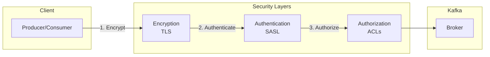

# How to Secure Kafka with SASL and TLS

Author: [nawazdhandala](https://www.github.com/nawazdhandala)

Tags: Kafka, Security, SASL, TLS, Authentication, Encryption

Description: A comprehensive guide to securing Apache Kafka with TLS encryption and SASL authentication, covering certificate generation, broker configuration, ACLs, and client setup for production environments.

---

An unsecured Kafka cluster is an open door for data breaches. Anyone who can reach the brokers can read and write to any topic. This guide covers implementing TLS for encryption and SASL for authentication to lock down your Kafka deployment.

## Security Layers in Kafka

Kafka security has three components:



- **Encryption (TLS)**: Protects data in transit from eavesdropping
- **Authentication (SASL)**: Verifies client identity
- **Authorization (ACLs)**: Controls what authenticated clients can do

## Step 1: Generate TLS Certificates

Create a certificate authority (CA) and generate certificates for each broker.

```bash
#!/bin/bash
# generate-certs.sh

# Configuration
PASSWORD="kafka-ssl-password"
VALIDITY=365
CA_CN="Kafka-CA"

# Create directories
mkdir -p certs/{ca,brokers,clients}

# Generate CA key and certificate
openssl req -new -x509 \
    -keyout certs/ca/ca-key.pem \
    -out certs/ca/ca-cert.pem \
    -days $VALIDITY \
    -subj "/CN=$CA_CN" \
    -passout pass:$PASSWORD

echo "CA certificate created"

# Function to create broker certificate
create_broker_cert() {
    local BROKER=$1
    local BROKER_HOST=$2

    echo "Creating certificate for $BROKER ($BROKER_HOST)"

    # Generate broker keystore with private key
    keytool -genkey -noprompt \
        -alias $BROKER \
        -keyalg RSA \
        -keysize 2048 \
        -keystore certs/brokers/$BROKER.keystore.jks \
        -storepass $PASSWORD \
        -keypass $PASSWORD \
        -validity $VALIDITY \
        -dname "CN=$BROKER_HOST"

    # Create certificate signing request
    keytool -certreq -noprompt \
        -alias $BROKER \
        -keystore certs/brokers/$BROKER.keystore.jks \
        -file certs/brokers/$BROKER.csr \
        -storepass $PASSWORD

    # Sign the certificate with CA
    openssl x509 -req \
        -CA certs/ca/ca-cert.pem \
        -CAkey certs/ca/ca-key.pem \
        -in certs/brokers/$BROKER.csr \
        -out certs/brokers/$BROKER-signed.pem \
        -days $VALIDITY \
        -CAcreateserial \
        -passin pass:$PASSWORD

    # Import CA certificate into keystore
    keytool -importcert -noprompt \
        -alias ca-cert \
        -file certs/ca/ca-cert.pem \
        -keystore certs/brokers/$BROKER.keystore.jks \
        -storepass $PASSWORD

    # Import signed certificate into keystore
    keytool -importcert -noprompt \
        -alias $BROKER \
        -file certs/brokers/$BROKER-signed.pem \
        -keystore certs/brokers/$BROKER.keystore.jks \
        -storepass $PASSWORD

    # Create truststore with CA certificate
    keytool -importcert -noprompt \
        -alias ca-cert \
        -file certs/ca/ca-cert.pem \
        -keystore certs/brokers/$BROKER.truststore.jks \
        -storepass $PASSWORD

    echo "Certificate for $BROKER complete"
}

# Create certificates for each broker
create_broker_cert "kafka1" "kafka1.example.com"
create_broker_cert "kafka2" "kafka2.example.com"
create_broker_cert "kafka3" "kafka3.example.com"

# Create client truststore (contains only CA cert)
keytool -importcert -noprompt \
    -alias ca-cert \
    -file certs/ca/ca-cert.pem \
    -keystore certs/clients/client.truststore.jks \
    -storepass $PASSWORD

echo "All certificates generated successfully"
```

## Step 2: Configure Brokers for TLS

Update `server.properties` on each broker:

```properties
# server.properties

# Listener configuration
listeners=PLAINTEXT://:9092,SSL://:9093,SASL_SSL://:9094
advertised.listeners=PLAINTEXT://kafka1.example.com:9092,SSL://kafka1.example.com:9093,SASL_SSL://kafka1.example.com:9094

# Map listener names to security protocols
listener.security.protocol.map=PLAINTEXT:PLAINTEXT,SSL:SSL,SASL_SSL:SASL_SSL

# Inter-broker communication (use SSL or SASL_SSL)
inter.broker.listener.name=SSL

# TLS/SSL configuration
ssl.keystore.location=/opt/kafka/certs/kafka1.keystore.jks
ssl.keystore.password=kafka-ssl-password
ssl.key.password=kafka-ssl-password
ssl.truststore.location=/opt/kafka/certs/kafka1.truststore.jks
ssl.truststore.password=kafka-ssl-password

# Require client authentication (mutual TLS)
ssl.client.auth=required

# TLS protocol versions (disable older versions)
ssl.enabled.protocols=TLSv1.3,TLSv1.2
ssl.protocol=TLSv1.3

# Strong cipher suites only
ssl.cipher.suites=TLS_AES_256_GCM_SHA384,TLS_CHACHA20_POLY1305_SHA256
```

## Step 3: Configure SASL Authentication

SASL provides flexible authentication mechanisms. SCRAM-SHA-512 is recommended for username/password authentication.

### Create SASL Users

```bash
# Create admin user (run on one broker, credentials propagate via Kafka)
kafka-configs.sh --bootstrap-server kafka1:9092 \
    --alter \
    --add-config 'SCRAM-SHA-512=[password=admin-secret-password]' \
    --entity-type users \
    --entity-name admin

# Create application users
kafka-configs.sh --bootstrap-server kafka1:9092 \
    --alter \
    --add-config 'SCRAM-SHA-512=[password=producer-password]' \
    --entity-type users \
    --entity-name order-producer

kafka-configs.sh --bootstrap-server kafka1:9092 \
    --alter \
    --add-config 'SCRAM-SHA-512=[password=consumer-password]' \
    --entity-type users \
    --entity-name order-consumer
```

### Broker SASL Configuration

```properties
# server.properties additions for SASL

# Enable SASL mechanisms
sasl.enabled.mechanisms=SCRAM-SHA-512
sasl.mechanism.inter.broker.protocol=SCRAM-SHA-512

# JAAS configuration for inter-broker communication
listener.name.sasl_ssl.scram-sha-512.sasl.jaas.config=org.apache.kafka.common.security.scram.ScramLoginModule required \
    username="admin" \
    password="admin-secret-password";

# Authorize specific operations
authorizer.class.name=kafka.security.authorizer.AclAuthorizer
super.users=User:admin
allow.everyone.if.no.acl.found=false
```

## Step 4: Configure ACLs (Authorization)

Set up Access Control Lists to restrict what each user can do.

```bash
# Grant producer permissions to order-producer user
kafka-acls.sh --bootstrap-server kafka1:9094 \
    --command-config /opt/kafka/config/admin.properties \
    --add \
    --allow-principal User:order-producer \
    --operation Write \
    --operation Describe \
    --topic orders

# Grant consumer permissions to order-consumer user
kafka-acls.sh --bootstrap-server kafka1:9094 \
    --command-config /opt/kafka/config/admin.properties \
    --add \
    --allow-principal User:order-consumer \
    --operation Read \
    --operation Describe \
    --topic orders \
    --group order-processor-group

# Grant read access to all topics matching a pattern
kafka-acls.sh --bootstrap-server kafka1:9094 \
    --command-config /opt/kafka/config/admin.properties \
    --add \
    --allow-principal User:analytics-reader \
    --operation Read \
    --operation Describe \
    --topic '*' \
    --resource-pattern-type prefixed \
    --topic analytics-

# List all ACLs
kafka-acls.sh --bootstrap-server kafka1:9094 \
    --command-config /opt/kafka/config/admin.properties \
    --list

# Remove an ACL
kafka-acls.sh --bootstrap-server kafka1:9094 \
    --command-config /opt/kafka/config/admin.properties \
    --remove \
    --allow-principal User:old-user \
    --operation All \
    --topic old-topic
```

Admin properties file for ACL commands:

```properties
# /opt/kafka/config/admin.properties
security.protocol=SASL_SSL
sasl.mechanism=SCRAM-SHA-512
sasl.jaas.config=org.apache.kafka.common.security.scram.ScramLoginModule required \
    username="admin" \
    password="admin-secret-password";
ssl.truststore.location=/opt/kafka/certs/client.truststore.jks
ssl.truststore.password=kafka-ssl-password
```

## Step 5: Configure Java Clients

### Producer Configuration

```java
import org.apache.kafka.clients.producer.*;
import java.util.Properties;

public class SecureProducer {
    public static void main(String[] args) {
        Properties props = new Properties();

        // Broker connection with SASL_SSL
        props.put(ProducerConfig.BOOTSTRAP_SERVERS_CONFIG, "kafka1:9094,kafka2:9094");

        // Security protocol
        props.put("security.protocol", "SASL_SSL");

        // SASL configuration
        props.put("sasl.mechanism", "SCRAM-SHA-512");
        props.put("sasl.jaas.config",
            "org.apache.kafka.common.security.scram.ScramLoginModule required " +
            "username=\"order-producer\" " +
            "password=\"producer-password\";");

        // TLS configuration
        props.put("ssl.truststore.location", "/app/certs/client.truststore.jks");
        props.put("ssl.truststore.password", "kafka-ssl-password");

        // Optional: Enable hostname verification
        props.put("ssl.endpoint.identification.algorithm", "https");

        // Serializers
        props.put(ProducerConfig.KEY_SERIALIZER_CLASS_CONFIG,
            "org.apache.kafka.common.serialization.StringSerializer");
        props.put(ProducerConfig.VALUE_SERIALIZER_CLASS_CONFIG,
            "org.apache.kafka.common.serialization.StringSerializer");

        try (KafkaProducer<String, String> producer = new KafkaProducer<>(props)) {
            ProducerRecord<String, String> record = new ProducerRecord<>(
                "orders", "order-123", "{\"item\": \"widget\", \"quantity\": 5}"
            );
            producer.send(record).get();
            System.out.println("Message sent securely");
        } catch (Exception e) {
            e.printStackTrace();
        }
    }
}
```

### Consumer Configuration

```java
import org.apache.kafka.clients.consumer.*;
import java.time.Duration;
import java.util.Collections;
import java.util.Properties;

public class SecureConsumer {
    public static void main(String[] args) {
        Properties props = new Properties();

        props.put(ConsumerConfig.BOOTSTRAP_SERVERS_CONFIG, "kafka1:9094,kafka2:9094");
        props.put(ConsumerConfig.GROUP_ID_CONFIG, "order-processor-group");

        // Security protocol
        props.put("security.protocol", "SASL_SSL");

        // SASL configuration
        props.put("sasl.mechanism", "SCRAM-SHA-512");
        props.put("sasl.jaas.config",
            "org.apache.kafka.common.security.scram.ScramLoginModule required " +
            "username=\"order-consumer\" " +
            "password=\"consumer-password\";");

        // TLS configuration
        props.put("ssl.truststore.location", "/app/certs/client.truststore.jks");
        props.put("ssl.truststore.password", "kafka-ssl-password");
        props.put("ssl.endpoint.identification.algorithm", "https");

        // Deserializers
        props.put(ConsumerConfig.KEY_DESERIALIZER_CLASS_CONFIG,
            "org.apache.kafka.common.serialization.StringDeserializer");
        props.put(ConsumerConfig.VALUE_DESERIALIZER_CLASS_CONFIG,
            "org.apache.kafka.common.serialization.StringDeserializer");

        try (KafkaConsumer<String, String> consumer = new KafkaConsumer<>(props)) {
            consumer.subscribe(Collections.singletonList("orders"));

            while (true) {
                ConsumerRecords<String, String> records = consumer.poll(Duration.ofMillis(100));
                for (ConsumerRecord<String, String> record : records) {
                    System.out.printf("Received: %s%n", record.value());
                }
            }
        }
    }
}
```

## Certificate Rotation

Rotate certificates before they expire without downtime:

```bash
#!/bin/bash
# rotate-certs.sh

# Generate new certificates (same process as initial generation)
./generate-certs.sh --output certs-new/

# Rolling update: Update one broker at a time
for broker in kafka1 kafka2 kafka3; do
    echo "Rotating certificates for $broker"

    # Copy new certificates
    scp certs-new/brokers/$broker.* $broker:/opt/kafka/certs-new/

    # Update configuration to use new certs
    ssh $broker "sed -i 's/certs\//certs-new\//g' /opt/kafka/config/server.properties"

    # Restart broker
    ssh $broker "systemctl restart kafka"

    # Wait for broker to rejoin cluster
    sleep 60

    # Verify broker is healthy
    kafka-broker-api-versions.sh --bootstrap-server $broker:9094 \
        --command-config admin.properties

    echo "$broker rotation complete"
done

echo "Certificate rotation complete"
```

## Security Checklist

Before going to production:

- [ ] TLS enabled on all listeners (disable PLAINTEXT in production)
- [ ] Strong cipher suites only (TLS 1.2+ minimum)
- [ ] SASL authentication required for all clients
- [ ] ACLs configured with least-privilege principle
- [ ] Super users limited to admin accounts only
- [ ] Certificate expiration monitoring in place
- [ ] Secrets stored securely (not in plain text configs)
- [ ] Network segmentation between Kafka and untrusted networks
- [ ] Audit logging enabled for security events

---

Securing Kafka requires TLS for encryption, SASL for authentication, and ACLs for authorization. Start with TLS to protect data in transit, add SCRAM-SHA-512 authentication for identity verification, and configure ACLs to enforce the principle of least privilege. Plan for certificate rotation from day one to avoid emergency rotations when certificates expire.
