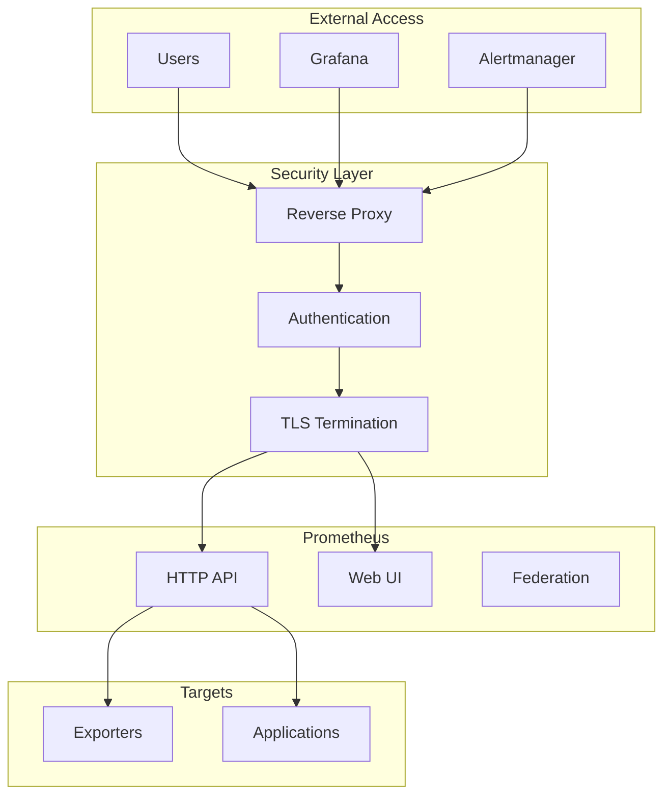

# How to Secure Prometheus

Author: [nawazdhandala](https://www.github.com/nawazdhandala)

Tags: Prometheus, Security, TLS, Authentication, RBAC, Network Security, Encryption, Observability

Description: A comprehensive guide to securing your Prometheus deployment. Learn how to enable TLS encryption, configure authentication, implement network policies, and apply security best practices for production environments.

---

## Why Prometheus Security Matters

By default, Prometheus exposes sensitive information without authentication:

- Metric data reveals infrastructure details and business metrics
- Configuration endpoints expose scrape targets and credentials
- Admin endpoints allow remote configuration changes
- Label values may contain sensitive information

In production, you need multiple layers of security to protect your monitoring infrastructure.

## Security Architecture Overview



## Enabling TLS Encryption

### Generate TLS Certificates

```bash
# Generate CA certificate
openssl genrsa -out ca.key 4096
openssl req -x509 -new -nodes -key ca.key -sha256 -days 365 \
  -out ca.crt -subj "/CN=Prometheus CA"

# Generate server certificate
openssl genrsa -out prometheus.key 2048
openssl req -new -key prometheus.key -out prometheus.csr \
  -subj "/CN=prometheus.example.com"

# Create certificate extension file
cat > prometheus.ext << EOF
authorityKeyIdentifier=keyid,issuer
basicConstraints=CA:FALSE
keyUsage = digitalSignature, nonRepudiation, keyEncipherment, dataEncipherment
subjectAltName = @alt_names

[alt_names]
DNS.1 = prometheus.example.com
DNS.2 = prometheus.monitoring.svc.cluster.local
DNS.3 = localhost
IP.1 = 127.0.0.1
EOF

# Sign the certificate
openssl x509 -req -in prometheus.csr -CA ca.crt -CAkey ca.key \
  -CAcreateserial -out prometheus.crt -days 365 -sha256 \
  -extfile prometheus.ext
```

### Configure Prometheus with TLS

```yaml
# web-config.yml - Prometheus TLS configuration
tls_server_config:
  cert_file: /etc/prometheus/certs/prometheus.crt
  key_file: /etc/prometheus/certs/prometheus.key
  # Require client certificates (mutual TLS)
  client_auth_type: RequireAndVerifyClientCert
  client_ca_file: /etc/prometheus/certs/ca.crt
  # Minimum TLS version
  min_version: TLS12
  # Cipher suites (optional, defaults are secure)
  cipher_suites:
    - TLS_ECDHE_RSA_WITH_AES_128_GCM_SHA256
    - TLS_ECDHE_RSA_WITH_AES_256_GCM_SHA384
    - TLS_ECDHE_ECDSA_WITH_AES_128_GCM_SHA256
    - TLS_ECDHE_ECDSA_WITH_AES_256_GCM_SHA384
```

Start Prometheus with TLS:

```bash
prometheus \
  --config.file=/etc/prometheus/prometheus.yml \
  --web.config.file=/etc/prometheus/web-config.yml \
  --storage.tsdb.path=/prometheus
```

## Configuring Basic Authentication

### Generate Password Hash

```bash
# Install htpasswd or use Python
# Using Python to generate bcrypt hash
python3 -c "import bcrypt; print(bcrypt.hashpw(b'your-secure-password', bcrypt.gensalt()).decode())"
# Output: $2b$12$xxxxx...
```

### Configure Authentication

```yaml
# web-config.yml - Basic authentication
basic_auth_users:
  admin: $2b$12$hNf2lSsxfm0.i4a.1kVpSOVyBCfIB51VRjgBUyv6kdnyTlgWj81Bq
  grafana: $2b$12$xxxxx...
  alertmanager: $2b$12$xxxxx...

tls_server_config:
  cert_file: /etc/prometheus/certs/prometheus.crt
  key_file: /etc/prometheus/certs/prometheus.key
```

### Configure Grafana to Authenticate

```yaml
# grafana datasource configuration
apiVersion: 1
datasources:
  - name: Prometheus
    type: prometheus
    url: https://prometheus.example.com:9090
    basicAuth: true
    basicAuthUser: grafana
    secureJsonData:
      basicAuthPassword: grafana-password
    jsonData:
      tlsAuth: false
      tlsAuthWithCACert: true
    secureJsonData:
      tlsCACert: |
        -----BEGIN CERTIFICATE-----
        ... CA certificate content ...
        -----END CERTIFICATE-----
```

## Network Security

### Kubernetes Network Policies

```yaml
# network-policy.yaml - Restrict Prometheus network access
apiVersion: networking.k8s.io/v1
kind: NetworkPolicy
metadata:
  name: prometheus-network-policy
  namespace: monitoring
spec:
  podSelector:
    matchLabels:
      app: prometheus
  policyTypes:
    - Ingress
    - Egress
  ingress:
    # Allow Grafana to query Prometheus
    - from:
        - namespaceSelector:
            matchLabels:
              name: monitoring
          podSelector:
            matchLabels:
              app: grafana
      ports:
        - protocol: TCP
          port: 9090
    # Allow Alertmanager to receive alerts
    - from:
        - namespaceSelector:
            matchLabels:
              name: monitoring
          podSelector:
            matchLabels:
              app: alertmanager
      ports:
        - protocol: TCP
          port: 9090
  egress:
    # Allow scraping targets in specific namespaces
    - to:
        - namespaceSelector:
            matchLabels:
              prometheus-scrape: "true"
      ports:
        - protocol: TCP
          port: 9090
        - protocol: TCP
          port: 8080
    # Allow DNS resolution
    - to:
        - namespaceSelector: {}
          podSelector:
            matchLabels:
              k8s-app: kube-dns
      ports:
        - protocol: UDP
          port: 53
```

### Firewall Rules

```bash
# iptables rules to restrict Prometheus access
# Allow only specific IPs to access Prometheus

# Allow localhost
iptables -A INPUT -p tcp --dport 9090 -s 127.0.0.1 -j ACCEPT

# Allow Grafana server
iptables -A INPUT -p tcp --dport 9090 -s 10.0.1.10 -j ACCEPT

# Allow Alertmanager
iptables -A INPUT -p tcp --dport 9090 -s 10.0.1.11 -j ACCEPT

# Drop all other connections to Prometheus
iptables -A INPUT -p tcp --dport 9090 -j DROP
```

## Reverse Proxy with Authentication

### NGINX Configuration

```nginx
# nginx.conf - Secure proxy for Prometheus
upstream prometheus {
    server 127.0.0.1:9090;
}

server {
    listen 443 ssl http2;
    server_name prometheus.example.com;

    # TLS configuration
    ssl_certificate /etc/nginx/certs/prometheus.crt;
    ssl_certificate_key /etc/nginx/certs/prometheus.key;
    ssl_protocols TLSv1.2 TLSv1.3;
    ssl_ciphers ECDHE-ECDSA-AES128-GCM-SHA256:ECDHE-RSA-AES128-GCM-SHA256;
    ssl_prefer_server_ciphers on;

    # Security headers
    add_header Strict-Transport-Security "max-age=31536000; includeSubDomains" always;
    add_header X-Frame-Options DENY always;
    add_header X-Content-Type-Options nosniff always;
    add_header X-XSS-Protection "1; mode=block" always;

    # Basic authentication
    auth_basic "Prometheus";
    auth_basic_user_file /etc/nginx/.htpasswd;

    # Rate limiting
    limit_req_zone $binary_remote_addr zone=prometheus:10m rate=10r/s;

    location / {
        limit_req zone=prometheus burst=20 nodelay;
        proxy_pass http://prometheus;
        proxy_set_header Host $host;
        proxy_set_header X-Real-IP $remote_addr;
        proxy_set_header X-Forwarded-For $proxy_add_x_forwarded_for;
        proxy_set_header X-Forwarded-Proto $scheme;
    }

    # Block dangerous admin endpoints
    location ~ ^/-/(reload|quit) {
        deny all;
        return 403;
    }

    # Restrict config endpoint
    location /api/v1/status/config {
        # Only allow specific IPs
        allow 10.0.0.0/8;
        deny all;
        proxy_pass http://prometheus;
    }
}
```

### Create htpasswd File

```bash
# Create password file for NGINX
htpasswd -c /etc/nginx/.htpasswd admin
htpasswd /etc/nginx/.htpasswd grafana
htpasswd /etc/nginx/.htpasswd alertmanager
```

## Securing Scrape Targets

### Configure TLS for Scraping

```yaml
# prometheus.yml - Secure scraping configuration
scrape_configs:
  - job_name: 'secure-app'
    scheme: https
    tls_config:
      # Verify target certificates
      ca_file: /etc/prometheus/certs/ca.crt
      cert_file: /etc/prometheus/certs/client.crt
      key_file: /etc/prometheus/certs/client.key
      # Require valid certificates
      insecure_skip_verify: false
    basic_auth:
      username: prometheus
      password_file: /etc/prometheus/secrets/scrape-password
    static_configs:
      - targets: ['app1.example.com:9090', 'app2.example.com:9090']

  - job_name: 'kubernetes-pods'
    kubernetes_sd_configs:
      - role: pod
    tls_config:
      ca_file: /var/run/secrets/kubernetes.io/serviceaccount/ca.crt
    bearer_token_file: /var/run/secrets/kubernetes.io/serviceaccount/token
```

### Protect Exporter Endpoints

```yaml
# Node Exporter with TLS
# web-config.yml for Node Exporter
tls_server_config:
  cert_file: /etc/node_exporter/certs/node.crt
  key_file: /etc/node_exporter/certs/node.key
  client_auth_type: RequireAndVerifyClientCert
  client_ca_file: /etc/node_exporter/certs/ca.crt

basic_auth_users:
  prometheus: $2b$12$xxxxx...
```

## Kubernetes RBAC Configuration

```yaml
# rbac.yaml - RBAC for Prometheus in Kubernetes
apiVersion: v1
kind: ServiceAccount
metadata:
  name: prometheus
  namespace: monitoring
---
apiVersion: rbac.authorization.k8s.io/v1
kind: ClusterRole
metadata:
  name: prometheus
rules:
  # Minimal permissions for service discovery
  - apiGroups: [""]
    resources:
      - nodes
      - nodes/proxy
      - services
      - endpoints
      - pods
    verbs: ["get", "list", "watch"]
  - apiGroups: [""]
    resources:
      - configmaps
    verbs: ["get"]
  - nonResourceURLs: ["/metrics"]
    verbs: ["get"]
---
apiVersion: rbac.authorization.k8s.io/v1
kind: ClusterRoleBinding
metadata:
  name: prometheus
roleRef:
  apiGroup: rbac.authorization.k8s.io
  kind: ClusterRole
  name: prometheus
subjects:
  - kind: ServiceAccount
    name: prometheus
    namespace: monitoring
```

## Protecting Sensitive Labels

Use relabeling to remove sensitive information:

```yaml
# prometheus.yml - Remove sensitive labels
scrape_configs:
  - job_name: 'app'
    static_configs:
      - targets: ['app:9090']
    metric_relabel_configs:
      # Drop metrics with sensitive labels
      - source_labels: [user_id]
        regex: '.+'
        action: drop
      # Remove sensitive label values
      - regex: '(password|token|secret|key)'
        action: labeldrop
      # Hash sensitive values
      - source_labels: [email]
        target_label: email_hash
        replacement: 'hashed'
        action: replace
      - regex: 'email'
        action: labeldrop
```

## Security Checklist

Use this checklist for production deployments:

```yaml
# security-checklist.yaml
security_checklist:
  network_security:
    - Enable TLS for all Prometheus endpoints
    - Configure firewall rules to restrict access
    - Implement Kubernetes NetworkPolicies
    - Use private networks for scraping

  authentication:
    - Enable basic authentication or OAuth
    - Use strong, unique passwords
    - Rotate credentials regularly
    - Implement rate limiting

  authorization:
    - Apply principle of least privilege
    - Use Kubernetes RBAC
    - Restrict admin endpoints
    - Audit access logs

  data_protection:
    - Remove sensitive labels via relabeling
    - Encrypt data at rest
    - Limit metric retention
    - Secure backup storage

  operational:
    - Keep Prometheus updated
    - Monitor security alerts
    - Disable unnecessary features
    - Document security configuration
```

## Monitoring Security Events

Create alerts for security-related events:

```yaml
# security_alerts.yml
groups:
  - name: security_alerts
    rules:
      - alert: PrometheusConfigReloaded
        expr: |
          increase(prometheus_config_last_reload_successful[5m]) > 0
        labels:
          severity: info
        annotations:
          summary: "Prometheus configuration was reloaded"

      - alert: UnauthorizedScrapeAttempts
        expr: |
          increase(prometheus_target_scrape_pools_failed_total[5m]) > 10
        labels:
          severity: warning
        annotations:
          summary: "Multiple failed scrape attempts detected"

      - alert: HighRateOfAPIRequests
        expr: |
          rate(prometheus_http_requests_total[5m]) > 100
        labels:
          severity: warning
        annotations:
          summary: "Unusually high API request rate"
```

## Best Practices Summary

1. **Enable TLS everywhere**: Encrypt all Prometheus communications
2. **Require authentication**: Never expose Prometheus without auth
3. **Use network segmentation**: Restrict who can access Prometheus
4. **Apply least privilege**: Only grant necessary permissions
5. **Remove sensitive data**: Use relabeling to protect PII
6. **Monitor access**: Log and alert on security events
7. **Keep updated**: Apply security patches promptly
8. **Audit regularly**: Review security configuration periodically

## Conclusion

Securing Prometheus requires multiple defense layers: TLS encryption, authentication, network policies, and careful data handling. Start with TLS and basic authentication, then add network restrictions and RBAC as your deployment matures. Regular audits and monitoring ensure your security controls remain effective as your infrastructure evolves.
