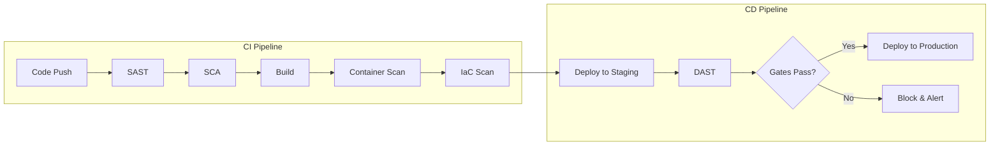

# How to Configure Security Scanning in CI/CD Pipelines

Author: [nawazdhandala](https://www.github.com/nawazdhandala)

Tags: CI/CD, Security, DevSecOps, SAST, DAST, Container Scanning, Vulnerability Management

Description: Learn how to integrate security scanning into CI/CD pipelines for comprehensive DevSecOps. This guide covers SAST, DAST, container scanning, and dependency analysis with practical examples.

---

> Shifting security left means integrating security testing early in the development lifecycle. CI/CD pipelines provide the ideal enforcement point for automated security scanning, catching vulnerabilities before they reach production.

Security scanning in CI/CD encompasses multiple dimensions: static analysis of source code, dynamic testing of running applications, container image scanning, dependency vulnerability checks, and infrastructure-as-code validation. A comprehensive pipeline addresses all these areas.

---

## Security Scanning Categories

Understanding different scanning types helps build comprehensive coverage:

**SAST (Static Application Security Testing)**: Analyzes source code for security vulnerabilities without executing the application.

**DAST (Dynamic Application Security Testing)**: Tests running applications for vulnerabilities by simulating attacks.

**SCA (Software Composition Analysis)**: Identifies vulnerabilities in third-party dependencies.

**Container Scanning**: Checks container images for vulnerable packages and misconfigurations.

**IaC Scanning**: Validates infrastructure-as-code for security misconfigurations.

---

## Pipeline Architecture



---

## Prerequisites

Before configuring security scanning:

- CI/CD platform (GitHub Actions, GitLab CI, Jenkins)
- Container registry access
- Understanding of your application stack
- Security policies for vulnerability thresholds

---

## SAST with Semgrep

Configure Semgrep for static code analysis:

```yaml
# .github/workflows/sast.yaml
name: SAST Analysis

on:
  push:
    branches: [main, develop]
  pull_request:
    branches: [main]

jobs:
  semgrep:
    runs-on: ubuntu-latest
    container:
      image: returntocorp/semgrep

    steps:
    - name: Checkout code
      uses: actions/checkout@v4

    - name: Run Semgrep
      run: |
        semgrep scan \
          --config=p/security-audit \
          --config=p/secrets \
          --config=p/owasp-top-ten \
          --sarif \
          --output=semgrep-results.sarif \
          .

    - name: Upload SARIF results
      uses: github/codeql-action/upload-sarif@v2
      with:
        sarif_file: semgrep-results.sarif

    - name: Check for high severity findings
      run: |
        # Fail if high or critical findings exist
        semgrep scan \
          --config=p/security-audit \
          --error \
          --severity=ERROR \
          .
```

Custom Semgrep rules for your codebase:

```yaml
# .semgrep/custom-rules.yaml
rules:
  # Detect hardcoded secrets
  - id: hardcoded-api-key
    patterns:
      - pattern-either:
          - pattern: $X = "AKIA..."
          - pattern: $X = "sk_live_..."
          - pattern: $X = "ghp_..."
    message: "Hardcoded API key detected"
    severity: ERROR
    languages: [python, javascript, go]

  # Detect SQL injection in Python
  - id: sql-injection-python
    patterns:
      - pattern: cursor.execute($QUERY % ...)
      - pattern: cursor.execute($QUERY.format(...))
      - pattern: cursor.execute(f"...")
    message: "Potential SQL injection - use parameterized queries"
    severity: ERROR
    languages: [python]

  # Detect insecure deserialization
  - id: insecure-pickle
    patterns:
      - pattern: pickle.loads(...)
      - pattern: pickle.load(...)
    message: "Pickle deserialization can lead to RCE"
    severity: WARNING
    languages: [python]

  # Kubernetes security rules
  - id: k8s-privileged-container
    patterns:
      - pattern: |
          securityContext:
            privileged: true
    message: "Privileged containers should be avoided"
    severity: ERROR
    languages: [yaml]
```

---

## Software Composition Analysis

Scan dependencies with multiple tools:

```yaml
# .github/workflows/sca.yaml
name: Dependency Scanning

on:
  push:
    branches: [main]
  pull_request:
  schedule:
    - cron: '0 6 * * *'  # Daily scan

jobs:
  dependency-scan:
    runs-on: ubuntu-latest
    steps:
    - uses: actions/checkout@v4

    # Python dependencies with Safety
    - name: Set up Python
      uses: actions/setup-python@v5
      with:
        python-version: '3.11'

    - name: Scan Python dependencies
      run: |
        pip install safety
        safety check -r requirements.txt --json > safety-results.json || true

        # Check for critical vulnerabilities
        CRITICAL=$(cat safety-results.json | jq '[.[] | select(.severity == "critical")] | length')
        if [ "$CRITICAL" -gt 0 ]; then
          echo "Critical vulnerabilities found in Python dependencies"
          cat safety-results.json | jq '.[] | select(.severity == "critical")'
          exit 1
        fi

    # JavaScript dependencies with npm audit
    - name: Set up Node
      uses: actions/setup-node@v4
      with:
        node-version: '20'

    - name: Scan JavaScript dependencies
      run: |
        npm audit --json > npm-audit.json || true

        # Check for high/critical vulnerabilities
        HIGH=$(cat npm-audit.json | jq '.metadata.vulnerabilities.high // 0')
        CRITICAL=$(cat npm-audit.json | jq '.metadata.vulnerabilities.critical // 0')

        if [ "$CRITICAL" -gt 0 ] || [ "$HIGH" -gt 5 ]; then
          echo "High severity vulnerabilities found"
          npm audit
          exit 1
        fi

    # Go dependencies with govulncheck
    - name: Set up Go
      uses: actions/setup-go@v5
      with:
        go-version: '1.21'

    - name: Scan Go dependencies
      run: |
        go install golang.org/x/vuln/cmd/govulncheck@latest
        govulncheck ./... > govuln-results.txt || true

        if grep -q "Vulnerability" govuln-results.txt; then
          cat govuln-results.txt
          exit 1
        fi

    # Trivy for comprehensive SCA
    - name: Run Trivy filesystem scan
      uses: aquasecurity/trivy-action@master
      with:
        scan-type: 'fs'
        scan-ref: '.'
        format: 'sarif'
        output: 'trivy-fs-results.sarif'

    - name: Upload Trivy results
      uses: github/codeql-action/upload-sarif@v2
      with:
        sarif_file: trivy-fs-results.sarif
```

---

## Container Image Scanning

Comprehensive container scanning:

```yaml
# .github/workflows/container-scan.yaml
name: Container Security Scan

on:
  push:
    branches: [main]
  pull_request:

env:
  REGISTRY: ghcr.io
  IMAGE_NAME: ${{ github.repository }}

jobs:
  build-and-scan:
    runs-on: ubuntu-latest
    permissions:
      contents: read
      packages: write
      security-events: write

    steps:
    - uses: actions/checkout@v4

    - name: Build container image
      run: |
        docker build -t ${{ env.IMAGE_NAME }}:${{ github.sha }} .

    # Trivy vulnerability scan
    - name: Trivy vulnerability scan
      uses: aquasecurity/trivy-action@master
      with:
        image-ref: '${{ env.IMAGE_NAME }}:${{ github.sha }}'
        format: 'sarif'
        output: 'trivy-results.sarif'
        severity: 'CRITICAL,HIGH'

    - name: Upload Trivy scan results
      uses: github/codeql-action/upload-sarif@v2
      with:
        sarif_file: trivy-results.sarif

    # Grype as secondary scanner
    - name: Grype vulnerability scan
      uses: anchore/scan-action@v3
      with:
        image: '${{ env.IMAGE_NAME }}:${{ github.sha }}'
        fail-build: true
        severity-cutoff: high
        output-format: sarif

    # Hadolint for Dockerfile best practices
    - name: Lint Dockerfile
      uses: hadolint/hadolint-action@v3.1.0
      with:
        dockerfile: Dockerfile
        failure-threshold: warning

    # Dockle for container best practices
    - name: Dockle scan
      run: |
        VERSION=$(curl --silent "https://api.github.com/repos/goodwithtech/dockle/releases/latest" | grep '"tag_name":' | sed -E 's/.*"v([^"]+)".*/\1/')
        curl -L -o dockle.tar.gz https://github.com/goodwithtech/dockle/releases/download/v${VERSION}/dockle_${VERSION}_Linux-64bit.tar.gz
        tar zxvf dockle.tar.gz
        ./dockle --exit-code 1 --exit-level warn ${{ env.IMAGE_NAME }}:${{ github.sha }}

    # Sign image if all scans pass
    - name: Sign container image
      if: github.event_name != 'pull_request'
      run: |
        cosign sign --yes ${{ env.REGISTRY }}/${{ env.IMAGE_NAME }}@${{ steps.build.outputs.digest }}
```

---

## Infrastructure-as-Code Scanning

Scan Terraform, Kubernetes manifests, and CloudFormation:

```yaml
# .github/workflows/iac-scan.yaml
name: Infrastructure Security Scan

on:
  push:
    paths:
      - 'terraform/**'
      - 'kubernetes/**'
      - 'cloudformation/**'
  pull_request:
    paths:
      - 'terraform/**'
      - 'kubernetes/**'
      - 'cloudformation/**'

jobs:
  iac-scan:
    runs-on: ubuntu-latest
    steps:
    - uses: actions/checkout@v4

    # Checkov for multi-framework IaC scanning
    - name: Checkov scan
      uses: bridgecrewio/checkov-action@v12
      with:
        directory: .
        framework: terraform,kubernetes,cloudformation
        output_format: sarif
        output_file_path: checkov-results.sarif
        soft_fail: false
        skip_check: CKV_AWS_18,CKV_AWS_21  # Skip specific checks if needed

    - name: Upload Checkov results
      uses: github/codeql-action/upload-sarif@v2
      with:
        sarif_file: checkov-results.sarif

    # tfsec for Terraform-specific scanning
    - name: tfsec scan
      uses: aquasecurity/tfsec-action@v1.0.0
      with:
        working_directory: terraform/
        soft_fail: false

    # Kubescape for Kubernetes manifests
    - name: Kubescape scan
      run: |
        curl -s https://raw.githubusercontent.com/kubescape/kubescape/master/install.sh | /bin/bash
        kubescape scan framework nsa,mitre kubernetes/ \
          --format sarif \
          --output kubescape-results.sarif \
          --compliance-threshold 80

    # KICS for additional coverage
    - name: KICS scan
      uses: checkmarx/kics-github-action@v1.7
      with:
        path: .
        fail_on: high,medium
        output_path: kics-results/
        output_formats: 'sarif'
```

---

## DAST with OWASP ZAP

Configure dynamic application testing:

```yaml
# .github/workflows/dast.yaml
name: Dynamic Security Testing

on:
  workflow_run:
    workflows: ["Deploy to Staging"]
    types: [completed]

jobs:
  zap-scan:
    if: ${{ github.event.workflow_run.conclusion == 'success' }}
    runs-on: ubuntu-latest

    steps:
    - uses: actions/checkout@v4

    # Wait for application to be ready
    - name: Wait for deployment
      run: |
        for i in {1..30}; do
          if curl -s -o /dev/null -w "%{http_code}" https://staging.example.com/health | grep -q "200"; then
            echo "Application is ready"
            break
          fi
          echo "Waiting for application..."
          sleep 10
        done

    # OWASP ZAP baseline scan
    - name: ZAP Baseline Scan
      uses: zaproxy/action-baseline@v0.10.0
      with:
        target: 'https://staging.example.com'
        rules_file_name: '.zap/rules.tsv'
        cmd_options: '-a'

    # OWASP ZAP full scan for more comprehensive testing
    - name: ZAP Full Scan
      uses: zaproxy/action-full-scan@v0.8.0
      with:
        target: 'https://staging.example.com'
        rules_file_name: '.zap/rules.tsv'
        cmd_options: '-a -j'

    # ZAP API scan
    - name: ZAP API Scan
      uses: zaproxy/action-api-scan@v0.5.0
      with:
        target: 'https://staging.example.com/openapi.json'
        format: openapi

    - name: Upload ZAP results
      uses: actions/upload-artifact@v4
      with:
        name: zap-results
        path: |
          zap-baseline-report.html
          zap-full-report.html
          zap-api-report.html
```

ZAP configuration file:

```
# .zap/rules.tsv
# Rule ID	Action	Description
10015	IGNORE	Incomplete or No Cache-control and Pragma HTTP Header Set
10020	WARN	X-Frame-Options Header Not Set
10021	FAIL	X-Content-Type-Options Header Missing
10035	FAIL	Strict-Transport-Security Header Not Set
10038	WARN	Content Security Policy (CSP) Header Not Set
10054	FAIL	Cookie without SameSite Attribute
10055	FAIL	CSP: Wildcard Directive
10096	WARN	Timestamp Disclosure
10098	FAIL	Cross-Domain Misconfiguration
40012	FAIL	Cross Site Scripting (Reflected)
40014	FAIL	Cross Site Scripting (Persistent)
40016	FAIL	Cross Site Scripting (Persistent) - Prime
40017	FAIL	Cross Site Scripting (Persistent) - Spider
40018	FAIL	SQL Injection
90019	FAIL	Server Side Include
90020	FAIL	Remote OS Command Injection
```

---

## Security Gate Implementation

Create unified security gates:

```yaml
# .github/workflows/security-gate.yaml
name: Security Gate

on:
  pull_request:
    branches: [main]

jobs:
  security-gate:
    runs-on: ubuntu-latest
    steps:
    - uses: actions/checkout@v4

    - name: Run all security scans
      id: scans
      run: |
        # Initialize results
        echo "SAST_PASSED=true" >> $GITHUB_OUTPUT
        echo "SCA_PASSED=true" >> $GITHUB_OUTPUT
        echo "CONTAINER_PASSED=true" >> $GITHUB_OUTPUT
        echo "IAC_PASSED=true" >> $GITHUB_OUTPUT

        # Run SAST
        if ! semgrep scan --config=p/security-audit --error --severity=ERROR .; then
          echo "SAST_PASSED=false" >> $GITHUB_OUTPUT
        fi

        # Run SCA
        if ! trivy fs --exit-code 1 --severity CRITICAL .; then
          echo "SCA_PASSED=false" >> $GITHUB_OUTPUT
        fi

        # Run container scan
        if docker images | grep -q "$IMAGE_NAME"; then
          if ! trivy image --exit-code 1 --severity CRITICAL,HIGH "$IMAGE_NAME"; then
            echo "CONTAINER_PASSED=false" >> $GITHUB_OUTPUT
          fi
        fi

        # Run IaC scan
        if ! checkov -d . --framework terraform,kubernetes --check CRITICAL,HIGH; then
          echo "IAC_PASSED=false" >> $GITHUB_OUTPUT
        fi

    - name: Evaluate security gate
      run: |
        echo "=== Security Gate Results ==="
        echo "SAST: ${{ steps.scans.outputs.SAST_PASSED }}"
        echo "SCA: ${{ steps.scans.outputs.SCA_PASSED }}"
        echo "Container: ${{ steps.scans.outputs.CONTAINER_PASSED }}"
        echo "IaC: ${{ steps.scans.outputs.IAC_PASSED }}"

        if [ "${{ steps.scans.outputs.SAST_PASSED }}" != "true" ] || \
           [ "${{ steps.scans.outputs.SCA_PASSED }}" != "true" ] || \
           [ "${{ steps.scans.outputs.CONTAINER_PASSED }}" != "true" ] || \
           [ "${{ steps.scans.outputs.IAC_PASSED }}" != "true" ]; then
          echo "Security gate FAILED - blocking merge"
          exit 1
        fi

        echo "Security gate PASSED"

    - name: Create status check
      uses: actions/github-script@v7
      with:
        script: |
          github.rest.repos.createCommitStatus({
            owner: context.repo.owner,
            repo: context.repo.repo,
            sha: context.sha,
            state: 'success',
            context: 'security-gate',
            description: 'All security scans passed'
          })
```

---

## Centralized Vulnerability Dashboard

Aggregate results for visibility:

```python
# aggregate_results.py
# Aggregate security scan results from multiple sources

import json
import sys
from datetime import datetime

def aggregate_results(scan_files):
    """Aggregate results from multiple security scanners"""

    aggregated = {
        "timestamp": datetime.utcnow().isoformat(),
        "summary": {
            "critical": 0,
            "high": 0,
            "medium": 0,
            "low": 0,
            "total": 0
        },
        "findings": []
    }

    for scan_file in scan_files:
        try:
            with open(scan_file) as f:
                data = json.load(f)

            # Parse SARIF format
            if "runs" in data:
                for run in data.get("runs", []):
                    tool = run.get("tool", {}).get("driver", {}).get("name", "unknown")
                    for result in run.get("results", []):
                        severity = map_severity(result.get("level", "note"))
                        finding = {
                            "tool": tool,
                            "rule_id": result.get("ruleId", "unknown"),
                            "message": result.get("message", {}).get("text", ""),
                            "severity": severity,
                            "location": format_location(result.get("locations", []))
                        }
                        aggregated["findings"].append(finding)
                        aggregated["summary"][severity] += 1
                        aggregated["summary"]["total"] += 1

        except Exception as e:
            print(f"Error processing {scan_file}: {e}")

    return aggregated

def map_severity(level):
    """Map SARIF levels to standard severities"""
    mapping = {
        "error": "critical",
        "warning": "high",
        "note": "medium",
        "none": "low"
    }
    return mapping.get(level, "medium")

def format_location(locations):
    """Format location information"""
    if not locations:
        return "unknown"
    loc = locations[0].get("physicalLocation", {})
    file_path = loc.get("artifactLocation", {}).get("uri", "unknown")
    line = loc.get("region", {}).get("startLine", 0)
    return f"{file_path}:{line}"

if __name__ == "__main__":
    results = aggregate_results(sys.argv[1:])
    print(json.dumps(results, indent=2))

    # Exit with error if critical findings
    if results["summary"]["critical"] > 0:
        sys.exit(1)
```

---

## Conclusion

Security scanning in CI/CD pipelines creates a continuous security feedback loop. By integrating SAST, SCA, container scanning, IaC validation, and DAST, you catch vulnerabilities at every stage of the development lifecycle.

Start with SAST and SCA as they provide immediate value with minimal setup. Add container scanning as you containerize applications, and IaC scanning as infrastructure-as-code matures. DAST provides the final layer of runtime validation before production deployment.

---

*Need comprehensive visibility into your security scanning results? [OneUptime](https://oneuptime.com) provides monitoring and alerting that integrates with your CI/CD pipeline, helping you track security metrics and respond to vulnerabilities across your development lifecycle.*
