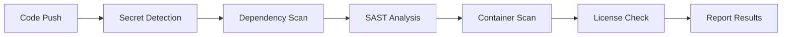

# How to Run Security Scanning with GitHub Actions

Author: [nawazdhandala](https://www.github.com/nawazdhandala)

Tags: GitHub Actions, Security, SAST, Dependency Scanning, Container Security, DevSecOps

Description: Integrate comprehensive security scanning into your GitHub Actions workflows, covering dependency vulnerabilities, static code analysis, container scanning, and secret detection with practical examples.

---

Security cannot be an afterthought. By integrating security scanning directly into your CI/CD pipeline, you catch vulnerabilities before they reach production. GitHub Actions makes it straightforward to add multiple layers of security checks.

## Security Scanning Overview

A comprehensive security pipeline includes these scan types:



## Dependency Vulnerability Scanning

Check your dependencies for known vulnerabilities. This catches issues in third-party packages before they become your problem.

```yaml
# .github/workflows/security.yml
name: Security Scanning

on:
  push:
    branches: [main]
  pull_request:
    branches: [main]
  schedule:
    # Run daily at 2 AM to catch new CVEs
    - cron: '0 2 * * *'

jobs:
  dependency-scan:
    runs-on: ubuntu-latest
    steps:
      - uses: actions/checkout@v4

      # npm audit for Node.js projects
      - name: Run npm audit
        run: |
          npm ci
          npm audit --audit-level=high
        continue-on-error: true  # Don't fail PR, report instead

      # Trivy for comprehensive dependency scanning
      - name: Run Trivy vulnerability scanner
        uses: aquasecurity/trivy-action@master
        with:
          scan-type: 'fs'  # Filesystem scan
          scan-ref: '.'
          vuln-type: 'library'
          severity: 'CRITICAL,HIGH'
          format: 'sarif'
          output: 'trivy-results.sarif'

      # Upload results to GitHub Security tab
      - name: Upload Trivy scan results
        uses: github/codeql-action/upload-sarif@v3
        with:
          sarif_file: 'trivy-results.sarif'
```

For Python projects, add pip-audit:

```yaml
      - name: Set up Python
        uses: actions/setup-python@v5
        with:
          python-version: '3.11'

      - name: Install and run pip-audit
        run: |
          pip install pip-audit
          pip install -r requirements.txt
          pip-audit --strict --vulnerability-service osv
```

## Static Application Security Testing (SAST)

Analyze your source code for security vulnerabilities, code smells, and potential bugs.

```yaml
  sast-scan:
    runs-on: ubuntu-latest
    permissions:
      security-events: write  # Required for uploading SARIF
      contents: read
    steps:
      - uses: actions/checkout@v4

      # CodeQL for deep semantic analysis
      - name: Initialize CodeQL
        uses: github/codeql-action/init@v3
        with:
          languages: javascript, python  # Add your languages
          queries: security-extended  # Include extended security queries

      - name: Autobuild
        uses: github/codeql-action/autobuild@v3

      - name: Perform CodeQL Analysis
        uses: github/codeql-action/analyze@v3
        with:
          category: "/language:javascript"
```

For faster SAST with Semgrep:

```yaml
      # Semgrep for pattern-based security scanning
      - name: Run Semgrep
        uses: returntocorp/semgrep-action@v1
        with:
          config: >-
            p/security-audit
            p/secrets
            p/owasp-top-ten
          generateSarif: true

      - name: Upload Semgrep results
        uses: github/codeql-action/upload-sarif@v3
        with:
          sarif_file: semgrep.sarif
```

## Secret Detection

Prevent secrets from being committed to your repository. This is critical for preventing credential leaks.

```yaml
  secret-scan:
    runs-on: ubuntu-latest
    steps:
      - uses: actions/checkout@v4
        with:
          fetch-depth: 0  # Full history for scanning all commits

      # Gitleaks for secret detection
      - name: Run Gitleaks
        uses: gitleaks/gitleaks-action@v2
        env:
          GITHUB_TOKEN: ${{ secrets.GITHUB_TOKEN }}

      # TruffleHog for deeper secret scanning
      - name: Run TruffleHog
        uses: trufflesecurity/trufflehog@main
        with:
          path: ./
          base: ${{ github.event.repository.default_branch }}
          head: HEAD
          extra_args: --only-verified
```

Configure Gitleaks to ignore false positives:

```toml
# .gitleaks.toml
title = "Gitleaks config"

[allowlist]
description = "Allowlisted patterns"
paths = [
    '''.*test.*''',
    '''.*fixture.*''',
]
regexes = [
    '''example\.com''',
    '''localhost''',
]
```

## Container Security Scanning

Scan your Docker images for vulnerabilities before pushing to registries.

```yaml
  container-scan:
    runs-on: ubuntu-latest
    steps:
      - uses: actions/checkout@v4

      - name: Build Docker image
        run: docker build -t myapp:${{ github.sha }} .

      # Trivy for container scanning
      - name: Scan container with Trivy
        uses: aquasecurity/trivy-action@master
        with:
          image-ref: 'myapp:${{ github.sha }}'
          format: 'sarif'
          output: 'trivy-container.sarif'
          severity: 'CRITICAL,HIGH'
          vuln-type: 'os,library'

      - name: Upload container scan results
        uses: github/codeql-action/upload-sarif@v3
        with:
          sarif_file: 'trivy-container.sarif'

      # Grype as an alternative scanner
      - name: Scan with Grype
        uses: anchore/scan-action@v3
        id: grype
        with:
          image: 'myapp:${{ github.sha }}'
          fail-build: true
          severity-cutoff: high

      - name: Upload Grype results
        uses: github/codeql-action/upload-sarif@v3
        with:
          sarif_file: ${{ steps.grype.outputs.sarif }}
```

## Infrastructure as Code Scanning

Scan your Terraform, CloudFormation, and Kubernetes manifests for misconfigurations.

```yaml
  iac-scan:
    runs-on: ubuntu-latest
    steps:
      - uses: actions/checkout@v4

      # Checkov for IaC scanning
      - name: Run Checkov
        uses: bridgecrewio/checkov-action@v12
        with:
          directory: infrastructure/
          framework: terraform,kubernetes
          output_format: sarif
          output_file_path: checkov-results.sarif
          soft_fail: true

      - name: Upload Checkov results
        uses: github/codeql-action/upload-sarif@v3
        with:
          sarif_file: checkov-results.sarif

      # tfsec for Terraform-specific scanning
      - name: Run tfsec
        uses: aquasecurity/tfsec-action@v1.0.3
        with:
          working_directory: infrastructure/terraform
          soft_fail: true
```

## License Compliance Scanning

Ensure your dependencies comply with your license policy.

```yaml
  license-scan:
    runs-on: ubuntu-latest
    steps:
      - uses: actions/checkout@v4

      # FOSSA for license analysis
      - name: Run FOSSA scan
        uses: fossas/fossa-action@main
        with:
          api-key: ${{ secrets.FOSSA_API_KEY }}

      - name: Run FOSSA test
        uses: fossas/fossa-action@main
        with:
          api-key: ${{ secrets.FOSSA_API_KEY }}
          run-tests: true
```

## Consolidated Security Report

Create a summary job that aggregates all security findings:

```yaml
  security-summary:
    needs: [dependency-scan, sast-scan, secret-scan, container-scan, iac-scan]
    runs-on: ubuntu-latest
    if: always()  # Run even if some scans fail
    steps:
      - name: Download all scan results
        uses: actions/download-artifact@v4
        with:
          path: scan-results

      - name: Generate security summary
        run: |
          echo "## Security Scan Summary" >> $GITHUB_STEP_SUMMARY
          echo "" >> $GITHUB_STEP_SUMMARY
          echo "| Scan Type | Status |" >> $GITHUB_STEP_SUMMARY
          echo "|-----------|--------|" >> $GITHUB_STEP_SUMMARY
          echo "| Dependencies | ${{ needs.dependency-scan.result }} |" >> $GITHUB_STEP_SUMMARY
          echo "| SAST | ${{ needs.sast-scan.result }} |" >> $GITHUB_STEP_SUMMARY
          echo "| Secrets | ${{ needs.secret-scan.result }} |" >> $GITHUB_STEP_SUMMARY
          echo "| Container | ${{ needs.container-scan.result }} |" >> $GITHUB_STEP_SUMMARY
          echo "| IaC | ${{ needs.iac-scan.result }} |" >> $GITHUB_STEP_SUMMARY

      - name: Fail if critical issues found
        if: |
          needs.secret-scan.result == 'failure' ||
          needs.sast-scan.result == 'failure'
        run: |
          echo "Critical security issues detected!"
          exit 1
```

## Scheduled Security Scans

Run comprehensive scans on a schedule to catch newly discovered vulnerabilities:

```yaml
name: Scheduled Security Scan

on:
  schedule:
    - cron: '0 6 * * 1'  # Every Monday at 6 AM

jobs:
  full-security-audit:
    runs-on: ubuntu-latest
    steps:
      - uses: actions/checkout@v4

      - name: Run comprehensive scan
        run: |
          # Run all security tools with verbose output
          npm audit --json > npm-audit.json || true
          trivy fs --format json --output trivy.json . || true

      - name: Create issue for vulnerabilities
        uses: actions/github-script@v7
        with:
          script: |
            const fs = require('fs');
            const auditResults = JSON.parse(fs.readFileSync('npm-audit.json'));
            if (auditResults.metadata.vulnerabilities.high > 0) {
              await github.rest.issues.create({
                owner: context.repo.owner,
                repo: context.repo.repo,
                title: 'Security vulnerabilities detected',
                body: `High severity vulnerabilities found in dependencies.`,
                labels: ['security', 'automated']
              });
            }
```

## Best Practices

1. **Fail fast on secrets** - Secret detection should always block merges. Leaked credentials cannot be undetected.

2. **Allow soft failures for dependencies** - New CVEs appear daily. Use warnings rather than blocking to avoid constant CI failures.

3. **Use SARIF format** - SARIF integrates with GitHub's security tab, giving you a unified view of all vulnerabilities.

4. **Schedule regular scans** - Daily or weekly scans catch new vulnerabilities in existing code.

5. **Tune your rules** - Every scanner has false positives. Maintain allowlists and configuration to reduce noise.

Security scanning in CI catches issues early when they are cheapest to fix. Make it part of every pull request.
