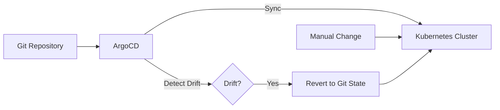

# How to Implement Self-Healing Applications in ArgoCD

Author: [nawazdhandala](https://www.github.com/nawazdhandala)

Tags: ArgoCD, Self-Healing, GitOps, Kubernetes, Automation, Drift Detection

Description: Learn how to configure ArgoCD self-healing to automatically detect and correct configuration drift, ensuring your cluster state always matches your Git repository declarations.

---

Someone ran kubectl apply directly on the cluster. Or edited a ConfigMap through the dashboard. Now your cluster does not match what is in Git. ArgoCD self-healing fixes this automatically by reverting unauthorized changes back to the Git-declared state.

## What Is Self-Healing?

Self-healing automatically corrects drift between your Git repository and the live cluster state:



When enabled, ArgoCD:
1. Continuously compares cluster state to Git
2. Detects any differences (drift)
3. Automatically applies Git state to fix drift
4. Logs the correction for audit purposes

## Enabling Self-Healing

Add `selfHeal: true` to your Application sync policy:

```yaml
apiVersion: argoproj.io/v1alpha1
kind: Application
metadata:
  name: myapp
  namespace: argocd
spec:
  project: default
  source:
    repoURL: https://github.com/myorg/myapp.git
    targetRevision: HEAD
    path: k8s
  destination:
    server: https://kubernetes.default.svc
    namespace: myapp
  syncPolicy:
    automated:
      # Enable automatic sync
      prune: true
      # Enable self-healing
      selfHeal: true
```

## Self-Healing Options

### Basic Configuration

```yaml
syncPolicy:
  automated:
    prune: true      # Delete resources not in Git
    selfHeal: true   # Revert manual changes
    allowEmpty: false # Prevent accidental deletion of all resources
```

### Sync Options

Fine-tune self-healing behavior:

```yaml
syncPolicy:
  automated:
    prune: true
    selfHeal: true
  syncOptions:
    # Validate resources against schema
    - Validate=true
    # Create namespace if missing
    - CreateNamespace=true
    # Apply resources using server-side apply
    - ServerSideApply=true
    # Prune resources after sync completes
    - PruneLast=true
    # Replace resources instead of patching
    - Replace=false
```

### Retry Configuration

Handle transient failures:

```yaml
syncPolicy:
  automated:
    selfHeal: true
  retry:
    limit: 5
    backoff:
      duration: 5s
      factor: 2
      maxDuration: 3m
```

## Understanding Drift Detection

ArgoCD compares resources using a three-way diff:

1. **Git state**: What should exist
2. **Live state**: What currently exists
3. **Last applied state**: What ArgoCD last applied

### What Triggers Self-Healing

```yaml
# Git declares 3 replicas
apiVersion: apps/v1
kind: Deployment
metadata:
  name: myapp
spec:
  replicas: 3
```

If someone runs:
```bash
# Manual scaling - this will be reverted
kubectl scale deployment myapp --replicas=5
```

ArgoCD detects the drift and reverts to 3 replicas.

### Ignoring Specific Fields

Some fields should not trigger self-healing:

```yaml
apiVersion: argoproj.io/v1alpha1
kind: Application
metadata:
  name: myapp
spec:
  ignoreDifferences:
    # Ignore HPA-managed replicas
    - group: apps
      kind: Deployment
      jsonPointers:
        - /spec/replicas
    # Ignore last-applied annotation
    - group: "*"
      kind: "*"
      managedFieldsManagers:
        - kube-controller-manager
```

### Common Fields to Ignore

```yaml
ignoreDifferences:
  # Ignore service cluster IP (auto-assigned)
  - group: ""
    kind: Service
    jsonPointers:
      - /spec/clusterIP
      - /spec/clusterIPs

  # Ignore webhook CA bundle (injected by cert-manager)
  - group: admissionregistration.k8s.io
    kind: MutatingWebhookConfiguration
    jsonPointers:
      - /webhooks/0/clientConfig/caBundle

  # Ignore status fields (managed by controllers)
  - group: "*"
    kind: "*"
    jsonPointers:
      - /status
```

## Self-Healing with HPA

Horizontal Pod Autoscaler manages replicas, so you should not self-heal replica count:

```yaml
apiVersion: argoproj.io/v1alpha1
kind: Application
metadata:
  name: myapp
spec:
  ignoreDifferences:
    - group: apps
      kind: Deployment
      name: myapp
      jsonPointers:
        - /spec/replicas
  syncPolicy:
    automated:
      selfHeal: true
```

Or remove replicas from your Git manifest entirely when using HPA:

```yaml
# deployment.yaml - no replicas specified
apiVersion: apps/v1
kind: Deployment
metadata:
  name: myapp
spec:
  # replicas: <omitted, managed by HPA>
  selector:
    matchLabels:
      app: myapp
  template:
    # ...
```

## Self-Healing with Operators

Operators often modify resources they manage. Configure ArgoCD to work with them:

```yaml
apiVersion: argoproj.io/v1alpha1
kind: Application
metadata:
  name: myapp
spec:
  ignoreDifferences:
    # Ignore fields managed by the operator
    - group: myoperator.io
      kind: MyResource
      jsonPointers:
        - /status
        - /metadata/annotations/operator.io~1last-reconciled
  syncPolicy:
    automated:
      selfHeal: true
```

## Monitoring Self-Healing

### View Sync History

```bash
# Check application sync history
argocd app history myapp

# Get detailed sync status
argocd app get myapp
```

### ArgoCD Metrics

Monitor self-healing with Prometheus:

```yaml
# Prometheus alert for frequent self-healing
groups:
  - name: argocd-self-healing
    rules:
      - alert: FrequentSelfHealing
        expr: |
          increase(argocd_app_sync_total{phase="Succeeded",dest_server=~".*"}[1h]) > 10
        for: 5m
        labels:
          severity: warning
        annotations:
          summary: "Application {{ $labels.name }} is self-healing frequently"
          description: "This may indicate someone is making manual changes"
```

### Notifications

Get notified when self-healing occurs:

```yaml
# argocd-notifications-cm
data:
  template.self-healed: |
    message: |
      Application {{.app.metadata.name}} was automatically synced due to drift detection.
    slack:
      attachments: |
        [{
          "color": "#FFA500",
          "fields": [
            {"title": "Application", "value": "{{.app.metadata.name}}", "short": true},
            {"title": "Sync Status", "value": "{{.app.status.sync.status}}", "short": true}
          ]
        }]

  trigger.on-self-healed: |
    - description: Application was self-healed
      send:
        - self-healed
      when: app.status.operationState.phase == 'Succeeded' and app.status.operationState.operation.initiatedBy.automated == true
```

## Selective Self-Healing

Enable self-healing only for specific environments:

```yaml
# Production with self-healing
apiVersion: argoproj.io/v1alpha1
kind: Application
metadata:
  name: myapp-production
spec:
  syncPolicy:
    automated:
      prune: true
      selfHeal: true

---
# Development without self-healing (allow experimentation)
apiVersion: argoproj.io/v1alpha1
kind: Application
metadata:
  name: myapp-development
spec:
  syncPolicy:
    automated:
      prune: true
      selfHeal: false
```

## Handling Emergencies

Sometimes you need to make manual changes during incidents:

### Temporary Disable

```bash
# Disable auto-sync temporarily
argocd app set myapp --sync-policy none

# Make emergency changes
kubectl apply -f emergency-fix.yaml

# Re-enable after incident
argocd app set myapp --sync-policy automated --self-heal
```

### Sync Window Exceptions

Define maintenance windows:

```yaml
apiVersion: argoproj.io/v1alpha1
kind: AppProject
metadata:
  name: production
spec:
  syncWindows:
    # Block auto-sync during business hours
    - kind: deny
      schedule: '0 9 * * 1-5'
      duration: 8h
      applications:
        - '*'
    # Allow manual sync anytime
    - kind: allow
      schedule: '* * * * *'
      duration: 24h
      manualSync: true
```

## Best Practices

### Start with Monitoring

Before enabling self-healing, monitor drift:

```bash
# Check for drift without fixing it
argocd app diff myapp
```

### Use Version Control for Emergencies

Instead of manual kubectl:

```bash
# Create a hotfix branch
git checkout -b hotfix/incident-123
# Make changes
git commit -m "Emergency fix for incident 123"
git push

# Point ArgoCD to the hotfix branch
argocd app set myapp --revision hotfix/incident-123
```

### Document Ignored Differences

```yaml
apiVersion: argoproj.io/v1alpha1
kind: Application
metadata:
  name: myapp
  annotations:
    # Document why fields are ignored
    argocd.io/ignore-differences-reason: |
      /spec/replicas: Managed by HPA
      /metadata/annotations/checksum: Generated by Helm
spec:
  ignoreDifferences:
    - group: apps
      kind: Deployment
      jsonPointers:
        - /spec/replicas
        - /metadata/annotations/checksum
```

### Test Self-Healing Behavior

```bash
# Intentionally create drift
kubectl scale deployment myapp --replicas=10

# Watch ArgoCD correct it
argocd app get myapp --watch

# Verify it was corrected
kubectl get deployment myapp -o jsonpath='{.spec.replicas}'
```

## Troubleshooting

### Self-Healing Not Working

```bash
# Check sync policy
argocd app get myapp -o yaml | grep -A 10 syncPolicy

# Check for errors
argocd app sync myapp --dry-run
```

### Constant Drift Detection

```bash
# See what is different
argocd app diff myapp

# Add to ignoreDifferences if legitimate
```

### Resources Being Deleted Unexpectedly

```bash
# Check prune settings
argocd app get myapp -o yaml | grep prune

# Verify resource is in Git
ls k8s/
```

Self-healing is the enforcement mechanism for GitOps. It ensures that Git remains the single source of truth, not just in theory but in practice. Enable it on production applications, monitor for frequent corrections, and investigate when they occur. That investigation often reveals either a process problem or a need to update your ignoreDifferences configuration.
