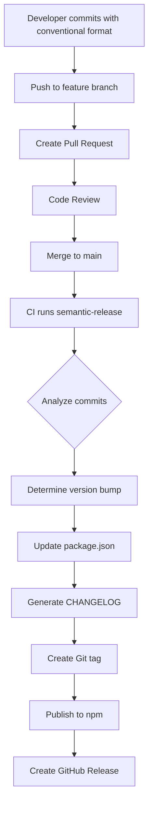

# How to Implement Semantic Versioning Automation

Author: [nawazdhandala](https://www.github.com/nawazdhandala)

Tags: Semantic Versioning, CI/CD, Release Management, Git, Developer Experience

Description: Learn how to automate semantic versioning in your projects using conventional commits and tools like semantic-release, ensuring consistent version numbers without manual intervention.

---

Version numbers matter. They communicate compatibility expectations to users and enable package managers to resolve dependencies correctly. Semantic Versioning (SemVer) provides a clear framework: MAJOR.MINOR.PATCH, where MAJOR indicates breaking changes, MINOR adds functionality, and PATCH fixes bugs. This guide shows you how to automate versioning so you never manually bump a version number again.

## Understanding Semantic Versioning

SemVer version numbers follow the pattern `MAJOR.MINOR.PATCH`:

- **MAJOR** (1.0.0 to 2.0.0): Breaking changes that require users to update their code
- **MINOR** (1.0.0 to 1.1.0): New features that are backward compatible
- **PATCH** (1.0.0 to 1.0.1): Bug fixes that are backward compatible

Pre-release versions add suffixes: `1.0.0-alpha.1`, `1.0.0-beta.2`, `1.0.0-rc.1`.

The challenge is determining which type of bump each release needs. Automated tools solve this by analyzing commit messages.

## Setting Up semantic-release

semantic-release automates the entire release process based on commit messages. It determines the version bump, generates changelogs, creates Git tags, and publishes packages.

Install the tool:

```bash
# Install semantic-release and plugins
npm install --save-dev semantic-release \
  @semantic-release/git \
  @semantic-release/changelog \
  @semantic-release/commit-analyzer \
  @semantic-release/release-notes-generator \
  @semantic-release/npm \
  @semantic-release/github
```

Create a configuration file:

```json
{
  "branches": ["main"],
  "plugins": [
    ["@semantic-release/commit-analyzer", {
      "preset": "conventionalcommits",
      "releaseRules": [
        {"type": "feat", "release": "minor"},
        {"type": "fix", "release": "patch"},
        {"type": "perf", "release": "patch"},
        {"type": "revert", "release": "patch"},
        {"type": "docs", "release": false},
        {"type": "style", "release": false},
        {"type": "refactor", "release": false},
        {"type": "test", "release": false},
        {"type": "build", "release": false},
        {"type": "ci", "release": false},
        {"breaking": true, "release": "major"}
      ]
    }],
    "@semantic-release/release-notes-generator",
    ["@semantic-release/changelog", {
      "changelogFile": "CHANGELOG.md"
    }],
    ["@semantic-release/npm", {
      "npmPublish": true
    }],
    ["@semantic-release/git", {
      "assets": ["CHANGELOG.md", "package.json"],
      "message": "chore(release): ${nextRelease.version} [skip ci]\n\n${nextRelease.notes}"
    }],
    "@semantic-release/github"
  ]
}
```

## Commit Message Format

semantic-release uses commit messages to determine version bumps. Follow the Conventional Commits specification:

```
<type>(<scope>): <description>

[optional body]

[optional footer(s)]
```

Examples:

```bash
# Patch release (1.0.0 -> 1.0.1)
git commit -m "fix: resolve null pointer in user service"

# Minor release (1.0.0 -> 1.1.0)
git commit -m "feat: add user profile picture upload"

# Major release (1.0.0 -> 2.0.0)
git commit -m "feat!: change authentication API response format

BREAKING CHANGE: The /auth/login endpoint now returns a different JSON structure.
See migration guide at docs/migration-v2.md"

# No release (docs, refactor, etc.)
git commit -m "docs: update API documentation"
git commit -m "refactor: extract validation logic to separate module"
```

## CI/CD Integration

Configure GitHub Actions to run releases:

```yaml
# .github/workflows/release.yml
name: Release

on:
  push:
    branches: [main]

permissions:
  contents: write
  issues: write
  pull-requests: write
  packages: write

jobs:
  release:
    runs-on: ubuntu-latest
    steps:
      - name: Checkout
        uses: actions/checkout@v4
        with:
          fetch-depth: 0
          persist-credentials: false

      - name: Setup Node.js
        uses: actions/setup-node@v4
        with:
          node-version: 20
          registry-url: 'https://registry.npmjs.org'

      - name: Install dependencies
        run: npm ci

      - name: Run tests
        run: npm test

      - name: Release
        env:
          GITHUB_TOKEN: ${{ secrets.GITHUB_TOKEN }}
          NPM_TOKEN: ${{ secrets.NPM_TOKEN }}
        run: npx semantic-release
```

## Multi-Branch Releases

Support multiple release channels for different stability levels:

```javascript
// release.config.js
module.exports = {
  branches: [
    // Production releases from main
    'main',
    // Pre-release channel from next branch
    {
      name: 'next',
      prerelease: true
    },
    // Beta releases
    {
      name: 'beta',
      prerelease: true
    },
    // Maintenance branches for older versions
    {
      name: '1.x',
      range: '1.x',
      channel: '1.x'
    }
  ],
  plugins: [
    '@semantic-release/commit-analyzer',
    '@semantic-release/release-notes-generator',
    '@semantic-release/npm',
    '@semantic-release/github'
  ]
};
```

This configuration enables:

- `main` branch: stable releases (1.0.0, 1.1.0, 2.0.0)
- `next` branch: pre-releases (2.0.0-next.1)
- `beta` branch: beta releases (2.0.0-beta.1)
- `1.x` branch: patch releases for v1 (1.0.1, 1.0.2)

## Monorepo Support

For monorepos with multiple packages, use semantic-release-monorepo or release-please:

```javascript
// Using semantic-release with workspaces
// packages/api/release.config.js
module.exports = {
  extends: 'semantic-release-monorepo',
  branches: ['main'],
  plugins: [
    '@semantic-release/commit-analyzer',
    '@semantic-release/release-notes-generator',
    ['@semantic-release/npm', {
      pkgRoot: '.'
    }],
    '@semantic-release/github'
  ]
};
```

Alternative: Google's release-please for monorepos:

```yaml
# .github/workflows/release-please.yml
name: Release Please

on:
  push:
    branches: [main]

permissions:
  contents: write
  pull-requests: write

jobs:
  release-please:
    runs-on: ubuntu-latest
    steps:
      - uses: google-github-actions/release-please-action@v4
        with:
          # Configure for monorepo
          config-file: release-please-config.json
          manifest-file: .release-please-manifest.json
```

Configuration for release-please:

```json
{
  "packages": {
    "packages/api": {
      "release-type": "node",
      "bump-minor-pre-major": true
    },
    "packages/client": {
      "release-type": "node",
      "bump-minor-pre-major": true
    },
    "packages/shared": {
      "release-type": "node",
      "bump-minor-pre-major": true
    }
  }
}
```

## Changelog Generation

Automatically generate changelogs from commit messages:

```javascript
// release.config.js with enhanced changelog
module.exports = {
  plugins: [
    ['@semantic-release/commit-analyzer', {
      preset: 'conventionalcommits'
    }],
    ['@semantic-release/release-notes-generator', {
      preset: 'conventionalcommits',
      presetConfig: {
        types: [
          { type: 'feat', section: 'Features' },
          { type: 'fix', section: 'Bug Fixes' },
          { type: 'perf', section: 'Performance' },
          { type: 'revert', section: 'Reverts' },
          { type: 'docs', section: 'Documentation', hidden: false },
          { type: 'style', section: 'Styles', hidden: true },
          { type: 'refactor', section: 'Code Refactoring', hidden: true },
          { type: 'test', section: 'Tests', hidden: true },
          { type: 'build', section: 'Build System', hidden: true },
          { type: 'ci', section: 'CI/CD', hidden: true }
        ]
      }
    }],
    ['@semantic-release/changelog', {
      changelogFile: 'CHANGELOG.md',
      changelogTitle: '# Changelog\n\nAll notable changes to this project will be documented in this file.'
    }],
    '@semantic-release/npm',
    ['@semantic-release/git', {
      assets: ['CHANGELOG.md', 'package.json', 'package-lock.json']
    }],
    '@semantic-release/github'
  ]
};
```

Generated changelog example:

```markdown
# Changelog

## [2.1.0](https://github.com/org/repo/compare/v2.0.0...v2.1.0) (2026-01-25)

### Features

* add user profile picture upload ([abc1234](https://github.com/org/repo/commit/abc1234))
* implement email notifications for password changes ([def5678](https://github.com/org/repo/commit/def5678))

### Bug Fixes

* resolve null pointer in user service ([ghi9012](https://github.com/org/repo/commit/ghi9012))
* fix timezone handling in scheduled jobs ([jkl3456](https://github.com/org/repo/commit/jkl3456))
```

## Release Process Flow

Here is how automated versioning fits into development:



## Python Projects with commitizen

For Python projects, use commitizen:

```bash
# Install commitizen
pip install commitizen

# Initialize configuration
cz init
```

Configure in `pyproject.toml`:

```toml
[tool.commitizen]
name = "cz_conventional_commits"
version = "1.0.0"
version_files = [
    "src/__init__.py:__version__",
    "pyproject.toml:version"
]
tag_format = "v$version"
update_changelog_on_bump = true
changelog_incremental = true

[tool.commitizen.customize]
bump_pattern = "^(feat|fix|perf|refactor)(!)?:"
bump_map = {"feat" = "MINOR", "fix" = "PATCH", "perf" = "PATCH", "refactor" = "PATCH"}
```

Bump versions:

```bash
# Determine and apply version bump
cz bump

# Preview what would happen
cz bump --dry-run

# Generate changelog
cz changelog
```

## Best Practices

1. **Enforce commit format**: Use commitlint to reject non-conforming commits. This ensures semantic-release can always determine the correct version.

2. **Start at 0.x.x for new projects**: Before your first stable release, use 0.x.x versions. Breaking changes bump the minor version (0.1.0 to 0.2.0).

3. **Document breaking changes**: Include migration guides in commit footers or link to documentation.

4. **Test release process**: Run `semantic-release --dry-run` locally to verify configuration before merging.

5. **Keep CI tokens secure**: NPM_TOKEN and GITHUB_TOKEN are sensitive. Use repository secrets, never commit them.

Automated semantic versioning removes human error from the release process. Developers focus on writing meaningful commit messages, and the tooling handles everything else: calculating versions, generating changelogs, and publishing packages. Your users always know what to expect from each release.
