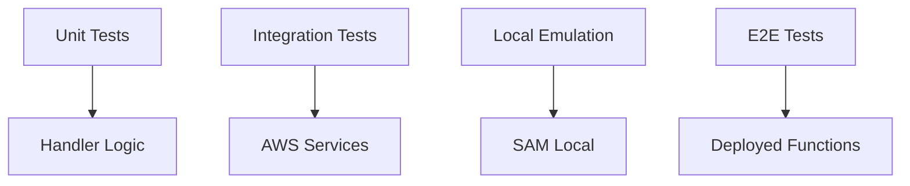

# How to Configure Serverless Function Testing

Author: [nawazdhandala](https://github.com/nawazdhandala)

Tags: Serverless, AWS Lambda, Testing, Integration Testing, DevOps

Description: Learn to test serverless functions effectively, including local testing, event simulation, cold start analysis, and integration testing with cloud services.

---

Serverless functions present unique testing challenges. Functions are stateless, event-driven, and run in environments you do not control. Cold starts affect performance, and testing cloud integrations requires special handling. This guide covers testing strategies for AWS Lambda and similar serverless platforms.

## Serverless Testing Layers



## Project Structure

Organize code for testability:

```
serverless-app/
    src/
        handlers/
            createOrder.ts
            getOrder.ts
        services/
            orderService.ts
            paymentService.ts
        utils/
            validation.ts
    tests/
        unit/
            handlers/
            services/
        integration/
        e2e/
    events/
        createOrder.json
        getOrder.json
    template.yaml
```

## Unit Testing Lambda Handlers

Test handler functions in isolation:

```typescript
// src/handlers/createOrder.ts
import { APIGatewayProxyEvent, APIGatewayProxyResult } from 'aws-lambda';
import { OrderService } from '../services/orderService';
import { validateOrder } from '../utils/validation';

// Dependencies injected for testability
export const createHandler = (orderService: OrderService) => {
    return async (event: APIGatewayProxyEvent): Promise<APIGatewayProxyResult> => {
        try {
            // Parse request body
            const body = JSON.parse(event.body || '{}');

            // Validate input
            const validationErrors = validateOrder(body);
            if (validationErrors.length > 0) {
                return {
                    statusCode: 400,
                    body: JSON.stringify({ errors: validationErrors }),
                };
            }

            // Get user ID from authorizer
            const userId = event.requestContext.authorizer?.userId;
            if (!userId) {
                return {
                    statusCode: 401,
                    body: JSON.stringify({ error: 'Unauthorized' }),
                };
            }

            // Create order
            const order = await orderService.create({
                userId,
                items: body.items,
                shippingAddress: body.shippingAddress,
            });

            return {
                statusCode: 201,
                headers: {
                    'Content-Type': 'application/json',
                },
                body: JSON.stringify(order),
            };
        } catch (error: any) {
            console.error('Error creating order:', error);

            return {
                statusCode: 500,
                body: JSON.stringify({ error: 'Internal server error' }),
            };
        }
    };
};

// Default export with real dependencies
import { DynamoDBOrderService } from '../services/dynamoDBOrderService';
export const handler = createHandler(new DynamoDBOrderService());
```

Unit tests for the handler:

```typescript
// tests/unit/handlers/createOrder.test.ts
import { APIGatewayProxyEvent, Context } from 'aws-lambda';
import { createHandler } from '../../../src/handlers/createOrder';
import { OrderService } from '../../../src/services/orderService';

// Mock order service
const mockOrderService: jest.Mocked<OrderService> = {
    create: jest.fn(),
    get: jest.fn(),
    update: jest.fn(),
    delete: jest.fn(),
};

const handler = createHandler(mockOrderService);

// Helper to create mock API Gateway events
function createMockEvent(overrides: Partial<APIGatewayProxyEvent> = {}): APIGatewayProxyEvent {
    return {
        body: null,
        headers: {},
        multiValueHeaders: {},
        httpMethod: 'POST',
        isBase64Encoded: false,
        path: '/orders',
        pathParameters: null,
        queryStringParameters: null,
        multiValueQueryStringParameters: null,
        stageVariables: null,
        requestContext: {
            authorizer: { userId: 'user-123' },
            accountId: '123456789',
            apiId: 'api-id',
            httpMethod: 'POST',
            identity: {} as any,
            path: '/orders',
            protocol: 'HTTP/1.1',
            requestId: 'request-id',
            requestTimeEpoch: Date.now(),
            resourceId: 'resource-id',
            resourcePath: '/orders',
            stage: 'test',
        },
        resource: '/orders',
        ...overrides,
    };
}

describe('createOrder handler', () => {
    beforeEach(() => {
        jest.clearAllMocks();
    });

    test('creates order successfully', async () => {
        const orderData = {
            items: [{ productId: 'prod-1', quantity: 2 }],
            shippingAddress: { street: '123 Main St', city: 'Test City' },
        };

        mockOrderService.create.mockResolvedValue({
            id: 'order-123',
            userId: 'user-123',
            status: 'PENDING',
            ...orderData,
        });

        const event = createMockEvent({
            body: JSON.stringify(orderData),
        });

        const result = await handler(event, {} as Context, () => {});

        expect(result.statusCode).toBe(201);
        expect(mockOrderService.create).toHaveBeenCalledWith({
            userId: 'user-123',
            items: orderData.items,
            shippingAddress: orderData.shippingAddress,
        });

        const responseBody = JSON.parse(result.body);
        expect(responseBody.id).toBe('order-123');
    });

    test('returns 400 for invalid input', async () => {
        const event = createMockEvent({
            body: JSON.stringify({ items: [] }), // Empty items should fail validation
        });

        const result = await handler(event, {} as Context, () => {});

        expect(result.statusCode).toBe(400);
        expect(mockOrderService.create).not.toHaveBeenCalled();
    });

    test('returns 401 without user context', async () => {
        const event = createMockEvent({
            body: JSON.stringify({ items: [{ productId: 'prod-1', quantity: 1 }] }),
            requestContext: {
                ...createMockEvent().requestContext,
                authorizer: null,
            },
        });

        const result = await handler(event, {} as Context, () => {});

        expect(result.statusCode).toBe(401);
    });

    test('returns 500 on service error', async () => {
        mockOrderService.create.mockRejectedValue(new Error('Database error'));

        const event = createMockEvent({
            body: JSON.stringify({
                items: [{ productId: 'prod-1', quantity: 1 }],
                shippingAddress: { street: '123 Main St', city: 'Test City' },
            }),
        });

        const result = await handler(event, {} as Context, () => {});

        expect(result.statusCode).toBe(500);
    });
});
```

## Local Testing with SAM

Use AWS SAM for local Lambda testing:

```yaml
# template.yaml
AWSTemplateFormatVersion: '2010-09-09'
Transform: AWS::Serverless-2016-10-31

Globals:
  Function:
    Timeout: 30
    Runtime: nodejs18.x
    MemorySize: 256

Resources:
  CreateOrderFunction:
    Type: AWS::Serverless::Function
    Properties:
      CodeUri: dist/
      Handler: handlers/createOrder.handler
      Events:
        CreateOrder:
          Type: Api
          Properties:
            Path: /orders
            Method: post
      Environment:
        Variables:
          ORDERS_TABLE: !Ref OrdersTable
      Policies:
        - DynamoDBCrudPolicy:
            TableName: !Ref OrdersTable

  OrdersTable:
    Type: AWS::DynamoDB::Table
    Properties:
      TableName: orders
      AttributeDefinitions:
        - AttributeName: id
          AttributeType: S
      KeySchema:
        - AttributeName: id
          KeyType: HASH
      BillingMode: PAY_PER_REQUEST
```

Test events for SAM:

```json
// events/createOrder.json
{
    "body": "{\"items\": [{\"productId\": \"prod-1\", \"quantity\": 2}], \"shippingAddress\": {\"street\": \"123 Main St\", \"city\": \"Test City\"}}",
    "httpMethod": "POST",
    "path": "/orders",
    "requestContext": {
        "authorizer": {
            "userId": "user-123"
        }
    }
}
```

Run local tests:

```bash
# Start local API
sam local start-api

# Invoke function directly
sam local invoke CreateOrderFunction --event events/createOrder.json

# Run with DynamoDB Local
docker run -d -p 8000:8000 amazon/dynamodb-local
sam local start-api --docker-network host
```

## Integration Testing with AWS Services

Test against real AWS services:

```typescript
// tests/integration/orderService.test.ts
import { DynamoDBClient } from '@aws-sdk/client-dynamodb';
import { DynamoDBDocumentClient, DeleteCommand, ScanCommand } from '@aws-sdk/lib-dynamodb';
import { DynamoDBOrderService } from '../../src/services/dynamoDBOrderService';

describe('OrderService Integration', () => {
    let orderService: DynamoDBOrderService;
    let docClient: DynamoDBDocumentClient;
    const tableName = process.env.TEST_ORDERS_TABLE || 'orders-test';

    beforeAll(() => {
        const client = new DynamoDBClient({
            endpoint: process.env.DYNAMODB_ENDPOINT || 'http://localhost:8000',
            region: 'us-east-1',
            credentials: {
                accessKeyId: 'test',
                secretAccessKey: 'test',
            },
        });

        docClient = DynamoDBDocumentClient.from(client);
        orderService = new DynamoDBOrderService(docClient, tableName);
    });

    afterEach(async () => {
        // Clean up test data
        const scanResult = await docClient.send(new ScanCommand({
            TableName: tableName,
        }));

        for (const item of scanResult.Items || []) {
            await docClient.send(new DeleteCommand({
                TableName: tableName,
                Key: { id: item.id },
            }));
        }
    });

    test('creates and retrieves order', async () => {
        const orderData = {
            userId: 'user-123',
            items: [{ productId: 'prod-1', quantity: 2, price: 29.99 }],
            shippingAddress: { street: '123 Main St', city: 'Test City' },
        };

        const created = await orderService.create(orderData);

        expect(created.id).toBeDefined();
        expect(created.userId).toBe('user-123');
        expect(created.status).toBe('PENDING');

        // Retrieve and verify
        const retrieved = await orderService.get(created.id);

        expect(retrieved).toBeDefined();
        expect(retrieved?.items).toHaveLength(1);
    });

    test('updates order status', async () => {
        const order = await orderService.create({
            userId: 'user-456',
            items: [{ productId: 'prod-2', quantity: 1, price: 49.99 }],
            shippingAddress: { street: '456 Oak Ave', city: 'Test Town' },
        });

        await orderService.update(order.id, { status: 'PROCESSING' });

        const updated = await orderService.get(order.id);
        expect(updated?.status).toBe('PROCESSING');
    });
});
```

## Cold Start Testing

Measure and test cold start performance:

```typescript
// tests/performance/coldStart.test.ts
import { LambdaClient, InvokeCommand } from '@aws-sdk/client-lambda';

describe('Cold Start Performance', () => {
    const lambda = new LambdaClient({ region: 'us-east-1' });
    const functionName = process.env.LAMBDA_FUNCTION_NAME || 'CreateOrderFunction';

    // Force cold start by updating config
    async function forceColdStart(): Promise<void> {
        // Updating environment variable forces new container
        const { LambdaClient, UpdateFunctionConfigurationCommand } = await import('@aws-sdk/client-lambda');
        const client = new LambdaClient({ region: 'us-east-1' });

        await client.send(new UpdateFunctionConfigurationCommand({
            FunctionName: functionName,
            Environment: {
                Variables: {
                    COLD_START_TRIGGER: Date.now().toString(),
                },
            },
        }));

        // Wait for update to complete
        await new Promise(r => setTimeout(r, 5000));
    }

    test('cold start completes within SLA', async () => {
        await forceColdStart();

        const start = Date.now();

        const response = await lambda.send(new InvokeCommand({
            FunctionName: functionName,
            Payload: JSON.stringify({
                body: JSON.stringify({
                    items: [{ productId: 'prod-1', quantity: 1 }],
                    shippingAddress: { street: '123 Main St', city: 'Test' },
                }),
                requestContext: { authorizer: { userId: 'user-123' } },
            }),
        }));

        const duration = Date.now() - start;

        console.log(`Cold start duration: ${duration}ms`);

        // Cold start should complete within 3 seconds
        expect(duration).toBeLessThan(3000);

        // Function should succeed
        const payload = JSON.parse(new TextDecoder().decode(response.Payload));
        expect(payload.statusCode).toBe(201);
    }, 30000);

    test('warm invocation is fast', async () => {
        // First call might be cold
        await lambda.send(new InvokeCommand({
            FunctionName: functionName,
            Payload: JSON.stringify({
                body: '{}',
                requestContext: { authorizer: { userId: 'user-123' } },
            }),
        }));

        // Measure warm invocation
        const durations: number[] = [];

        for (let i = 0; i < 10; i++) {
            const start = Date.now();

            await lambda.send(new InvokeCommand({
                FunctionName: functionName,
                Payload: JSON.stringify({
                    body: JSON.stringify({
                        items: [{ productId: 'prod-1', quantity: 1 }],
                        shippingAddress: { street: '123 Main St', city: 'Test' },
                    }),
                    requestContext: { authorizer: { userId: 'user-123' } },
                }),
            }));

            durations.push(Date.now() - start);
        }

        const avgDuration = durations.reduce((a, b) => a + b) / durations.length;
        console.log(`Average warm duration: ${avgDuration.toFixed(0)}ms`);

        // Warm invocations should be under 500ms
        expect(avgDuration).toBeLessThan(500);
    }, 60000);
});
```

## Event Source Testing

Test Lambda event sources:

```typescript
// tests/integration/eventSources.test.ts
import { SQSClient, SendMessageCommand, ReceiveMessageCommand } from '@aws-sdk/client-sqs';
import { S3Client, PutObjectCommand } from '@aws-sdk/client-s3';

describe('Event Source Integration', () => {
    describe('SQS Trigger', () => {
        const sqs = new SQSClient({ region: 'us-east-1' });
        const queueUrl = process.env.TEST_QUEUE_URL!;

        test('processes SQS message', async () => {
            // Send message to queue
            await sqs.send(new SendMessageCommand({
                QueueUrl: queueUrl,
                MessageBody: JSON.stringify({
                    orderId: 'order-123',
                    action: 'process',
                }),
            }));

            // Wait for Lambda to process (check DLQ or result)
            await new Promise(r => setTimeout(r, 5000));

            // Verify processing (check database, logs, etc.)
            // This depends on your Lambda's behavior
        });
    });

    describe('S3 Trigger', () => {
        const s3 = new S3Client({ region: 'us-east-1' });
        const bucketName = process.env.TEST_BUCKET!;

        test('processes S3 upload', async () => {
            const key = `test-uploads/${Date.now()}.json`;

            // Upload file to trigger Lambda
            await s3.send(new PutObjectCommand({
                Bucket: bucketName,
                Key: key,
                Body: JSON.stringify({ data: 'test content' }),
                ContentType: 'application/json',
            }));

            // Wait for Lambda processing
            await new Promise(r => setTimeout(r, 5000));

            // Verify Lambda processed the file
            // Check processed output location, database, etc.
        });
    });
});
```

## CI/CD Pipeline

```yaml
# .github/workflows/serverless-tests.yaml
name: Serverless Tests

on: [push, pull_request]

jobs:
  unit-tests:
    runs-on: ubuntu-latest
    steps:
      - uses: actions/checkout@v4

      - name: Setup Node.js
        uses: actions/setup-node@v4
        with:
          node-version: '18'

      - name: Install dependencies
        run: npm ci

      - name: Run unit tests
        run: npm test -- --testPathPattern=unit

  integration-tests:
    runs-on: ubuntu-latest
    needs: unit-tests
    services:
      dynamodb:
        image: amazon/dynamodb-local
        ports:
          - 8000:8000

    steps:
      - uses: actions/checkout@v4

      - name: Setup Node.js
        uses: actions/setup-node@v4
        with:
          node-version: '18'

      - name: Install dependencies
        run: npm ci

      - name: Create test table
        run: |
          aws dynamodb create-table \
            --endpoint-url http://localhost:8000 \
            --table-name orders-test \
            --attribute-definitions AttributeName=id,AttributeType=S \
            --key-schema AttributeName=KeyType=HASH \
            --billing-mode PAY_PER_REQUEST
        env:
          AWS_ACCESS_KEY_ID: test
          AWS_SECRET_ACCESS_KEY: test
          AWS_DEFAULT_REGION: us-east-1

      - name: Run integration tests
        run: npm test -- --testPathPattern=integration
        env:
          DYNAMODB_ENDPOINT: http://localhost:8000
          TEST_ORDERS_TABLE: orders-test
```

## Summary

| Test Type | Tools | When to Use |
|-----------|-------|-------------|
| **Unit tests** | Jest, mock dependencies | Every change |
| **Local tests** | SAM CLI, LocalStack | Development |
| **Integration tests** | Real AWS services | Pre-deployment |
| **Cold start tests** | Lambda invocation | Performance monitoring |

Serverless testing requires separating business logic from AWS SDK calls for unit testing, while integration tests verify actual cloud service behavior. Test cold starts separately as they significantly impact user experience.
