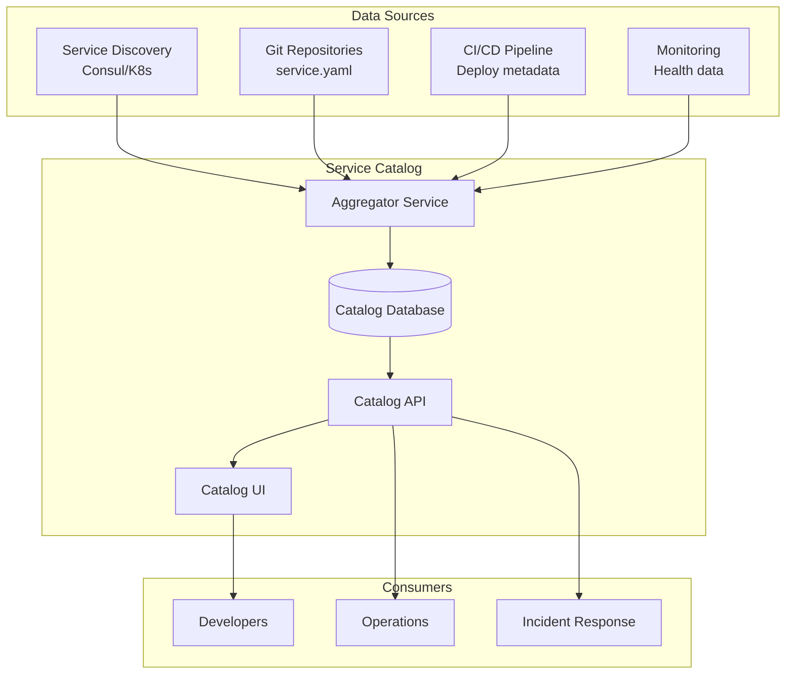

# How to Implement Service Catalog Management

Author: [nawazdhandala](https://www.github.com/nawazdhandala)

Tags: Service Catalog, Service Discovery, Microservices, API Management, DevOps, Governance

Description: Learn how to build and maintain a service catalog for your microservices architecture. This guide covers service registration, metadata management, and building a comprehensive view of your service landscape.

---

> A service catalog provides a centralized inventory of all services in your organization. It goes beyond service discovery to include ownership, documentation, dependencies, and operational metadata that helps teams understand and manage their service ecosystem.

As organizations grow, tracking services becomes challenging. A service catalog answers questions like "Who owns this service?", "What does it depend on?", and "How do I contact the team if there's an issue?"

---

## Prerequisites

Before we begin, ensure you have:
- Service discovery system (Consul, Kubernetes, or similar)
- Multiple services to catalog
- Understanding of your organization's service ownership model

---

## Service Catalog Components

A comprehensive service catalog includes:

1. **Service Identity** - Name, version, description
2. **Ownership** - Team, contacts, escalation paths
3. **Technical Details** - Endpoints, protocols, dependencies
4. **Operational Info** - SLAs, runbooks, dashboards
5. **Documentation** - API specs, architecture diagrams

---

## Catalog Architecture



---

## Service Definition Schema

Define a standard schema for service metadata:

```yaml
# service-catalog-schema.yaml
type: object
required:
  - name
  - team
  - tier
properties:
  name:
    type: string
    description: Unique service identifier
  displayName:
    type: string
    description: Human-readable name
  description:
    type: string
    description: What this service does
  team:
    type: string
    description: Owning team name
  contacts:
    type: object
    properties:
      email:
        type: string
      slack:
        type: string
      pagerduty:
        type: string
  tier:
    type: string
    enum: [critical, standard, experimental]
    description: Service criticality level
  lifecycle:
    type: string
    enum: [development, staging, production, deprecated]
  dependencies:
    type: array
    items:
      type: string
    description: Services this depends on
  dependents:
    type: array
    items:
      type: string
    description: Services that depend on this
  endpoints:
    type: array
    items:
      type: object
      properties:
        name:
          type: string
        url:
          type: string
        type:
          enum: [http, grpc, graphql]
  documentation:
    type: object
    properties:
      readme:
        type: string
      api_spec:
        type: string
      runbook:
        type: string
      architecture:
        type: string
  sla:
    type: object
    properties:
      availability:
        type: string
      latency_p99:
        type: string
      error_budget:
        type: string
```

---

## Service Definition File

Each service maintains a definition file in its repository:

```yaml
# service.yaml in each service repository
apiVersion: catalog/v1
kind: Service
metadata:
  name: order-service
  displayName: Order Service
  description: Handles order creation, updates, and fulfillment tracking
spec:
  team: commerce-platform
  contacts:
    email: commerce-platform@company.com
    slack: "#commerce-platform"
    pagerduty: commerce-platform-pd
  tier: critical
  lifecycle: production

  endpoints:
    - name: api
      url: https://order-service.internal/
      type: http
    - name: grpc
      url: grpc://order-service.internal:9090
      type: grpc

  dependencies:
    - inventory-service
    - payment-service
    - notification-service

  documentation:
    readme: https://github.com/company/order-service/README.md
    api_spec: https://github.com/company/order-service/api/openapi.yaml
    runbook: https://wiki.company.com/order-service-runbook
    architecture: https://wiki.company.com/order-service-architecture

  sla:
    availability: "99.9%"
    latency_p99: "500ms"
    error_budget: "0.1%"

  tags:
    - commerce
    - orders
    - critical-path
```

---

## Catalog API Implementation (Go)

```go
package main

import (
    "encoding/json"
    "net/http"
    "sync"

    "github.com/gorilla/mux"
)

// Service represents a service in the catalog
type Service struct {
    Name         string            `json:"name"`
    DisplayName  string            `json:"displayName"`
    Description  string            `json:"description"`
    Team         string            `json:"team"`
    Tier         string            `json:"tier"`
    Lifecycle    string            `json:"lifecycle"`
    Contacts     Contacts          `json:"contacts"`
    Endpoints    []Endpoint        `json:"endpoints"`
    Dependencies []string          `json:"dependencies"`
    Dependents   []string          `json:"dependents"`
    Documentation Documentation    `json:"documentation"`
    SLA          SLA               `json:"sla"`
    Tags         []string          `json:"tags"`
    Metadata     map[string]string `json:"metadata"`
    Health       HealthStatus      `json:"health"`
    LastUpdated  string            `json:"lastUpdated"`
}

type Contacts struct {
    Email     string `json:"email"`
    Slack     string `json:"slack"`
    PagerDuty string `json:"pagerduty"`
}

type Endpoint struct {
    Name string `json:"name"`
    URL  string `json:"url"`
    Type string `json:"type"`
}

type Documentation struct {
    Readme       string `json:"readme"`
    APISpec      string `json:"api_spec"`
    Runbook      string `json:"runbook"`
    Architecture string `json:"architecture"`
}

type SLA struct {
    Availability string `json:"availability"`
    LatencyP99   string `json:"latency_p99"`
    ErrorBudget  string `json:"error_budget"`
}

type HealthStatus struct {
    Status    string `json:"status"`
    LastCheck string `json:"lastCheck"`
    Details   string `json:"details"`
}

// ServiceCatalog manages the service inventory
type ServiceCatalog struct {
    services map[string]*Service
    mu       sync.RWMutex
}

// NewServiceCatalog creates a new catalog
func NewServiceCatalog() *ServiceCatalog {
    return &ServiceCatalog{
        services: make(map[string]*Service),
    }
}

// Register adds or updates a service
func (c *ServiceCatalog) Register(svc *Service) {
    c.mu.Lock()
    defer c.mu.Unlock()
    c.services[svc.Name] = svc
}

// Get retrieves a service by name
func (c *ServiceCatalog) Get(name string) (*Service, bool) {
    c.mu.RLock()
    defer c.mu.RUnlock()
    svc, ok := c.services[name]
    return svc, ok
}

// List returns all services
func (c *ServiceCatalog) List() []*Service {
    c.mu.RLock()
    defer c.mu.RUnlock()

    result := make([]*Service, 0, len(c.services))
    for _, svc := range c.services {
        result = append(result, svc)
    }
    return result
}

// ListByTeam returns services owned by a team
func (c *ServiceCatalog) ListByTeam(team string) []*Service {
    c.mu.RLock()
    defer c.mu.RUnlock()

    result := make([]*Service, 0)
    for _, svc := range c.services {
        if svc.Team == team {
            result = append(result, svc)
        }
    }
    return result
}

// GetDependencyGraph returns dependency information
func (c *ServiceCatalog) GetDependencyGraph(name string) map[string][]string {
    c.mu.RLock()
    defer c.mu.RUnlock()

    graph := make(map[string][]string)

    svc, ok := c.services[name]
    if !ok {
        return graph
    }

    graph["dependencies"] = svc.Dependencies

    // Find dependents
    dependents := make([]string, 0)
    for _, other := range c.services {
        for _, dep := range other.Dependencies {
            if dep == name {
                dependents = append(dependents, other.Name)
            }
        }
    }
    graph["dependents"] = dependents

    return graph
}

// HTTP Handlers
func (c *ServiceCatalog) SetupRoutes(r *mux.Router) {
    r.HandleFunc("/api/services", c.listServicesHandler).Methods("GET")
    r.HandleFunc("/api/services", c.registerServiceHandler).Methods("POST")
    r.HandleFunc("/api/services/{name}", c.getServiceHandler).Methods("GET")
    r.HandleFunc("/api/services/{name}/dependencies", c.getDependenciesHandler).Methods("GET")
    r.HandleFunc("/api/teams/{team}/services", c.listByTeamHandler).Methods("GET")
    r.HandleFunc("/api/search", c.searchHandler).Methods("GET")
}

func (c *ServiceCatalog) listServicesHandler(w http.ResponseWriter, r *http.Request) {
    services := c.List()
    json.NewEncoder(w).Encode(services)
}

func (c *ServiceCatalog) getServiceHandler(w http.ResponseWriter, r *http.Request) {
    vars := mux.Vars(r)
    name := vars["name"]

    svc, ok := c.Get(name)
    if !ok {
        http.Error(w, "Service not found", http.StatusNotFound)
        return
    }

    json.NewEncoder(w).Encode(svc)
}

func (c *ServiceCatalog) registerServiceHandler(w http.ResponseWriter, r *http.Request) {
    var svc Service
    if err := json.NewDecoder(r.Body).Decode(&svc); err != nil {
        http.Error(w, err.Error(), http.StatusBadRequest)
        return
    }

    c.Register(&svc)
    w.WriteHeader(http.StatusCreated)
    json.NewEncoder(w).Encode(svc)
}

func (c *ServiceCatalog) getDependenciesHandler(w http.ResponseWriter, r *http.Request) {
    vars := mux.Vars(r)
    name := vars["name"]

    graph := c.GetDependencyGraph(name)
    json.NewEncoder(w).Encode(graph)
}

func (c *ServiceCatalog) listByTeamHandler(w http.ResponseWriter, r *http.Request) {
    vars := mux.Vars(r)
    team := vars["team"]

    services := c.ListByTeam(team)
    json.NewEncoder(w).Encode(services)
}

func (c *ServiceCatalog) searchHandler(w http.ResponseWriter, r *http.Request) {
    query := r.URL.Query().Get("q")
    tier := r.URL.Query().Get("tier")
    tag := r.URL.Query().Get("tag")

    results := c.Search(query, tier, tag)
    json.NewEncoder(w).Encode(results)
}

func (c *ServiceCatalog) Search(query, tier, tag string) []*Service {
    c.mu.RLock()
    defer c.mu.RUnlock()

    results := make([]*Service, 0)
    for _, svc := range c.services {
        // Apply filters
        if tier != "" && svc.Tier != tier {
            continue
        }

        if tag != "" {
            hasTag := false
            for _, t := range svc.Tags {
                if t == tag {
                    hasTag = true
                    break
                }
            }
            if !hasTag {
                continue
            }
        }

        if query != "" {
            // Simple text search
            if !contains(svc.Name, query) &&
               !contains(svc.Description, query) {
                continue
            }
        }

        results = append(results, svc)
    }

    return results
}

func contains(s, substr string) bool {
    return len(s) >= len(substr) && (s == substr || len(substr) == 0 ||
        (len(s) > 0 && len(substr) > 0 &&
         (s[0:len(substr)] == substr || contains(s[1:], substr))))
}
```

---

## Sync with Service Discovery

Automatically sync catalog with Consul:

```python
import consul
import yaml
import requests
from typing import Dict, List

class CatalogSync:
    """
    Synchronizes service catalog with Consul service discovery.
    """

    def __init__(self, consul_host='localhost', catalog_url='http://localhost:8080'):
        self.consul = consul.Consul(host=consul_host)
        self.catalog_url = catalog_url

    def sync(self):
        """
        Sync services from Consul to catalog.
        Enriches with metadata from service tags.
        """
        # Get all services from Consul
        index, services = self.consul.catalog.services()

        for service_name, tags in services.items():
            # Skip Consul itself
            if service_name == 'consul':
                continue

            # Get service instances
            index, instances = self.consul.health.service(service_name, passing=True)

            if not instances:
                continue

            # Build service record
            service = self._build_service_record(service_name, tags, instances)

            # Register with catalog
            self._register_service(service)

    def _build_service_record(self, name: str, tags: List[str], instances: List) -> Dict:
        """Build service record from Consul data."""
        # Parse tags for metadata
        metadata = self._parse_tags(tags)

        # Get first instance for example data
        instance = instances[0]

        return {
            'name': name,
            'displayName': metadata.get('display_name', name),
            'description': metadata.get('description', ''),
            'team': metadata.get('team', 'unknown'),
            'tier': metadata.get('tier', 'standard'),
            'lifecycle': 'production',
            'endpoints': [{
                'name': 'default',
                'url': f"http://{instance['Service']['Address']}:{instance['Service']['Port']}",
                'type': 'http'
            }],
            'tags': tags,
            'health': {
                'status': 'healthy',
                'instances': len(instances)
            }
        }

    def _parse_tags(self, tags: List[str]) -> Dict:
        """Parse key=value tags into metadata dict."""
        metadata = {}
        for tag in tags:
            if '=' in tag:
                key, value = tag.split('=', 1)
                metadata[key] = value
        return metadata

    def _register_service(self, service: Dict):
        """Register service with catalog API."""
        response = requests.post(
            f"{self.catalog_url}/api/services",
            json=service
        )
        if response.status_code not in [200, 201]:
            print(f"Failed to register {service['name']}: {response.text}")


# Run sync periodically
if __name__ == '__main__':
    import time

    sync = CatalogSync()

    while True:
        print("Syncing services...")
        sync.sync()
        time.sleep(60)  # Sync every minute
```

---

## Dependency Visualization

Generate dependency graphs:

```python
def generate_dependency_graph(catalog_url: str) -> str:
    """
    Generate Mermaid diagram of service dependencies.
    """
    response = requests.get(f"{catalog_url}/api/services")
    services = response.json()

    lines = ["graph LR"]

    for svc in services:
        name = svc['name']
        tier = svc.get('tier', 'standard')

        # Style based on tier
        if tier == 'critical':
            lines.append(f"    {name}[{name}]:::critical")
        else:
            lines.append(f"    {name}[{name}]")

        # Add dependency edges
        for dep in svc.get('dependencies', []):
            lines.append(f"    {name} --> {dep}")

    # Add styles
    lines.append("    classDef critical fill:#ff6b6b,stroke:#333")

    return "\n".join(lines)
```

---

## Best Practices

1. **Single source of truth** - Define services in one place
2. **Automate registration** - Sync with CI/CD pipelines
3. **Require ownership** - Every service needs an owner
4. **Keep it current** - Stale data is worse than no data
5. **Link to documentation** - Catalog should be a gateway to details
6. **Include health status** - Show current operational state
7. **Track dependencies** - Understand blast radius of changes

---

## Conclusion

A service catalog provides essential visibility into your service ecosystem. By combining automated discovery with rich metadata, you create a resource that helps teams understand, operate, and improve their services.

Key takeaways:
- Define a standard schema for service metadata
- Automate sync with service discovery
- Track ownership and dependencies
- Include operational information like SLAs and runbooks

With a well-maintained service catalog, your organization can better understand its service landscape and respond more effectively to incidents and changes.

---

*Managing a complex service landscape? [OneUptime](https://oneuptime.com) provides service catalog integration with monitoring and incident management.*
