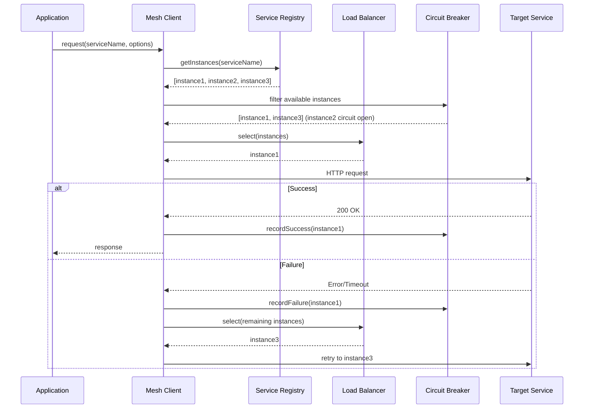

# How to Build a Service Mesh Client in Node.js

Author: [nawazdhandala](https://www.github.com/nawazdhandala)

Tags: NodeJS, TypeScript, Microservices, Service Mesh, Distributed Systems

Description: Learn how to build a service mesh client in Node.js that handles service discovery, load balancing, circuit breaking, and observability without requiring a sidecar proxy.

---

Service meshes like Istio and Linkerd solve critical microservices challenges: service discovery, load balancing, retries, and observability. But they add operational complexity and resource overhead with their sidecar proxies. This guide shows how to build a lightweight service mesh client directly in Node.js for scenarios where a full mesh is overkill.

## When to Build Your Own

Before diving in, consider when this approach makes sense:

| Full Service Mesh | Built-in Client |
|-------------------|-----------------|
| Many services (50+) | Few services (5-15) |
| Multiple languages | Primarily Node.js |
| Need traffic shifting | Basic load balancing |
| Strict mTLS requirements | Application-level auth |
| Dedicated platform team | Small DevOps team |

If you have a smaller deployment or want more control, a built-in client can be simpler and more efficient than deploying Envoy sidecars everywhere.

## Core Components

Our service mesh client needs these capabilities:

1. Service Registry - Track available service instances
2. Load Balancer - Distribute requests across instances
3. Circuit Breaker - Prevent cascade failures
4. Retry Logic - Handle transient failures
5. Observability - Metrics and distributed tracing

## Service Registry Implementation

The registry tracks service instances and their health. It can pull from Kubernetes, Consul, or a simple configuration file.

```typescript
// ServiceRegistry.ts
// Tracks available instances for each service and their health status

export interface ServiceInstance {
  id: string;
  host: string;
  port: number;
  healthy: boolean;
  metadata: Record<string, string>;
  lastHealthCheck: number;
  weight: number;
}

export interface ServiceDefinition {
  name: string;
  instances: ServiceInstance[];
}

export class ServiceRegistry {
  private services: Map<string, ServiceInstance[]> = new Map();
  private healthCheckInterval: NodeJS.Timeout | null = null;
  private healthCheckPeriod: number = 10000;

  constructor(options: { healthCheckPeriod?: number } = {}) {
    this.healthCheckPeriod = options.healthCheckPeriod || 10000;
  }

  // Register a service instance
  register(serviceName: string, instance: Omit<ServiceInstance, 'id' | 'healthy' | 'lastHealthCheck'>): void {
    const instances = this.services.get(serviceName) || [];
    const id = `${serviceName}-${instance.host}:${instance.port}`;

    // Check if already registered
    const existing = instances.find(i => i.id === id);
    if (existing) {
      existing.weight = instance.weight;
      existing.metadata = instance.metadata;
      return;
    }

    instances.push({
      ...instance,
      id,
      healthy: true,
      lastHealthCheck: Date.now(),
    });

    this.services.set(serviceName, instances);
    console.log(`Registered instance ${id} for service ${serviceName}`);
  }

  // Remove a service instance
  deregister(serviceName: string, host: string, port: number): void {
    const instances = this.services.get(serviceName);
    if (!instances) return;

    const id = `${serviceName}-${host}:${port}`;
    const filtered = instances.filter(i => i.id !== id);
    this.services.set(serviceName, filtered);
    console.log(`Deregistered instance ${id}`);
  }

  // Get healthy instances for a service
  getInstances(serviceName: string): ServiceInstance[] {
    const instances = this.services.get(serviceName) || [];
    return instances.filter(i => i.healthy);
  }

  // Get all instances including unhealthy ones
  getAllInstances(serviceName: string): ServiceInstance[] {
    return this.services.get(serviceName) || [];
  }

  // Mark an instance as healthy or unhealthy
  setHealth(serviceName: string, instanceId: string, healthy: boolean): void {
    const instances = this.services.get(serviceName);
    if (!instances) return;

    const instance = instances.find(i => i.id === instanceId);
    if (instance) {
      const wasHealthy = instance.healthy;
      instance.healthy = healthy;
      instance.lastHealthCheck = Date.now();

      if (wasHealthy !== healthy) {
        console.log(`Instance ${instanceId} health changed: ${wasHealthy} -> ${healthy}`);
      }
    }
  }

  // Start periodic health checks
  startHealthChecks(checker: (instance: ServiceInstance) => Promise<boolean>): void {
    this.healthCheckInterval = setInterval(async () => {
      for (const [serviceName, instances] of this.services) {
        for (const instance of instances) {
          try {
            const healthy = await checker(instance);
            this.setHealth(serviceName, instance.id, healthy);
          } catch (error) {
            this.setHealth(serviceName, instance.id, false);
          }
        }
      }
    }, this.healthCheckPeriod);
  }

  stopHealthChecks(): void {
    if (this.healthCheckInterval) {
      clearInterval(this.healthCheckInterval);
      this.healthCheckInterval = null;
    }
  }

  // Load services from Kubernetes-style config
  loadFromConfig(config: ServiceDefinition[]): void {
    for (const service of config) {
      for (const instance of service.instances) {
        this.register(service.name, instance);
      }
    }
  }
}
```

## Load Balancer Strategies

Different load balancing strategies suit different scenarios. Here are three common ones.

```typescript
// LoadBalancer.ts
// Multiple load balancing algorithms for distributing requests

import { ServiceInstance } from './ServiceRegistry';

export interface LoadBalancer {
  select(instances: ServiceInstance[]): ServiceInstance | null;
}

// Round-robin: distribute requests evenly in order
export class RoundRobinBalancer implements LoadBalancer {
  private counters: Map<string, number> = new Map();

  select(instances: ServiceInstance[]): ServiceInstance | null {
    if (instances.length === 0) return null;

    // Create a key from instance IDs to track rotation
    const key = instances.map(i => i.id).sort().join(',');
    const current = this.counters.get(key) || 0;
    const selected = instances[current % instances.length];

    this.counters.set(key, current + 1);
    return selected;
  }
}

// Weighted round-robin: higher weight instances get more traffic
export class WeightedRoundRobinBalancer implements LoadBalancer {
  private currentWeight: number = 0;
  private currentIndex: number = -1;

  select(instances: ServiceInstance[]): ServiceInstance | null {
    if (instances.length === 0) return null;

    const maxWeight = Math.max(...instances.map(i => i.weight));
    const gcd = this.findGcd(instances.map(i => i.weight));

    while (true) {
      this.currentIndex = (this.currentIndex + 1) % instances.length;

      if (this.currentIndex === 0) {
        this.currentWeight = this.currentWeight - gcd;
        if (this.currentWeight <= 0) {
          this.currentWeight = maxWeight;
        }
      }

      if (instances[this.currentIndex].weight >= this.currentWeight) {
        return instances[this.currentIndex];
      }
    }
  }

  private findGcd(values: number[]): number {
    const gcd = (a: number, b: number): number => (b === 0 ? a : gcd(b, a % b));
    return values.reduce((a, b) => gcd(a, b));
  }
}

// Least connections: send to instance with fewest active requests
export class LeastConnectionsBalancer implements LoadBalancer {
  private connections: Map<string, number> = new Map();

  select(instances: ServiceInstance[]): ServiceInstance | null {
    if (instances.length === 0) return null;

    let minConnections = Infinity;
    let selected: ServiceInstance | null = null;

    for (const instance of instances) {
      const count = this.connections.get(instance.id) || 0;
      if (count < minConnections) {
        minConnections = count;
        selected = instance;
      }
    }

    return selected;
  }

  // Call when starting a request
  acquire(instanceId: string): void {
    const current = this.connections.get(instanceId) || 0;
    this.connections.set(instanceId, current + 1);
  }

  // Call when request completes
  release(instanceId: string): void {
    const current = this.connections.get(instanceId) || 0;
    this.connections.set(instanceId, Math.max(0, current - 1));
  }
}

// Random selection with optional weighting
export class RandomBalancer implements LoadBalancer {
  select(instances: ServiceInstance[]): ServiceInstance | null {
    if (instances.length === 0) return null;

    // Calculate total weight
    const totalWeight = instances.reduce((sum, i) => sum + i.weight, 0);
    let random = Math.random() * totalWeight;

    for (const instance of instances) {
      random -= instance.weight;
      if (random <= 0) {
        return instance;
      }
    }

    return instances[instances.length - 1];
  }
}
```

## Circuit Breaker

The circuit breaker prevents repeated calls to failing services. It tracks failures per service instance.

```typescript
// CircuitBreaker.ts
// Per-instance circuit breaker to isolate failures

export interface CircuitBreakerOptions {
  failureThreshold: number;
  resetTimeout: number;
  halfOpenRequests: number;
}

type CircuitState = 'CLOSED' | 'OPEN' | 'HALF_OPEN';

interface InstanceCircuit {
  state: CircuitState;
  failures: number;
  successes: number;
  lastFailure: number;
  halfOpenAttempts: number;
}

export class CircuitBreaker {
  private circuits: Map<string, InstanceCircuit> = new Map();
  private options: CircuitBreakerOptions;

  constructor(options: Partial<CircuitBreakerOptions> = {}) {
    this.options = {
      failureThreshold: options.failureThreshold || 5,
      resetTimeout: options.resetTimeout || 30000,
      halfOpenRequests: options.halfOpenRequests || 3,
    };
  }

  // Get or create circuit for an instance
  private getCircuit(instanceId: string): InstanceCircuit {
    let circuit = this.circuits.get(instanceId);
    if (!circuit) {
      circuit = {
        state: 'CLOSED',
        failures: 0,
        successes: 0,
        lastFailure: 0,
        halfOpenAttempts: 0,
      };
      this.circuits.set(instanceId, circuit);
    }
    return circuit;
  }

  // Check if requests can be sent to this instance
  canRequest(instanceId: string): boolean {
    const circuit = this.getCircuit(instanceId);

    switch (circuit.state) {
      case 'CLOSED':
        return true;

      case 'OPEN':
        // Check if reset timeout has passed
        if (Date.now() - circuit.lastFailure > this.options.resetTimeout) {
          circuit.state = 'HALF_OPEN';
          circuit.halfOpenAttempts = 0;
          circuit.successes = 0;
          console.log(`Circuit for ${instanceId}: OPEN -> HALF_OPEN`);
          return true;
        }
        return false;

      case 'HALF_OPEN':
        // Allow limited requests in half-open state
        return circuit.halfOpenAttempts < this.options.halfOpenRequests;
    }
  }

  // Record a successful request
  recordSuccess(instanceId: string): void {
    const circuit = this.getCircuit(instanceId);

    if (circuit.state === 'HALF_OPEN') {
      circuit.successes++;
      if (circuit.successes >= this.options.halfOpenRequests) {
        circuit.state = 'CLOSED';
        circuit.failures = 0;
        console.log(`Circuit for ${instanceId}: HALF_OPEN -> CLOSED`);
      }
    } else {
      circuit.failures = 0;
    }
  }

  // Record a failed request
  recordFailure(instanceId: string): void {
    const circuit = this.getCircuit(instanceId);
    circuit.failures++;
    circuit.lastFailure = Date.now();

    if (circuit.state === 'HALF_OPEN') {
      circuit.state = 'OPEN';
      console.log(`Circuit for ${instanceId}: HALF_OPEN -> OPEN`);
    } else if (circuit.failures >= this.options.failureThreshold) {
      circuit.state = 'OPEN';
      console.log(`Circuit for ${instanceId}: CLOSED -> OPEN (${circuit.failures} failures)`);
    }

    if (circuit.state === 'HALF_OPEN') {
      circuit.halfOpenAttempts++;
    }
  }

  getState(instanceId: string): CircuitState {
    return this.getCircuit(instanceId).state;
  }
}
```

## Service Mesh Client Flow



## Complete Mesh Client

Now let's combine everything into a unified client.

```typescript
// MeshClient.ts
// Full-featured service mesh client with all components

import { ServiceRegistry, ServiceInstance } from './ServiceRegistry';
import { LoadBalancer, RoundRobinBalancer, LeastConnectionsBalancer } from './LoadBalancer';
import { CircuitBreaker } from './CircuitBreaker';

interface RequestOptions {
  method?: string;
  path?: string;
  headers?: Record<string, string>;
  body?: unknown;
  timeout?: number;
  retries?: number;
}

interface MeshClientOptions {
  registry: ServiceRegistry;
  loadBalancer?: LoadBalancer;
  circuitBreaker?: CircuitBreaker;
  defaultTimeout?: number;
  defaultRetries?: number;
}

export class MeshClient {
  private registry: ServiceRegistry;
  private loadBalancer: LoadBalancer;
  private circuitBreaker: CircuitBreaker;
  private leastConnections: LeastConnectionsBalancer;
  private defaultTimeout: number;
  private defaultRetries: number;

  // Track request timing for observability
  private requestMetrics: {
    total: number;
    success: number;
    failure: number;
    latencies: number[];
  } = { total: 0, success: 0, failure: 0, latencies: [] };

  constructor(options: MeshClientOptions) {
    this.registry = options.registry;
    this.loadBalancer = options.loadBalancer || new RoundRobinBalancer();
    this.circuitBreaker = options.circuitBreaker || new CircuitBreaker();
    this.leastConnections = new LeastConnectionsBalancer();
    this.defaultTimeout = options.defaultTimeout || 5000;
    this.defaultRetries = options.defaultRetries || 2;
  }

  // Main request method
  async request<T>(serviceName: string, options: RequestOptions = {}): Promise<T> {
    const {
      method = 'GET',
      path = '/',
      headers = {},
      body,
      timeout = this.defaultTimeout,
      retries = this.defaultRetries,
    } = options;

    const startTime = Date.now();
    this.requestMetrics.total++;

    // Get healthy instances
    let instances = this.registry.getInstances(serviceName);
    if (instances.length === 0) {
      throw new Error(`No instances available for service: ${serviceName}`);
    }

    // Filter by circuit breaker state
    instances = instances.filter(i => this.circuitBreaker.canRequest(i.id));
    if (instances.length === 0) {
      throw new Error(`All instances for ${serviceName} have open circuits`);
    }

    let lastError: Error | null = null;
    const triedInstances: Set<string> = new Set();

    // Retry loop
    for (let attempt = 0; attempt <= retries; attempt++) {
      // Select an instance we have not tried yet
      const availableInstances = instances.filter(i => !triedInstances.has(i.id));
      if (availableInstances.length === 0) break;

      const instance = this.loadBalancer.select(availableInstances);
      if (!instance) break;

      triedInstances.add(instance.id);
      this.leastConnections.acquire(instance.id);

      try {
        const result = await this.executeRequest<T>(instance, {
          method,
          path,
          headers: {
            ...headers,
            'x-request-id': this.generateRequestId(),
            'x-forwarded-service': serviceName,
          },
          body,
          timeout,
        });

        // Success
        this.circuitBreaker.recordSuccess(instance.id);
        this.leastConnections.release(instance.id);
        this.requestMetrics.success++;
        this.requestMetrics.latencies.push(Date.now() - startTime);

        return result;
      } catch (error) {
        lastError = error as Error;
        this.circuitBreaker.recordFailure(instance.id);
        this.leastConnections.release(instance.id);

        console.log(
          `Request to ${instance.id} failed (attempt ${attempt + 1}/${retries + 1}): ${lastError.message}`
        );
      }
    }

    this.requestMetrics.failure++;
    throw lastError || new Error(`All retries exhausted for ${serviceName}`);
  }

  // Execute HTTP request to a specific instance
  private async executeRequest<T>(
    instance: ServiceInstance,
    options: {
      method: string;
      path: string;
      headers: Record<string, string>;
      body?: unknown;
      timeout: number;
    }
  ): Promise<T> {
    const url = `http://${instance.host}:${instance.port}${options.path}`;

    const controller = new AbortController();
    const timeoutId = setTimeout(() => controller.abort(), options.timeout);

    try {
      const response = await fetch(url, {
        method: options.method,
        headers: {
          'Content-Type': 'application/json',
          ...options.headers,
        },
        body: options.body ? JSON.stringify(options.body) : undefined,
        signal: controller.signal,
      });

      clearTimeout(timeoutId);

      if (!response.ok) {
        throw new Error(`HTTP ${response.status}: ${response.statusText}`);
      }

      return await response.json() as T;
    } catch (error) {
      clearTimeout(timeoutId);

      if ((error as Error).name === 'AbortError') {
        throw new Error(`Request timeout after ${options.timeout}ms`);
      }

      throw error;
    }
  }

  // Generate unique request ID for tracing
  private generateRequestId(): string {
    return `${Date.now().toString(36)}-${Math.random().toString(36).substr(2, 9)}`;
  }

  // Get metrics for monitoring
  getMetrics(): typeof this.requestMetrics & { avgLatency: number } {
    const avgLatency = this.requestMetrics.latencies.length > 0
      ? this.requestMetrics.latencies.reduce((a, b) => a + b, 0) / this.requestMetrics.latencies.length
      : 0;

    return {
      ...this.requestMetrics,
      avgLatency,
    };
  }
}
```

## Usage Example

Here is how to use the mesh client in an Express application.

```typescript
// app.ts
import express from 'express';
import { ServiceRegistry } from './ServiceRegistry';
import { MeshClient } from './MeshClient';
import { LeastConnectionsBalancer } from './LoadBalancer';

const app = express();

// Initialize registry with service configuration
const registry = new ServiceRegistry({ healthCheckPeriod: 10000 });

registry.loadFromConfig([
  {
    name: 'user-service',
    instances: [
      { host: '10.0.1.10', port: 3001, weight: 10, metadata: { version: '1.2.0' } },
      { host: '10.0.1.11', port: 3001, weight: 10, metadata: { version: '1.2.0' } },
      { host: '10.0.1.12', port: 3001, weight: 5, metadata: { version: '1.1.0' } },
    ],
  },
  {
    name: 'order-service',
    instances: [
      { host: '10.0.2.10', port: 3002, weight: 10, metadata: {} },
      { host: '10.0.2.11', port: 3002, weight: 10, metadata: {} },
    ],
  },
]);

// Start health checks
registry.startHealthChecks(async (instance) => {
  try {
    const response = await fetch(`http://${instance.host}:${instance.port}/health`);
    return response.ok;
  } catch {
    return false;
  }
});

// Create mesh client
const meshClient = new MeshClient({
  registry,
  loadBalancer: new LeastConnectionsBalancer(),
  defaultTimeout: 3000,
  defaultRetries: 2,
});

// API endpoints using mesh client
app.get('/users/:id', async (req, res) => {
  try {
    const user = await meshClient.request('user-service', {
      path: `/users/${req.params.id}`,
    });
    res.json(user);
  } catch (error) {
    res.status(503).json({ error: 'User service unavailable' });
  }
});

app.post('/orders', async (req, res) => {
  try {
    const order = await meshClient.request('order-service', {
      method: 'POST',
      path: '/orders',
      body: req.body,
    });
    res.json(order);
  } catch (error) {
    res.status(503).json({ error: 'Order service unavailable' });
  }
});

// Metrics endpoint
app.get('/mesh/metrics', (req, res) => {
  res.json(meshClient.getMetrics());
});

app.listen(3000);
```

## Summary

| Component | Purpose | Key Feature |
|-----------|---------|-------------|
| Service Registry | Track instances | Health checking |
| Load Balancer | Distribute requests | Multiple algorithms |
| Circuit Breaker | Prevent cascade failures | Per-instance isolation |
| Mesh Client | Unified interface | Automatic retries |

Building a service mesh client in Node.js gives you fine-grained control over service-to-service communication. For smaller deployments, this approach is simpler than managing sidecar proxies while still providing the resilience patterns you need.
