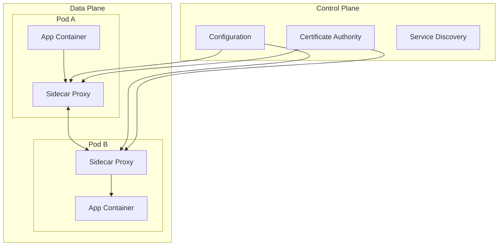

# How to Implement Service Mesh Networking

Author: [nawazdhandala](https://www.github.com/nawazdhandala)

Tags: Service Mesh, Istio, Linkerd, Kubernetes, Networking, Microservices

Description: A hands-on guide to implementing service mesh networking in Kubernetes, covering Istio and Linkerd installation, traffic management, observability, and security features.

---

Service meshes provide a dedicated infrastructure layer for service-to-service communication in microservices architectures. They handle traffic management, security, and observability without requiring changes to application code. This guide covers practical implementation with Istio and Linkerd.

## Service Mesh Architecture



## Istio Installation

### Install Istio with istioctl

```bash
# Download Istio
curl -L https://istio.io/downloadIstio | sh -
cd istio-*
export PATH=$PWD/bin:$PATH

# Install with demo profile (good for learning)
istioctl install --set profile=demo -y

# Or minimal production profile
istioctl install --set profile=minimal -y

# Enable sidecar injection for namespace
kubectl label namespace default istio-injection=enabled
```

### Istio Custom Installation

```yaml
# istio-operator.yaml
apiVersion: install.istio.io/v1alpha1
kind: IstioOperator
metadata:
  name: istio-control-plane
  namespace: istio-system
spec:
  profile: default

  components:
    pilot:
      k8s:
        resources:
          requests:
            cpu: 500m
            memory: 512Mi
        hpaSpec:
          minReplicas: 2
          maxReplicas: 5

    ingressGateways:
      - name: istio-ingressgateway
        enabled: true
        k8s:
          service:
            type: LoadBalancer
          resources:
            requests:
              cpu: 100m
              memory: 128Mi

  meshConfig:
    enableTracing: true
    accessLogFile: /dev/stdout
    accessLogFormat: |
      [%START_TIME%] "%REQ(:METHOD)% %REQ(X-ENVOY-ORIGINAL-PATH?:PATH)%"
      %RESPONSE_CODE% %RESPONSE_FLAGS% %BYTES_RECEIVED% %BYTES_SENT%
      %DURATION% "%REQ(X-FORWARDED-FOR)%" "%REQ(USER-AGENT)%"

    defaultConfig:
      tracing:
        sampling: 100.0
      proxyMetadata:
        ISTIO_META_DNS_CAPTURE: "true"
```

## Traffic Management

### Virtual Service for Routing

```yaml
# virtual-service.yaml
apiVersion: networking.istio.io/v1beta1
kind: VirtualService
metadata:
  name: reviews-routing
spec:
  hosts:
    - reviews
  http:
    # Route based on headers
    - match:
        - headers:
            end-user:
              exact: jason
      route:
        - destination:
            host: reviews
            subset: v2

    # Canary deployment - 90/10 split
    - route:
        - destination:
            host: reviews
            subset: v1
          weight: 90
        - destination:
            host: reviews
            subset: v2
          weight: 10

---
apiVersion: networking.istio.io/v1beta1
kind: DestinationRule
metadata:
  name: reviews-destination
spec:
  host: reviews
  subsets:
    - name: v1
      labels:
        version: v1
    - name: v2
      labels:
        version: v2
  trafficPolicy:
    connectionPool:
      tcp:
        maxConnections: 100
      http:
        h2UpgradePolicy: UPGRADE
        http1MaxPendingRequests: 100
        http2MaxRequests: 1000
```

### Fault Injection

```yaml
# fault-injection.yaml
apiVersion: networking.istio.io/v1beta1
kind: VirtualService
metadata:
  name: ratings-fault
spec:
  hosts:
    - ratings
  http:
    - fault:
        delay:
          percentage:
            value: 10
          fixedDelay: 5s
        abort:
          percentage:
            value: 5
          httpStatus: 500
      route:
        - destination:
            host: ratings
```

### Circuit Breaker

```yaml
# circuit-breaker.yaml
apiVersion: networking.istio.io/v1beta1
kind: DestinationRule
metadata:
  name: reviews-circuit-breaker
spec:
  host: reviews
  trafficPolicy:
    connectionPool:
      tcp:
        maxConnections: 100
      http:
        http1MaxPendingRequests: 100
        http2MaxRequests: 1000
        maxRequestsPerConnection: 10
    outlierDetection:
      consecutive5xxErrors: 5
      interval: 30s
      baseEjectionTime: 30s
      maxEjectionPercent: 50
      minHealthPercent: 30
```

## Istio Security

### Mutual TLS

```yaml
# peer-authentication.yaml
apiVersion: security.istio.io/v1beta1
kind: PeerAuthentication
metadata:
  name: default
  namespace: default
spec:
  mtls:
    mode: STRICT

---
# For gradual migration, use PERMISSIVE mode
apiVersion: security.istio.io/v1beta1
kind: PeerAuthentication
metadata:
  name: allow-plaintext
  namespace: legacy
spec:
  mtls:
    mode: PERMISSIVE
```

### Authorization Policy

```yaml
# authorization-policy.yaml
apiVersion: security.istio.io/v1beta1
kind: AuthorizationPolicy
metadata:
  name: frontend-to-api
  namespace: default
spec:
  selector:
    matchLabels:
      app: api
  action: ALLOW
  rules:
    - from:
        - source:
            principals:
              - cluster.local/ns/default/sa/frontend
      to:
        - operation:
            methods: ["GET", "POST"]
            paths: ["/api/*"]

---
# Deny all by default
apiVersion: security.istio.io/v1beta1
kind: AuthorizationPolicy
metadata:
  name: deny-all
  namespace: default
spec:
  {}  # Empty spec denies all
```

## Linkerd Installation

Linkerd is lighter weight than Istio and easier to get started with.

### Install Linkerd CLI

```bash
# Install CLI
curl --proto '=https' --tlsv1.2 -sSfL https://run.linkerd.io/install | sh
export PATH=$PATH:$HOME/.linkerd2/bin

# Validate cluster
linkerd check --pre

# Install control plane
linkerd install --crds | kubectl apply -f -
linkerd install | kubectl apply -f -

# Verify installation
linkerd check

# Install viz extension for dashboard
linkerd viz install | kubectl apply -f -
```

### Inject Linkerd Proxy

```bash
# Inject into existing deployment
kubectl get deploy -n default -o yaml | linkerd inject - | kubectl apply -f -

# Or annotate namespace for automatic injection
kubectl annotate namespace default linkerd.io/inject=enabled
```

### Linkerd Traffic Split

```yaml
# traffic-split.yaml
apiVersion: split.smi-spec.io/v1alpha1
kind: TrafficSplit
metadata:
  name: web-split
  namespace: default
spec:
  service: web
  backends:
    - service: web-v1
      weight: 900m  # 90%
    - service: web-v2
      weight: 100m  # 10%
```

### Linkerd Service Profiles

```yaml
# service-profile.yaml
apiVersion: linkerd.io/v1alpha2
kind: ServiceProfile
metadata:
  name: api.default.svc.cluster.local
  namespace: default
spec:
  routes:
    - name: GET /api/users
      condition:
        method: GET
        pathRegex: /api/users
      responseClasses:
        - condition:
            status:
              min: 500
              max: 599
          isFailure: true
      timeout: 5s
      isRetryable: true

    - name: POST /api/orders
      condition:
        method: POST
        pathRegex: /api/orders
      timeout: 30s
      isRetryable: false
```

## Observability

### Istio with Prometheus and Grafana

```yaml
# monitoring-stack.yaml
apiVersion: install.istio.io/v1alpha1
kind: IstioOperator
spec:
  addonComponents:
    prometheus:
      enabled: true
    grafana:
      enabled: true
    kiali:
      enabled: true
    tracing:
      enabled: true
```

### Custom Metrics in Istio

```yaml
# telemetry.yaml
apiVersion: telemetry.istio.io/v1alpha1
kind: Telemetry
metadata:
  name: custom-metrics
  namespace: istio-system
spec:
  metrics:
    - providers:
        - name: prometheus
      overrides:
        - match:
            metric: REQUEST_COUNT
            mode: CLIENT_AND_SERVER
          tagOverrides:
            request_host:
              operation: UPSERT
              value: request.host
```

### Distributed Tracing

```yaml
# tracing-config.yaml
apiVersion: install.istio.io/v1alpha1
kind: IstioOperator
spec:
  meshConfig:
    enableTracing: true
    defaultConfig:
      tracing:
        sampling: 100.0
        zipkin:
          address: zipkin.istio-system:9411
```

### Linkerd Dashboard

```bash
# Open Linkerd dashboard
linkerd viz dashboard &

# View live traffic
linkerd viz top deploy/web

# Check route metrics
linkerd viz routes deploy/web --to svc/api

# View service profiles
linkerd viz routes deploy/api --to svc/database -o wide
```

## Gateway Configuration

### Istio Gateway

```yaml
# istio-gateway.yaml
apiVersion: networking.istio.io/v1beta1
kind: Gateway
metadata:
  name: main-gateway
  namespace: istio-system
spec:
  selector:
    istio: ingressgateway
  servers:
    - port:
        number: 443
        name: https
        protocol: HTTPS
      tls:
        mode: SIMPLE
        credentialName: tls-secret
      hosts:
        - "*.example.com"
    - port:
        number: 80
        name: http
        protocol: HTTP
      hosts:
        - "*.example.com"
      tls:
        httpsRedirect: true

---
apiVersion: networking.istio.io/v1beta1
kind: VirtualService
metadata:
  name: main-routes
spec:
  hosts:
    - "api.example.com"
  gateways:
    - istio-system/main-gateway
  http:
    - match:
        - uri:
            prefix: /v1
      route:
        - destination:
            host: api-v1.default.svc.cluster.local
            port:
              number: 80
    - match:
        - uri:
            prefix: /v2
      route:
        - destination:
            host: api-v2.default.svc.cluster.local
            port:
              number: 80
```

## Debugging Service Mesh

```bash
#!/bin/bash
# mesh-debug.sh

echo "=== Istio Proxy Status ==="
istioctl proxy-status

echo -e "\n=== Envoy Configuration ==="
istioctl proxy-config clusters deploy/api -n default

echo -e "\n=== Check mTLS Status ==="
istioctl authn tls-check api.default.svc.cluster.local

echo -e "\n=== Analyze Configuration ==="
istioctl analyze

echo -e "\n=== Linkerd Status ==="
linkerd check

echo -e "\n=== Linkerd Edges ==="
linkerd viz edges deploy -n default
```

---

Service meshes add powerful capabilities for traffic management, security, and observability. Linkerd is simpler and lighter for getting started, while Istio offers more features for complex requirements. Start with basic traffic management and mTLS, then gradually adopt more advanced features as you understand your needs better.
