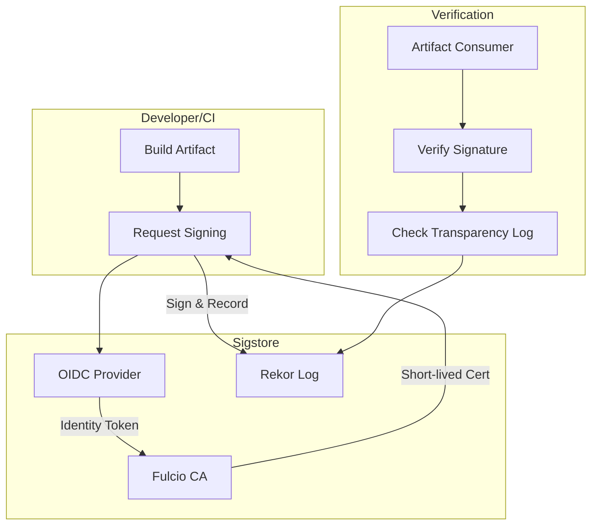

# How to Implement Supply Chain Security with Sigstore

Author: [nawazdhandala](https://www.github.com/nawazdhandala)

Tags: Security, Sigstore, Supply Chain Security, Software Signing, Cosign, Fulcio, Rekor, DevSecOps

Description: Learn how to secure your software supply chain using Sigstore's suite of tools for signing, verification, and transparency logging of software artifacts.

---

Software supply chain attacks have become a primary vector for compromise. From SolarWinds to npm package hijacking, attackers target the build and distribution process rather than running systems. Sigstore provides an open-source toolkit for signing and verifying software artifacts, creating cryptographic proof of provenance. This guide covers the Sigstore ecosystem and practical implementation patterns.

## The Sigstore Ecosystem

Sigstore is not a single tool but a suite of components:

- **Cosign**: Signs and verifies container images and other artifacts
- **Fulcio**: Certificate authority that issues short-lived signing certificates
- **Rekor**: Transparency log that records all signing events
- **Gitsign**: Signs Git commits using Sigstore
- **policy-controller**: Kubernetes admission controller for signature verification

Together, these tools create a system where every artifact can be traced back to its origin.

## Architecture Overview



## How Keyless Signing Works

Traditional code signing requires managing private keys. Sigstore's keyless approach eliminates this:

1. Developer authenticates via OIDC (GitHub, Google, etc.)
2. Fulcio issues a short-lived certificate binding the identity to a public key
3. Developer signs the artifact with the corresponding private key
4. Signature and certificate are recorded in Rekor
5. Private key can be discarded (certificate expires in minutes)

The transparency log provides auditability without requiring trust in a single party.

## Installing Sigstore Tools

```bash
# Install Cosign
brew install cosign
# Or
go install github.com/sigstore/cosign/v2/cmd/cosign@latest

# Install Rekor CLI
go install github.com/sigstore/rekor/cmd/rekor-cli@latest

# Install Gitsign
brew install gitsign
# Or
go install github.com/sigstore/gitsign@latest

# Verify installations
cosign version
rekor-cli version
gitsign --version
```

## Signing Container Images

### Keyless Signing (Recommended)

```bash
# Build and push your image
docker build -t ghcr.io/myorg/myapp:v1.0 .
docker push ghcr.io/myorg/myapp:v1.0

# Sign using your OIDC identity (opens browser)
cosign sign ghcr.io/myorg/myapp:v1.0

# In CI, use workload identity (no browser needed)
# GitHub Actions provides OIDC tokens automatically
cosign sign --yes ghcr.io/myorg/myapp:v1.0
```

The signature is stored in the registry alongside the image.

### Verification

```bash
# Verify the signature
cosign verify \
  --certificate-identity=user@example.com \
  --certificate-oidc-issuer=https://accounts.google.com \
  ghcr.io/myorg/myapp:v1.0

# For CI-signed images
cosign verify \
  --certificate-identity="https://github.com/myorg/myapp/.github/workflows/build.yml@refs/heads/main" \
  --certificate-oidc-issuer="https://token.actions.githubusercontent.com" \
  ghcr.io/myorg/myapp:v1.0
```

## Signing with Attestations

Attestations provide structured metadata about artifacts:

### SBOM Attestation

```bash
# Generate SBOM
syft ghcr.io/myorg/myapp:v1.0 -o spdx-json > sbom.spdx.json

# Attach as signed attestation
cosign attest --predicate sbom.spdx.json \
  --type spdxjson \
  ghcr.io/myorg/myapp:v1.0

# Verify attestation
cosign verify-attestation \
  --type spdxjson \
  --certificate-identity=user@example.com \
  --certificate-oidc-issuer=https://accounts.google.com \
  ghcr.io/myorg/myapp:v1.0
```

### SLSA Provenance Attestation

SLSA (Supply chain Levels for Software Artifacts) provenance describes how an artifact was built:

```json
{
  "_type": "https://in-toto.io/Statement/v0.1",
  "predicateType": "https://slsa.dev/provenance/v1",
  "subject": [
    {
      "name": "ghcr.io/myorg/myapp",
      "digest": {
        "sha256": "abc123..."
      }
    }
  ],
  "predicate": {
    "buildDefinition": {
      "buildType": "https://github.com/actions/runner",
      "externalParameters": {
        "workflow": ".github/workflows/build.yml",
        "ref": "refs/heads/main"
      }
    },
    "runDetails": {
      "builder": {
        "id": "https://github.com/actions/runner"
      },
      "metadata": {
        "invocationId": "https://github.com/myorg/myapp/actions/runs/12345"
      }
    }
  }
}
```

Use the SLSA GitHub generator for automatic provenance:

```yaml
# .github/workflows/slsa.yml
name: SLSA Build

on:
  push:
    tags: ['v*']

jobs:
  build:
    outputs:
      digest: ${{ steps.build.outputs.digest }}
    runs-on: ubuntu-latest
    steps:
      - uses: actions/checkout@v4
      - name: Build and push
        id: build
        run: |
          docker build -t ghcr.io/myorg/myapp:${{ github.ref_name }} .
          docker push ghcr.io/myorg/myapp:${{ github.ref_name }}
          echo "digest=$(docker inspect --format='{{index .RepoDigests 0}}' ghcr.io/myorg/myapp:${{ github.ref_name }} | cut -d@ -f2)" >> $GITHUB_OUTPUT

  provenance:
    needs: build
    permissions:
      actions: read
      id-token: write
      packages: write
    uses: slsa-framework/slsa-github-generator/.github/workflows/generator_container_slsa3.yml@v1.9.0
    with:
      image: ghcr.io/myorg/myapp
      digest: ${{ needs.build.outputs.digest }}
```

## Signing Git Commits with Gitsign

Sign commits with your OIDC identity:

```bash
# Configure Git to use Gitsign
git config --global commit.gpgsign true
git config --global tag.gpgsign true
git config --global gpg.x509.program gitsign
git config --global gpg.format x509

# Make a signed commit
git commit -m "Add new feature"
# Opens browser for OIDC authentication

# Verify a commit
git verify-commit HEAD
# Good signature from CN=sigstore-intermediate,O=sigstore.dev
# Validated Git signature: true
# Validated Rekor entry: true
```

## Using the Transparency Log

### Searching Rekor

```bash
# Search by email
rekor-cli search --email user@example.com

# Search by artifact SHA
rekor-cli search --sha sha256:abc123...

# Get entry details
rekor-cli get --uuid 24296fb24b8ad77a1234567890abcdef

# Verify inclusion
rekor-cli verify --artifact myfile.tar.gz --signature myfile.tar.gz.sig
```

### Monitoring for Suspicious Signatures

Set up alerts for unexpected signing activity:

```python
# monitor_rekor.py
import requests
import time

def check_rekor_for_identity(identity_email, last_index):
    """Check for new signatures from a specific identity."""
    url = f"https://rekor.sigstore.dev/api/v1/log/entries?logIndex={last_index}"
    response = requests.get(url)

    for entry in response.json():
        body = entry.get('body', {})
        if identity_email in str(body):
            print(f"Alert: New signature from {identity_email}")
            # Send alert to security team
            notify_security_team(entry)

    return response.json()[-1].get('logIndex', last_index)

# Poll for new entries
last_index = 0
while True:
    last_index = check_rekor_for_identity("builder@mycompany.com", last_index)
    time.sleep(60)
```

## Kubernetes Policy Enforcement

### Using Sigstore Policy Controller

```bash
# Install policy controller
helm repo add sigstore https://sigstore.github.io/helm-charts
helm install policy-controller sigstore/policy-controller \
  --namespace sigstore-system \
  --create-namespace
```

Create a policy requiring signatures:

```yaml
# cluster-image-policy.yaml
apiVersion: policy.sigstore.dev/v1beta1
kind: ClusterImagePolicy
metadata:
  name: require-sigstore-signatures
spec:
  images:
    - glob: "ghcr.io/myorg/**"
  authorities:
    - keyless:
        identities:
          - issuer: "https://token.actions.githubusercontent.com"
            subjectRegExp: "https://github.com/myorg/.*"
        url: https://fulcio.sigstore.dev
      ctlog:
        url: https://rekor.sigstore.dev
    # Require SLSA provenance
    - attestations:
        - name: slsa-provenance
          predicateType: https://slsa.dev/provenance/v1
          policy:
            type: rego
            data: |
              package sigstore
              default allow = false
              allow {
                input.predicate.buildDefinition.buildType == "https://github.com/actions/runner"
              }
```

Enable enforcement on namespaces:

```bash
kubectl label namespace production policy.sigstore.dev/include=true
```

## Private Sigstore Deployment

For air-gapped or high-security environments, deploy your own Sigstore infrastructure:

```yaml
# sigstore-scaffold values.yaml
fulcio:
  enabled: true
  namespace:
    create: true
    name: fulcio-system

rekor:
  enabled: true
  namespace:
    create: true
    name: rekor-system

ctlog:
  enabled: true
  namespace:
    create: true
    name: ctlog-system

tuf:
  enabled: true
  namespace:
    create: true
    name: tuf-system
```

Install with Helm:

```bash
helm repo add sigstore https://sigstore.github.io/helm-charts
helm install sigstore-scaffold sigstore/scaffold \
  --namespace sigstore \
  --create-namespace \
  -f values.yaml
```

Configure clients to use your private instance:

```bash
# Initialize TUF root
cosign initialize --mirror=https://tuf.internal.example.com --root=https://tuf.internal.example.com/root.json

# Sign using private Fulcio and Rekor
cosign sign \
  --fulcio-url=https://fulcio.internal.example.com \
  --rekor-url=https://rekor.internal.example.com \
  --oidc-issuer=https://dex.internal.example.com \
  ghcr.io/myorg/myapp:v1.0
```

## CI/CD Integration

### Complete GitHub Actions Workflow

```yaml
# .github/workflows/secure-build.yml
name: Secure Build and Release

on:
  push:
    tags: ['v*']

permissions:
  contents: read
  packages: write
  id-token: write

jobs:
  build-sign-attest:
    runs-on: ubuntu-latest
    steps:
      - name: Checkout
        uses: actions/checkout@v4

      - name: Set up Docker Buildx
        uses: docker/setup-buildx-action@v3

      - name: Log in to GHCR
        uses: docker/login-action@v3
        with:
          registry: ghcr.io
          username: ${{ github.actor }}
          password: ${{ secrets.GITHUB_TOKEN }}

      - name: Build and push
        id: build
        uses: docker/build-push-action@v5
        with:
          push: true
          tags: ghcr.io/${{ github.repository }}:${{ github.ref_name }}

      - name: Install Cosign
        uses: sigstore/cosign-installer@v3

      - name: Install Syft
        uses: anchore/sbom-action/download-syft@v0

      - name: Sign image
        run: |
          cosign sign --yes ghcr.io/${{ github.repository }}@${{ steps.build.outputs.digest }}

      - name: Generate and attest SBOM
        run: |
          syft ghcr.io/${{ github.repository }}@${{ steps.build.outputs.digest }} -o spdx-json > sbom.json
          cosign attest --yes --predicate sbom.json --type spdxjson \
            ghcr.io/${{ github.repository }}@${{ steps.build.outputs.digest }}

      - name: Verify signature and attestation
        run: |
          cosign verify \
            --certificate-identity="https://github.com/${{ github.repository }}/.github/workflows/secure-build.yml@${{ github.ref }}" \
            --certificate-oidc-issuer="https://token.actions.githubusercontent.com" \
            ghcr.io/${{ github.repository }}@${{ steps.build.outputs.digest }}

          cosign verify-attestation \
            --type spdxjson \
            --certificate-identity="https://github.com/${{ github.repository }}/.github/workflows/secure-build.yml@${{ github.ref }}" \
            --certificate-oidc-issuer="https://token.actions.githubusercontent.com" \
            ghcr.io/${{ github.repository }}@${{ steps.build.outputs.digest }}
```

---

Supply chain security is no longer optional. Sigstore provides the tooling to sign everything from container images to Git commits, with transparent logging that makes tampering detectable. Start by signing container images in CI/CD, then expand to attestations and Kubernetes enforcement. The result is cryptographic proof of provenance for every artifact you ship.
