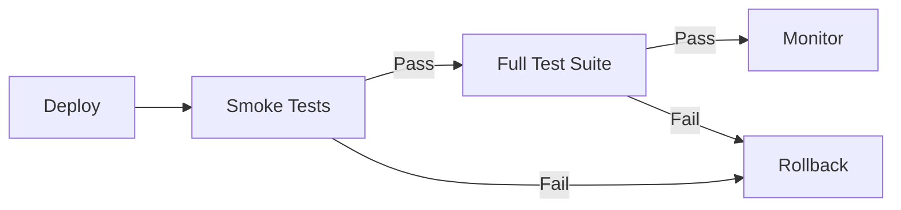

# How to Implement Smoke Testing Strategies

Author: [nawazdhandala](https://www.github.com/nawazdhandala)

Tags: Smoke Testing, Testing Strategy, CI/CD, Deployment, Quality Assurance, DevOps

Description: Learn how to implement effective smoke testing strategies to quickly verify deployments work before running comprehensive test suites.

---

You just deployed to production. Is it working? Smoke tests answer this question in seconds. They are quick sanity checks that verify critical functionality works. If smoke tests fail, you know immediately that something is broken and can roll back before users notice.

The term comes from hardware testing - if you power on a device and smoke comes out, you know something is wrong. Software smoke tests serve the same purpose: quick verification that the basics work.

## What Smoke Tests Should Cover

Smoke tests verify:
- Application starts and responds
- Database connections work
- External service integrations are reachable
- Critical user flows complete
- Authentication works
- Core API endpoints respond

Smoke tests do NOT:
- Test every feature
- Cover edge cases
- Verify business logic details
- Replace comprehensive test suites



## Basic Health Check Endpoint

Every service needs a health endpoint:

```javascript
// routes/health.js
const express = require('express');
const router = express.Router();
const db = require('../db');
const redis = require('../redis');

router.get('/health', async (req, res) => {
  const health = {
    status: 'healthy',
    timestamp: new Date().toISOString(),
    version: process.env.APP_VERSION || 'unknown',
    checks: {}
  };

  // Check database
  try {
    await db.raw('SELECT 1');
    health.checks.database = 'ok';
  } catch (error) {
    health.checks.database = 'failed';
    health.status = 'unhealthy';
  }

  // Check Redis
  try {
    await redis.ping();
    health.checks.redis = 'ok';
  } catch (error) {
    health.checks.redis = 'failed';
    health.status = 'unhealthy';
  }

  // Check external API
  try {
    const response = await fetch('https://api.stripe.com/v1/health', {
      timeout: 5000
    });
    health.checks.stripe = response.ok ? 'ok' : 'degraded';
  } catch (error) {
    health.checks.stripe = 'unreachable';
    // External API down might not be critical
  }

  const statusCode = health.status === 'healthy' ? 200 : 503;
  res.status(statusCode).json(health);
});

module.exports = router;
```

## Smoke Test Script

Create a standalone smoke test script:

```bash
#!/bin/bash
# smoke-test.sh - Quick deployment verification

set -e

BASE_URL="${1:-http://localhost:3000}"
TIMEOUT=10

echo "Running smoke tests against $BASE_URL"

# Test 1: Health endpoint
echo -n "Health check... "
HEALTH=$(curl -sf --max-time $TIMEOUT "$BASE_URL/health" || echo "FAILED")
if echo "$HEALTH" | grep -q '"status":"healthy"'; then
    echo "PASS"
else
    echo "FAIL"
    echo "$HEALTH"
    exit 1
fi

# Test 2: Homepage loads
echo -n "Homepage... "
HTTP_CODE=$(curl -sf -o /dev/null -w "%{http_code}" --max-time $TIMEOUT "$BASE_URL/")
if [ "$HTTP_CODE" = "200" ]; then
    echo "PASS"
else
    echo "FAIL (HTTP $HTTP_CODE)"
    exit 1
fi

# Test 3: API responds
echo -n "API endpoint... "
API_RESPONSE=$(curl -sf --max-time $TIMEOUT "$BASE_URL/api/status" || echo "FAILED")
if echo "$API_RESPONSE" | grep -q '"ok":true'; then
    echo "PASS"
else
    echo "FAIL"
    exit 1
fi

# Test 4: Static assets load
echo -n "Static assets... "
ASSET_CODE=$(curl -sf -o /dev/null -w "%{http_code}" --max-time $TIMEOUT "$BASE_URL/static/main.js")
if [ "$ASSET_CODE" = "200" ]; then
    echo "PASS"
else
    echo "FAIL (HTTP $ASSET_CODE)"
    exit 1
fi

# Test 5: Database-backed endpoint
echo -n "Database query... "
DB_RESPONSE=$(curl -sf --max-time $TIMEOUT "$BASE_URL/api/products?limit=1" || echo "FAILED")
if echo "$DB_RESPONSE" | grep -q '\['; then
    echo "PASS"
else
    echo "FAIL"
    exit 1
fi

echo ""
echo "All smoke tests passed!"
```

## JavaScript Smoke Tests

Using Jest and axios:

```javascript
// tests/smoke/smoke.test.js
const axios = require('axios');

const BASE_URL = process.env.BASE_URL || 'http://localhost:3000';
const TIMEOUT = 10000;

describe('Smoke Tests', () => {
  const client = axios.create({
    baseURL: BASE_URL,
    timeout: TIMEOUT,
    validateStatus: () => true // Don't throw on non-2xx
  });

  test('health endpoint returns healthy', async () => {
    const response = await client.get('/health');

    expect(response.status).toBe(200);
    expect(response.data.status).toBe('healthy');
    expect(response.data.checks.database).toBe('ok');
  });

  test('homepage loads', async () => {
    const response = await client.get('/');

    expect(response.status).toBe(200);
    expect(response.headers['content-type']).toContain('text/html');
  });

  test('API authentication works', async () => {
    // Test that auth endpoint responds
    const response = await client.post('/api/auth/login', {
      email: 'smoke-test@example.com',
      password: 'smoke-test-password'
    });

    // We expect either success or invalid credentials
    // Both indicate the auth system is working
    expect([200, 401]).toContain(response.status);
  });

  test('critical API endpoint responds', async () => {
    const response = await client.get('/api/products');

    expect(response.status).toBe(200);
    expect(Array.isArray(response.data)).toBe(true);
  });

  test('static assets are served', async () => {
    const response = await client.get('/favicon.ico');

    expect(response.status).toBe(200);
  });

  test('CORS headers are present', async () => {
    const response = await client.options('/api/products', {
      headers: {
        'Origin': 'https://example.com',
        'Access-Control-Request-Method': 'GET'
      }
    });

    expect(response.headers['access-control-allow-origin']).toBeDefined();
  });
});
```

Run smoke tests:

```bash
# Against local environment
BASE_URL=http://localhost:3000 npm run test:smoke

# Against staging
BASE_URL=https://staging.example.com npm run test:smoke

# Against production
BASE_URL=https://api.example.com npm run test:smoke
```

## Critical User Flow Tests

Test the most important user journeys:

```javascript
// tests/smoke/critical-flows.test.js
const { chromium } = require('playwright');

describe('Critical User Flows', () => {
  let browser;
  let page;

  beforeAll(async () => {
    browser = await chromium.launch();
  });

  afterAll(async () => {
    await browser.close();
  });

  beforeEach(async () => {
    page = await browser.newPage();
  });

  afterEach(async () => {
    await page.close();
  });

  test('user can view homepage and navigate to products', async () => {
    await page.goto(process.env.BASE_URL);

    // Homepage loads
    await expect(page.locator('h1')).toBeVisible();

    // Navigate to products
    await page.click('a[href="/products"]');

    // Products page loads
    await expect(page.locator('[data-testid="product-list"]')).toBeVisible();
  }, 30000);

  test('user can search for products', async () => {
    await page.goto(`${process.env.BASE_URL}/products`);

    // Enter search term
    await page.fill('[data-testid="search-input"]', 'test');
    await page.click('[data-testid="search-button"]');

    // Results appear
    await expect(page.locator('[data-testid="search-results"]')).toBeVisible();
  }, 30000);

  test('user can add item to cart', async () => {
    await page.goto(`${process.env.BASE_URL}/products/1`);

    // Add to cart
    await page.click('[data-testid="add-to-cart"]');

    // Cart updates
    await expect(page.locator('[data-testid="cart-count"]')).toHaveText('1');
  }, 30000);
});
```

## CI/CD Integration

### GitHub Actions

```yaml
# .github/workflows/deploy.yml
name: Deploy and Smoke Test

on:
  push:
    branches: [main]

jobs:
  deploy:
    runs-on: ubuntu-latest
    steps:
      - uses: actions/checkout@v4

      - name: Deploy to staging
        run: ./scripts/deploy.sh staging

      - name: Wait for deployment
        run: sleep 30

      - name: Run smoke tests
        run: |
          npm ci
          BASE_URL=https://staging.example.com npm run test:smoke

      - name: Deploy to production
        if: success()
        run: ./scripts/deploy.sh production

      - name: Smoke test production
        run: |
          sleep 30
          BASE_URL=https://api.example.com npm run test:smoke

      - name: Rollback on failure
        if: failure()
        run: ./scripts/rollback.sh
```

### Kubernetes Deployment

```yaml
# deployment.yaml with readiness probe
apiVersion: apps/v1
kind: Deployment
metadata:
  name: api-server
spec:
  template:
    spec:
      containers:
        - name: api
          image: myapp:latest
          ports:
            - containerPort: 3000
          readinessProbe:
            httpGet:
              path: /health
              port: 3000
            initialDelaySeconds: 10
            periodSeconds: 5
            failureThreshold: 3
          livenessProbe:
            httpGet:
              path: /health
              port: 3000
            initialDelaySeconds: 30
            periodSeconds: 10
```

### Post-Deployment Hook

```bash
#!/bin/bash
# hooks/post-deploy.sh

ENVIRONMENT=$1
BASE_URL=$2

echo "Running post-deployment smoke tests for $ENVIRONMENT"

# Run smoke tests
if ! npm run test:smoke; then
    echo "Smoke tests failed! Initiating rollback..."

    # Notify team
    curl -X POST "$SLACK_WEBHOOK" \
        -H 'Content-Type: application/json' \
        -d "{\"text\":\"Smoke tests failed for $ENVIRONMENT. Rolling back...\"}"

    # Trigger rollback
    kubectl rollout undo deployment/api-server

    exit 1
fi

echo "Smoke tests passed for $ENVIRONMENT"

# Notify success
curl -X POST "$SLACK_WEBHOOK" \
    -H 'Content-Type: application/json' \
    -d "{\"text\":\"Deployment to $ENVIRONMENT successful. All smoke tests passed.\"}"
```

## Monitoring Integration

Run smoke tests continuously in production:

```javascript
// monitoring/smoke-monitor.js
const cron = require('node-cron');
const axios = require('axios');
const { sendAlert } = require('./alerting');

const ENDPOINTS = [
  { name: 'Health', url: '/health', expected: 200 },
  { name: 'API', url: '/api/status', expected: 200 },
  { name: 'Homepage', url: '/', expected: 200 }
];

async function runSmokeTests() {
  const results = [];

  for (const endpoint of ENDPOINTS) {
    try {
      const start = Date.now();
      const response = await axios.get(
        `${process.env.BASE_URL}${endpoint.url}`,
        { timeout: 10000 }
      );
      const duration = Date.now() - start;

      results.push({
        name: endpoint.name,
        success: response.status === endpoint.expected,
        status: response.status,
        duration
      });
    } catch (error) {
      results.push({
        name: endpoint.name,
        success: false,
        error: error.message
      });
    }
  }

  // Check for failures
  const failures = results.filter(r => !r.success);
  if (failures.length > 0) {
    await sendAlert({
      severity: 'critical',
      message: `Smoke test failures: ${failures.map(f => f.name).join(', ')}`,
      details: failures
    });
  }

  // Record metrics
  results.forEach(r => {
    recordMetric('smoke_test_result', {
      endpoint: r.name,
      success: r.success ? 1 : 0,
      duration: r.duration || 0
    });
  });
}

// Run every 5 minutes
cron.schedule('*/5 * * * *', runSmokeTests);
```

## Best Practices

1. Keep smoke tests fast (under 2 minutes total)
2. Test only critical paths, not edge cases
3. Run smoke tests immediately after every deployment
4. Include smoke tests in deployment pipeline gates
5. Make smoke tests environment-agnostic
6. Alert immediately on smoke test failures
7. Have automated rollback on failure
8. Run smoke tests continuously in production

---

Smoke tests are your first line of defense against deployment failures. They catch catastrophic issues in seconds, giving you confidence to deploy frequently. Keep them fast, focused, and automated. When smoke tests pass, you know your application is alive and responding.
