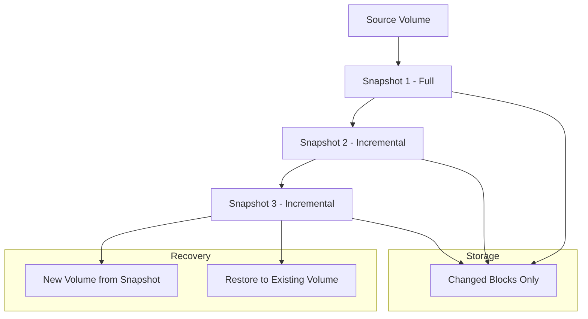

# How to Configure Snapshot Management

Author: [nawazdhandala](https://www.github.com/nawazdhandala)

Tags: Snapshots, Storage, Kubernetes, AWS, Backup

Description: A practical guide to managing storage snapshots across cloud providers and Kubernetes, covering creation, scheduling, retention, and recovery procedures.

---

Snapshots capture the state of storage volumes at a specific point in time. Unlike full backups that copy all data, snapshots record only changes since the last snapshot, making them fast and storage-efficient. This makes snapshots ideal for frequent protection points, pre-change checkpoints, and rapid recovery scenarios.

This guide covers snapshot management across major cloud providers and Kubernetes environments.

## Why Snapshots?

Snapshots provide several advantages over traditional backups:

1. **Speed:** Creating a snapshot takes seconds, regardless of volume size
2. **Efficiency:** Only changed blocks are stored after the initial snapshot
3. **Consistency:** Application-consistent snapshots capture coherent state
4. **Recovery:** Restore entire volumes or create new volumes from snapshots

The tradeoff is that snapshots typically live in the same region as the source volume. They are not a substitute for off-site backups.

## Snapshot Architecture



## AWS EBS Snapshot Management

### Creating Snapshots

```bash
# Create snapshot of a volume
aws ec2 create-snapshot \
    --volume-id vol-0123456789abcdef \
    --description "Manual snapshot before upgrade" \
    --tag-specifications 'ResourceType=snapshot,Tags=[{Key=Name,Value=prod-db-snapshot},{Key=Environment,Value=production}]'

# Create snapshot with instance metadata
INSTANCE_ID=$(curl -s http://169.254.169.254/latest/meta-data/instance-id)
VOLUME_ID=$(aws ec2 describe-instances \
    --instance-id "$INSTANCE_ID" \
    --query 'Reservations[0].Instances[0].BlockDeviceMappings[0].Ebs.VolumeId' \
    --output text)

aws ec2 create-snapshot \
    --volume-id "$VOLUME_ID" \
    --description "Automated snapshot from $INSTANCE_ID"
```

### Scheduling with Data Lifecycle Manager

```bash
# Create DLM lifecycle policy
aws dlm create-lifecycle-policy \
    --description "Daily EBS snapshots" \
    --state ENABLED \
    --execution-role-arn arn:aws:iam::123456789012:role/AWSDataLifecycleManagerDefaultRole \
    --policy-details '{
        "PolicyType": "EBS_SNAPSHOT_MANAGEMENT",
        "ResourceTypes": ["VOLUME"],
        "TargetTags": [{"Key": "Backup", "Value": "true"}],
        "Schedules": [{
            "Name": "Daily",
            "CopyTags": true,
            "TagsToAdd": [{"Key": "SnapshotType", "Value": "automated"}],
            "CreateRule": {
                "Interval": 24,
                "IntervalUnit": "HOURS",
                "Times": ["03:00"]
            },
            "RetainRule": {
                "Count": 7
            }
        }]
    }'
```

### Cross-Region Snapshot Copy

```bash
# Copy snapshot to another region
aws ec2 copy-snapshot \
    --source-region us-east-1 \
    --source-snapshot-id snap-0123456789abcdef \
    --destination-region us-west-2 \
    --description "DR copy of prod-db snapshot"

# Automated cross-region in DLM
# Add to policy-details:
{
    "CrossRegionCopyRules": [{
        "TargetRegion": "us-west-2",
        "Encrypted": true,
        "CmkArn": "arn:aws:kms:us-west-2:123456789012:key/xxx",
        "CopyTags": true,
        "RetainRule": {"Interval": 7, "IntervalUnit": "DAYS"}
    }]
}
```

### Restoring from Snapshots

```bash
# Create new volume from snapshot
aws ec2 create-volume \
    --snapshot-id snap-0123456789abcdef \
    --availability-zone us-east-1a \
    --volume-type gp3 \
    --iops 3000 \
    --throughput 125

# Attach to instance
aws ec2 attach-volume \
    --volume-id vol-new123456 \
    --instance-id i-0123456789abcdef \
    --device /dev/sdf
```

## Azure Managed Disk Snapshots

### Creating Snapshots

```bash
# Create snapshot
az snapshot create \
    --name prod-db-snapshot \
    --resource-group myresources \
    --source /subscriptions/xxx/resourceGroups/myresources/providers/Microsoft.Compute/disks/prod-db-disk \
    --tags Environment=production BackupType=manual

# Create incremental snapshot (recommended for cost)
az snapshot create \
    --name prod-db-snapshot-incremental \
    --resource-group myresources \
    --source prod-db-disk \
    --incremental true
```

### Scheduling with Azure Backup

```bash
# Create backup vault
az backup vault create \
    --name backup-vault \
    --resource-group myresources \
    --location eastus

# Create backup policy
az backup policy create \
    --vault-name backup-vault \
    --resource-group myresources \
    --name daily-snapshot-policy \
    --policy '{
        "schedulePolicy": {
            "schedulePolicyType": "SimpleSchedulePolicy",
            "scheduleRunFrequency": "Daily",
            "scheduleRunTimes": ["2026-01-25T03:00:00Z"]
        },
        "retentionPolicy": {
            "retentionPolicyType": "LongTermRetentionPolicy",
            "dailySchedule": {
                "retentionTimes": ["2026-01-25T03:00:00Z"],
                "retentionDuration": {"count": 7, "durationType": "Days"}
            }
        }
    }'
```

### Restoring from Snapshots

```bash
# Create disk from snapshot
az disk create \
    --name restored-disk \
    --resource-group myresources \
    --source prod-db-snapshot \
    --sku Premium_LRS

# Attach to VM
az vm disk attach \
    --vm-name myvm \
    --resource-group myresources \
    --disk restored-disk
```

## Google Cloud Persistent Disk Snapshots

### Creating Snapshots

```bash
# Create snapshot
gcloud compute disks snapshot prod-db-disk \
    --zone=us-central1-a \
    --snapshot-names=prod-db-snapshot-$(date +%Y%m%d) \
    --labels=environment=production,backup-type=manual

# Create snapshot with guest flush (application consistent)
gcloud compute disks snapshot prod-db-disk \
    --zone=us-central1-a \
    --snapshot-names=prod-db-snapshot-consistent \
    --guest-flush
```

### Scheduling with Snapshot Schedules

```bash
# Create snapshot schedule
gcloud compute resource-policies create snapshot-schedule daily-snapshots \
    --region=us-central1 \
    --max-retention-days=7 \
    --on-source-disk-delete=apply-retention-policy \
    --daily-schedule \
    --start-time=03:00

# Attach schedule to disk
gcloud compute disks add-resource-policies prod-db-disk \
    --zone=us-central1-a \
    --resource-policies=daily-snapshots
```

### Restoring from Snapshots

```bash
# Create disk from snapshot
gcloud compute disks create restored-disk \
    --source-snapshot=prod-db-snapshot-20260125 \
    --zone=us-central1-a \
    --type=pd-ssd

# Attach to instance
gcloud compute instances attach-disk myinstance \
    --disk=restored-disk \
    --zone=us-central1-a
```

## Kubernetes Volume Snapshots

Kubernetes uses the VolumeSnapshot API for CSI-based snapshots.

### VolumeSnapshotClass

```yaml
# volumesnapshotclass.yaml
apiVersion: snapshot.storage.k8s.io/v1
kind: VolumeSnapshotClass
metadata:
  name: csi-snapclass
driver: ebs.csi.aws.com  # or pd.csi.storage.gke.io, disk.csi.azure.com
deletionPolicy: Delete
parameters:
  # Provider-specific parameters
```

### Creating VolumeSnapshots

```yaml
# volumesnapshot.yaml
apiVersion: snapshot.storage.k8s.io/v1
kind: VolumeSnapshot
metadata:
  name: postgres-snapshot-20260125
  namespace: production
  labels:
    app: postgres
    snapshot-type: manual
spec:
  volumeSnapshotClassName: csi-snapclass
  source:
    persistentVolumeClaimName: postgres-data
```

```bash
# Create snapshot
kubectl apply -f volumesnapshot.yaml

# Check snapshot status
kubectl get volumesnapshot postgres-snapshot-20260125 -n production
kubectl describe volumesnapshot postgres-snapshot-20260125 -n production
```

### Scheduled Snapshots with CronJob

```yaml
# snapshot-cronjob.yaml
apiVersion: batch/v1
kind: CronJob
metadata:
  name: postgres-snapshot-job
  namespace: production
spec:
  schedule: "0 3 * * *"  # Daily at 3 AM
  jobTemplate:
    spec:
      template:
        spec:
          serviceAccountName: snapshot-creator
          containers:
            - name: snapshot-creator
              image: bitnami/kubectl:latest
              command:
                - /bin/bash
                - -c
                - |
                  SNAPSHOT_NAME="postgres-snapshot-$(date +%Y%m%d-%H%M%S)"
                  cat <<EOF | kubectl apply -f -
                  apiVersion: snapshot.storage.k8s.io/v1
                  kind: VolumeSnapshot
                  metadata:
                    name: $SNAPSHOT_NAME
                    namespace: production
                  spec:
                    volumeSnapshotClassName: csi-snapclass
                    source:
                      persistentVolumeClaimName: postgres-data
                  EOF

                  # Clean up old snapshots (keep last 7)
                  kubectl get volumesnapshot -n production \
                    --sort-by=.metadata.creationTimestamp \
                    -o name | head -n -7 | xargs -r kubectl delete -n production
          restartPolicy: OnFailure
```

### Restoring from VolumeSnapshot

```yaml
# pvc-from-snapshot.yaml
apiVersion: v1
kind: PersistentVolumeClaim
metadata:
  name: postgres-restored
  namespace: production
spec:
  storageClassName: gp3
  dataSource:
    name: postgres-snapshot-20260125
    kind: VolumeSnapshot
    apiGroup: snapshot.storage.k8s.io
  accessModes:
    - ReadWriteOnce
  resources:
    requests:
      storage: 100Gi
```

## Snapshot Management Script

Comprehensive snapshot management:

```bash
#!/bin/bash
# snapshot-manager.sh

set -euo pipefail

ACTION="${1:-help}"
VOLUME_ID="${2:-}"
RETENTION_DAYS="${3:-7}"

create_snapshot() {
    local volume_id="$1"
    local description="Automated snapshot $(date +%Y-%m-%d)"

    echo "Creating snapshot of $volume_id..."

    SNAPSHOT_ID=$(aws ec2 create-snapshot \
        --volume-id "$volume_id" \
        --description "$description" \
        --tag-specifications "ResourceType=snapshot,Tags=[{Key=Name,Value=auto-snapshot-$(date +%Y%m%d)},{Key=AutoDelete,Value=true},{Key=CreatedBy,Value=snapshot-manager}]" \
        --query 'SnapshotId' \
        --output text)

    echo "Created snapshot: $SNAPSHOT_ID"

    # Wait for completion
    aws ec2 wait snapshot-completed --snapshot-ids "$SNAPSHOT_ID"
    echo "Snapshot completed"
}

list_snapshots() {
    local volume_id="$1"

    echo "Snapshots for volume $volume_id:"
    aws ec2 describe-snapshots \
        --filters "Name=volume-id,Values=$volume_id" \
        --query 'Snapshots[*].[SnapshotId,StartTime,State,Description]' \
        --output table
}

cleanup_snapshots() {
    local volume_id="$1"
    local retention_days="$2"

    echo "Cleaning up snapshots older than $retention_days days..."

    CUTOFF_DATE=$(date -d "$retention_days days ago" +%Y-%m-%d)

    OLD_SNAPSHOTS=$(aws ec2 describe-snapshots \
        --filters "Name=volume-id,Values=$volume_id" "Name=tag:AutoDelete,Values=true" \
        --query "Snapshots[?StartTime<='$CUTOFF_DATE'].SnapshotId" \
        --output text)

    for snapshot_id in $OLD_SNAPSHOTS; do
        echo "Deleting snapshot: $snapshot_id"
        aws ec2 delete-snapshot --snapshot-id "$snapshot_id"
    done

    echo "Cleanup complete"
}

restore_snapshot() {
    local snapshot_id="$1"
    local availability_zone="${2:-us-east-1a}"

    echo "Creating volume from snapshot $snapshot_id..."

    VOLUME_ID=$(aws ec2 create-volume \
        --snapshot-id "$snapshot_id" \
        --availability-zone "$availability_zone" \
        --volume-type gp3 \
        --query 'VolumeId' \
        --output text)

    echo "Created volume: $VOLUME_ID"

    aws ec2 wait volume-available --volume-ids "$VOLUME_ID"
    echo "Volume available"
}

case "$ACTION" in
    create)
        [ -z "$VOLUME_ID" ] && { echo "Usage: $0 create <volume-id>"; exit 1; }
        create_snapshot "$VOLUME_ID"
        ;;
    list)
        [ -z "$VOLUME_ID" ] && { echo "Usage: $0 list <volume-id>"; exit 1; }
        list_snapshots "$VOLUME_ID"
        ;;
    cleanup)
        [ -z "$VOLUME_ID" ] && { echo "Usage: $0 cleanup <volume-id> [retention-days]"; exit 1; }
        cleanup_snapshots "$VOLUME_ID" "$RETENTION_DAYS"
        ;;
    restore)
        [ -z "$VOLUME_ID" ] && { echo "Usage: $0 restore <snapshot-id> [availability-zone]"; exit 1; }
        restore_snapshot "$VOLUME_ID" "${3:-us-east-1a}"
        ;;
    *)
        echo "Usage: $0 {create|list|cleanup|restore} <args>"
        echo "  create <volume-id>                    - Create snapshot"
        echo "  list <volume-id>                      - List snapshots"
        echo "  cleanup <volume-id> [retention-days]  - Delete old snapshots"
        echo "  restore <snapshot-id> [az]            - Create volume from snapshot"
        ;;
esac
```

## Monitoring Snapshots

Track snapshot health and costs:

```python
#!/usr/bin/env python3
# monitor_snapshots.py

import boto3
from datetime import datetime, timedelta

def get_snapshot_metrics(region='us-east-1'):
    """Gather snapshot metrics."""

    ec2 = boto3.client('ec2', region_name=region)

    snapshots = ec2.describe_snapshots(OwnerIds=['self'])['Snapshots']

    metrics = {
        'total_count': len(snapshots),
        'total_size_gb': 0,
        'pending': 0,
        'completed': 0,
        'error': 0,
        'age_distribution': {
            '0-7 days': 0,
            '8-30 days': 0,
            '31-90 days': 0,
            '90+ days': 0
        }
    }

    for snapshot in snapshots:
        metrics['total_size_gb'] += snapshot['VolumeSize']

        if snapshot['State'] == 'pending':
            metrics['pending'] += 1
        elif snapshot['State'] == 'completed':
            metrics['completed'] += 1
        elif snapshot['State'] == 'error':
            metrics['error'] += 1

        age = (datetime.now(snapshot['StartTime'].tzinfo) - snapshot['StartTime']).days
        if age <= 7:
            metrics['age_distribution']['0-7 days'] += 1
        elif age <= 30:
            metrics['age_distribution']['8-30 days'] += 1
        elif age <= 90:
            metrics['age_distribution']['31-90 days'] += 1
        else:
            metrics['age_distribution']['90+ days'] += 1

    return metrics

def report_metrics(metrics):
    """Print snapshot metrics report."""

    print("=== Snapshot Metrics Report ===")
    print(f"Total Snapshots: {metrics['total_count']}")
    print(f"Total Size: {metrics['total_size_gb']} GB")
    print(f"Estimated Monthly Cost: ${metrics['total_size_gb'] * 0.05:.2f}")
    print(f"\nStatus:")
    print(f"  Completed: {metrics['completed']}")
    print(f"  Pending: {metrics['pending']}")
    print(f"  Error: {metrics['error']}")
    print(f"\nAge Distribution:")
    for period, count in metrics['age_distribution'].items():
        print(f"  {period}: {count}")

if __name__ == "__main__":
    metrics = get_snapshot_metrics()
    report_metrics(metrics)
```

## Best Practices

1. **Use incremental snapshots.** Modern snapshot systems only store changed blocks. Frequent snapshots are cheap.

2. **Tag everything.** Tags enable automation for retention, cost allocation, and identification.

3. **Test restores.** Periodically restore snapshots to verify they are usable.

4. **Automate retention.** Use DLM, resource policies, or custom scripts to enforce retention.

5. **Copy critical snapshots cross-region.** Snapshots in a single region do not protect against regional failures.

6. **Consider application consistency.** Use freeze/thaw hooks or VSS for database-consistent snapshots.

## Wrapping Up

Snapshots are the foundation of rapid recovery and change management. Their speed and efficiency make frequent protection points practical. Combine automated schedules with cross-region copies for comprehensive protection. The key is automation. Manual snapshot management does not scale and inevitably leads to gaps in protection.
