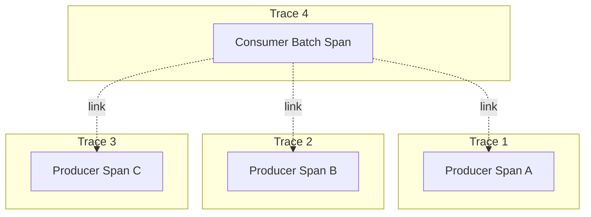

# How to Implement Span Links in OpenTelemetry

Author: [nawazdhandala](https://www.github.com/nawazdhandala)

Tags: OpenTelemetry, Span Links, Tracing, Distributed Tracing, Async Processing, Message Queues, Observability

Description: Learn how to use span links in OpenTelemetry to connect related but non-parent-child traces, including batch processing, fan-out patterns, and async workflows.

---

Traditional distributed traces follow a parent-child relationship. A service calls another service, creating a child span. But many real-world patterns do not fit this model: a queue consumer processing messages from multiple producers, a batch job aggregating work from various sources, or a request triggering multiple parallel workflows. Span links solve this by connecting related spans without implying a parent-child relationship.

## Understanding Span Links

A span link is a reference from one span to another span context. Unlike the parent-child relationship, links are:

- **Non-hierarchical**: Links do not establish a parent-child relationship
- **Multi-directional**: A span can link to multiple other spans
- **Cross-trace**: Links can connect spans from different traces
- **Attributable**: Each link can carry its own attributes

Use span links when:
- Processing batched messages from multiple sources
- Fan-out operations triggering parallel processing
- Scheduled jobs processing queued work
- Aggregation of multiple upstream requests

## Basic Link Creation

Here is how to create span links in different languages.

### Node.js

```javascript
const { trace, SpanKind } = require('@opentelemetry/api');

const tracer = trace.getTracer('batch-processor');

async function processBatch(messages) {
  // Collect span contexts from all messages
  const links = messages.map(msg => ({
    context: msg.spanContext,  // SpanContext from producer
    attributes: {
      'messaging.message_id': msg.id,
      'messaging.source': msg.source,
    },
  }));

  // Create span with links to all message producers
  return tracer.startActiveSpan('process-batch', {
    kind: SpanKind.CONSUMER,
    links: links,
  }, async (span) => {
    span.setAttribute('batch.size', messages.length);
    span.setAttribute('batch.id', generateBatchId());

    try {
      for (const message of messages) {
        await processMessage(message);
      }
      return { success: true, processed: messages.length };
    } catch (error) {
      span.recordException(error);
      span.setStatus({ code: 2, message: error.message });
      throw error;
    } finally {
      span.end();
    }
  });
}
```

### Python

```python
from opentelemetry import trace
from opentelemetry.trace import SpanKind, Link

tracer = trace.get_tracer('batch-processor')

def process_batch(messages):
    # Create links from message span contexts
    links = [
        Link(
            context=msg['span_context'],
            attributes={
                'messaging.message_id': msg['id'],
                'messaging.source': msg['source'],
            }
        )
        for msg in messages
    ]

    # Create span with links
    with tracer.start_as_current_span(
        'process-batch',
        kind=SpanKind.CONSUMER,
        links=links,
    ) as span:
        span.set_attribute('batch.size', len(messages))
        span.set_attribute('batch.id', generate_batch_id())

        for message in messages:
            process_message(message)

        return {'success': True, 'processed': len(messages)}
```

### Go

```go
package main

import (
    "context"
    "go.opentelemetry.io/otel"
    "go.opentelemetry.io/otel/attribute"
    "go.opentelemetry.io/otel/trace"
)

var tracer = otel.Tracer("batch-processor")

func ProcessBatch(ctx context.Context, messages []Message) (Result, error) {
    // Build links from message contexts
    links := make([]trace.Link, len(messages))
    for i, msg := range messages {
        links[i] = trace.Link{
            SpanContext: msg.SpanContext,
            Attributes: []attribute.KeyValue{
                attribute.String("messaging.message_id", msg.ID),
                attribute.String("messaging.source", msg.Source),
            },
        }
    }

    // Start span with links
    ctx, span := tracer.Start(ctx, "process-batch",
        trace.WithSpanKind(trace.SpanKindConsumer),
        trace.WithLinks(links...),
    )
    defer span.End()

    span.SetAttributes(
        attribute.Int("batch.size", len(messages)),
        attribute.String("batch.id", generateBatchID()),
    )

    for _, msg := range messages {
        if err := processMessage(ctx, msg); err != nil {
            span.RecordError(err)
            return Result{}, err
        }
    }

    return Result{Success: true, Processed: len(messages)}, nil
}
```

### Java

```java
import io.opentelemetry.api.GlobalOpenTelemetry;
import io.opentelemetry.api.trace.*;
import io.opentelemetry.api.common.Attributes;
import java.util.List;
import java.util.stream.Collectors;

public class BatchProcessor {
    private static final Tracer tracer = GlobalOpenTelemetry.getTracer("batch-processor");

    public Result processBatch(List<Message> messages) {
        // Build links from message contexts
        List<LinkData> links = messages.stream()
            .map(msg -> LinkData.create(
                msg.getSpanContext(),
                Attributes.builder()
                    .put("messaging.message_id", msg.getId())
                    .put("messaging.source", msg.getSource())
                    .build()
            ))
            .collect(Collectors.toList());

        SpanBuilder spanBuilder = tracer.spanBuilder("process-batch")
            .setSpanKind(SpanKind.CONSUMER);

        // Add all links
        for (LinkData link : links) {
            spanBuilder.addLink(link.getSpanContext(), link.getAttributes());
        }

        Span span = spanBuilder.startSpan();

        try {
            span.setAttribute("batch.size", messages.size());
            span.setAttribute("batch.id", generateBatchId());

            for (Message msg : messages) {
                processMessage(msg);
            }

            return new Result(true, messages.size());
        } catch (Exception e) {
            span.recordException(e);
            span.setStatus(StatusCode.ERROR, e.getMessage());
            throw e;
        } finally {
            span.end();
        }
    }
}
```

## Common Use Cases

### Message Queue Consumer

When a consumer processes messages from multiple producers:

```javascript
const { trace, SpanKind, propagation } = require('@opentelemetry/api');

const tracer = trace.getTracer('queue-consumer');

async function consumeMessages(messages) {
  // Extract span context from each message header
  const links = messages.map(msg => {
    const parentContext = propagation.extract(
      context.active(),
      msg.headers
    );
    const spanContext = trace.getSpanContext(parentContext);

    return {
      context: spanContext,
      attributes: {
        'messaging.message_id': msg.id,
        'messaging.kafka.partition': msg.partition,
        'messaging.kafka.offset': msg.offset,
      },
    };
  }).filter(link => link.context); // Filter out invalid contexts

  return tracer.startActiveSpan('consume-messages', {
    kind: SpanKind.CONSUMER,
    links: links,
    attributes: {
      'messaging.system': 'kafka',
      'messaging.destination': 'orders-topic',
      'messaging.operation': 'receive',
    },
  }, async (span) => {
    span.setAttribute('messaging.batch_size', messages.length);

    const results = await Promise.all(
      messages.map(msg => processMessage(msg))
    );

    span.setAttribute('messaging.processed_count', results.filter(r => r.success).length);
    span.end();
    return results;
  });
}
```

### Fan-Out Pattern

When a single request triggers multiple parallel operations:

```javascript
const tracer = trace.getTracer('notification-service');

async function sendNotifications(event) {
  return tracer.startActiveSpan('send-notifications', async (triggerSpan) => {
    triggerSpan.setAttribute('event.type', event.type);
    triggerSpan.setAttribute('event.id', event.id);

    // Capture the trigger span context for linking
    const triggerContext = triggerSpan.spanContext();

    // Fan out to multiple channels
    const channels = ['email', 'sms', 'push', 'slack'];
    const notificationPromises = channels.map(channel =>
      sendToChannel(channel, event, triggerContext)
    );

    const results = await Promise.all(notificationPromises);

    triggerSpan.setAttribute('notifications.sent', results.filter(r => r.sent).length);
    triggerSpan.end();

    return results;
  });
}

async function sendToChannel(channel, event, triggerContext) {
  // Each channel operation links back to the trigger
  return tracer.startActiveSpan(`send-${channel}`, {
    links: [{
      context: triggerContext,
      attributes: {
        'link.type': 'triggered_by',
        'event.id': event.id,
      },
    }],
  }, async (span) => {
    span.setAttribute('notification.channel', channel);
    span.setAttribute('notification.recipient', event.userId);

    try {
      await deliverNotification(channel, event);
      span.setAttribute('notification.status', 'sent');
      return { channel, sent: true };
    } catch (error) {
      span.recordException(error);
      span.setAttribute('notification.status', 'failed');
      return { channel, sent: false, error: error.message };
    } finally {
      span.end();
    }
  });
}
```

### Scheduled Job Processing Queued Work

When a scheduled job processes work items created by earlier requests:

```javascript
const tracer = trace.getTracer('report-generator');

async function generateDailyReports() {
  return tracer.startActiveSpan('generate-daily-reports', async (jobSpan) => {
    jobSpan.setAttribute('job.type', 'scheduled');
    jobSpan.setAttribute('job.schedule', 'daily');

    // Fetch pending report requests
    const requests = await fetchPendingReportRequests();

    // Create links to all original requests
    const links = requests
      .filter(req => req.traceContext)
      .map(req => ({
        context: req.traceContext,
        attributes: {
          'report.request_id': req.id,
          'report.user_id': req.userId,
          'report.requested_at': req.createdAt,
        },
      }));

    // Process with links to original requests
    return tracer.startActiveSpan('process-report-batch', {
      links: links,
    }, async (processSpan) => {
      processSpan.setAttribute('batch.size', requests.length);

      const reports = [];
      for (const request of requests) {
        const report = await generateReport(request);
        reports.push(report);
      }

      processSpan.setAttribute('reports.generated', reports.length);
      processSpan.end();
      jobSpan.end();

      return reports;
    });
  });
}
```

### Aggregation Pattern

When aggregating results from multiple sources:

```javascript
const tracer = trace.getTracer('aggregator');

async function aggregateSearchResults(query) {
  return tracer.startActiveSpan('aggregate-search', async (span) => {
    span.setAttribute('search.query', query);

    // Search multiple backends in parallel
    const searchPromises = [
      searchBackend('products', query),
      searchBackend('articles', query),
      searchBackend('users', query),
    ];

    const results = await Promise.all(searchPromises);

    // Collect span contexts from each search
    const links = results
      .filter(r => r.spanContext)
      .map(r => ({
        context: r.spanContext,
        attributes: {
          'search.backend': r.backend,
          'search.result_count': r.items.length,
        },
      }));

    // Create aggregation span with links to source searches
    return tracer.startActiveSpan('merge-results', {
      links: links,
    }, async (mergeSpan) => {
      const merged = mergeAndRank(results);
      mergeSpan.setAttribute('results.total', merged.length);
      mergeSpan.end();
      span.end();
      return merged;
    });
  });
}

async function searchBackend(backend, query) {
  return tracer.startActiveSpan(`search-${backend}`, async (span) => {
    span.setAttribute('search.backend', backend);

    const items = await executeSearch(backend, query);

    span.setAttribute('search.result_count', items.length);
    span.end();

    return {
      backend,
      items,
      spanContext: span.spanContext(),
    };
  });
}
```

## Preserving Context for Links

To create links, you need the span context from the original operation. Here is how to preserve it.

### In Message Headers

```javascript
// Producer: Inject context into message
function publishMessage(topic, payload) {
  const headers = {};
  propagation.inject(context.active(), headers);

  return kafka.send({
    topic,
    messages: [{
      value: JSON.stringify(payload),
      headers: headers,
    }],
  });
}

// Consumer: Extract context for linking
function extractLinkContext(message) {
  const parentContext = propagation.extract(context.active(), message.headers);
  return trace.getSpanContext(parentContext);
}
```

### In Database Records

```javascript
// When creating a work item
async function createWorkItem(data) {
  const span = trace.getActiveSpan();
  const spanContext = span?.spanContext();

  return db.workItems.create({
    ...data,
    // Store serialized trace context
    traceId: spanContext?.traceId,
    spanId: spanContext?.spanId,
    traceFlags: spanContext?.traceFlags,
  });
}

// When processing the work item
function reconstructSpanContext(record) {
  if (!record.traceId || !record.spanId) return null;

  return {
    traceId: record.traceId,
    spanId: record.spanId,
    traceFlags: record.traceFlags || 0,
    isRemote: true,
  };
}
```

## Visualizing Linked Traces

Observability backends display links differently. In most UIs, you will see:
- Links listed in the span details
- The ability to navigate to linked traces
- Attributes on each link providing context



The dashed lines represent links, connecting the consumer span to each producer span without establishing a parent-child hierarchy.

## Best Practices

1. **Add meaningful attributes to links**: Include identifiers that help understand the relationship
2. **Limit the number of links**: Most backends have limits (typically 128 links per span)
3. **Filter invalid contexts**: Check that span contexts are valid before creating links
4. **Use descriptive link types**: Add a `link.type` attribute (e.g., "triggered_by", "aggregated_from")
5. **Preserve context early**: Store span context when creating work items, not when processing them

## Conclusion

Span links extend OpenTelemetry's tracing model to handle real-world asynchronous and aggregation patterns. They connect related work across trace boundaries without forcing an artificial parent-child hierarchy. Use them for batch processing, fan-out operations, scheduled jobs, and anywhere multiple independent operations contribute to a single outcome. With proper context preservation and meaningful link attributes, you can trace complex workflows that span multiple traces and time periods.
