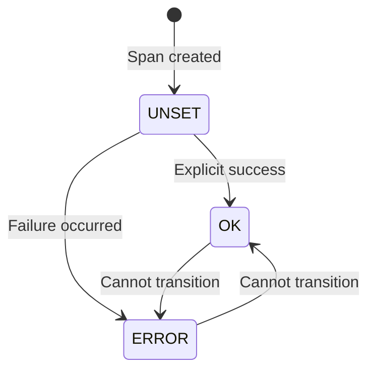

# How to Implement Span Status in OpenTelemetry

Author: [nawazdhandala](https://www.github.com/nawazdhandala)

Tags: OpenTelemetry, Span Status, Error Handling, Tracing, Observability, Debugging

Description: Learn how to properly implement span status in OpenTelemetry to indicate success, errors, and unset states. This guide covers status codes, best practices, and common patterns for accurate error representation.

---

Span status tells you whether an operation succeeded or failed. It sounds simple, but getting it right is crucial for accurate error tracking and alerting. Incorrectly set status codes lead to false positives, missed errors, or confusion about what actually went wrong.

This guide covers the proper implementation of span status in OpenTelemetry.

## Understanding Span Status Codes

OpenTelemetry defines three status codes:

| Code | Name | When to Use |
|------|------|-------------|
| 0 | UNSET | Default, let the system decide based on span data |
| 1 | OK | Operation completed successfully (explicit success) |
| 2 | ERROR | Operation failed |



## Basic Status Setting

### Node.js Implementation

```javascript
// status-basics.js
const { trace, SpanStatusCode } = require('@opentelemetry/api');

const tracer = trace.getTracer('order-service');

async function processOrder(orderData) {
  const span = tracer.startSpan('process-order');

  try {
    const result = await doOrderProcessing(orderData);

    // Explicitly mark as successful
    span.setStatus({ code: SpanStatusCode.OK });

    return result;
  } catch (error) {
    // Mark as error with message
    span.setStatus({
      code: SpanStatusCode.ERROR,
      message: error.message
    });

    // Record the exception for stack trace
    span.recordException(error);

    throw error;
  } finally {
    span.end();
  }
}
```

### Python Implementation

```python
# status_basics.py
from opentelemetry import trace
from opentelemetry.trace import Status, StatusCode

tracer = trace.get_tracer("order-service")

def process_order(order_data):
    with tracer.start_as_current_span("process-order") as span:
        try:
            result = do_order_processing(order_data)

            # Explicitly mark as successful
            span.set_status(Status(StatusCode.OK))

            return result
        except Exception as e:
            # Mark as error with message
            span.set_status(Status(StatusCode.ERROR, str(e)))
            span.record_exception(e)
            raise
```

## When to Use Each Status Code

### UNSET (Code 0)

Leave status as UNSET when you want downstream systems to interpret success or failure:

```javascript
// unset-example.js
async function fetchData(url) {
  const span = tracer.startSpan('fetch-data');

  try {
    const response = await fetch(url);
    span.setAttribute('http.status_code', response.status);

    // Leave status UNSET - let the backend interpret based on http.status_code
    // The observability backend can apply its own rules for what constitutes an error

    return response.json();
  } finally {
    span.end();
  }
}
```

Use UNSET when:
- Auto-instrumentation handles the span (it will set status appropriately)
- You want the backend to apply rules based on attributes
- The outcome is ambiguous (partial success, warnings)

### OK (Code 1)

Set OK when you want to explicitly indicate success:

```javascript
// ok-example.js
async function healthCheck() {
  const span = tracer.startSpan('health-check');

  try {
    await checkDatabase();
    await checkCache();
    await checkExternalServices();

    // All checks passed - explicitly mark as OK
    span.setStatus({ code: SpanStatusCode.OK });

    return { healthy: true };
  } catch (error) {
    span.setStatus({ code: SpanStatusCode.ERROR, message: error.message });
    span.recordException(error);
    return { healthy: false, error: error.message };
  } finally {
    span.end();
  }
}
```

Use OK when:
- You want to override automatic error detection
- The operation has specific success criteria you have validated
- Distinguishing explicit success from unset status matters

### ERROR (Code 2)

Set ERROR when the operation fails:

```javascript
// error-example.js
async function processPayment(payment) {
  const span = tracer.startSpan('process-payment');

  try {
    const result = await paymentGateway.charge(payment);

    if (result.status === 'declined') {
      // Payment declined is an error from our perspective
      span.setStatus({
        code: SpanStatusCode.ERROR,
        message: `Payment declined: ${result.reason}`
      });
      span.setAttribute('payment.decline_reason', result.reason);
      return { success: false, reason: result.reason };
    }

    span.setStatus({ code: SpanStatusCode.OK });
    return { success: true, transactionId: result.id };
  } catch (error) {
    span.setStatus({
      code: SpanStatusCode.ERROR,
      message: error.message
    });
    span.recordException(error);
    throw error;
  } finally {
    span.end();
  }
}
```

## HTTP Status Code Mapping

For HTTP spans, map status codes appropriately:

```javascript
// http-status-mapping.js
const { SpanStatusCode } = require('@opentelemetry/api');

function setHttpSpanStatus(span, httpStatusCode) {
  span.setAttribute('http.status_code', httpStatusCode);

  // Only set ERROR for 5xx server errors
  // 4xx are client errors, not server errors
  if (httpStatusCode >= 500) {
    span.setStatus({
      code: SpanStatusCode.ERROR,
      message: `HTTP ${httpStatusCode}`
    });
  }
  // Leave as UNSET for 2xx, 3xx, 4xx
  // Or explicitly set OK for 2xx if preferred
}

// Example middleware
function responseHandler(req, res, span) {
  res.on('finish', () => {
    setHttpSpanStatus(span, res.statusCode);
    span.end();
  });
}
```

### Alternative: Treating 4xx as Errors

Some teams prefer treating 4xx as errors for their use case:

```javascript
// strict-http-status.js
function setStrictHttpStatus(span, httpStatusCode) {
  span.setAttribute('http.status_code', httpStatusCode);

  if (httpStatusCode >= 400) {
    span.setStatus({
      code: SpanStatusCode.ERROR,
      message: `HTTP ${httpStatusCode}`
    });
  } else {
    span.setStatus({ code: SpanStatusCode.OK });
  }
}
```

## Database Operation Status

```python
# database_status.py
from opentelemetry import trace
from opentelemetry.trace import Status, StatusCode

tracer = trace.get_tracer("database")

def execute_query(connection, query, params=None):
    with tracer.start_as_current_span("db.query") as span:
        span.set_attribute("db.statement", sanitize_query(query))

        try:
            cursor = connection.cursor()
            cursor.execute(query, params or [])
            result = cursor.fetchall()

            # Query succeeded
            span.set_attribute("db.rows_returned", len(result))
            span.set_status(Status(StatusCode.OK))

            return result

        except connection.IntegrityError as e:
            # Constraint violation - client error, but we still mark as error
            # because the operation did not complete successfully
            span.set_status(Status(StatusCode.ERROR, "Integrity violation"))
            span.record_exception(e)
            raise

        except connection.OperationalError as e:
            # Database connectivity issue - definitely an error
            span.set_status(Status(StatusCode.ERROR, "Database unavailable"))
            span.record_exception(e)
            raise

        except Exception as e:
            span.set_status(Status(StatusCode.ERROR, str(e)))
            span.record_exception(e)
            raise
```

## Messaging Operation Status

```javascript
// messaging-status.js
async function publishMessage(queue, message) {
  const span = tracer.startSpan('publish-message', {
    attributes: {
      'messaging.system': 'rabbitmq',
      'messaging.destination': queue
    }
  });

  try {
    await channel.sendToQueue(queue, Buffer.from(JSON.stringify(message)));
    span.setStatus({ code: SpanStatusCode.OK });

  } catch (error) {
    span.setStatus({
      code: SpanStatusCode.ERROR,
      message: `Failed to publish: ${error.message}`
    });
    span.recordException(error);
    throw error;
  } finally {
    span.end();
  }
}

async function consumeMessage(queue, handler) {
  const span = tracer.startSpan('consume-message', {
    attributes: {
      'messaging.system': 'rabbitmq',
      'messaging.destination': queue
    }
  });

  try {
    const result = await handler(message);

    if (result.success) {
      span.setStatus({ code: SpanStatusCode.OK });
      await channel.ack(message);
    } else {
      // Processing failed but no exception
      span.setStatus({
        code: SpanStatusCode.ERROR,
        message: result.error || 'Processing failed'
      });
      await channel.nack(message, false, true);  // Requeue
    }
  } catch (error) {
    span.setStatus({
      code: SpanStatusCode.ERROR,
      message: error.message
    });
    span.recordException(error);
    await channel.nack(message, false, false);  // Dead letter
    throw error;
  } finally {
    span.end();
  }
}
```

## Partial Success Handling

When an operation partially succeeds:

```python
# partial_success.py
def process_batch(items):
    with tracer.start_as_current_span("process-batch") as span:
        span.set_attribute("batch.total_items", len(items))

        successes = []
        failures = []

        for item in items:
            try:
                result = process_item(item)
                successes.append(result)
            except Exception as e:
                failures.append({"item": item.id, "error": str(e)})

        span.set_attribute("batch.success_count", len(successes))
        span.set_attribute("batch.failure_count", len(failures))

        # Determine overall status
        if len(failures) == 0:
            span.set_status(Status(StatusCode.OK))
        elif len(successes) == 0:
            span.set_status(Status(StatusCode.ERROR, "All items failed"))
        else:
            # Partial success - use OK but add attribute for visibility
            span.set_status(Status(StatusCode.OK))
            span.set_attribute("batch.partial_failure", True)
            span.add_event("partial_failure", {
                "failed_items": len(failures)
            })

        return {"successes": successes, "failures": failures}
```

## Status vs Exception Recording

Understanding the difference:

| Aspect | setStatus(ERROR) | recordException() |
|--------|------------------|-------------------|
| Purpose | Mark span as failed | Capture error details |
| Required for errors | Yes | Recommended |
| Contains stack trace | No | Yes |
| Visible in span list | Yes (status indicator) | Yes (event) |

Always use both together for complete error information:

```javascript
// complete-error-handling.js
try {
  await riskyOperation();
} catch (error) {
  // 1. Set status to mark span as failed
  span.setStatus({
    code: SpanStatusCode.ERROR,
    message: error.message
  });

  // 2. Record exception for stack trace and details
  span.recordException(error);

  // 3. Add error attributes for filtering/querying
  span.setAttribute('error.type', error.name);
  span.setAttribute('error.category', categorizeError(error));

  throw error;
}
```

## Best Practices Summary

1. **Always set ERROR on exceptions**: Do not leave failed operations with UNSET status.

2. **Include meaningful messages**: The status message should help identify the issue.

3. **Be consistent with HTTP mapping**: Most teams treat 5xx as errors, 4xx as client errors (not server errors).

4. **Record exceptions alongside ERROR status**: Status marks failure, exception provides details.

5. **Handle partial success carefully**: Decide on a consistent policy for your team.

6. **Prefer UNSET for auto-instrumentation**: Let the instrumentation library set appropriate status.

7. **Consider your alerting rules**: Your error rate calculations depend on consistent status usage.

## Summary

Span status is a simple concept with nuanced application. UNSET lets the system decide, OK explicitly marks success, and ERROR marks failure. For HTTP operations, typically only 5xx responses warrant ERROR status. Always combine `setStatus(ERROR)` with `recordException()` for complete error information.

Consistent status setting enables accurate error rate metrics, effective alerting, and faster debugging when issues occur.
