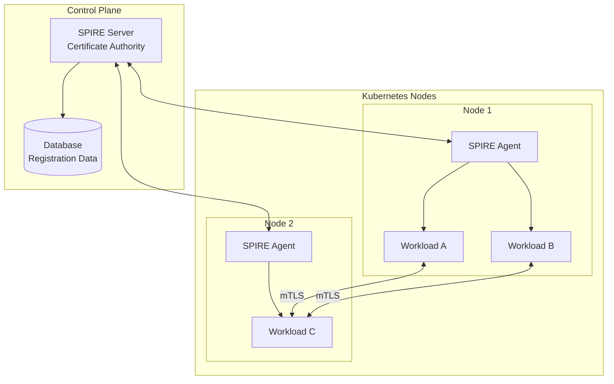

# How to Configure SPIFFE/SPIRE for Service Identity

Author: [nawazdhandala](https://www.github.com/nawazdhandala)

Tags: SPIFFE, SPIRE, Service Identity, Zero Trust, Kubernetes, mTLS, Workload Identity

Description: Learn how to implement SPIFFE/SPIRE for cryptographic service identity in Kubernetes. This guide covers server deployment, workload registration, and integration with service meshes.

---

> SPIFFE (Secure Production Identity Framework for Everyone) provides a standard for service identity, while SPIRE (SPIFFE Runtime Environment) is its production-ready implementation. Together, they enable zero-trust service authentication without shared secrets.

In microservices architectures, services need to verify each other's identity. Traditional approaches using API keys or certificates require manual distribution and rotation. SPIFFE/SPIRE automates identity issuance and verification, enabling true zero-trust networking.

---

## Understanding SPIFFE Concepts

SPIFFE introduces several key concepts:

**SPIFFE ID**: A URI that uniquely identifies a workload (e.g., `spiffe://example.org/ns/production/sa/api-server`).

**SVID (SPIFFE Verifiable Identity Document)**: A cryptographic document (X.509 certificate or JWT) proving a workload's identity.

**Trust Domain**: The scope within which SPIFFE IDs are valid, typically representing an organization or environment.

**Workload Attestation**: The process by which SPIRE verifies a workload's identity before issuing an SVID.

---

## Architecture Overview



---

## Prerequisites

Before deploying SPIRE:

- Kubernetes cluster (v1.21+)
- kubectl with cluster admin access
- Helm 3.x installed
- Understanding of X.509 certificates

---

## Deploying SPIRE Server

Deploy the SPIRE Server using Helm:

```yaml
# spire-server-values.yaml
# Helm values for SPIRE Server

# Trust domain configuration
trustDomain: example.org

# Server configuration
server:
  # Number of replicas for HA
  replicaCount: 2

  # Data storage
  dataStorage:
    enabled: true
    storageClass: standard
    size: 1Gi

  # CA configuration
  ca:
    # Key type and size
    keyType: ec-p256
    # CA certificate TTL (10 years)
    caTTL: 87600h

  # SVID configuration
  svid:
    # Default SVID TTL (1 hour)
    defaultTTL: 1h
    # Maximum SVID TTL
    maxTTL: 24h

  # Federation configuration (for multi-cluster)
  federation:
    enabled: false

  # Node attestation
  nodeAttestor:
    k8s:
      enabled: true
      # Service account allowed to attest nodes
      serviceAccountAllowList:
      - spire:spire-agent

  # Notifier for SVID rotation
  notifier:
    k8sBundle:
      enabled: true
      namespace: spire

  # Resource limits
  resources:
    requests:
      cpu: 100m
      memory: 256Mi
    limits:
      cpu: 500m
      memory: 512Mi

# Controller for automatic registration
controller:
  enabled: true

# OIDC Discovery for JWT-SVID validation
oidcDiscovery:
  enabled: true
  # Domain for OIDC endpoint
  domain: oidc.example.org
```

Deploy the server:

```bash
# Add SPIRE Helm repository
helm repo add spiffe https://spiffe.github.io/helm-charts-hardened
helm repo update

# Create namespace
kubectl create namespace spire

# Install SPIRE Server
helm install spire-server spiffe/spire-server \
  --namespace spire \
  --values spire-server-values.yaml

# Verify deployment
kubectl get pods -n spire -l app.kubernetes.io/name=spire-server

# Check server health
kubectl exec -n spire spire-server-0 -- \
  /opt/spire/bin/spire-server healthcheck
```

---

## Deploying SPIRE Agent

Deploy SPIRE Agents as a DaemonSet:

```yaml
# spire-agent-values.yaml
# Helm values for SPIRE Agent

# Connect to server
server:
  address: spire-server.spire.svc.cluster.local
  port: 8081

# Trust domain must match server
trustDomain: example.org

# Agent configuration
agent:
  # Socket path for workload API
  socketPath: /run/spire/sockets/agent.sock

  # Workload attestation
  workloadAttestor:
    k8s:
      enabled: true
      # Verify pod service account
      skipKubeletVerification: false

  # Enable SDS for Envoy integration
  sds:
    enabled: true
    defaultSvidName: default

  # Resource limits
  resources:
    requests:
      cpu: 50m
      memory: 64Mi
    limits:
      cpu: 200m
      memory: 128Mi

# CSI driver for SVID injection
csiDriver:
  enabled: true
```

Deploy the agent:

```bash
# Install SPIRE Agent
helm install spire-agent spiffe/spire-agent \
  --namespace spire \
  --values spire-agent-values.yaml

# Verify agent deployment
kubectl get pods -n spire -l app.kubernetes.io/name=spire-agent

# Check agent health
kubectl exec -n spire -l app.kubernetes.io/name=spire-agent -- \
  /opt/spire/bin/spire-agent healthcheck
```

---

## Registering Workloads

Register workloads to receive SPIFFE identities:

```bash
# Get SPIRE Server pod
SPIRE_SERVER=$(kubectl get pod -n spire -l app.kubernetes.io/name=spire-server -o jsonpath='{.items[0].metadata.name}')

# Register a workload by service account
kubectl exec -n spire $SPIRE_SERVER -- \
  /opt/spire/bin/spire-server entry create \
  -spiffeID spiffe://example.org/ns/production/sa/api-server \
  -parentID spiffe://example.org/spire/agent/k8s_psat/production-cluster/$(uuidgen) \
  -selector k8s:ns:production \
  -selector k8s:sa:api-server \
  -ttl 3600

# Register with pod label selector
kubectl exec -n spire $SPIRE_SERVER -- \
  /opt/spire/bin/spire-server entry create \
  -spiffeID spiffe://example.org/workload/payment-service \
  -parentID spiffe://example.org/spire/agent/k8s_psat/production-cluster/$(uuidgen) \
  -selector k8s:ns:production \
  -selector k8s:pod-label:app:payment-service \
  -ttl 3600

# List registered entries
kubectl exec -n spire $SPIRE_SERVER -- \
  /opt/spire/bin/spire-server entry show
```

---

## Automatic Registration with Controller

Use the SPIRE Controller Manager for Kubernetes-native registration:

```yaml
# spire-registration.yaml
# ClusterSPIFFEID for automatic workload registration

apiVersion: spire.spiffe.io/v1alpha1
kind: ClusterSPIFFEID
metadata:
  name: api-server
spec:
  # SPIFFE ID template
  spiffeIDTemplate: "spiffe://example.org/ns/{{ .PodMeta.Namespace }}/sa/{{ .PodSpec.ServiceAccountName }}"

  # Pod selector
  podSelector:
    matchLabels:
      spiffe.io/spire-managed-identity: "true"

  # Namespace selector
  namespaceSelector:
    matchLabels:
      spiffe.io/enabled: "true"

  # SVID TTL
  ttl: 1h

  # DNS names to include in SVID
  dnsNameTemplates:
  - "{{ .PodMeta.Name }}"
  - "{{ .PodMeta.Name }}.{{ .PodMeta.Namespace }}"
  - "{{ .PodMeta.Name }}.{{ .PodMeta.Namespace }}.svc.cluster.local"

---
# Specific registration for payment service
apiVersion: spire.spiffe.io/v1alpha1
kind: ClusterSPIFFEID
metadata:
  name: payment-service
spec:
  spiffeIDTemplate: "spiffe://example.org/workload/payment-service"

  podSelector:
    matchLabels:
      app: payment-service

  namespaceSelector:
    matchLabels:
      environment: production

  ttl: 30m

  # Federated trust bundles
  federatesWith:
  - external-partner.org
```

Label namespaces for automatic registration:

```bash
# Enable SPIFFE for namespace
kubectl label namespace production spiffe.io/enabled=true

# Label pods for managed identity
kubectl label pod my-pod spiffe.io/spire-managed-identity=true
```

---

## Integrating with Applications

Mount SVIDs into pods using the CSI driver:

```yaml
# pod-with-spiffe.yaml
apiVersion: v1
kind: Pod
metadata:
  name: api-server
  namespace: production
  labels:
    app: api-server
    spiffe.io/spire-managed-identity: "true"
spec:
  serviceAccountName: api-server

  containers:
  - name: app
    image: myapp:1.0
    env:
    # Path to SVID bundle
    - name: SPIFFE_ENDPOINT_SOCKET
      value: unix:///run/spire/sockets/agent.sock
    volumeMounts:
    # Mount SPIRE agent socket
    - name: spire-agent-socket
      mountPath: /run/spire/sockets
      readOnly: true
    # Mount SVIDs via CSI driver
    - name: spiffe-svid
      mountPath: /var/run/secrets/spiffe.io
      readOnly: true

  volumes:
  - name: spire-agent-socket
    hostPath:
      path: /run/spire/sockets
      type: Directory
  - name: spiffe-svid
    csi:
      driver: csi.spiffe.io
      readOnly: true
```

---

## Using SPIFFE in Application Code

Example Go application using SPIFFE workload API:

```go
// main.go
// Application using SPIFFE for service identity

package main

import (
    "context"
    "crypto/tls"
    "crypto/x509"
    "log"
    "net/http"
    "time"

    "github.com/spiffe/go-spiffe/v2/spiffeid"
    "github.com/spiffe/go-spiffe/v2/spiffetls"
    "github.com/spiffe/go-spiffe/v2/spiffetls/tlsconfig"
    "github.com/spiffe/go-spiffe/v2/workloadapi"
)

const (
    socketPath = "unix:///run/spire/sockets/agent.sock"
)

func main() {
    ctx, cancel := context.WithCancel(context.Background())
    defer cancel()

    // Create workload API client
    client, err := workloadapi.New(ctx, workloadapi.WithAddr(socketPath))
    if err != nil {
        log.Fatalf("Unable to create workload API client: %v", err)
    }
    defer client.Close()

    // Get X.509 SVID
    svid, err := client.FetchX509SVID(ctx)
    if err != nil {
        log.Fatalf("Unable to fetch SVID: %v", err)
    }

    log.Printf("SPIFFE ID: %s", svid.ID)
    log.Printf("Certificate expires: %s", svid.Certificates[0].NotAfter)

    // Start mTLS server
    go startServer(ctx, client)

    // Make mTLS request to another service
    makeSecureRequest(ctx, client)
}

func startServer(ctx context.Context, client *workloadapi.Client) {
    // Create TLS config that auto-rotates certificates
    tlsConfig := tlsconfig.MTLSServerConfig(
        client,
        client,
        tlsconfig.AuthorizeAny(), // Configure authorization
    )

    server := &http.Server{
        Addr:      ":8443",
        TLSConfig: tlsConfig,
        Handler:   http.HandlerFunc(handler),
    }

    log.Println("Starting mTLS server on :8443")
    if err := server.ListenAndServeTLS("", ""); err != nil {
        log.Printf("Server error: %v", err)
    }
}

func handler(w http.ResponseWriter, r *http.Request) {
    // Extract peer SPIFFE ID from TLS connection
    if r.TLS != nil && len(r.TLS.PeerCertificates) > 0 {
        peerID, err := spiffeid.FromURI(r.TLS.PeerCertificates[0].URIs[0])
        if err == nil {
            log.Printf("Request from: %s", peerID)
        }
    }

    w.Write([]byte("Hello from SPIFFE-enabled service!"))
}

func makeSecureRequest(ctx context.Context, client *workloadapi.Client) {
    // Authorized SPIFFE ID for the target service
    authorizedID := spiffeid.RequireTrustDomainFromString("example.org")

    // Create TLS config for client
    tlsConfig := tlsconfig.MTLSClientConfig(
        client,
        client,
        tlsconfig.AuthorizeMemberOf(authorizedID),
    )

    httpClient := &http.Client{
        Transport: &http.Transport{
            TLSClientConfig: tlsConfig,
        },
        Timeout: 10 * time.Second,
    }

    resp, err := httpClient.Get("https://payment-service:8443/api/process")
    if err != nil {
        log.Printf("Request failed: %v", err)
        return
    }
    defer resp.Body.Close()

    log.Printf("Response status: %s", resp.Status)
}
```

---

## Envoy Integration

Configure Envoy to use SPIFFE for mTLS:

```yaml
# envoy-spiffe-config.yaml
static_resources:
  listeners:
  - name: listener_0
    address:
      socket_address:
        address: 0.0.0.0
        port_value: 8443
    filter_chains:
    - filters:
      - name: envoy.filters.network.http_connection_manager
        typed_config:
          "@type": type.googleapis.com/envoy.extensions.filters.network.http_connection_manager.v3.HttpConnectionManager
          stat_prefix: ingress_http
          route_config:
            name: local_route
            virtual_hosts:
            - name: local_service
              domains: ["*"]
              routes:
              - match:
                  prefix: "/"
                route:
                  cluster: local_service
          http_filters:
          - name: envoy.filters.http.router
            typed_config:
              "@type": type.googleapis.com/envoy.extensions.filters.http.router.v3.Router
      transport_socket:
        name: envoy.transport_sockets.tls
        typed_config:
          "@type": type.googleapis.com/envoy.extensions.transport_sockets.tls.v3.DownstreamTlsContext
          common_tls_context:
            tls_certificate_sds_secret_configs:
            - name: "spiffe://example.org/ns/production/sa/api-server"
              sds_config:
                resource_api_version: V3
                api_config_source:
                  api_type: GRPC
                  transport_api_version: V3
                  grpc_services:
                  - envoy_grpc:
                      cluster_name: spire_agent
            validation_context_sds_secret_config:
              name: "spiffe://example.org"
              sds_config:
                resource_api_version: V3
                api_config_source:
                  api_type: GRPC
                  transport_api_version: V3
                  grpc_services:
                  - envoy_grpc:
                      cluster_name: spire_agent
          require_client_certificate: true

  clusters:
  - name: spire_agent
    connect_timeout: 1s
    type: STATIC
    http2_protocol_options: {}
    load_assignment:
      cluster_name: spire_agent
      endpoints:
      - lb_endpoints:
        - endpoint:
            address:
              pipe:
                path: /run/spire/sockets/agent.sock

  - name: local_service
    connect_timeout: 1s
    type: STATIC
    load_assignment:
      cluster_name: local_service
      endpoints:
      - lb_endpoints:
        - endpoint:
            address:
              socket_address:
                address: 127.0.0.1
                port_value: 8080
```

---

## Federation for Multi-Cluster

Configure trust federation between clusters:

```yaml
# federation-config.yaml
# SPIRE Server federation configuration

apiVersion: v1
kind: ConfigMap
metadata:
  name: spire-server-federation
  namespace: spire
data:
  server.conf: |
    server {
      trust_domain = "cluster-a.example.org"

      federation {
        bundle_endpoint {
          address = "0.0.0.0"
          port = 8443
        }

        # Trust cluster B
        federates_with "cluster-b.example.org" {
          bundle_endpoint_url = "https://spire-server.cluster-b.example.org:8443"
          bundle_endpoint_profile "https_spiffe" {
            endpoint_spiffe_id = "spiffe://cluster-b.example.org/spire/server"
          }
        }
      }
    }
```

---

## Monitoring SPIRE

Create alerts for SPIRE health:

```yaml
# spire-alerts.yaml
apiVersion: monitoring.coreos.com/v1
kind: PrometheusRule
metadata:
  name: spire-alerts
  namespace: monitoring
spec:
  groups:
  - name: spire
    rules:
    - alert: SpireServerDown
      expr: |
        up{job="spire-server"} == 0
      for: 5m
      labels:
        severity: critical
      annotations:
        summary: "SPIRE Server is down"

    - alert: SpireAgentDown
      expr: |
        up{job="spire-agent"} == 0
      for: 5m
      labels:
        severity: critical
      annotations:
        summary: "SPIRE Agent is down on {{ $labels.node }}"

    - alert: SVIDRotationFailing
      expr: |
        increase(spire_agent_svid_rotation_errors_total[1h]) > 0
      for: 15m
      labels:
        severity: warning
      annotations:
        summary: "SVID rotation errors detected"
```

---

## Conclusion

SPIFFE/SPIRE provides a robust foundation for service identity in Kubernetes environments. By automating certificate issuance and rotation, it eliminates the security risks of manual credential management while enabling true zero-trust networking.

Start by deploying SPIRE to a single cluster and registering critical services. Once familiar with the registration model, expand to federation for multi-cluster environments. The integration with service meshes like Istio and Envoy makes SPIFFE identities seamlessly available to your applications.

---

*Need observability for your SPIFFE/SPIRE deployment? [OneUptime](https://oneuptime.com) provides comprehensive monitoring for identity infrastructure, helping you track certificate rotations and detect authentication failures before they impact your services.*
