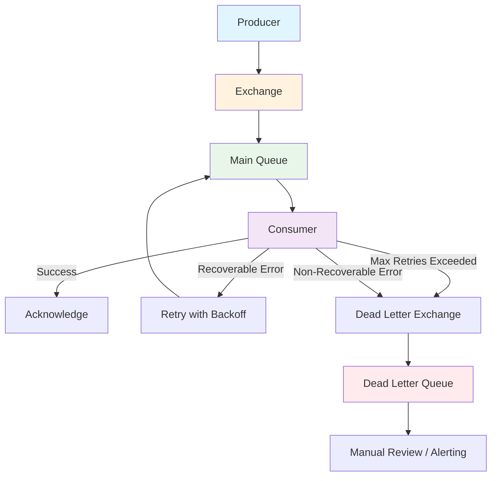

# How to Build Message Consumers with Spring AMQP

Author: [nawazdhandala](https://www.github.com/nawazdhandala)

Tags: Java, Spring Boot, Spring AMQP, RabbitMQ, Message Queue, Microservices, Event-Driven

Description: Learn how to build robust message consumers with Spring AMQP and RabbitMQ. This guide covers listener configuration, error handling, message acknowledgment, and production-ready patterns.

---

> Message queues decouple services and enable asynchronous communication. Spring AMQP makes it straightforward to consume messages from RabbitMQ with automatic configuration, flexible error handling, and built-in retry mechanisms. This guide walks through building production-ready message consumers.

When building microservices, you often need services to communicate without waiting for each other. Message queues solve this by letting producers send messages and consumers process them at their own pace. Spring AMQP provides excellent abstractions for working with RabbitMQ, the most popular AMQP message broker.

---

## Setting Up Spring AMQP

### Dependencies

Add the Spring AMQP starter to your `pom.xml`:

```xml
<!-- pom.xml -->
<dependencies>
    <!-- Spring AMQP with RabbitMQ support -->
    <dependency>
        <groupId>org.springframework.boot</groupId>
        <artifactId>spring-boot-starter-amqp</artifactId>
    </dependency>

    <!-- JSON serialization for messages -->
    <dependency>
        <groupId>com.fasterxml.jackson.core</groupId>
        <artifactId>jackson-databind</artifactId>
    </dependency>
</dependencies>
```

### Application Configuration

Configure the RabbitMQ connection in `application.yml`:

```yaml
# application.yml
spring:
  rabbitmq:
    host: localhost
    port: 5672
    username: guest
    password: guest
    # Connection retry settings
    connection-timeout: 30000
    # Listener configuration
    listener:
      simple:
        acknowledge-mode: manual  # We'll handle acks ourselves
        prefetch: 10  # Process 10 messages at a time per consumer
        concurrency: 3  # Start with 3 consumers
        max-concurrency: 10  # Scale up to 10 under load
        retry:
          enabled: true
          initial-interval: 1000  # 1 second initial retry delay
          max-attempts: 3
          multiplier: 2.0  # Double the delay each retry
```

---

## Basic Message Consumer

### Simple Listener

The simplest way to consume messages is with the `@RabbitListener` annotation. Spring AMQP handles all the connection management and message deserialization automatically.

```java
// OrderEventListener.java
// Basic message consumer for order events
package com.example.consumer;

import org.springframework.amqp.rabbit.annotation.RabbitListener;
import org.springframework.stereotype.Component;
import org.slf4j.Logger;
import org.slf4j.LoggerFactory;

@Component
public class OrderEventListener {

    private static final Logger log = LoggerFactory.getLogger(OrderEventListener.class);

    // This method is called for each message on the "orders" queue
    @RabbitListener(queues = "orders")
    public void handleOrder(String message) {
        log.info("Received order message: {}", message);
        // Process the order here
        processOrder(message);
    }

    private void processOrder(String message) {
        // Business logic for handling the order
        log.info("Processing order: {}", message);
    }
}
```

### Typed Message Consumer

In real applications, you'll want to work with objects instead of raw strings. Spring AMQP can automatically deserialize JSON messages into Java objects.

```java
// OrderMessage.java
// Data class representing an order message
package com.example.consumer.model;

public class OrderMessage {

    private String orderId;
    private String customerId;
    private Double amount;
    private String status;

    // Default constructor required for Jackson deserialization
    public OrderMessage() {}

    public OrderMessage(String orderId, String customerId, Double amount) {
        this.orderId = orderId;
        this.customerId = customerId;
        this.amount = amount;
        this.status = "PENDING";
    }

    // Getters and setters
    public String getOrderId() { return orderId; }
    public void setOrderId(String orderId) { this.orderId = orderId; }

    public String getCustomerId() { return customerId; }
    public void setCustomerId(String customerId) { this.customerId = customerId; }

    public Double getAmount() { return amount; }
    public void setAmount(Double amount) { this.amount = amount; }

    public String getStatus() { return status; }
    public void setStatus(String status) { this.status = status; }
}
```

```java
// TypedOrderListener.java
// Consumer that works with typed messages
package com.example.consumer;

import com.example.consumer.model.OrderMessage;
import org.springframework.amqp.rabbit.annotation.RabbitListener;
import org.springframework.stereotype.Component;
import org.slf4j.Logger;
import org.slf4j.LoggerFactory;

@Component
public class TypedOrderListener {

    private static final Logger log = LoggerFactory.getLogger(TypedOrderListener.class);

    // Spring AMQP will automatically convert JSON to OrderMessage
    @RabbitListener(queues = "orders.typed")
    public void handleTypedOrder(OrderMessage order) {
        log.info("Received order {} for customer {} with amount {}",
            order.getOrderId(),
            order.getCustomerId(),
            order.getAmount());

        // Process the typed order
        processTypedOrder(order);
    }

    private void processTypedOrder(OrderMessage order) {
        // Your business logic here
        log.info("Processing typed order: {}", order.getOrderId());
    }
}
```

---

## RabbitMQ Configuration

### Queue and Exchange Setup

Before consuming messages, you need to declare the queues and exchanges. This configuration class sets up a direct exchange with a bound queue.

```java
// RabbitMQConfig.java
// Configures RabbitMQ infrastructure
package com.example.consumer.config;

import org.springframework.amqp.core.*;
import org.springframework.amqp.rabbit.connection.ConnectionFactory;
import org.springframework.amqp.rabbit.core.RabbitTemplate;
import org.springframework.amqp.support.converter.Jackson2JsonMessageConverter;
import org.springframework.amqp.support.converter.MessageConverter;
import org.springframework.context.annotation.Bean;
import org.springframework.context.annotation.Configuration;

@Configuration
public class RabbitMQConfig {

    // Queue names as constants for reuse
    public static final String ORDERS_QUEUE = "orders";
    public static final String ORDERS_EXCHANGE = "orders.exchange";
    public static final String ORDERS_ROUTING_KEY = "orders.new";

    // Dead letter queue for failed messages
    public static final String DLQ_QUEUE = "orders.dlq";
    public static final String DLQ_EXCHANGE = "orders.dlx";

    // Main queue with dead letter configuration
    @Bean
    public Queue ordersQueue() {
        return QueueBuilder.durable(ORDERS_QUEUE)
            // Send failed messages to dead letter exchange
            .withArgument("x-dead-letter-exchange", DLQ_EXCHANGE)
            .withArgument("x-dead-letter-routing-key", DLQ_QUEUE)
            // Messages expire after 24 hours if not processed
            .withArgument("x-message-ttl", 86400000)
            .build();
    }

    // Direct exchange for routing messages
    @Bean
    public DirectExchange ordersExchange() {
        return new DirectExchange(ORDERS_EXCHANGE);
    }

    // Bind queue to exchange with routing key
    @Bean
    public Binding ordersBinding(Queue ordersQueue, DirectExchange ordersExchange) {
        return BindingBuilder
            .bind(ordersQueue)
            .to(ordersExchange)
            .with(ORDERS_ROUTING_KEY);
    }

    // Dead letter queue catches messages that fail processing
    @Bean
    public Queue deadLetterQueue() {
        return QueueBuilder.durable(DLQ_QUEUE).build();
    }

    @Bean
    public DirectExchange deadLetterExchange() {
        return new DirectExchange(DLQ_EXCHANGE);
    }

    @Bean
    public Binding deadLetterBinding() {
        return BindingBuilder
            .bind(deadLetterQueue())
            .to(deadLetterExchange())
            .with(DLQ_QUEUE);
    }

    // Use Jackson for JSON message conversion
    @Bean
    public MessageConverter jsonMessageConverter() {
        return new Jackson2JsonMessageConverter();
    }

    // Configure RabbitTemplate with JSON converter
    @Bean
    public RabbitTemplate rabbitTemplate(ConnectionFactory connectionFactory) {
        RabbitTemplate template = new RabbitTemplate(connectionFactory);
        template.setMessageConverter(jsonMessageConverter());
        return template;
    }
}
```

---

## Manual Acknowledgment

For production systems, you want control over when messages are acknowledged. Manual acknowledgment lets you retry failed messages or send them to a dead letter queue.

```java
// ManualAckListener.java
// Consumer with manual message acknowledgment
package com.example.consumer;

import com.example.consumer.model.OrderMessage;
import com.rabbitmq.client.Channel;
import org.springframework.amqp.rabbit.annotation.RabbitListener;
import org.springframework.amqp.support.AmqpHeaders;
import org.springframework.messaging.handler.annotation.Header;
import org.springframework.messaging.handler.annotation.Payload;
import org.springframework.stereotype.Component;
import org.slf4j.Logger;
import org.slf4j.LoggerFactory;

@Component
public class ManualAckListener {

    private static final Logger log = LoggerFactory.getLogger(ManualAckListener.class);

    @RabbitListener(queues = "orders.manual")
    public void handleWithManualAck(
            @Payload OrderMessage order,
            Channel channel,
            @Header(AmqpHeaders.DELIVERY_TAG) long deliveryTag) {

        try {
            log.info("Processing order: {}", order.getOrderId());

            // Process the order
            processOrder(order);

            // Acknowledge success - message will be removed from queue
            channel.basicAck(deliveryTag, false);
            log.info("Order {} processed successfully", order.getOrderId());

        } catch (RecoverableException e) {
            // Recoverable error - requeue the message for retry
            log.warn("Recoverable error processing order {}, requeuing",
                order.getOrderId(), e);
            try {
                // Reject and requeue - the message will be retried
                channel.basicNack(deliveryTag, false, true);
            } catch (Exception ackError) {
                log.error("Failed to nack message", ackError);
            }

        } catch (Exception e) {
            // Non-recoverable error - send to dead letter queue
            log.error("Fatal error processing order {}, sending to DLQ",
                order.getOrderId(), e);
            try {
                // Reject without requeue - goes to dead letter queue
                channel.basicNack(deliveryTag, false, false);
            } catch (Exception ackError) {
                log.error("Failed to reject message", ackError);
            }
        }
    }

    private void processOrder(OrderMessage order) throws Exception {
        // Business logic that might throw exceptions
        if (order.getAmount() == null) {
            throw new IllegalArgumentException("Order amount cannot be null");
        }
        // Process the order...
    }
}

// Custom exception for recoverable errors
class RecoverableException extends Exception {
    public RecoverableException(String message, Throwable cause) {
        super(message, cause);
    }
}
```

---

## Error Handling and Retry

Spring AMQP provides built-in retry mechanisms. You can configure exponential backoff to handle temporary failures gracefully.

```java
// RetryConfig.java
// Configure retry behavior for message processing
package com.example.consumer.config;

import org.springframework.amqp.rabbit.config.SimpleRabbitListenerContainerFactory;
import org.springframework.amqp.rabbit.connection.ConnectionFactory;
import org.springframework.amqp.rabbit.listener.RabbitListenerContainerFactory;
import org.springframework.amqp.support.converter.MessageConverter;
import org.springframework.context.annotation.Bean;
import org.springframework.context.annotation.Configuration;
import org.springframework.retry.backoff.ExponentialBackOffPolicy;
import org.springframework.retry.policy.SimpleRetryPolicy;
import org.springframework.retry.support.RetryTemplate;

import java.util.HashMap;
import java.util.Map;

@Configuration
public class RetryConfig {

    @Bean
    public RabbitListenerContainerFactory<?> retryContainerFactory(
            ConnectionFactory connectionFactory,
            MessageConverter messageConverter) {

        SimpleRabbitListenerContainerFactory factory =
            new SimpleRabbitListenerContainerFactory();
        factory.setConnectionFactory(connectionFactory);
        factory.setMessageConverter(messageConverter);

        // Configure retry with exponential backoff
        factory.setAdviceChain(
            org.springframework.amqp.rabbit.config.RetryInterceptorBuilder
                .stateless()
                .retryOperations(retryTemplate())
                .recoverer(new org.springframework.amqp.rabbit.retry
                    .RejectAndDontRequeueRecoverer())  // Send to DLQ after retries
                .build()
        );

        return factory;
    }

    @Bean
    public RetryTemplate retryTemplate() {
        RetryTemplate template = new RetryTemplate();

        // Exponential backoff: 1s, 2s, 4s, 8s...
        ExponentialBackOffPolicy backOffPolicy = new ExponentialBackOffPolicy();
        backOffPolicy.setInitialInterval(1000);  // Start at 1 second
        backOffPolicy.setMultiplier(2.0);  // Double each time
        backOffPolicy.setMaxInterval(30000);  // Cap at 30 seconds
        template.setBackOffPolicy(backOffPolicy);

        // Retry only specific exceptions
        Map<Class<? extends Throwable>, Boolean> retryableExceptions = new HashMap<>();
        retryableExceptions.put(RecoverableException.class, true);
        retryableExceptions.put(java.net.ConnectException.class, true);
        // Don't retry validation errors
        retryableExceptions.put(IllegalArgumentException.class, false);

        SimpleRetryPolicy retryPolicy = new SimpleRetryPolicy(
            5,  // Max 5 attempts
            retryableExceptions,
            true  // Traverse exception causes
        );
        template.setRetryPolicy(retryPolicy);

        return template;
    }
}
```

---

## Message Flow Architecture

The following diagram shows how messages flow through a Spring AMQP consumer setup with retry and dead letter handling:



---

## Concurrent Message Processing

For high throughput, you can configure multiple consumers to process messages in parallel.

```java
// ConcurrentConsumerConfig.java
// Configure concurrent message processing
package com.example.consumer.config;

import org.springframework.amqp.rabbit.config.SimpleRabbitListenerContainerFactory;
import org.springframework.amqp.rabbit.connection.ConnectionFactory;
import org.springframework.amqp.support.converter.MessageConverter;
import org.springframework.context.annotation.Bean;
import org.springframework.context.annotation.Configuration;

@Configuration
public class ConcurrentConsumerConfig {

    @Bean
    public SimpleRabbitListenerContainerFactory concurrentFactory(
            ConnectionFactory connectionFactory,
            MessageConverter messageConverter) {

        SimpleRabbitListenerContainerFactory factory =
            new SimpleRabbitListenerContainerFactory();
        factory.setConnectionFactory(connectionFactory);
        factory.setMessageConverter(messageConverter);

        // Start with 5 concurrent consumers
        factory.setConcurrentConsumers(5);
        // Scale up to 20 under load
        factory.setMaxConcurrentConsumers(20);

        // Each consumer prefetches 10 messages
        // This balances throughput and memory usage
        factory.setPrefetchCount(10);

        return factory;
    }
}
```

```java
// HighThroughputListener.java
// Consumer using concurrent factory
package com.example.consumer;

import com.example.consumer.model.OrderMessage;
import org.springframework.amqp.rabbit.annotation.RabbitListener;
import org.springframework.stereotype.Component;
import org.slf4j.Logger;
import org.slf4j.LoggerFactory;

@Component
public class HighThroughputListener {

    private static final Logger log = LoggerFactory.getLogger(HighThroughputListener.class);

    // Use the concurrent factory for high throughput
    @RabbitListener(
        queues = "orders.high-volume",
        containerFactory = "concurrentFactory"
    )
    public void handleHighVolumeOrders(OrderMessage order) {
        log.info("Processing high-volume order: {} on thread {}",
            order.getOrderId(),
            Thread.currentThread().getName());

        // Process the order
        processOrder(order);
    }

    private void processOrder(OrderMessage order) {
        // Simulate processing time
        try {
            Thread.sleep(100);
        } catch (InterruptedException e) {
            Thread.currentThread().interrupt();
        }
    }
}
```

---

## Best Practices

### 1. Always Use Dead Letter Queues

Never lose messages. Configure dead letter queues to catch failures.

```java
// Always configure DLQ
@Bean
public Queue mainQueue() {
    return QueueBuilder.durable("my-queue")
        .withArgument("x-dead-letter-exchange", "dlx")
        .withArgument("x-dead-letter-routing-key", "dlq")
        .build();
}
```

### 2. Make Consumers Idempotent

Messages might be delivered more than once. Design your consumers to handle duplicates.

```java
// Check if already processed before handling
@RabbitListener(queues = "orders")
public void handleOrder(OrderMessage order) {
    if (alreadyProcessed(order.getOrderId())) {
        log.info("Order {} already processed, skipping", order.getOrderId());
        return;
    }
    processOrder(order);
    markAsProcessed(order.getOrderId());
}
```

### 3. Log Message IDs

Always log message identifiers for traceability.

```java
@RabbitListener(queues = "orders")
public void handleOrder(
        OrderMessage order,
        @Header(AmqpHeaders.MESSAGE_ID) String messageId) {
    log.info("Processing message {} for order {}", messageId, order.getOrderId());
}
```

### 4. Set Appropriate Prefetch

Balance throughput and memory usage with prefetch settings.

```yaml
spring:
  rabbitmq:
    listener:
      simple:
        # Low prefetch for slow consumers, high for fast ones
        prefetch: 10
```

---

## Conclusion

Spring AMQP makes building message consumers straightforward while providing the flexibility needed for production systems. Key points to remember:

- Use manual acknowledgment for control over message processing
- Configure dead letter queues to handle failures gracefully
- Implement exponential backoff for transient errors
- Make consumers idempotent to handle duplicate messages
- Scale with concurrent consumers for high throughput

With proper configuration, your message consumers will be resilient, scalable, and easy to maintain.

---

*Need to monitor your message queues? [OneUptime](https://oneuptime.com) provides comprehensive monitoring for RabbitMQ and your Spring Boot applications, with automatic alerting when queue depths spike or consumers fall behind.*

**Related Reading:**
- [How to Build a Graceful Shutdown Handler in Node.js](https://oneuptime.com/blog/post/2026-01-06-nodejs-graceful-shutdown-handler/view)
- [How to Build Health Checks and Readiness Probes in Python for Kubernetes](https://oneuptime.com/blog/post/2025-01-06-python-health-checks-kubernetes/view)
