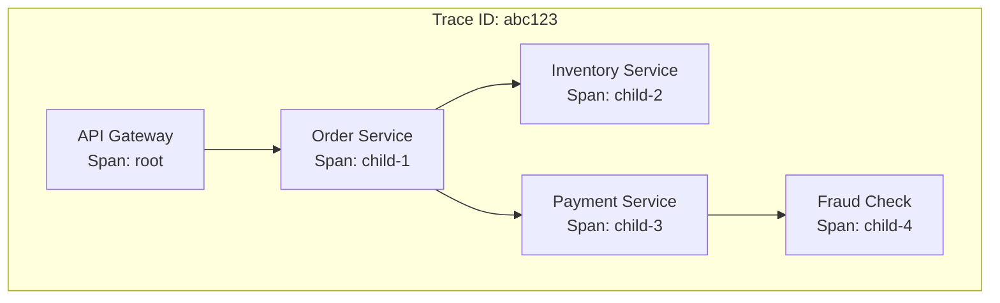

# How to Implement Distributed Tracing with Sleuth and Zipkin

Author: [nawazdhandala](https://www.github.com/nawazdhandala)

Tags: Spring Boot, Java, Distributed Tracing, Sleuth, Zipkin, Microservices, Observability, OpenTelemetry

Description: Learn how to implement distributed tracing in Spring Boot microservices using Spring Cloud Sleuth and Zipkin, including trace propagation, custom spans, and production configuration.

---

In microservices architectures, a single user request often flows through multiple services. When something goes wrong or performance degrades, understanding which service caused the problem becomes difficult. Distributed tracing solves this by assigning a unique trace ID to each request and propagating it across service boundaries.

Spring Cloud Sleuth adds distributed tracing capabilities to Spring Boot applications automatically. Zipkin provides a UI for visualizing traces and analyzing latency. Together, they give you visibility into how requests flow through your system.

## Understanding Trace Concepts

A trace represents a complete request journey through your system. It consists of multiple spans, where each span represents a unit of work. Spans have parent-child relationships that form a tree structure.



Key concepts:
- **Trace ID**: Unique identifier for the entire request flow
- **Span ID**: Unique identifier for a single operation
- **Parent Span ID**: Links a span to its parent
- **Baggage**: Key-value pairs propagated across services

## Setting Up Zipkin Server

Deploy Zipkin to collect and visualize traces. The simplest approach is using Docker.

```bash
# Run Zipkin with in-memory storage (development only)
docker run -d -p 9411:9411 openzipkin/zipkin

# For production, use persistent storage
docker run -d -p 9411:9411 \
  -e STORAGE_TYPE=elasticsearch \
  -e ES_HOSTS=http://elasticsearch:9200 \
  openzipkin/zipkin
```

Access the Zipkin UI at `http://localhost:9411`.

## Adding Sleuth and Zipkin to Spring Boot

Add dependencies to your microservices.

```xml
<!-- pom.xml -->
<dependencies>
    <dependency>
        <groupId>org.springframework.boot</groupId>
        <artifactId>spring-boot-starter-web</artifactId>
    </dependency>

    <!-- Sleuth for distributed tracing -->
    <dependency>
        <groupId>org.springframework.cloud</groupId>
        <artifactId>spring-cloud-starter-sleuth</artifactId>
    </dependency>

    <!-- Zipkin reporter -->
    <dependency>
        <groupId>org.springframework.cloud</groupId>
        <artifactId>spring-cloud-sleuth-zipkin</artifactId>
    </dependency>
</dependencies>

<dependencyManagement>
    <dependencies>
        <dependency>
            <groupId>org.springframework.cloud</groupId>
            <artifactId>spring-cloud-dependencies</artifactId>
            <version>2023.0.0</version>
            <type>pom</type>
            <scope>import</scope>
        </dependency>
    </dependencies>
</dependencyManagement>
```

Configure Sleuth and Zipkin.

```yaml
# application.yml
spring:
  application:
    name: order-service

  sleuth:
    # Sample rate: 1.0 = 100% of traces (reduce in production)
    sampler:
      probability: 1.0
    # Propagate baggage items
    baggage:
      remote-fields:
        - x-request-id
        - x-correlation-id
      correlation-fields:
        - x-request-id

  zipkin:
    base-url: http://localhost:9411
    # Send spans asynchronously
    sender:
      type: web

# Include trace IDs in logs
logging:
  pattern:
    level: "%5p [${spring.application.name},%X{traceId},%X{spanId}]"
```

## Automatic Instrumentation

Sleuth automatically instruments many Spring components without code changes:
- Incoming HTTP requests (Spring MVC, WebFlux)
- Outgoing HTTP requests (RestTemplate, WebClient, Feign)
- Message channels (Spring Integration, Kafka, RabbitMQ)
- Scheduled tasks (@Scheduled)
- Async execution (@Async)

```java
import org.springframework.web.bind.annotation.*;
import org.springframework.web.client.RestTemplate;

@RestController
@RequestMapping("/api/orders")
public class OrderController {

    private final RestTemplate restTemplate;

    public OrderController(RestTemplate restTemplate) {
        this.restTemplate = restTemplate;
    }

    @PostMapping
    public Order createOrder(@RequestBody OrderRequest request) {
        // Sleuth automatically adds trace headers to outgoing request
        InventoryResponse inventory = restTemplate.getForObject(
            "http://inventory-service/api/inventory/{sku}",
            InventoryResponse.class,
            request.getSku()
        );

        // Trace context is propagated automatically
        PaymentResponse payment = restTemplate.postForObject(
            "http://payment-service/api/payments",
            new PaymentRequest(request.getAmount()),
            PaymentResponse.class
        );

        return new Order(request, inventory, payment);
    }
}
```

Configure RestTemplate to propagate trace headers.

```java
import org.springframework.context.annotation.Bean;
import org.springframework.context.annotation.Configuration;
import org.springframework.web.client.RestTemplate;

@Configuration
public class RestTemplateConfig {

    @Bean
    public RestTemplate restTemplate() {
        // Sleuth will automatically instrument this bean
        return new RestTemplate();
    }
}
```

## Creating Custom Spans

For custom business operations, create spans manually.

```java
import org.springframework.cloud.sleuth.Span;
import org.springframework.cloud.sleuth.Tracer;
import org.springframework.stereotype.Service;

@Service
public class OrderProcessingService {

    private final Tracer tracer;

    public OrderProcessingService(Tracer tracer) {
        this.tracer = tracer;
    }

    public ProcessingResult processOrder(Order order) {
        // Create a new span for this operation
        Span span = tracer.nextSpan().name("process-order");

        try (Tracer.SpanInScope ws = tracer.withSpan(span.start())) {
            // Add attributes to the span
            span.tag("order.id", order.getId());
            span.tag("order.total", String.valueOf(order.getTotal()));
            span.tag("order.items.count", String.valueOf(order.getItems().size()));

            // Perform validation
            validateOrder(order);

            // Reserve inventory
            Span inventorySpan = tracer.nextSpan().name("reserve-inventory");
            try (Tracer.SpanInScope inventoryScope =
                    tracer.withSpan(inventorySpan.start())) {
                reserveInventory(order);
                inventorySpan.tag("inventory.status", "reserved");
            } finally {
                inventorySpan.end();
            }

            // Process payment
            Span paymentSpan = tracer.nextSpan().name("process-payment");
            try (Tracer.SpanInScope paymentScope =
                    tracer.withSpan(paymentSpan.start())) {
                processPayment(order);
                paymentSpan.tag("payment.method", order.getPaymentMethod());
            } finally {
                paymentSpan.end();
            }

            span.tag("processing.status", "completed");
            return new ProcessingResult(true, "Order processed");

        } catch (Exception e) {
            span.error(e);
            span.tag("processing.status", "failed");
            throw e;
        } finally {
            span.end();
        }
    }
}
```

## Using the @NewSpan Annotation

Simplify span creation with annotations.

```java
import org.springframework.cloud.sleuth.annotation.NewSpan;
import org.springframework.cloud.sleuth.annotation.SpanTag;
import org.springframework.stereotype.Service;

@Service
public class InventoryService {

    @NewSpan("check-inventory")
    public InventoryStatus checkInventory(
            @SpanTag("sku") String sku,
            @SpanTag("quantity") int quantity) {
        // Method body is automatically wrapped in a span
        // Tags are added from method parameters
        return performInventoryCheck(sku, quantity);
    }

    @NewSpan("reserve-items")
    public ReservationResult reserveItems(
            @SpanTag("order.id") String orderId,
            @SpanTag("items.count") int itemCount) {
        // ...
        return new ReservationResult(true);
    }
}
```

## Propagating Baggage

Baggage items are key-value pairs that travel with the trace across service boundaries.

```java
import org.springframework.cloud.sleuth.BaggageInScope;
import org.springframework.cloud.sleuth.Tracer;
import org.springframework.web.bind.annotation.*;

@RestController
public class ApiGatewayController {

    private final Tracer tracer;

    public ApiGatewayController(Tracer tracer) {
        this.tracer = tracer;
    }

    @PostMapping("/api/orders")
    public Order createOrder(@RequestBody OrderRequest request,
                            @RequestHeader("X-User-Id") String userId) {
        // Set baggage that will propagate to all downstream services
        try (BaggageInScope baggage = tracer.createBaggageInScope("user-id", userId)) {
            // All downstream calls will include this baggage
            return orderService.createOrder(request);
        }
    }
}
```

Read baggage in downstream services.

```java
import org.springframework.cloud.sleuth.Tracer;
import org.springframework.stereotype.Service;

@Service
public class AuditService {

    private final Tracer tracer;

    public AuditService(Tracer tracer) {
        this.tracer = tracer;
    }

    public void logAction(String action) {
        // Read baggage from upstream service
        String userId = tracer.getBaggage("user-id").get();
        String traceId = tracer.currentSpan().context().traceId();

        auditLog.log(new AuditEntry(action, userId, traceId));
    }
}
```

## Integrating with Logs

Include trace context in log statements for correlation.

```yaml
# Logback configuration for trace context
logging:
  pattern:
    console: "%d{yyyy-MM-dd HH:mm:ss.SSS} %5p [%X{traceId},%X{spanId}] [%t] %c : %m%n"
```

Or configure in logback-spring.xml.

```xml
<!-- logback-spring.xml -->
<configuration>
    <include resource="org/springframework/boot/logging/logback/defaults.xml"/>

    <springProperty name="appName" source="spring.application.name"/>

    <appender name="CONSOLE" class="ch.qos.logback.core.ConsoleAppender">
        <encoder>
            <pattern>
                %d{yyyy-MM-dd HH:mm:ss.SSS} %5p [${appName},%X{traceId},%X{spanId}] [%t] %c{36} : %m%n
            </pattern>
        </encoder>
    </appender>

    <root level="INFO">
        <appender-ref ref="CONSOLE"/>
    </root>
</configuration>
```

Now logs can be correlated with traces.

```
2024-01-15 10:23:45.123  INFO [order-service,abc123def456,789xyz] [http-nio-8080-exec-1] c.e.OrderController : Creating order for customer C001
2024-01-15 10:23:45.456  INFO [order-service,abc123def456,012abc] [http-nio-8080-exec-1] c.e.InventoryService : Checking inventory for SKU-123
```

## Async Operations

Sleuth propagates trace context through async boundaries.

```java
import org.springframework.scheduling.annotation.Async;
import org.springframework.stereotype.Service;

@Service
public class NotificationService {

    // Trace context is automatically propagated to async methods
    @Async
    public void sendOrderConfirmation(Order order) {
        // This runs in a different thread but has the same trace context
        emailService.send(order.getCustomerEmail(), "Order Confirmed");
    }
}
```

Configure async executor with Sleuth awareness.

```java
import org.springframework.cloud.sleuth.instrument.async.LazyTraceExecutor;
import org.springframework.context.annotation.Bean;
import org.springframework.context.annotation.Configuration;
import org.springframework.scheduling.annotation.EnableAsync;
import org.springframework.scheduling.concurrent.ThreadPoolTaskExecutor;

import java.util.concurrent.Executor;

@Configuration
@EnableAsync
public class AsyncConfig {

    private final BeanFactory beanFactory;

    public AsyncConfig(BeanFactory beanFactory) {
        this.beanFactory = beanFactory;
    }

    @Bean
    public Executor taskExecutor() {
        ThreadPoolTaskExecutor executor = new ThreadPoolTaskExecutor();
        executor.setCorePoolSize(10);
        executor.setMaxPoolSize(20);
        executor.setQueueCapacity(500);
        executor.setThreadNamePrefix("async-");
        executor.initialize();

        // Wrap with Sleuth for trace propagation
        return new LazyTraceExecutor(beanFactory, executor);
    }
}
```

## Message Queue Tracing

Sleuth propagates trace context through messaging systems.

```java
import org.springframework.kafka.annotation.KafkaListener;
import org.springframework.kafka.core.KafkaTemplate;
import org.springframework.stereotype.Service;

@Service
public class OrderEventService {

    private final KafkaTemplate<String, OrderEvent> kafkaTemplate;

    public OrderEventService(KafkaTemplate<String, OrderEvent> kafkaTemplate) {
        this.kafkaTemplate = kafkaTemplate;
    }

    public void publishOrderCreated(Order order) {
        // Trace headers are automatically added to the Kafka message
        kafkaTemplate.send("order-events", new OrderCreatedEvent(order));
    }

    @KafkaListener(topics = "order-events")
    public void handleOrderEvent(OrderEvent event) {
        // Trace context is automatically extracted from message headers
        // This span will be linked to the producer span
        processEvent(event);
    }
}
```

## Production Configuration

Adjust sampling and performance settings for production.

```yaml
spring:
  sleuth:
    sampler:
      # Sample 10% of traces in production
      probability: 0.1
    # Or use rate-limited sampling
    # rate: 100  # 100 traces per second

    # Skip tracing for health checks
    web:
      skip-pattern: /actuator/health|/actuator/info

    # Reduce overhead by limiting tag length
    span:
      tag:
        max-length: 128

  zipkin:
    base-url: http://zipkin.monitoring.svc.cluster.local:9411
    sender:
      type: kafka  # Use Kafka for reliability in production
    kafka:
      topic: zipkin
    # Compression for bandwidth efficiency
    compression:
      enabled: true
    # Connection pooling
    http:
      connection-timeout: 1000
      read-timeout: 10000
```

## Migration to OpenTelemetry

Spring Cloud Sleuth is transitioning to Micrometer Tracing with OpenTelemetry support.

```xml
<!-- New dependencies for Micrometer Tracing -->
<dependency>
    <groupId>io.micrometer</groupId>
    <artifactId>micrometer-tracing-bridge-otel</artifactId>
</dependency>

<dependency>
    <groupId>io.opentelemetry</groupId>
    <artifactId>opentelemetry-exporter-zipkin</artifactId>
</dependency>
```

```yaml
# Micrometer Tracing configuration
management:
  tracing:
    sampling:
      probability: 0.1
  zipkin:
    tracing:
      endpoint: http://zipkin:9411/api/v2/spans
```

## Viewing Traces in Zipkin

Access Zipkin at `http://localhost:9411` to view traces.

The Zipkin UI provides:
- **Search**: Find traces by service, operation, duration, or tags
- **Trace view**: Visualize the complete request flow as a tree
- **Dependencies**: See service relationships based on trace data
- **Latency analysis**: Identify slow operations and bottlenecks

Search for traces by service name, span name, or custom tags. Click on a trace to see the full span tree with timing information for each operation.

## Summary

| Component | Purpose |
|-----------|---------|
| **Sleuth** | Adds trace context to Spring applications |
| **Zipkin** | Collects and visualizes traces |
| **Trace ID** | Identifies complete request flow |
| **Span** | Represents single unit of work |
| **Baggage** | Propagates custom data across services |
| **Sampling** | Controls trace collection rate |

Distributed tracing with Sleuth and Zipkin provides essential visibility into microservices architectures. By automatically propagating trace context and providing visualization tools, it enables teams to understand request flows, identify performance bottlenecks, and troubleshoot errors across service boundaries. Start with 100% sampling in development, then reduce to 10-20% in production to balance visibility with overhead.
