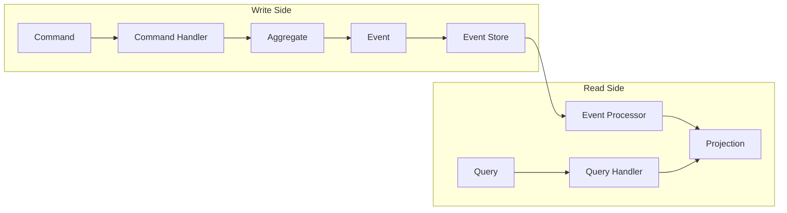

# How to Build Event-Sourced Apps with Axon in Spring Boot

Author: [nawazdhandala](https://www.github.com/nawazdhandala)

Tags: Spring Boot, Java, Event Sourcing, Axon, CQRS, Microservices, Domain-Driven Design

Description: Learn how to build event-sourced applications using Axon Framework with Spring Boot, including command handling, event storage, projections, and saga orchestration for complex business workflows.

---

Event sourcing is an architectural pattern where state changes are stored as a sequence of events rather than just the current state. Instead of updating a database record, you append an event describing what happened. This provides a complete audit trail, enables temporal queries, and allows rebuilding state at any point in time.

Axon Framework makes implementing event sourcing and CQRS (Command Query Responsibility Segregation) straightforward in Spring Boot applications. It handles the complexity of event storage, command routing, and projection management.

## Understanding Event Sourcing and CQRS

In traditional applications, you store the current state. In event sourcing, you store the events that led to the current state. When you need the current state, you replay all events from the beginning.

CQRS separates read and write operations. Commands modify state by generating events. Queries read from optimized projections (views) built from those events.



## Project Setup

Add Axon dependencies to your Spring Boot project.

```xml
<!-- pom.xml -->
<dependencies>
    <dependency>
        <groupId>org.springframework.boot</groupId>
        <artifactId>spring-boot-starter-web</artifactId>
    </dependency>

    <dependency>
        <groupId>org.axonframework</groupId>
        <artifactId>axon-spring-boot-starter</artifactId>
        <version>4.9.3</version>
    </dependency>

    <!-- JPA for projections -->
    <dependency>
        <groupId>org.springframework.boot</groupId>
        <artifactId>spring-boot-starter-data-jpa</artifactId>
    </dependency>

    <dependency>
        <groupId>com.h2database</groupId>
        <artifactId>h2</artifactId>
        <scope>runtime</scope>
    </dependency>
</dependencies>
```

Configure Axon in your application properties.

```yaml
# application.yml
spring:
  datasource:
    url: jdbc:h2:mem:testdb
    driver-class-name: org.h2.Driver
  jpa:
    hibernate:
      ddl-auto: update

axon:
  # Use JPA-based event store (for production, consider Axon Server)
  eventhandling:
    processors:
      # Process events asynchronously for better performance
      account-processor:
        mode: tracking
        source: eventStore
```

## Defining Commands and Events

Commands represent intentions to change state. Events represent facts that have occurred. Both should be immutable.

```java
// Commands - what we want to happen
public record CreateAccountCommand(
    @TargetAggregateIdentifier String accountId,
    String owner,
    BigDecimal initialBalance
) {}

public record DepositMoneyCommand(
    @TargetAggregateIdentifier String accountId,
    BigDecimal amount,
    String transactionId
) {}

public record WithdrawMoneyCommand(
    @TargetAggregateIdentifier String accountId,
    BigDecimal amount,
    String transactionId
) {}

public record TransferMoneyCommand(
    @TargetAggregateIdentifier String sourceAccountId,
    String targetAccountId,
    BigDecimal amount,
    String transferId
) {}
```

```java
// Events - what actually happened
public record AccountCreatedEvent(
    String accountId,
    String owner,
    BigDecimal initialBalance,
    Instant createdAt
) {}

public record MoneyDepositedEvent(
    String accountId,
    BigDecimal amount,
    BigDecimal newBalance,
    String transactionId,
    Instant timestamp
) {}

public record MoneyWithdrawnEvent(
    String accountId,
    BigDecimal amount,
    BigDecimal newBalance,
    String transactionId,
    Instant timestamp
) {}

public record TransferInitiatedEvent(
    String transferId,
    String sourceAccountId,
    String targetAccountId,
    BigDecimal amount
) {}
```

## Building the Aggregate

The aggregate is the core of event sourcing. It handles commands and produces events. Axon reconstructs aggregate state by replaying events.

```java
import org.axonframework.commandhandling.CommandHandler;
import org.axonframework.eventsourcing.EventSourcingHandler;
import org.axonframework.modelling.command.AggregateIdentifier;
import org.axonframework.modelling.command.AggregateLifecycle;
import org.axonframework.spring.stereotype.Aggregate;

import java.math.BigDecimal;
import java.time.Instant;

@Aggregate
public class AccountAggregate {

    @AggregateIdentifier
    private String accountId;
    private String owner;
    private BigDecimal balance;
    private boolean closed;

    // Required no-arg constructor for Axon
    protected AccountAggregate() {}

    // Command handler that creates the aggregate
    @CommandHandler
    public AccountAggregate(CreateAccountCommand command) {
        // Validate command
        if (command.initialBalance().compareTo(BigDecimal.ZERO) < 0) {
            throw new IllegalArgumentException(
                "Initial balance cannot be negative"
            );
        }

        // Apply event - this is the only way to change state
        AggregateLifecycle.apply(new AccountCreatedEvent(
            command.accountId(),
            command.owner(),
            command.initialBalance(),
            Instant.now()
        ));
    }

    @CommandHandler
    public void handle(DepositMoneyCommand command) {
        if (closed) {
            throw new IllegalStateException("Account is closed");
        }
        if (command.amount().compareTo(BigDecimal.ZERO) <= 0) {
            throw new IllegalArgumentException("Deposit amount must be positive");
        }

        BigDecimal newBalance = balance.add(command.amount());

        AggregateLifecycle.apply(new MoneyDepositedEvent(
            accountId,
            command.amount(),
            newBalance,
            command.transactionId(),
            Instant.now()
        ));
    }

    @CommandHandler
    public void handle(WithdrawMoneyCommand command) {
        if (closed) {
            throw new IllegalStateException("Account is closed");
        }
        if (command.amount().compareTo(BigDecimal.ZERO) <= 0) {
            throw new IllegalArgumentException("Withdrawal amount must be positive");
        }
        if (balance.compareTo(command.amount()) < 0) {
            throw new InsufficientFundsException(
                "Insufficient funds. Available: " + balance
            );
        }

        BigDecimal newBalance = balance.subtract(command.amount());

        AggregateLifecycle.apply(new MoneyWithdrawnEvent(
            accountId,
            command.amount(),
            newBalance,
            command.transactionId(),
            Instant.now()
        ));
    }

    // Event sourcing handlers rebuild state from events
    @EventSourcingHandler
    public void on(AccountCreatedEvent event) {
        this.accountId = event.accountId();
        this.owner = event.owner();
        this.balance = event.initialBalance();
        this.closed = false;
    }

    @EventSourcingHandler
    public void on(MoneyDepositedEvent event) {
        this.balance = event.newBalance();
    }

    @EventSourcingHandler
    public void on(MoneyWithdrawnEvent event) {
        this.balance = event.newBalance();
    }
}
```

## Creating Projections for Queries

Projections provide optimized read models. They listen to events and update denormalized views suitable for queries.

```java
// Projection entity
import jakarta.persistence.Entity;
import jakarta.persistence.Id;
import java.math.BigDecimal;
import java.time.Instant;

@Entity
public class AccountView {

    @Id
    private String accountId;
    private String owner;
    private BigDecimal balance;
    private int transactionCount;
    private Instant lastTransactionAt;
    private Instant createdAt;

    // Getters, setters, and constructors
    public AccountView() {}

    public AccountView(String accountId, String owner, BigDecimal balance,
                       Instant createdAt) {
        this.accountId = accountId;
        this.owner = owner;
        this.balance = balance;
        this.createdAt = createdAt;
        this.transactionCount = 0;
    }

    // ... getters and setters
}
```

```java
// Repository for the projection
import org.springframework.data.jpa.repository.JpaRepository;
import java.util.List;

public interface AccountViewRepository extends JpaRepository<AccountView, String> {
    List<AccountView> findByOwner(String owner);
    List<AccountView> findByBalanceGreaterThan(BigDecimal amount);
}
```

```java
// Event handlers that update the projection
import org.axonframework.eventhandling.EventHandler;
import org.axonframework.queryhandling.QueryHandler;
import org.springframework.stereotype.Component;

@Component
public class AccountProjection {

    private final AccountViewRepository repository;

    public AccountProjection(AccountViewRepository repository) {
        this.repository = repository;
    }

    @EventHandler
    public void on(AccountCreatedEvent event) {
        AccountView view = new AccountView(
            event.accountId(),
            event.owner(),
            event.initialBalance(),
            event.createdAt()
        );
        repository.save(view);
    }

    @EventHandler
    public void on(MoneyDepositedEvent event) {
        repository.findById(event.accountId()).ifPresent(view -> {
            view.setBalance(event.newBalance());
            view.setTransactionCount(view.getTransactionCount() + 1);
            view.setLastTransactionAt(event.timestamp());
            repository.save(view);
        });
    }

    @EventHandler
    public void on(MoneyWithdrawnEvent event) {
        repository.findById(event.accountId()).ifPresent(view -> {
            view.setBalance(event.newBalance());
            view.setTransactionCount(view.getTransactionCount() + 1);
            view.setLastTransactionAt(event.timestamp());
            repository.save(view);
        });
    }

    // Query handlers
    @QueryHandler
    public AccountView handle(FindAccountQuery query) {
        return repository.findById(query.accountId()).orElse(null);
    }

    @QueryHandler
    public List<AccountView> handle(FindAccountsByOwnerQuery query) {
        return repository.findByOwner(query.owner());
    }
}
```

## Defining Query Objects

Queries should be simple, immutable objects that describe what data you need.

```java
// Query objects
public record FindAccountQuery(String accountId) {}

public record FindAccountsByOwnerQuery(String owner) {}

public record FindHighBalanceAccountsQuery(BigDecimal threshold) {}
```

## Building the REST API

The controller sends commands and queries through Axon's gateways.

```java
import org.axonframework.commandhandling.gateway.CommandGateway;
import org.axonframework.queryhandling.QueryGateway;
import org.springframework.http.ResponseEntity;
import org.springframework.web.bind.annotation.*;

import java.math.BigDecimal;
import java.util.UUID;
import java.util.concurrent.CompletableFuture;

@RestController
@RequestMapping("/api/accounts")
public class AccountController {

    private final CommandGateway commandGateway;
    private final QueryGateway queryGateway;

    public AccountController(CommandGateway commandGateway,
                            QueryGateway queryGateway) {
        this.commandGateway = commandGateway;
        this.queryGateway = queryGateway;
    }

    @PostMapping
    public CompletableFuture<String> createAccount(
            @RequestBody CreateAccountRequest request) {
        String accountId = UUID.randomUUID().toString();

        return commandGateway.send(new CreateAccountCommand(
            accountId,
            request.owner(),
            request.initialBalance()
        ));
    }

    @PostMapping("/{accountId}/deposit")
    public CompletableFuture<Void> deposit(
            @PathVariable String accountId,
            @RequestBody AmountRequest request) {
        return commandGateway.send(new DepositMoneyCommand(
            accountId,
            request.amount(),
            UUID.randomUUID().toString()
        ));
    }

    @PostMapping("/{accountId}/withdraw")
    public CompletableFuture<Void> withdraw(
            @PathVariable String accountId,
            @RequestBody AmountRequest request) {
        return commandGateway.send(new WithdrawMoneyCommand(
            accountId,
            request.amount(),
            UUID.randomUUID().toString()
        ));
    }

    @GetMapping("/{accountId}")
    public CompletableFuture<AccountView> getAccount(
            @PathVariable String accountId) {
        return queryGateway.query(
            new FindAccountQuery(accountId),
            AccountView.class
        );
    }

    // Request DTOs
    record CreateAccountRequest(String owner, BigDecimal initialBalance) {}
    record AmountRequest(BigDecimal amount) {}
}
```

## Implementing Sagas for Complex Workflows

Sagas coordinate long-running business processes that span multiple aggregates. They react to events and send commands.

```java
import org.axonframework.modelling.saga.SagaEventHandler;
import org.axonframework.modelling.saga.SagaLifecycle;
import org.axonframework.modelling.saga.StartSaga;
import org.axonframework.spring.stereotype.Saga;
import org.axonframework.commandhandling.gateway.CommandGateway;
import org.springframework.beans.factory.annotation.Autowired;

@Saga
public class MoneyTransferSaga {

    @Autowired
    private transient CommandGateway commandGateway;

    private String transferId;
    private String sourceAccountId;
    private String targetAccountId;
    private BigDecimal amount;

    @StartSaga
    @SagaEventHandler(associationProperty = "transferId")
    public void on(TransferInitiatedEvent event) {
        this.transferId = event.transferId();
        this.sourceAccountId = event.sourceAccountId();
        this.targetAccountId = event.targetAccountId();
        this.amount = event.amount();

        // Associate saga with target account for deposit event
        SagaLifecycle.associateWith("targetAccountId", targetAccountId);

        // Withdraw from source account
        commandGateway.send(new WithdrawMoneyCommand(
            sourceAccountId,
            amount,
            transferId
        )).exceptionally(error -> {
            // Handle withdrawal failure
            commandGateway.send(new MarkTransferFailedCommand(
                transferId,
                error.getMessage()
            ));
            return null;
        });
    }

    @SagaEventHandler(associationProperty = "transactionId",
                      keyName = "transferId")
    public void on(MoneyWithdrawnEvent event) {
        // Source withdrawal succeeded, now deposit to target
        commandGateway.send(new DepositMoneyCommand(
            targetAccountId,
            amount,
            transferId
        )).exceptionally(error -> {
            // Deposit failed - compensate by refunding source
            commandGateway.send(new DepositMoneyCommand(
                sourceAccountId,
                amount,
                "refund-" + transferId
            ));
            return null;
        });
    }

    @SagaEventHandler(associationProperty = "transactionId",
                      keyName = "transferId")
    public void on(MoneyDepositedEvent event) {
        if (event.accountId().equals(targetAccountId)) {
            // Transfer completed successfully
            commandGateway.send(new MarkTransferCompletedCommand(transferId));
            SagaLifecycle.end();
        }
    }
}
```

## Event Upcasting for Schema Evolution

When event schemas change, upcasters transform old events to new formats.

```java
import org.axonframework.serialization.upcasting.event.IntermediateEventRepresentation;
import org.axonframework.serialization.upcasting.event.SingleEventUpcaster;
import org.dom4j.Document;
import org.dom4j.Element;

public class AccountCreatedEventUpcaster extends SingleEventUpcaster {

    @Override
    protected boolean canUpcast(IntermediateEventRepresentation ir) {
        return ir.getType().getName().equals(
            "com.example.events.AccountCreatedEvent"
        ) && ir.getType().getRevision() == null;
    }

    @Override
    protected IntermediateEventRepresentation doUpcast(
            IntermediateEventRepresentation ir) {
        return ir.upcastPayload(
            new SimpleSerializedType(
                "com.example.events.AccountCreatedEvent",
                "1.0"
            ),
            Document.class,
            document -> {
                // Add new field with default value
                Element root = document.getRootElement();
                root.addElement("currency").setText("USD");
                return document;
            }
        );
    }
}
```

Register the upcaster in configuration.

```java
@Configuration
public class AxonConfig {

    @Bean
    public EventUpcasterChain eventUpcasterChain() {
        return new EventUpcasterChain(
            new AccountCreatedEventUpcaster()
        );
    }
}
```

## Snapshotting for Performance

When aggregates have many events, replaying all of them becomes slow. Snapshots store periodic aggregate state to speed up loading.

```java
import org.axonframework.eventsourcing.EventCountSnapshotTriggerDefinition;
import org.axonframework.eventsourcing.SnapshotTriggerDefinition;
import org.axonframework.eventsourcing.Snapshotter;
import org.springframework.context.annotation.Bean;
import org.springframework.context.annotation.Configuration;

@Configuration
public class SnapshotConfig {

    @Bean
    public SnapshotTriggerDefinition accountSnapshotTrigger(
            Snapshotter snapshotter) {
        // Create snapshot every 100 events
        return new EventCountSnapshotTriggerDefinition(snapshotter, 100);
    }
}
```

Apply to the aggregate.

```java
@Aggregate(snapshotTriggerDefinition = "accountSnapshotTrigger")
public class AccountAggregate {
    // ... aggregate implementation
}
```

## Testing Event-Sourced Aggregates

Axon provides a test fixture for testing aggregates in isolation.

```java
import org.axonframework.test.aggregate.AggregateTestFixture;
import org.junit.jupiter.api.BeforeEach;
import org.junit.jupiter.api.Test;

class AccountAggregateTest {

    private AggregateTestFixture<AccountAggregate> fixture;

    @BeforeEach
    void setup() {
        fixture = new AggregateTestFixture<>(AccountAggregate.class);
    }

    @Test
    void shouldCreateAccount() {
        fixture.givenNoPriorActivity()
            .when(new CreateAccountCommand("acc-1", "John",
                new BigDecimal("100")))
            .expectSuccessfulHandlerExecution()
            .expectEvents(new AccountCreatedEvent(
                "acc-1", "John", new BigDecimal("100"),
                any(Instant.class)
            ));
    }

    @Test
    void shouldDepositMoney() {
        fixture.given(new AccountCreatedEvent(
                "acc-1", "John", new BigDecimal("100"), Instant.now()))
            .when(new DepositMoneyCommand("acc-1",
                new BigDecimal("50"), "tx-1"))
            .expectSuccessfulHandlerExecution()
            .expectEvents(new MoneyDepositedEvent(
                "acc-1", new BigDecimal("50"), new BigDecimal("150"),
                "tx-1", any(Instant.class)
            ));
    }

    @Test
    void shouldRejectOverdraft() {
        fixture.given(new AccountCreatedEvent(
                "acc-1", "John", new BigDecimal("100"), Instant.now()))
            .when(new WithdrawMoneyCommand("acc-1",
                new BigDecimal("150"), "tx-1"))
            .expectException(InsufficientFundsException.class);
    }
}
```

## Summary

| Concept | Purpose |
|---------|---------|
| **Command** | Intent to change state |
| **Event** | Fact that occurred |
| **Aggregate** | Handles commands, produces events |
| **Projection** | Read-optimized view from events |
| **Saga** | Coordinates multi-aggregate workflows |
| **Snapshot** | Performance optimization for loading |

Event sourcing with Axon provides a robust foundation for building applications that need audit trails, temporal queries, and complex business workflows. The separation of commands and queries enables independent scaling of read and write workloads, while sagas handle distributed transactions without tight coupling between services.
