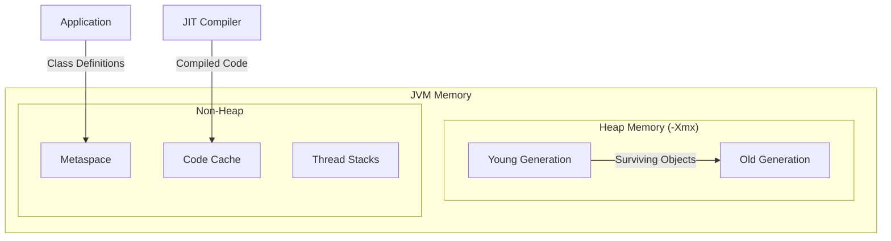

# How to Optimize Spring Boot for Production with JVM Tuning

Author: [nawazdhandala](https://www.github.com/nawazdhandala)

Tags: Spring Boot, Java, JVM, Performance, Production, GC Tuning, Memory Management, DevOps

Description: Learn how to optimize Spring Boot applications for production with JVM tuning, including garbage collection configuration, memory settings, container-aware deployments, and monitoring strategies.

---

Running Spring Boot applications in production requires careful attention to JVM configuration. The default settings are designed for general use cases, not high-performance production workloads. Proper tuning can dramatically improve throughput, reduce latency, and prevent out-of-memory errors.

This guide covers practical JVM tuning strategies for Spring Boot applications, from memory configuration to garbage collection selection and container deployment considerations.

## Understanding JVM Memory Layout

Before tuning, understand how the JVM organizes memory.



Key memory regions:
- **Heap**: Where objects live (-Xms, -Xmx)
- **Young Generation**: Short-lived objects, collected frequently
- **Old Generation**: Long-lived objects, collected less frequently
- **Metaspace**: Class metadata, method definitions
- **Code Cache**: JIT-compiled native code
- **Thread Stacks**: One per thread (-Xss)

## Basic Memory Configuration

Start with appropriate heap sizing based on your workload and available memory.

```bash
# Production JVM options
java -Xms4g -Xmx4g \
     -XX:MetaspaceSize=256m \
     -XX:MaxMetaspaceSize=512m \
     -jar application.jar
```

```yaml
# Kubernetes deployment with JVM options
apiVersion: apps/v1
kind: Deployment
metadata:
  name: order-service
spec:
  template:
    spec:
      containers:
        - name: order-service
          image: order-service:latest
          resources:
            requests:
              memory: "6Gi"
              cpu: "2"
            limits:
              memory: "6Gi"
              cpu: "4"
          env:
            - name: JAVA_OPTS
              value: >-
                -Xms4g
                -Xmx4g
                -XX:MetaspaceSize=256m
                -XX:MaxMetaspaceSize=512m
```

Key principles:
- Set -Xms equal to -Xmx to avoid heap resizing overhead
- Leave headroom for non-heap memory (metaspace, threads, native memory)
- Container memory should be 1.5-2x heap size

## Container-Aware JVM Settings

Modern JVMs detect container limits, but explicit configuration is more reliable.

```bash
# Container-aware settings (Java 17+)
java -XX:+UseContainerSupport \
     -XX:InitialRAMPercentage=75.0 \
     -XX:MaxRAMPercentage=75.0 \
     -XX:MinRAMPercentage=50.0 \
     -jar application.jar
```

This allocates 75% of container memory to the heap, leaving 25% for non-heap memory.

```dockerfile
# Dockerfile with optimized settings
FROM eclipse-temurin:21-jre-alpine

ENV JAVA_OPTS="-XX:+UseContainerSupport \
    -XX:InitialRAMPercentage=75.0 \
    -XX:MaxRAMPercentage=75.0 \
    -XX:+UseG1GC \
    -XX:MaxGCPauseMillis=200"

COPY target/application.jar /app/application.jar

ENTRYPOINT ["sh", "-c", "java $JAVA_OPTS -jar /app/application.jar"]
```

## Choosing a Garbage Collector

Java offers several garbage collectors, each with different trade-offs.

### G1GC (Recommended Default)

G1 provides a good balance of throughput and latency. It is the default in Java 9+.

```bash
# G1GC configuration
java -XX:+UseG1GC \
     -XX:MaxGCPauseMillis=200 \
     -XX:G1HeapRegionSize=16m \
     -XX:InitiatingHeapOccupancyPercent=45 \
     -XX:G1ReservePercent=10 \
     -Xms4g -Xmx4g \
     -jar application.jar
```

Settings explained:
- **MaxGCPauseMillis**: Target pause time (G1 tries to meet this)
- **G1HeapRegionSize**: Region size for G1 (auto-calculated if not set)
- **InitiatingHeapOccupancyPercent**: When to start concurrent marking
- **G1ReservePercent**: Reserve memory to reduce evacuation failures

### ZGC for Low Latency

ZGC provides sub-millisecond pause times, ideal for latency-sensitive applications.

```bash
# ZGC configuration (Java 15+)
java -XX:+UseZGC \
     -XX:+ZGenerational \
     -XX:SoftMaxHeapSize=4g \
     -Xms6g -Xmx6g \
     -jar application.jar
```

ZGC characteristics:
- Pause times under 1ms regardless of heap size
- Handles heaps from 8MB to 16TB
- Some throughput overhead compared to G1
- Best for applications requiring consistent response times

### Shenandoah GC

Similar to ZGC with low pause times, available in OpenJDK.

```bash
# Shenandoah configuration
java -XX:+UseShenandoahGC \
     -XX:ShenandoahGCHeuristics=adaptive \
     -Xms4g -Xmx4g \
     -jar application.jar
```

## GC Logging and Analysis

Enable GC logging to understand collection behavior.

```bash
# GC logging (Java 9+)
java -Xlog:gc*:file=/var/log/app/gc.log:time,uptime,level,tags:filecount=5,filesize=50m \
     -Xms4g -Xmx4g \
     -jar application.jar
```

```yaml
# Spring Boot application.yml for GC monitoring
management:
  endpoints:
    web:
      exposure:
        include: health,metrics,prometheus
  metrics:
    tags:
      application: order-service
    enable:
      jvm: true
```

Analyze GC logs with tools like GCViewer or GCEasy.

```bash
# Sample GC log output (G1GC)
[2024-01-15T10:23:45.123+0000] GC(42) Pause Young (Normal) (G1 Evacuation Pause)
[2024-01-15T10:23:45.123+0000] GC(42) Using 8 workers
[2024-01-15T10:23:45.145+0000] GC(42) Pause Young (Normal) 2048M->1024M(4096M) 22.456ms
```

## Thread Pool Configuration

Configure thread pools based on workload characteristics.

```java
import org.springframework.context.annotation.Bean;
import org.springframework.context.annotation.Configuration;
import org.springframework.scheduling.concurrent.ThreadPoolTaskExecutor;

import java.util.concurrent.Executor;

@Configuration
public class ThreadPoolConfig {

    @Bean(name = "asyncExecutor")
    public Executor asyncExecutor() {
        ThreadPoolTaskExecutor executor = new ThreadPoolTaskExecutor();

        // For CPU-bound tasks: cores + 1
        // For I/O-bound tasks: cores * 2 or higher
        int cores = Runtime.getRuntime().availableProcessors();

        executor.setCorePoolSize(cores * 2);
        executor.setMaxPoolSize(cores * 4);
        executor.setQueueCapacity(500);
        executor.setThreadNamePrefix("async-");
        executor.setRejectedExecutionHandler(
            new ThreadPoolExecutor.CallerRunsPolicy()
        );
        executor.initialize();

        return executor;
    }
}
```

Configure thread stack size for applications with many threads.

```bash
# Reduce thread stack size (default is 1MB)
java -Xss512k \
     -Xms4g -Xmx4g \
     -jar application.jar
```

## Tomcat Tuning

Optimize the embedded Tomcat server for production.

```yaml
# application.yml
server:
  tomcat:
    # Connection handling
    threads:
      max: 200
      min-spare: 20
    max-connections: 10000
    accept-count: 100

    # Connection timeouts
    connection-timeout: 20000
    keep-alive-timeout: 30000
    max-keep-alive-requests: 100

    # Access logging
    accesslog:
      enabled: true
      directory: /var/log/app
      pattern: "%h %l %u %t \"%r\" %s %b %D"

    # URI encoding
    uri-encoding: UTF-8

spring:
  mvc:
    async:
      request-timeout: 30000
```

## Connection Pool Optimization

Configure HikariCP for optimal database performance.

```yaml
# application.yml
spring:
  datasource:
    hikari:
      # Pool sizing
      # Formula: connections = (cores * 2) + effective_spindle_count
      maximum-pool-size: 20
      minimum-idle: 5

      # Timeouts
      connection-timeout: 30000
      idle-timeout: 600000
      max-lifetime: 1800000

      # Leak detection
      leak-detection-threshold: 60000

      # Performance
      auto-commit: true
      pool-name: OrderServicePool

      # Prepared statement caching
      data-source-properties:
        cachePrepStmts: true
        prepStmtCacheSize: 250
        prepStmtCacheSqlLimit: 2048
        useServerPrepStmts: true
```

## JIT Compiler Tuning

Optimize Just-In-Time compilation for faster warmup.

```bash
# JIT optimization settings
java -XX:+TieredCompilation \
     -XX:TieredStopAtLevel=4 \
     -XX:ReservedCodeCacheSize=256m \
     -XX:InitialCodeCacheSize=64m \
     -XX:+UseCodeCacheFlushing \
     -Xms4g -Xmx4g \
     -jar application.jar
```

For applications requiring fast startup (serverless, scale-to-zero).

```bash
# Faster startup with CDS (Class Data Sharing)
# Step 1: Generate class list
java -XX:DumpLoadedClassList=classes.lst -jar application.jar

# Step 2: Create shared archive
java -Xshare:dump -XX:SharedClassListFile=classes.lst \
     -XX:SharedArchiveFile=app-cds.jsa -jar application.jar

# Step 3: Use shared archive
java -Xshare:on -XX:SharedArchiveFile=app-cds.jsa \
     -jar application.jar
```

## Native Image with GraalVM

For minimal startup time and memory footprint, consider GraalVM native image.

```xml
<!-- pom.xml -->
<plugin>
    <groupId>org.graalvm.buildtools</groupId>
    <artifactId>native-maven-plugin</artifactId>
    <version>0.9.28</version>
    <configuration>
        <buildArgs>
            <buildArg>--no-fallback</buildArg>
            <buildArg>-H:+ReportExceptionStackTraces</buildArg>
        </buildArgs>
    </configuration>
</plugin>
```

```bash
# Build native image
./mvnw -Pnative native:compile

# Run native executable
./target/application
```

Native image benefits:
- Startup in milliseconds
- Reduced memory footprint
- No JVM warmup needed

Trade-offs:
- Longer build times
- Some reflection and dynamic features need configuration
- No runtime JIT optimization

## Monitoring and Diagnostics

Enable JMX for remote monitoring and diagnostics.

```bash
# JMX configuration
java -Dcom.sun.management.jmxremote \
     -Dcom.sun.management.jmxremote.port=9010 \
     -Dcom.sun.management.jmxremote.ssl=false \
     -Dcom.sun.management.jmxremote.authenticate=true \
     -Dcom.sun.management.jmxremote.password.file=/etc/jmx/jmxremote.password \
     -Dcom.sun.management.jmxremote.access.file=/etc/jmx/jmxremote.access \
     -jar application.jar
```

Expose metrics for Prometheus.

```yaml
# application.yml
management:
  endpoints:
    web:
      exposure:
        include: health,info,metrics,prometheus
  metrics:
    export:
      prometheus:
        enabled: true
    distribution:
      percentiles-histogram:
        http.server.requests: true
      percentiles:
        http.server.requests: 0.5, 0.95, 0.99
```

## Production JVM Options Template

Comprehensive JVM options for production deployment.

```bash
#!/bin/bash
# start.sh - Production startup script

JAVA_OPTS="-server"

# Memory settings
JAVA_OPTS="$JAVA_OPTS -Xms4g -Xmx4g"
JAVA_OPTS="$JAVA_OPTS -XX:MetaspaceSize=256m -XX:MaxMetaspaceSize=512m"
JAVA_OPTS="$JAVA_OPTS -Xss512k"

# GC settings (G1)
JAVA_OPTS="$JAVA_OPTS -XX:+UseG1GC"
JAVA_OPTS="$JAVA_OPTS -XX:MaxGCPauseMillis=200"
JAVA_OPTS="$JAVA_OPTS -XX:+ParallelRefProcEnabled"
JAVA_OPTS="$JAVA_OPTS -XX:+DisableExplicitGC"

# GC logging
JAVA_OPTS="$JAVA_OPTS -Xlog:gc*:file=/var/log/app/gc.log:time,uptime,level,tags:filecount=5,filesize=50m"

# JIT optimization
JAVA_OPTS="$JAVA_OPTS -XX:+TieredCompilation"
JAVA_OPTS="$JAVA_OPTS -XX:ReservedCodeCacheSize=256m"

# Error handling
JAVA_OPTS="$JAVA_OPTS -XX:+HeapDumpOnOutOfMemoryError"
JAVA_OPTS="$JAVA_OPTS -XX:HeapDumpPath=/var/log/app/heapdump.hprof"
JAVA_OPTS="$JAVA_OPTS -XX:ErrorFile=/var/log/app/hs_err_%p.log"

# Performance
JAVA_OPTS="$JAVA_OPTS -XX:+AlwaysPreTouch"
JAVA_OPTS="$JAVA_OPTS -XX:+UseStringDeduplication"

# Container support
JAVA_OPTS="$JAVA_OPTS -XX:+UseContainerSupport"

exec java $JAVA_OPTS -jar /app/application.jar
```

## Summary

| Setting | Purpose | Recommended Value |
|---------|---------|-------------------|
| **-Xms/-Xmx** | Heap size | Equal values, 60-75% container memory |
| **GC** | Garbage collection | G1GC (default), ZGC for low latency |
| **MaxGCPauseMillis** | Target pause time | 200ms for G1 |
| **Thread pools** | Concurrent processing | cores * 2 for I/O bound |
| **Connection pool** | Database connections | (cores * 2) + spindles |
| **HeapDump** | Diagnostics | Always enabled in production |

JVM tuning is an iterative process. Start with these recommendations, monitor your application under realistic load, and adjust based on observed behavior. GC logs and metrics provide the data needed to make informed decisions. The goal is finding the right balance between throughput, latency, and resource utilization for your specific workload.
