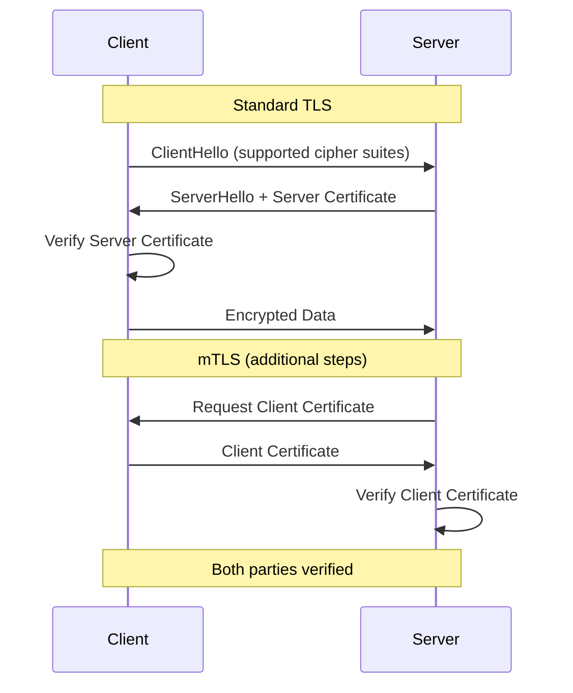

# How to Configure TLS 1.3 and mTLS in Spring Boot

Author: [nawazdhandala](https://www.github.com/nawazdhandala)

Tags: Spring Boot, Java, TLS, mTLS, Security, HTTPS, SSL, DevOps

Description: Learn how to configure TLS 1.3 and mutual TLS (mTLS) in Spring Boot applications for secure communication between services, including certificate generation, keystore setup, and production best practices.

---

Transport Layer Security (TLS) is the foundation of secure communication on the internet. While TLS encrypts data in transit, mutual TLS (mTLS) takes security further by requiring both client and server to authenticate each other using certificates. This is essential in zero-trust architectures and microservices environments where service-to-service communication must be verified.

Spring Boot provides robust support for TLS configuration, but setting it up correctly requires understanding certificates, keystores, and the Java security model.

## Understanding TLS and mTLS

Standard TLS involves a one-way handshake where the client verifies the server's identity through its certificate. The server presents its certificate, and the client checks that it was signed by a trusted Certificate Authority (CA).

Mutual TLS adds a second verification step. After the server presents its certificate, it requests the client's certificate. Both parties must present valid certificates signed by trusted CAs. This ensures that only authorized services can communicate with each other.



## Generating Certificates for Development

For development and testing, you can generate self-signed certificates. In production, use certificates from a proper CA or your organization's PKI infrastructure.

```bash
# Create a directory for certificates
mkdir -p certs && cd certs

# Generate CA key and certificate
# This CA will sign both server and client certificates
openssl genrsa -out ca.key 4096
openssl req -new -x509 -days 365 -key ca.key -out ca.crt \
    -subj "/CN=MyCA/O=MyOrganization"

# Generate server private key and certificate signing request
openssl genrsa -out server.key 4096
openssl req -new -key server.key -out server.csr \
    -subj "/CN=localhost/O=MyOrganization"

# Sign server certificate with CA
openssl x509 -req -days 365 -in server.csr -CA ca.crt -CAkey ca.key \
    -CAcreateserial -out server.crt

# Generate client private key and certificate signing request
openssl genrsa -out client.key 4096
openssl req -new -key client.key -out client.csr \
    -subj "/CN=client-service/O=MyOrganization"

# Sign client certificate with CA
openssl x509 -req -days 365 -in client.csr -CA ca.crt -CAkey ca.key \
    -CAcreateserial -out client.crt
```

## Creating Java Keystores

Spring Boot uses Java keystores (JKS or PKCS12 format) to manage certificates. You need two types of stores: a keystore containing your private key and certificate, and a truststore containing certificates you trust.

```bash
# Convert server key and certificate to PKCS12 format
# The keystore contains the server's identity
openssl pkcs12 -export -in server.crt -inkey server.key \
    -out server-keystore.p12 -name server \
    -password pass:changeit

# Create truststore with CA certificate
# This tells the server which client certificates to trust
keytool -import -trustcacerts -alias ca -file ca.crt \
    -keystore server-truststore.p12 -storetype PKCS12 \
    -storepass changeit -noprompt

# Create client keystore for mTLS
openssl pkcs12 -export -in client.crt -inkey client.key \
    -out client-keystore.p12 -name client \
    -password pass:changeit

# Create client truststore
keytool -import -trustcacerts -alias ca -file ca.crt \
    -keystore client-truststore.p12 -storetype PKCS12 \
    -storepass changeit -noprompt
```

## Configuring TLS 1.3 in Spring Boot

Place your keystores in the `src/main/resources` directory and configure Spring Boot to use them.

```yaml
# application.yml
server:
  port: 8443
  ssl:
    enabled: true
    # Use PKCS12 format (preferred over JKS)
    key-store-type: PKCS12
    key-store: classpath:server-keystore.p12
    key-store-password: ${SSL_KEYSTORE_PASSWORD:changeit}
    key-alias: server

    # Enforce TLS 1.3 only
    # TLS 1.3 removes vulnerable cipher suites and improves performance
    protocol: TLS
    enabled-protocols: TLSv1.3

    # Specify allowed cipher suites for TLS 1.3
    ciphers:
      - TLS_AES_256_GCM_SHA384
      - TLS_AES_128_GCM_SHA256
      - TLS_CHACHA20_POLY1305_SHA256
```

## Enabling Mutual TLS (mTLS)

To require client certificates, add truststore configuration and set the client authentication mode.

```yaml
# application.yml with mTLS
server:
  port: 8443
  ssl:
    enabled: true
    key-store-type: PKCS12
    key-store: classpath:server-keystore.p12
    key-store-password: ${SSL_KEYSTORE_PASSWORD:changeit}
    key-alias: server

    # Truststore contains CA certificates for validating clients
    trust-store-type: PKCS12
    trust-store: classpath:server-truststore.p12
    trust-store-password: ${SSL_TRUSTSTORE_PASSWORD:changeit}

    # Client authentication modes:
    # need - require client certificate (mTLS enforced)
    # want - request client certificate but allow connection without
    # none - do not request client certificate
    client-auth: need

    protocol: TLS
    enabled-protocols: TLSv1.3
```

## Programmatic SSL Configuration

For more control over SSL configuration, you can configure it programmatically using a `WebServerFactoryCustomizer`.

```java
import org.springframework.boot.web.embedded.tomcat.TomcatServletWebServerFactory;
import org.springframework.boot.web.server.Ssl;
import org.springframework.boot.web.server.WebServerFactoryCustomizer;
import org.springframework.context.annotation.Bean;
import org.springframework.context.annotation.Configuration;

@Configuration
public class SslConfiguration {

    @Bean
    public WebServerFactoryCustomizer<TomcatServletWebServerFactory> sslCustomizer() {
        return factory -> {
            Ssl ssl = new Ssl();

            // Configure keystore
            ssl.setEnabled(true);
            ssl.setKeyStoreType("PKCS12");
            ssl.setKeyStore("classpath:server-keystore.p12");
            ssl.setKeyStorePassword(System.getenv("SSL_KEYSTORE_PASSWORD"));
            ssl.setKeyAlias("server");

            // Configure truststore for mTLS
            ssl.setTrustStoreType("PKCS12");
            ssl.setTrustStore("classpath:server-truststore.p12");
            ssl.setTrustStorePassword(System.getenv("SSL_TRUSTSTORE_PASSWORD"));

            // Require client authentication
            ssl.setClientAuth(Ssl.ClientAuth.NEED);

            // TLS protocol configuration
            ssl.setProtocol("TLS");
            ssl.setEnabledProtocols(new String[]{"TLSv1.3"});
            ssl.setCiphers(new String[]{
                "TLS_AES_256_GCM_SHA384",
                "TLS_AES_128_GCM_SHA256"
            });

            factory.setSsl(ssl);
            factory.setPort(8443);
        };
    }
}
```

## Configuring RestTemplate for mTLS Client Calls

When your Spring Boot application needs to call other services using mTLS, configure RestTemplate with client certificates.

```java
import org.apache.hc.client5.http.impl.classic.CloseableHttpClient;
import org.apache.hc.client5.http.impl.classic.HttpClients;
import org.apache.hc.client5.http.impl.io.PoolingHttpClientConnectionManagerBuilder;
import org.apache.hc.client5.http.ssl.SSLConnectionSocketFactoryBuilder;
import org.springframework.context.annotation.Bean;
import org.springframework.context.annotation.Configuration;
import org.springframework.http.client.HttpComponentsClientHttpRequestFactory;
import org.springframework.web.client.RestTemplate;

import javax.net.ssl.KeyManagerFactory;
import javax.net.ssl.SSLContext;
import javax.net.ssl.TrustManagerFactory;
import java.io.InputStream;
import java.security.KeyStore;

@Configuration
public class RestTemplateConfig {

    @Bean
    public RestTemplate mtlsRestTemplate() throws Exception {
        // Load client keystore containing private key and certificate
        KeyStore keyStore = KeyStore.getInstance("PKCS12");
        try (InputStream keyStoreStream = getClass()
                .getResourceAsStream("/client-keystore.p12")) {
            keyStore.load(keyStoreStream,
                System.getenv("CLIENT_KEYSTORE_PASSWORD").toCharArray());
        }

        // Load truststore containing CA certificate
        KeyStore trustStore = KeyStore.getInstance("PKCS12");
        try (InputStream trustStoreStream = getClass()
                .getResourceAsStream("/client-truststore.p12")) {
            trustStore.load(trustStoreStream,
                System.getenv("CLIENT_TRUSTSTORE_PASSWORD").toCharArray());
        }

        // Initialize key manager with client certificate
        KeyManagerFactory keyManagerFactory = KeyManagerFactory
            .getInstance(KeyManagerFactory.getDefaultAlgorithm());
        keyManagerFactory.init(keyStore,
            System.getenv("CLIENT_KEYSTORE_PASSWORD").toCharArray());

        // Initialize trust manager with CA certificate
        TrustManagerFactory trustManagerFactory = TrustManagerFactory
            .getInstance(TrustManagerFactory.getDefaultAlgorithm());
        trustManagerFactory.init(trustStore);

        // Create SSL context with TLS 1.3
        SSLContext sslContext = SSLContext.getInstance("TLSv1.3");
        sslContext.init(
            keyManagerFactory.getKeyManagers(),
            trustManagerFactory.getTrustManagers(),
            null
        );

        // Build HTTP client with SSL configuration
        CloseableHttpClient httpClient = HttpClients.custom()
            .setConnectionManager(
                PoolingHttpClientConnectionManagerBuilder.create()
                    .setSSLSocketFactory(
                        SSLConnectionSocketFactoryBuilder.create()
                            .setSslContext(sslContext)
                            .build()
                    )
                    .build()
            )
            .build();

        return new RestTemplate(
            new HttpComponentsClientHttpRequestFactory(httpClient)
        );
    }
}
```

## Configuring WebClient for mTLS

For reactive applications using WebClient, configure SSL through the underlying Netty client.

```java
import io.netty.handler.ssl.SslContext;
import io.netty.handler.ssl.SslContextBuilder;
import org.springframework.context.annotation.Bean;
import org.springframework.context.annotation.Configuration;
import org.springframework.http.client.reactive.ReactorClientHttpConnector;
import org.springframework.web.reactive.function.client.WebClient;
import reactor.netty.http.client.HttpClient;

import javax.net.ssl.KeyManagerFactory;
import javax.net.ssl.TrustManagerFactory;
import java.io.InputStream;
import java.security.KeyStore;

@Configuration
public class WebClientConfig {

    @Bean
    public WebClient mtlsWebClient() throws Exception {
        // Load keystores (same as RestTemplate example)
        KeyStore keyStore = KeyStore.getInstance("PKCS12");
        try (InputStream is = getClass()
                .getResourceAsStream("/client-keystore.p12")) {
            keyStore.load(is, "changeit".toCharArray());
        }

        KeyStore trustStore = KeyStore.getInstance("PKCS12");
        try (InputStream is = getClass()
                .getResourceAsStream("/client-truststore.p12")) {
            trustStore.load(is, "changeit".toCharArray());
        }

        KeyManagerFactory kmf = KeyManagerFactory
            .getInstance(KeyManagerFactory.getDefaultAlgorithm());
        kmf.init(keyStore, "changeit".toCharArray());

        TrustManagerFactory tmf = TrustManagerFactory
            .getInstance(TrustManagerFactory.getDefaultAlgorithm());
        tmf.init(trustStore);

        // Build Netty SSL context
        SslContext sslContext = SslContextBuilder.forClient()
            .keyManager(kmf)
            .trustManager(tmf)
            .protocols("TLSv1.3")
            .build();

        // Configure HTTP client with SSL
        HttpClient httpClient = HttpClient.create()
            .secure(spec -> spec.sslContext(sslContext));

        return WebClient.builder()
            .clientConnector(new ReactorClientHttpConnector(httpClient))
            .build();
    }
}
```

## Extracting Client Certificate Information

In mTLS scenarios, you often need to extract information from the client certificate for authorization decisions.

```java
import org.springframework.web.bind.annotation.GetMapping;
import org.springframework.web.bind.annotation.RestController;

import jakarta.servlet.http.HttpServletRequest;
import java.security.cert.X509Certificate;

@RestController
public class SecureController {

    @GetMapping("/api/secure/info")
    public CertificateInfo getClientInfo(HttpServletRequest request) {
        // Client certificates are available as a request attribute
        X509Certificate[] certificates = (X509Certificate[])
            request.getAttribute("jakarta.servlet.request.X509Certificate");

        if (certificates == null || certificates.length == 0) {
            throw new SecurityException("No client certificate provided");
        }

        X509Certificate clientCert = certificates[0];

        // Extract certificate details
        String subjectDN = clientCert.getSubjectX500Principal().getName();
        String issuerDN = clientCert.getIssuerX500Principal().getName();
        String serialNumber = clientCert.getSerialNumber().toString(16);

        return new CertificateInfo(subjectDN, issuerDN, serialNumber);
    }

    record CertificateInfo(String subject, String issuer, String serialNumber) {}
}
```

## Certificate-Based Authorization

Combine mTLS with Spring Security to authorize requests based on certificate attributes.

```java
import org.springframework.context.annotation.Bean;
import org.springframework.context.annotation.Configuration;
import org.springframework.security.config.annotation.web.builders.HttpSecurity;
import org.springframework.security.core.userdetails.UserDetailsService;
import org.springframework.security.web.SecurityFilterChain;

@Configuration
public class SecurityConfig {

    @Bean
    public SecurityFilterChain securityFilterChain(HttpSecurity http)
            throws Exception {
        http
            // Enable X.509 certificate authentication
            .x509(x509 -> x509
                // Extract username from certificate CN
                .subjectPrincipalRegex("CN=(.*?)(?:,|$)")
                .userDetailsService(certificateUserDetailsService())
            )
            .authorizeHttpRequests(auth -> auth
                .requestMatchers("/api/admin/**").hasRole("ADMIN")
                .requestMatchers("/api/**").authenticated()
            );

        return http.build();
    }

    @Bean
    public UserDetailsService certificateUserDetailsService() {
        // Map certificate CN to user roles
        return username -> {
            // In production, look up roles from database
            if (username.startsWith("admin-")) {
                return org.springframework.security.core.userdetails.User
                    .withUsername(username)
                    .password("")
                    .roles("ADMIN", "USER")
                    .build();
            }
            return org.springframework.security.core.userdetails.User
                .withUsername(username)
                .password("")
                .roles("USER")
                .build();
        };
    }
}
```

## Testing mTLS Configuration

Test your mTLS setup using curl with client certificates.

```bash
# Test server with TLS (no client cert - should fail with mTLS enabled)
curl -v --cacert ca.crt https://localhost:8443/api/secure/info

# Test with client certificate
curl -v \
  --cacert ca.crt \
  --cert client.crt \
  --key client.key \
  https://localhost:8443/api/secure/info
```

## Production Considerations

When deploying mTLS in production, consider these practices:

1. **Certificate Rotation**: Implement automated certificate rotation before expiry. Short-lived certificates (30-90 days) reduce the impact of compromised certificates.

2. **Certificate Revocation**: Use CRLs or OCSP to check certificate validity. Configure Spring Boot to verify revocation status.

3. **Secure Password Storage**: Never hardcode keystore passwords. Use environment variables or secret management tools like HashiCorp Vault.

4. **Monitor Certificate Expiry**: Set up alerts for certificates approaching expiration to prevent outages.

5. **Use Hardware Security Modules**: For high-security environments, store private keys in HSMs rather than file-based keystores.

## Summary

| Component | Purpose |
|-----------|---------|
| **Keystore** | Stores your private key and certificate |
| **Truststore** | Stores CA certificates you trust |
| **TLS 1.3** | Latest protocol with improved security |
| **mTLS** | Mutual authentication for zero-trust |
| **client-auth: need** | Enforces client certificate requirement |

TLS 1.3 and mTLS provide strong security for Spring Boot applications. TLS 1.3 offers faster handshakes and removes legacy vulnerabilities, while mTLS ensures that both parties in a communication are authenticated. This combination is essential for microservices architectures where service identity verification is critical for security.
