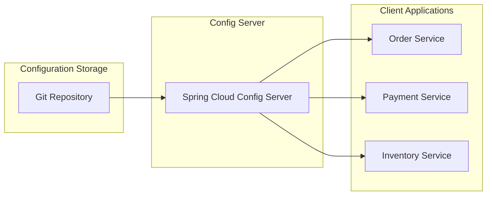

# How to Centralize Config with Spring Cloud Config Server

Author: [nawazdhandala](https://www.github.com/nawazdhandala)

Tags: Spring Boot, Java, Spring Cloud, Configuration Management, Microservices, DevOps, Git

Description: Learn how to centralize application configuration with Spring Cloud Config Server, including Git-backed configuration, encryption, dynamic refresh, and production deployment strategies.

---

Managing configuration across multiple microservices becomes challenging as systems grow. Each service needs different settings for different environments, and keeping them synchronized is error-prone. Spring Cloud Config Server solves this by providing a centralized configuration service that stores settings in a Git repository and serves them to client applications.

This approach offers version control for configuration, environment-specific overrides, and the ability to change settings without redeploying applications.

## Architecture Overview

Spring Cloud Config follows a client-server model. The Config Server connects to a Git repository containing configuration files. Client applications fetch their configuration from the Config Server on startup and can refresh it at runtime.



## Setting Up the Config Server

Create a new Spring Boot application with the Config Server dependency.

```xml
<!-- pom.xml for Config Server -->
<dependencies>
    <dependency>
        <groupId>org.springframework.cloud</groupId>
        <artifactId>spring-cloud-config-server</artifactId>
    </dependency>

    <dependency>
        <groupId>org.springframework.boot</groupId>
        <artifactId>spring-boot-starter-security</artifactId>
    </dependency>

    <dependency>
        <groupId>org.springframework.boot</groupId>
        <artifactId>spring-boot-starter-actuator</artifactId>
    </dependency>
</dependencies>

<dependencyManagement>
    <dependencies>
        <dependency>
            <groupId>org.springframework.cloud</groupId>
            <artifactId>spring-cloud-dependencies</artifactId>
            <version>2023.0.0</version>
            <type>pom</type>
            <scope>import</scope>
        </dependency>
    </dependencies>
</dependencyManagement>
```

Enable the Config Server in your main application class.

```java
import org.springframework.boot.SpringApplication;
import org.springframework.boot.autoconfigure.SpringBootApplication;
import org.springframework.cloud.config.server.EnableConfigServer;

@SpringBootApplication
@EnableConfigServer
public class ConfigServerApplication {
    public static void main(String[] args) {
        SpringApplication.run(ConfigServerApplication.class, args);
    }
}
```

Configure the server to connect to your Git repository.

```yaml
# application.yml for Config Server
server:
  port: 8888

spring:
  application:
    name: config-server

  cloud:
    config:
      server:
        git:
          # Git repository containing configuration files
          uri: https://github.com/your-org/config-repo
          # Branch to use
          default-label: main
          # Search paths within the repository
          search-paths:
            - '{application}'
            - shared
          # Clone on startup for faster first requests
          clone-on-start: true
          # Timeout for Git operations
          timeout: 10
          # For private repositories
          username: ${GIT_USERNAME:}
          password: ${GIT_TOKEN:}

# Basic security for the Config Server
spring:
  security:
    user:
      name: ${CONFIG_SERVER_USER:config}
      password: ${CONFIG_SERVER_PASSWORD:secret}
```

## Organizing the Configuration Repository

Structure your Git repository with configuration files named after applications and profiles.

```
config-repo/
├── application.yml              # Shared defaults for all apps
├── application-dev.yml          # Shared dev settings
├── application-prod.yml         # Shared prod settings
├── order-service/
│   ├── application.yml          # Order service defaults
│   ├── application-dev.yml      # Order service dev settings
│   └── application-prod.yml     # Order service prod settings
├── payment-service/
│   ├── application.yml
│   ├── application-dev.yml
│   └── application-prod.yml
└── shared/
    └── database.yml             # Shared database settings
```

Example configuration files.

```yaml
# config-repo/application.yml (shared defaults)
management:
  endpoints:
    web:
      exposure:
        include: health,info,refresh
  endpoint:
    health:
      show-details: when_authorized

logging:
  level:
    root: INFO
    org.springframework: INFO
```

```yaml
# config-repo/order-service/application.yml
spring:
  datasource:
    hikari:
      maximum-pool-size: 10
      minimum-idle: 5

order:
  processing:
    timeout-seconds: 30
    retry-attempts: 3
  notification:
    enabled: true
```

```yaml
# config-repo/order-service/application-prod.yml
spring:
  datasource:
    url: jdbc:postgresql://prod-db.example.com:5432/orders
    username: ${DB_USERNAME}
    hikari:
      maximum-pool-size: 50
      minimum-idle: 10

order:
  processing:
    timeout-seconds: 60
    retry-attempts: 5

logging:
  level:
    root: WARN
    com.example.order: INFO
```

## Configuring Client Applications

Add the Config Client dependency to your microservices.

```xml
<!-- pom.xml for client applications -->
<dependencies>
    <dependency>
        <groupId>org.springframework.cloud</groupId>
        <artifactId>spring-cloud-starter-config</artifactId>
    </dependency>

    <dependency>
        <groupId>org.springframework.boot</groupId>
        <artifactId>spring-boot-starter-actuator</artifactId>
    </dependency>
</dependencies>
```

Configure the client to connect to the Config Server.

```yaml
# application.yml for client application
spring:
  application:
    name: order-service

  config:
    import: configserver:http://localhost:8888

  cloud:
    config:
      # Fail startup if Config Server is unavailable
      fail-fast: true
      # Retry configuration
      retry:
        initial-interval: 1000
        max-attempts: 6
        max-interval: 2000
        multiplier: 1.5
      # Authentication
      username: ${CONFIG_SERVER_USER:config}
      password: ${CONFIG_SERVER_PASSWORD:secret}

  profiles:
    active: ${SPRING_PROFILES_ACTIVE:dev}
```

## Using Configuration in Your Application

Inject configuration values using standard Spring mechanisms.

```java
import org.springframework.beans.factory.annotation.Value;
import org.springframework.boot.context.properties.ConfigurationProperties;
import org.springframework.stereotype.Component;

// Simple value injection
@Component
public class OrderProcessor {

    @Value("${order.processing.timeout-seconds}")
    private int timeoutSeconds;

    @Value("${order.processing.retry-attempts}")
    private int retryAttempts;

    public void processOrder(Order order) {
        // Use configuration values
        // ...
    }
}

// Type-safe configuration properties
@Component
@ConfigurationProperties(prefix = "order")
public class OrderProperties {

    private Processing processing = new Processing();
    private Notification notification = new Notification();

    public static class Processing {
        private int timeoutSeconds = 30;
        private int retryAttempts = 3;

        // Getters and setters
    }

    public static class Notification {
        private boolean enabled = true;

        // Getters and setters
    }

    // Getters and setters
}
```

## Dynamic Configuration Refresh

Enable runtime configuration updates without restarting applications.

```java
import org.springframework.cloud.context.config.annotation.RefreshScope;
import org.springframework.stereotype.Service;

@Service
@RefreshScope  // Recreate this bean when configuration refreshes
public class DynamicFeatureService {

    @Value("${feature.new-checkout.enabled:false}")
    private boolean newCheckoutEnabled;

    @Value("${feature.discount.percentage:0}")
    private int discountPercentage;

    public boolean isNewCheckoutEnabled() {
        return newCheckoutEnabled;
    }

    public int getDiscountPercentage() {
        return discountPercentage;
    }
}
```

Trigger refresh via the actuator endpoint.

```bash
# Refresh a single application instance
curl -X POST http://localhost:8080/actuator/refresh \
  -u admin:password

# Response shows changed properties
["feature.new-checkout.enabled", "feature.discount.percentage"]
```

## Broadcasting Refresh with Spring Cloud Bus

For multiple instances, use Spring Cloud Bus to broadcast refresh events.

```xml
<!-- Add to both Config Server and clients -->
<dependency>
    <groupId>org.springframework.cloud</groupId>
    <artifactId>spring-cloud-starter-bus-amqp</artifactId>
</dependency>
```

```yaml
# application.yml - RabbitMQ configuration
spring:
  rabbitmq:
    host: localhost
    port: 5672
    username: guest
    password: guest

# Enable bus refresh endpoint on Config Server
management:
  endpoints:
    web:
      exposure:
        include: health,busrefresh
```

```bash
# Refresh all connected applications at once
curl -X POST http://localhost:8888/actuator/busrefresh
```

## Encrypting Sensitive Configuration

Config Server can encrypt sensitive values like passwords and API keys.

Generate an encryption key or use a keystore.

```yaml
# Config Server with symmetric encryption
encrypt:
  key: ${ENCRYPT_KEY:my-secret-encryption-key}

# Or with asymmetric encryption using a keystore
encrypt:
  key-store:
    location: classpath:server.jks
    password: ${KEYSTORE_PASSWORD}
    alias: config-key
    secret: ${KEY_PASSWORD}
```

Encrypt values using the Config Server endpoint.

```bash
# Encrypt a value
curl -X POST http://localhost:8888/encrypt \
  -u config:secret \
  -d 'my-secret-password'

# Response: AQB+...encrypted...==

# Decrypt a value
curl -X POST http://localhost:8888/decrypt \
  -u config:secret \
  -d 'AQB+...encrypted...=='
```

Store encrypted values in configuration files with the `{cipher}` prefix.

```yaml
# config-repo/order-service/application-prod.yml
spring:
  datasource:
    password: '{cipher}AQB+ZpFqhTRs...encrypted...=='

payment:
  api:
    key: '{cipher}AQA8kF9j2Nv...encrypted...=='
```

The Config Server decrypts these values before sending them to clients.

## Native File System Backend

For development or when Git is not suitable, use a local file system.

```yaml
# Config Server with native file system
spring:
  profiles:
    active: native

  cloud:
    config:
      server:
        native:
          search-locations:
            - file:///etc/config
            - classpath:/config
```

## Composite Backend

Combine multiple configuration sources with priority ordering.

```yaml
spring:
  cloud:
    config:
      server:
        composite:
          # First source - highest priority
          - type: git
            uri: https://github.com/your-org/config-overrides
            order: 1
          # Second source - lower priority
          - type: git
            uri: https://github.com/your-org/config-defaults
            order: 2
          # Vault for secrets
          - type: vault
            host: vault.example.com
            port: 8200
            scheme: https
            order: 3
```

## Vault Integration for Secrets

Integrate with HashiCorp Vault for managing secrets separately from configuration.

```yaml
spring:
  cloud:
    config:
      server:
        vault:
          host: vault.example.com
          port: 8200
          scheme: https
          backend: secret
          default-key: application
          profile-separator: /
          kv-version: 2
          authentication: TOKEN
          token: ${VAULT_TOKEN}
```

Store secrets in Vault.

```bash
# Store secrets in Vault
vault kv put secret/order-service/prod \
  spring.datasource.password=prod-db-password \
  payment.api.key=sk_live_xxx
```

## High Availability Configuration

Deploy multiple Config Server instances behind a load balancer.

```yaml
# Client configuration for HA
spring:
  cloud:
    config:
      uri:
        - http://config-server-1:8888
        - http://config-server-2:8888
        - http://config-server-3:8888
      fail-fast: true
      retry:
        initial-interval: 1000
        max-attempts: 10
```

Or use service discovery with Eureka.

```yaml
# Client with service discovery
spring:
  cloud:
    config:
      discovery:
        enabled: true
        service-id: config-server
      fail-fast: true

eureka:
  client:
    service-url:
      defaultZone: http://eureka:8761/eureka/
```

## Security Best Practices

Secure the Config Server with proper authentication and network policies.

```java
import org.springframework.context.annotation.Bean;
import org.springframework.context.annotation.Configuration;
import org.springframework.security.config.annotation.web.builders.HttpSecurity;
import org.springframework.security.web.SecurityFilterChain;

@Configuration
public class SecurityConfig {

    @Bean
    public SecurityFilterChain filterChain(HttpSecurity http) throws Exception {
        http
            .csrf(csrf -> csrf.disable())
            .authorizeHttpRequests(auth -> auth
                // Allow health checks without auth
                .requestMatchers("/actuator/health").permitAll()
                // Require authentication for config endpoints
                .requestMatchers("/**").authenticated()
            )
            .httpBasic(basic -> {});

        return http.build();
    }
}
```

## Monitoring and Health Checks

Enable health indicators to monitor Config Server status.

```yaml
# Config Server health configuration
management:
  endpoint:
    health:
      show-details: always
  health:
    config:
      enabled: true

spring:
  cloud:
    config:
      server:
        health:
          repositories:
            order-config:
              label: main
              name: order-service
              profiles: prod
```

Check health status.

```bash
curl http://localhost:8888/actuator/health

# Response shows Git repository connectivity
{
  "status": "UP",
  "components": {
    "configServer": {
      "status": "UP",
      "details": {
        "repositories": [
          {
            "name": "order-config",
            "profiles": ["prod"],
            "label": "main"
          }
        ]
      }
    }
  }
}
```

## Client Fallback Configuration

Include fallback configuration in client applications for when Config Server is unavailable.

```yaml
# src/main/resources/application.yml (client fallback)
# These values are used if Config Server cannot be reached

spring:
  application:
    name: order-service

# Fallback values for critical settings
order:
  processing:
    timeout-seconds: 30
    retry-attempts: 3
```

## Summary

| Component | Purpose |
|-----------|---------|
| **Config Server** | Serves configuration from Git repository |
| **Config Client** | Fetches configuration on startup |
| **RefreshScope** | Enables runtime configuration updates |
| **Spring Cloud Bus** | Broadcasts refresh to all instances |
| **Encryption** | Protects sensitive values |
| **Vault Integration** | Manages secrets separately |

Spring Cloud Config Server provides a robust solution for centralized configuration management. By storing configuration in Git, you gain version control, audit trails, and the ability to roll back changes. Combined with encryption, dynamic refresh, and service discovery, it forms a foundation for managing configuration across large microservices deployments.
