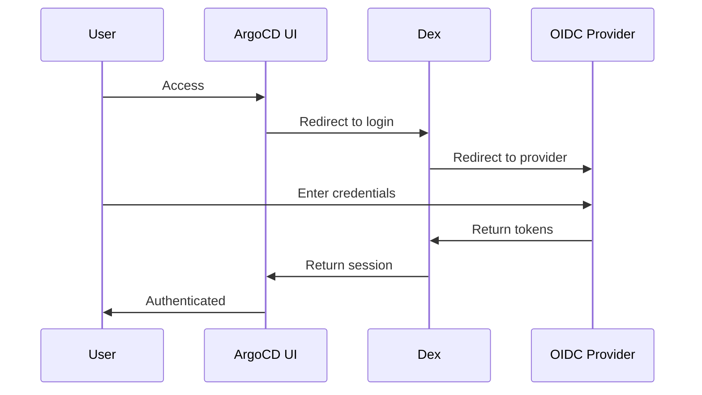

# How to Configure SSO with OIDC in ArgoCD

Author: [nawazdhandala](https://www.github.com/nawazdhandala)

Tags: ArgoCD, SSO, OIDC, Security, Authentication, Okta, Azure AD

Description: Learn how to configure Single Sign-On in ArgoCD using OIDC providers like Okta, Azure AD, Google, and Keycloak, including group-based access control and troubleshooting.

---

Managing ArgoCD users with local accounts does not scale. Single Sign-On (SSO) with OIDC lets your team use their existing corporate credentials, and you get centralized user management and audit trails. This guide covers setting up OIDC with popular identity providers.

## How ArgoCD Authentication Works

ArgoCD uses Dex as an identity broker. Dex connects to your OIDC provider and handles the OAuth2 flow.



## Prerequisites

Before configuring SSO:

1. ArgoCD accessible via HTTPS (required for OAuth callbacks)
2. A domain name for ArgoCD (e.g., argocd.example.com)
3. Admin access to your identity provider
4. ArgoCD CLI installed and logged in as admin

## Configuring OIDC with Okta

### Step 1: Create an Okta Application

1. Log into your Okta admin console
2. Go to Applications > Create App Integration
3. Select OIDC - OpenID Connect
4. Select Web Application
5. Configure:
   - Name: ArgoCD
   - Sign-in redirect URI: `https://argocd.example.com/api/dex/callback`
   - Sign-out redirect URI: `https://argocd.example.com`
   - Assignments: Assign to groups that need access

6. Note the Client ID and Client Secret

### Step 2: Configure ArgoCD

Edit the argocd-cm ConfigMap:

```yaml
# argocd-cm.yaml
apiVersion: v1
kind: ConfigMap
metadata:
  name: argocd-cm
  namespace: argocd
data:
  # ArgoCD URL for callbacks
  url: https://argocd.example.com

  # Dex configuration
  dex.config: |
    connectors:
      - type: oidc
        id: okta
        name: Okta
        config:
          issuer: https://your-org.okta.com
          clientID: 0oaxxxxxxxxxxxxxxxx
          clientSecret: $dex.okta.clientSecret
          # Request groups claim
          scopes:
            - openid
            - profile
            - email
            - groups
          # Map Okta groups to ArgoCD
          insecureSkipEmailVerified: true
```

Store the client secret:

```yaml
# argocd-secret.yaml
apiVersion: v1
kind: Secret
metadata:
  name: argocd-secret
  namespace: argocd
type: Opaque
stringData:
  # Add to existing secret
  dex.okta.clientSecret: your-client-secret-here
```

Apply both:

```bash
kubectl apply -f argocd-cm.yaml
kubectl apply -f argocd-secret.yaml

# Restart Dex to pick up changes
kubectl rollout restart deployment argocd-dex-server -n argocd
```

## Configuring OIDC with Azure AD

### Step 1: Register an Azure AD Application

1. Go to Azure Portal > Azure Active Directory > App registrations
2. Click New registration
3. Configure:
   - Name: ArgoCD
   - Redirect URI: Web, `https://argocd.example.com/api/dex/callback`
4. Note the Application (client) ID and Directory (tenant) ID
5. Go to Certificates & secrets, create a new client secret
6. Go to Token configuration, add groups claim (optional)

### Step 2: Configure ArgoCD for Azure AD

```yaml
apiVersion: v1
kind: ConfigMap
metadata:
  name: argocd-cm
  namespace: argocd
data:
  url: https://argocd.example.com

  dex.config: |
    connectors:
      - type: microsoft
        id: azure
        name: Azure AD
        config:
          clientID: xxxxxxxx-xxxx-xxxx-xxxx-xxxxxxxxxxxx
          clientSecret: $dex.azure.clientSecret
          tenant: xxxxxxxx-xxxx-xxxx-xxxx-xxxxxxxxxxxx
          # Optional: restrict to specific groups
          groups:
            - DevOps
            - Platform
          # Include group names instead of IDs
          useGroupDisplayName: true
```

## Configuring OIDC with Google

### Step 1: Create Google OAuth Credentials

1. Go to Google Cloud Console > APIs & Services > Credentials
2. Create OAuth client ID
3. Application type: Web application
4. Authorized redirect URIs: `https://argocd.example.com/api/dex/callback`
5. Note the Client ID and Client Secret

### Step 2: Configure ArgoCD

```yaml
apiVersion: v1
kind: ConfigMap
metadata:
  name: argocd-cm
  namespace: argocd
data:
  url: https://argocd.example.com

  dex.config: |
    connectors:
      - type: google
        id: google
        name: Google
        config:
          clientID: xxxxxxxxxxxx.apps.googleusercontent.com
          clientSecret: $dex.google.clientSecret
          # Restrict to your domain
          hostedDomains:
            - example.com
          # Request groups (requires Google Workspace)
          groups:
            - devops@example.com
```

## Configuring OIDC with Keycloak

### Step 1: Create Keycloak Client

1. Log into Keycloak admin console
2. Create a new client:
   - Client ID: argocd
   - Client Protocol: openid-connect
   - Root URL: `https://argocd.example.com`
3. Configure:
   - Access Type: confidential
   - Valid Redirect URIs: `https://argocd.example.com/api/dex/callback`
4. Go to Credentials tab, note the Secret
5. Go to Mappers, add groups mapper

### Step 2: Configure ArgoCD

```yaml
apiVersion: v1
kind: ConfigMap
metadata:
  name: argocd-cm
  namespace: argocd
data:
  url: https://argocd.example.com

  dex.config: |
    connectors:
      - type: oidc
        id: keycloak
        name: Keycloak
        config:
          issuer: https://keycloak.example.com/realms/master
          clientID: argocd
          clientSecret: $dex.keycloak.clientSecret
          scopes:
            - openid
            - profile
            - email
            - groups
          # Map Keycloak groups claim
          userIDKey: preferred_username
          userNameKey: preferred_username
```

## Group-Based Access Control

Map SSO groups to ArgoCD RBAC roles:

```yaml
# argocd-rbac-cm.yaml
apiVersion: v1
kind: ConfigMap
metadata:
  name: argocd-rbac-cm
  namespace: argocd
data:
  # Default policy for authenticated users
  policy.default: role:readonly

  policy.csv: |
    # Platform team gets admin access
    g, platform-team, role:admin

    # DevOps team can manage specific projects
    p, role:devops, applications, *, */*, allow
    p, role:devops, repositories, get, *, allow
    g, devops-team, role:devops

    # Developers get read-only on their projects
    p, role:developer, applications, get, team-*/*, allow
    p, role:developer, applications, sync, team-*/*, allow
    g, developers, role:developer

  # Map OIDC groups to ArgoCD groups
  scopes: '[groups]'
```

## Disabling Local Admin

Once SSO is working, disable local admin login:

```yaml
apiVersion: v1
kind: ConfigMap
metadata:
  name: argocd-cm
  namespace: argocd
data:
  # Disable admin user
  admin.enabled: "false"
```

Keep a break-glass procedure by storing the admin password securely.

## Using CLI with SSO

Login via SSO using the CLI:

```bash
# Opens browser for SSO login
argocd login argocd.example.com --sso

# For headless/CI environments, use auth tokens
argocd login argocd.example.com --sso --sso-port 8085

# Or use API tokens
argocd account generate-token --account admin
```

## Multiple Identity Providers

Configure multiple connectors for different teams:

```yaml
dex.config: |
  connectors:
    - type: oidc
      id: okta
      name: Corporate SSO
      config:
        issuer: https://corp.okta.com
        clientID: xxx
        clientSecret: $dex.okta.clientSecret

    - type: github
      id: github
      name: GitHub
      config:
        clientID: xxx
        clientSecret: $dex.github.clientSecret
        orgs:
          - name: myorg
```

## Troubleshooting SSO

### Check Dex Logs

```bash
kubectl logs -n argocd deployment/argocd-dex-server -f
```

### Common Issues

**Callback URL mismatch:**
```
Error: redirect_uri_mismatch
```
Ensure the callback URL in your IdP matches exactly: `https://argocd.example.com/api/dex/callback`

**Groups not appearing:**
```bash
# Check the token claims
argocd account get-user-info
```
Ensure your IdP is configured to include groups in the token.

**Certificate errors:**
```yaml
dex.config: |
  connectors:
    - type: oidc
      config:
        # Skip TLS verification (not for production)
        insecureSkipVerify: true
        # Or add custom CA
        rootCA: /etc/dex/tls/ca.crt
```

### Test OIDC Configuration

```bash
# Verify Dex is healthy
curl -k https://argocd.example.com/api/dex/.well-known/openid-configuration

# Check ArgoCD can reach the IdP
kubectl exec -n argocd deployment/argocd-dex-server -- \
  wget -qO- https://your-idp.example.com/.well-known/openid-configuration
```

## Security Best Practices

1. Always use HTTPS for ArgoCD
2. Rotate client secrets periodically
3. Use group-based access instead of individual users
4. Enable audit logging
5. Implement session timeouts:

```yaml
apiVersion: v1
kind: ConfigMap
metadata:
  name: argocd-cm
  namespace: argocd
data:
  # Session timeout in hours
  timeout.session: "24h"
  # Reconciliation timeout
  timeout.reconciliation: "180s"
```

---

SSO with OIDC centralizes authentication and removes the burden of managing ArgoCD users. Start with one identity provider, verify group mapping works, then configure RBAC policies. Once everything is tested, disable local admin and enjoy streamlined access management.
