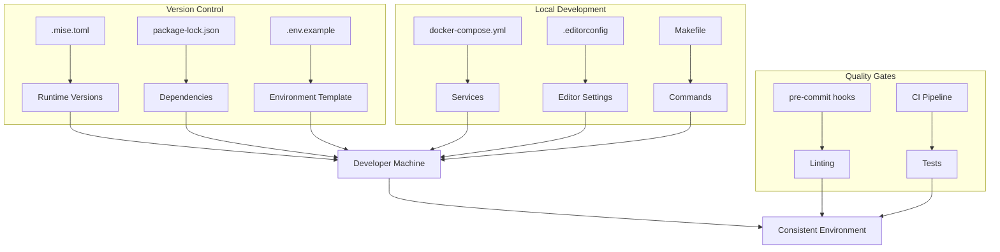

# How to Standardize Development Environments

Author: [nawazdhandala](https://www.github.com/nawazdhandala)

Tags: Developer Experience, Development Environments, DevOps, Standardization, Tooling

Description: Learn how to create consistent development environments across your team using configuration files, automation, and containerization to eliminate environment-related issues.

---

Every developer has encountered it: code that works perfectly on one machine fails mysteriously on another. Different Node versions, missing environment variables, incompatible system libraries. These inconsistencies waste hours of debugging time. Standardizing development environments eliminates this entire class of problems.

## Why Standardization Matters

Inconsistent environments cause:

- **"Works on my machine" bugs**: Code fails in CI or on other developers' machines
- **Onboarding friction**: New developers spend days configuring their setup
- **Security gaps**: Developers skip security tools that are hard to install
- **Knowledge silos**: Only certain people can work on certain parts of the codebase

Standardization provides:

- Identical environments for all team members
- Reproducible CI/CD pipelines
- Fast onboarding for new developers
- Consistent tooling and workflows

## Layer 1: Runtime Version Management

Pin runtime versions to ensure consistency:

```toml
# .mise.toml - Runtime version management
[tools]
node = "20.11.0"
python = "3.11.7"
go = "1.22.0"
java = "21.0.2"

[env]
NODE_ENV = "development"
```

Alternative: `.nvmrc` for Node-only projects:

```
20.11.0
```

For Python, use `.python-version`:

```
3.11.7
```

Document the version management tool in your README:

```markdown
## Prerequisites

This project uses [mise](https://mise.jdx.dev/) for version management.

```bash
# Install mise
curl https://mise.run | sh

# Install project runtimes
mise install
```
```

## Layer 2: Package Dependencies

Lock dependency versions precisely:

```json
// package.json - Specify exact versions
{
  "engines": {
    "node": ">=20.0.0",
    "npm": ">=10.0.0"
  },
  "dependencies": {
    "express": "4.18.2",
    "pg": "8.11.3"
  },
  "devDependencies": {
    "typescript": "5.3.3",
    "eslint": "8.56.0"
  }
}
```

Commit lock files:

- `package-lock.json` for npm
- `yarn.lock` for Yarn
- `pnpm-lock.yaml` for pnpm
- `requirements.txt` or `poetry.lock` for Python
- `go.sum` for Go

Verify lock file is used in CI:

```yaml
# .github/workflows/ci.yml
- name: Install dependencies
  run: npm ci  # Uses package-lock.json exactly
```

## Layer 3: Environment Variables

Create a template for required environment variables:

```bash
# .env.example - Template for local development
# Copy this to .env.local and fill in values

# Database
DATABASE_URL=postgresql://localhost:5432/myapp_dev
REDIS_URL=redis://localhost:6379

# Authentication
JWT_SECRET=generate-a-secure-secret-for-local-dev
SESSION_SECRET=another-secure-secret

# External Services (get from team password manager)
STRIPE_API_KEY=
AWS_ACCESS_KEY_ID=
AWS_SECRET_ACCESS_KEY=
AWS_REGION=us-east-1

# Feature Flags
ENABLE_NEW_CHECKOUT=true
DEBUG_MODE=true
```

Validate environment variables at startup:

```typescript
// src/config/env.ts
import { z } from 'zod';

// Define the schema for required environment variables
const envSchema = z.object({
  // Database
  DATABASE_URL: z.string().url(),
  REDIS_URL: z.string().url(),

  // Authentication
  JWT_SECRET: z.string().min(32),
  SESSION_SECRET: z.string().min(32),

  // External services
  STRIPE_API_KEY: z.string().optional(),
  AWS_ACCESS_KEY_ID: z.string().optional(),
  AWS_SECRET_ACCESS_KEY: z.string().optional(),
  AWS_REGION: z.string().default('us-east-1'),

  // Application
  NODE_ENV: z.enum(['development', 'test', 'production']).default('development'),
  PORT: z.coerce.number().default(3000),
});

// Parse and validate environment
export const env = envSchema.parse(process.env);

// Type-safe access to environment variables
export type Env = z.infer<typeof envSchema>;
```

## Layer 4: Development Services

Define local services with Docker Compose:

```yaml
# docker-compose.yml
version: '3.8'

services:
  postgres:
    image: postgres:15
    environment:
      POSTGRES_USER: dev
      POSTGRES_PASSWORD: dev
      POSTGRES_DB: myapp_dev
    ports:
      - "5432:5432"
    volumes:
      - postgres_data:/var/lib/postgresql/data
      - ./scripts/init.sql:/docker-entrypoint-initdb.d/init.sql
    healthcheck:
      test: ["CMD-SHELL", "pg_isready -U dev"]
      interval: 5s
      timeout: 5s
      retries: 5

  redis:
    image: redis:7-alpine
    ports:
      - "6379:6379"
    volumes:
      - redis_data:/data
    healthcheck:
      test: ["CMD", "redis-cli", "ping"]
      interval: 5s
      timeout: 5s
      retries: 5

  mailhog:
    image: mailhog/mailhog
    ports:
      - "1025:1025"  # SMTP
      - "8025:8025"  # Web UI

  localstack:
    image: localstack/localstack
    ports:
      - "4566:4566"
    environment:
      - SERVICES=s3,sqs,sns
      - DEBUG=1
    volumes:
      - localstack_data:/var/lib/localstack

volumes:
  postgres_data:
  redis_data:
  localstack_data:
```

## Layer 5: Editor Configuration

Standardize editor settings with EditorConfig:

```ini
# .editorconfig
root = true

[*]
charset = utf-8
end_of_line = lf
insert_final_newline = true
trim_trailing_whitespace = true
indent_style = space
indent_size = 2

[*.md]
trim_trailing_whitespace = false

[*.py]
indent_size = 4

[Makefile]
indent_style = tab
```

For VS Code, add workspace settings:

```json
// .vscode/settings.json
{
  "editor.formatOnSave": true,
  "editor.defaultFormatter": "esbenp.prettier-vscode",
  "[python]": {
    "editor.defaultFormatter": "charliermarsh.ruff"
  },
  "typescript.tsdk": "node_modules/typescript/lib",
  "eslint.workingDirectories": [{ "mode": "auto" }],
  "files.exclude": {
    "**/.git": true,
    "**/node_modules": true,
    "**/.DS_Store": true
  }
}
```

Recommend extensions:

```json
// .vscode/extensions.json
{
  "recommendations": [
    "dbaeumer.vscode-eslint",
    "esbenp.prettier-vscode",
    "bradlc.vscode-tailwindcss",
    "ms-azuretools.vscode-docker",
    "editorconfig.editorconfig"
  ]
}
```

## Layer 6: Git Configuration

Standardize Git behavior:

```ini
# .gitattributes
# Ensure consistent line endings
* text=auto eol=lf
*.bat text eol=crlf
*.cmd text eol=crlf

# Mark binary files
*.png binary
*.jpg binary
*.gif binary
*.ico binary
*.pdf binary

# Ensure consistent diff for lockfiles
package-lock.json -diff
yarn.lock -diff
pnpm-lock.yaml -diff
```

Configure Git hooks:

```yaml
# .pre-commit-config.yaml
repos:
  - repo: https://github.com/pre-commit/pre-commit-hooks
    rev: v4.5.0
    hooks:
      - id: trailing-whitespace
      - id: end-of-file-fixer
      - id: check-yaml
      - id: check-json

  - repo: local
    hooks:
      - id: lint
        name: lint
        entry: npm run lint
        language: system
        pass_filenames: false
```

## Layer 7: Makefile for Common Tasks

Provide consistent commands regardless of underlying tools:

```makefile
# Makefile - Standard development commands

.PHONY: help setup dev test lint clean

# Default target
help:
	@echo "Available commands:"
	@echo "  make setup    - Set up development environment"
	@echo "  make dev      - Start development server"
	@echo "  make test     - Run tests"
	@echo "  make lint     - Run linters"
	@echo "  make clean    - Clean build artifacts"

# Set up development environment
setup:
	@echo "Installing runtime versions..."
	mise install
	@echo "Installing dependencies..."
	npm ci
	@echo "Setting up environment..."
	cp -n .env.example .env.local || true
	@echo "Starting services..."
	docker-compose up -d
	@echo "Waiting for services..."
	sleep 5
	@echo "Running migrations..."
	npm run db:migrate
	@echo "Setup complete!"

# Start development server
dev:
	docker-compose up -d
	npm run dev

# Run tests
test:
	npm test

# Run tests with coverage
test-coverage:
	npm run test:coverage

# Run linters
lint:
	npm run lint
	npm run type-check

# Fix linting issues
lint-fix:
	npm run lint:fix

# Clean build artifacts
clean:
	rm -rf dist node_modules .next coverage
	docker-compose down -v

# Database commands
db-migrate:
	npm run db:migrate

db-seed:
	npm run db:seed

db-reset:
	npm run db:reset

# Start fresh
reset: clean setup
```

## Setup Verification Script

Automate environment verification:

```bash
#!/bin/bash
# scripts/verify-setup.sh

set -e

echo "Verifying development environment..."
echo "=================================="

errors=0

# Check runtime versions
check_version() {
    local name=$1
    local cmd=$2
    local expected=$3

    if ! command -v ${cmd%% *} &> /dev/null; then
        echo "✗ $name not installed"
        ((errors++))
        return
    fi

    local actual=$($cmd 2>/dev/null | head -1)
    if [[ "$actual" == *"$expected"* ]]; then
        echo "✓ $name: $actual"
    else
        echo "⚠ $name: $actual (expected $expected)"
    fi
}

check_version "Node.js" "node --version" "v20"
check_version "npm" "npm --version" "10"
check_version "Docker" "docker --version" "24"

# Check required files
check_file() {
    if [[ -f "$1" ]]; then
        echo "✓ $1 exists"
    else
        echo "✗ $1 missing"
        ((errors++))
    fi
}

check_file ".env.local"
check_file "node_modules/.package-lock.json"

# Check services
check_service() {
    local name=$1
    local cmd=$2

    if $cmd &> /dev/null; then
        echo "✓ $name is running"
    else
        echo "✗ $name is not running"
        ((errors++))
    fi
}

check_service "PostgreSQL" "pg_isready -h localhost -p 5432"
check_service "Redis" "redis-cli ping"

echo "=================================="

if [[ $errors -gt 0 ]]; then
    echo "Found $errors issues. Run 'make setup' to fix."
    exit 1
else
    echo "Environment verified successfully!"
fi
```

## Environment Consistency Diagram

Here is how the layers work together:



## Best Practices

1. **Automate everything**: If a step can be automated, automate it. Manual steps get skipped or done incorrectly.

2. **Verify setup programmatically**: Include a script that checks if the environment is correctly configured.

3. **Document exceptions**: When standardization is not possible, document why and provide alternatives.

4. **Update together**: When changing environment requirements, update documentation, scripts, and CI simultaneously.

5. **Test on fresh machines**: Periodically test the setup process on a clean machine to catch missing steps.

Standardized environments remove friction from development. Developers spend time writing code instead of debugging setup issues. CI results match local results. New team members become productive quickly. The initial investment in standardization pays off every day.
