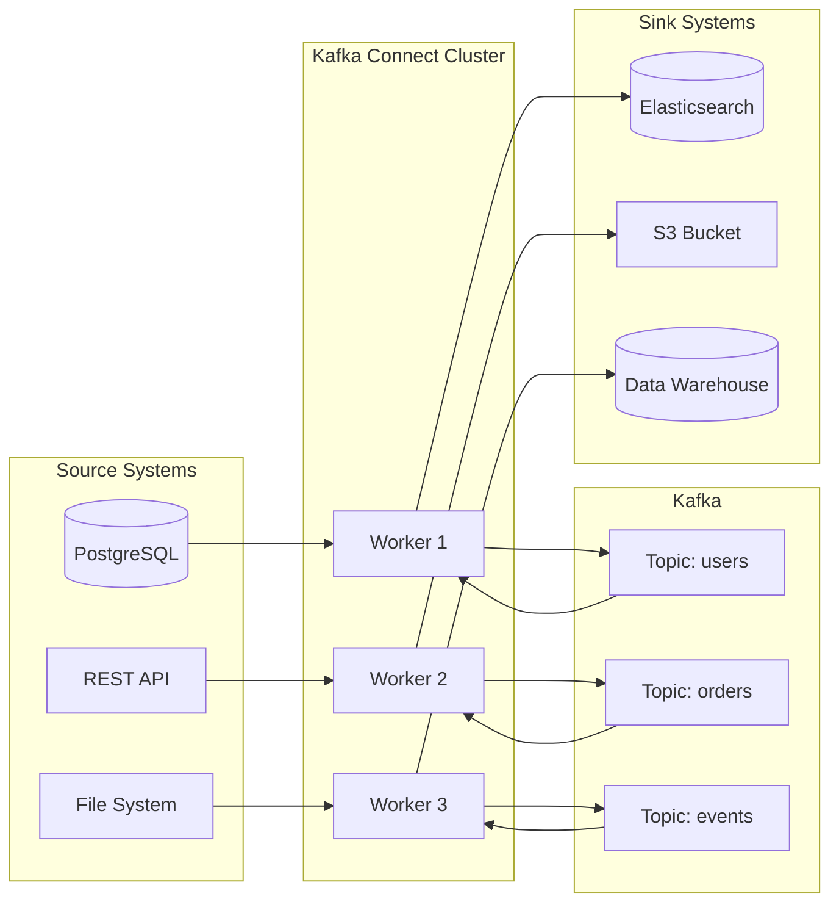

# How to Stream Data with Kafka Connect

Author: [nawazdhandala](https://www.github.com/nawazdhandala)

Tags: Kafka, Kafka Connect, Data Integration, ETL, Streaming

Description: A hands-on guide to using Kafka Connect for streaming data between Kafka and external systems, including source and sink connector configuration, transformations, and production deployment patterns.

---

Kafka Connect is a framework for streaming data between Apache Kafka and external systems without writing custom code. It handles the complexities of fault tolerance, offset management, and parallelism while you focus on configuration. This guide covers setting up connectors for common use cases.

## Kafka Connect Architecture

Connect runs as a cluster of worker nodes that execute connectors. Each connector creates tasks that do the actual data movement.



- **Source connectors** pull data from external systems into Kafka topics
- **Sink connectors** push data from Kafka topics to external systems
- **Workers** host the connector tasks and manage their lifecycle

## Setting Up a Connect Cluster

Create a distributed Connect cluster for production. Here is the worker configuration:

```properties
# connect-distributed.properties

# Kafka cluster connection
bootstrap.servers=kafka1:9092,kafka2:9092,kafka3:9092

# Unique cluster identifier
group.id=connect-cluster

# Internal topics for storing connector state
config.storage.topic=connect-configs
config.storage.replication.factor=3
offset.storage.topic=connect-offsets
offset.storage.replication.factor=3
offset.storage.partitions=25
status.storage.topic=connect-status
status.storage.replication.factor=3
status.storage.partitions=5

# Converters for key and value serialization
key.converter=org.apache.kafka.connect.json.JsonConverter
value.converter=org.apache.kafka.connect.json.JsonConverter
key.converter.schemas.enable=false
value.converter.schemas.enable=false

# REST API for managing connectors
rest.host.name=0.0.0.0
rest.port=8083
rest.advertised.host.name=connect-worker-1
rest.advertised.port=8083

# Plugin path for connector JARs
plugin.path=/opt/kafka-connect/plugins
```

Start the worker:

```bash
# Start Connect in distributed mode
connect-distributed.sh /opt/kafka/config/connect-distributed.properties
```

## Example: PostgreSQL Source Connector

Stream changes from PostgreSQL to Kafka using the Debezium connector. This captures INSERT, UPDATE, and DELETE operations.

```bash
# Install the Debezium PostgreSQL connector
confluent-hub install debezium/debezium-connector-postgresql:latest

# Or download manually to plugin.path
wget https://repo1.maven.org/maven2/io/debezium/debezium-connector-postgres/2.4.0.Final/debezium-connector-postgres-2.4.0.Final-plugin.tar.gz
tar -xzf debezium-connector-postgres-2.4.0.Final-plugin.tar.gz -C /opt/kafka-connect/plugins/
```

Create the connector configuration:

```json
{
  "name": "postgres-source",
  "config": {
    "connector.class": "io.debezium.connector.postgresql.PostgresConnector",
    "tasks.max": "1",

    "database.hostname": "postgres.example.com",
    "database.port": "5432",
    "database.user": "replication_user",
    "database.password": "${file:/opt/kafka-connect/secrets/postgres.properties:password}",
    "database.dbname": "production",

    "topic.prefix": "pg",
    "table.include.list": "public.users,public.orders",

    "plugin.name": "pgoutput",
    "slot.name": "kafka_connect",
    "publication.name": "kafka_publication",

    "snapshot.mode": "initial",

    "transforms": "route",
    "transforms.route.type": "org.apache.kafka.connect.transforms.RegexRouter",
    "transforms.route.regex": "pg\\.public\\.(.*)",
    "transforms.route.replacement": "$1-events"
  }
}
```

Deploy the connector via REST API:

```bash
# Create the connector
curl -X POST http://localhost:8083/connectors \
  -H "Content-Type: application/json" \
  -d @postgres-source.json

# Check connector status
curl http://localhost:8083/connectors/postgres-source/status | jq

# List all connectors
curl http://localhost:8083/connectors
```

## Example: Elasticsearch Sink Connector

Push data from Kafka topics to Elasticsearch for search and analytics.

```json
{
  "name": "elasticsearch-sink",
  "config": {
    "connector.class": "io.confluent.connect.elasticsearch.ElasticsearchSinkConnector",
    "tasks.max": "3",

    "topics": "users-events,orders-events",

    "connection.url": "https://elasticsearch.example.com:9200",
    "connection.username": "elastic",
    "connection.password": "${file:/opt/kafka-connect/secrets/es.properties:password}",

    "type.name": "_doc",
    "key.ignore": "false",
    "schema.ignore": "true",

    "behavior.on.null.values": "delete",
    "behavior.on.malformed.documents": "warn",

    "write.method": "upsert",
    "batch.size": "1000",
    "max.buffered.records": "5000",
    "flush.timeout.ms": "10000",

    "transforms": "extractKey,removePrefix",
    "transforms.extractKey.type": "org.apache.kafka.connect.transforms.ExtractField$Key",
    "transforms.extractKey.field": "id",
    "transforms.removePrefix.type": "org.apache.kafka.connect.transforms.RegexRouter",
    "transforms.removePrefix.regex": "(.*)-events",
    "transforms.removePrefix.replacement": "$1"
  }
}
```

## Single Message Transforms (SMTs)

Transforms modify records in-flight without writing code. Here are commonly used transforms:

```json
{
  "transforms": "addTimestamp,maskField,filterNull,flatten",

  "transforms.addTimestamp.type": "org.apache.kafka.connect.transforms.InsertField$Value",
  "transforms.addTimestamp.timestamp.field": "processed_at",

  "transforms.maskField.type": "org.apache.kafka.connect.transforms.MaskField$Value",
  "transforms.maskField.fields": "ssn,credit_card",
  "transforms.maskField.replacement": "****",

  "transforms.filterNull.type": "org.apache.kafka.connect.transforms.Filter",
  "transforms.filterNull.predicate": "isNull",

  "predicates": "isNull",
  "predicates.isNull.type": "org.apache.kafka.connect.transforms.predicates.RecordIsTombstone",

  "transforms.flatten.type": "org.apache.kafka.connect.transforms.Flatten$Value",
  "transforms.flatten.delimiter": "_"
}
```

Common transform types:

| Transform | Purpose |
|-----------|---------|
| `InsertField` | Add fields with static values or metadata |
| `ReplaceField` | Rename, filter, or reorder fields |
| `MaskField` | Obfuscate sensitive data |
| `ExtractField` | Pull a single field from a struct |
| `Flatten` | Convert nested structures to flat maps |
| `TimestampConverter` | Convert timestamp formats |
| `RegexRouter` | Modify topic names with regex |

## Handling Errors with Dead Letter Queues

Configure error handling to avoid losing messages due to bad data:

```json
{
  "errors.tolerance": "all",
  "errors.deadletterqueue.topic.name": "dlq-elasticsearch-sink",
  "errors.deadletterqueue.topic.replication.factor": 3,
  "errors.deadletterqueue.context.headers.enable": true,
  "errors.log.enable": true,
  "errors.log.include.messages": true
}
```

Messages that fail processing are routed to the dead letter queue with headers containing error details:

```bash
# Inspect DLQ messages
kafka-console-consumer.sh --bootstrap-server kafka:9092 \
  --topic dlq-elasticsearch-sink \
  --from-beginning \
  --property print.headers=true
```

## Monitoring Connectors

Export Connect metrics to Prometheus:

```yaml
# JMX Exporter configuration
rules:
  - pattern: "kafka.connect<type=connect-worker-metrics>([^:]+):"
    name: "kafka_connect_worker_$1"

  - pattern: "kafka.connect<type=connector-task-metrics, connector=(.+), task=(.+)><>(.+): (.+)"
    name: "kafka_connect_connector_task_$3"
    labels:
      connector: "$1"
      task: "$2"

  - pattern: "kafka.connect<type=source-task-metrics, connector=(.+), task=(.+)><>(.+): (.+)"
    name: "kafka_connect_source_task_$3"
    labels:
      connector: "$1"
      task: "$2"

  - pattern: "kafka.connect<type=sink-task-metrics, connector=(.+), task=(.+)><>(.+): (.+)"
    name: "kafka_connect_sink_task_$3"
    labels:
      connector: "$1"
      task: "$2"
```

Key metrics to monitor:

- `connector-count` and `task-count`: Number of running connectors/tasks
- `source-record-poll-rate`: Records read per second from source
- `sink-record-send-rate`: Records written per second to sink
- `offset-commit-success-percentage`: Offset commit success rate
- `deadletterqueue-produce-requests`: DLQ writes (should be zero ideally)

## Scaling Connectors

Increase `tasks.max` to parallelize work. Each task runs independently:

```json
{
  "tasks.max": "6"
}
```

For source connectors, tasks are assigned based on the source (tables, partitions, files). For sink connectors, tasks are assigned Kafka partitions. The number of active tasks will not exceed the number of partitions in the source topics.

```bash
# Check task distribution
curl http://localhost:8083/connectors/elasticsearch-sink/tasks | jq

# Restart a specific task
curl -X POST http://localhost:8083/connectors/elasticsearch-sink/tasks/0/restart
```

## Connector Management Commands

```bash
# Pause a connector (stops tasks but retains configuration)
curl -X PUT http://localhost:8083/connectors/postgres-source/pause

# Resume a paused connector
curl -X PUT http://localhost:8083/connectors/postgres-source/resume

# Update connector configuration
curl -X PUT http://localhost:8083/connectors/postgres-source/config \
  -H "Content-Type: application/json" \
  -d @updated-config.json

# Delete a connector
curl -X DELETE http://localhost:8083/connectors/postgres-source

# Get connector configuration
curl http://localhost:8083/connectors/postgres-source/config | jq
```

---

Kafka Connect simplifies data integration by handling the plumbing of moving data between systems. Start with pre-built connectors from Confluent Hub or the community, use SMTs for lightweight transformations, and configure dead letter queues to handle failures gracefully. For production deployments, run multiple workers and monitor connector metrics to ensure data flows reliably.
