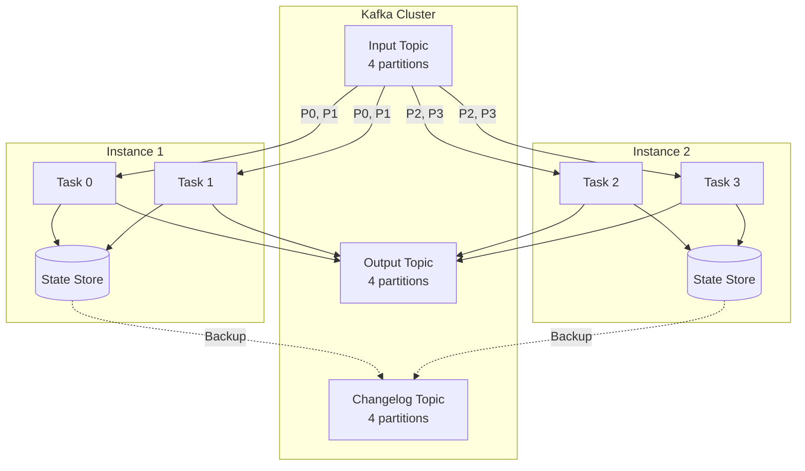

# How to Build Stream Processing Apps with Kafka Streams

Author: [nawazdhandala](https://www.github.com/nawazdhandala)

Tags: Kafka, Kafka Streams, Stream Processing, Java, Real-Time Analytics

Description: A practical guide to building real-time stream processing applications with Kafka Streams, covering stateless transformations, stateful aggregations, windowing, and joining streams with practical code examples.

---

Kafka Streams is a client library for building real-time applications that process data stored in Kafka. Unlike Spark Streaming or Flink, it runs as a standard Java application with no separate cluster to manage. This guide walks through building stream processing applications from simple transformations to complex stateful operations.

## Kafka Streams Architecture

Kafka Streams applications are just Java programs. They scale by running multiple instances that automatically partition work.



Each partition becomes a task. State stores are backed by changelog topics for fault tolerance.

## Basic Stream Processing Setup

Start with a minimal Kafka Streams application:

```java
import org.apache.kafka.common.serialization.Serdes;
import org.apache.kafka.streams.KafkaStreams;
import org.apache.kafka.streams.StreamsBuilder;
import org.apache.kafka.streams.StreamsConfig;
import org.apache.kafka.streams.kstream.KStream;
import java.util.Properties;

public class BasicStreamApp {

    public static void main(String[] args) {
        Properties props = new Properties();

        // Unique application ID (used for consumer group and state directory)
        props.put(StreamsConfig.APPLICATION_ID_CONFIG, "order-processor");

        // Kafka broker connection
        props.put(StreamsConfig.BOOTSTRAP_SERVERS_CONFIG, "kafka1:9092,kafka2:9092");

        // Default serializers/deserializers
        props.put(StreamsConfig.DEFAULT_KEY_SERDE_CLASS_CONFIG, Serdes.String().getClass());
        props.put(StreamsConfig.DEFAULT_VALUE_SERDE_CLASS_CONFIG, Serdes.String().getClass());

        // Processing guarantee
        props.put(StreamsConfig.PROCESSING_GUARANTEE_CONFIG, StreamsConfig.EXACTLY_ONCE_V2);

        // Build the topology
        StreamsBuilder builder = new StreamsBuilder();

        // Read from input topic
        KStream<String, String> orders = builder.stream("orders");

        // Process: filter and transform
        orders
            .filter((key, value) -> value.contains("\"status\":\"completed\""))
            .mapValues(value -> value.toUpperCase())
            .to("completed-orders");

        // Build and start the application
        KafkaStreams streams = new KafkaStreams(builder.build(), props);

        // Graceful shutdown hook
        Runtime.getRuntime().addShutdownHook(new Thread(streams::close));

        streams.start();
    }
}
```

## Stateless Transformations

Stateless operations process each record independently without remembering previous records.

```java
StreamsBuilder builder = new StreamsBuilder();
KStream<String, String> input = builder.stream("raw-events");

// Filter: Keep only events matching a condition
KStream<String, String> filtered = input.filter(
    (key, value) -> value != null && !value.isEmpty()
);

// Map: Transform both key and value
KStream<String, String> mapped = filtered.map(
    (key, value) -> {
        String newKey = extractUserId(value);
        String newValue = enrichEvent(value);
        return KeyValue.pair(newKey, newValue);
    }
);

// MapValues: Transform only the value (preserves key)
KStream<String, String> transformed = mapped.mapValues(
    value -> addTimestamp(value)
);

// FlatMap: One input produces zero or more outputs
KStream<String, String> expanded = transformed.flatMapValues(
    value -> {
        // Split a batch event into individual events
        List<String> events = parseEvents(value);
        return events;
    }
);

// Branch: Split stream based on conditions
KStream<String, String>[] branches = expanded.branch(
    (key, value) -> value.contains("\"priority\":\"high\""),
    (key, value) -> value.contains("\"priority\":\"medium\""),
    (key, value) -> true // Default branch
);

branches[0].to("high-priority-events");
branches[1].to("medium-priority-events");
branches[2].to("low-priority-events");
```

## Stateful Aggregations

Stateful operations maintain state across records, enabling aggregations and joins.

```java
import org.apache.kafka.streams.kstream.*;
import org.apache.kafka.common.serialization.Serdes;

StreamsBuilder builder = new StreamsBuilder();

// Read orders as a stream
KStream<String, String> orders = builder.stream(
    "orders",
    Consumed.with(Serdes.String(), Serdes.String())
);

// Parse order amount from JSON
KStream<String, Double> orderAmounts = orders.mapValues(value -> {
    // Extract amount from JSON (simplified)
    return parseAmount(value);
});

// Group by customer ID (the key)
KGroupedStream<String, Double> groupedByCustomer = orderAmounts.groupByKey(
    Grouped.with(Serdes.String(), Serdes.Double())
);

// Aggregate: Calculate total spend per customer
KTable<String, Double> customerTotals = groupedByCustomer.aggregate(
    () -> 0.0,                              // Initializer
    (customerId, amount, total) -> total + amount,  // Aggregator
    Materialized.<String, Double, KeyValueStore<Bytes, byte[]>>as("customer-totals-store")
        .withKeySerde(Serdes.String())
        .withValueSerde(Serdes.Double())
);

// Count: Simple count per key
KTable<String, Long> orderCounts = groupedByCustomer.count(
    Materialized.as("order-counts-store")
);

// Reduce: Combine values with a reducer function
KTable<String, Double> maxOrders = groupedByCustomer.reduce(
    (value1, value2) -> Math.max(value1, value2),
    Materialized.as("max-order-store")
);

// Write aggregation results to output topics
customerTotals.toStream().to("customer-spend-totals");
orderCounts.toStream().to("customer-order-counts");
```

## Windowed Aggregations

Window operations group records by time, enabling time-based analytics.

```java
import org.apache.kafka.streams.kstream.*;
import java.time.Duration;

StreamsBuilder builder = new StreamsBuilder();
KStream<String, Long> pageViews = builder.stream("page-views");

// Tumbling window: Fixed, non-overlapping windows
TimeWindowedKStream<String, Long> tumblingWindowed = pageViews
    .groupByKey()
    .windowedBy(TimeWindows.ofSizeWithNoGrace(Duration.ofMinutes(5)));

KTable<Windowed<String>, Long> viewsPerWindow = tumblingWindowed.count(
    Materialized.as("tumbling-page-views")
);

// Hopping window: Fixed windows that overlap
TimeWindowedKStream<String, Long> hoppingWindowed = pageViews
    .groupByKey()
    .windowedBy(TimeWindows.ofSizeWithNoGrace(Duration.ofMinutes(5))
        .advanceBy(Duration.ofMinutes(1)));

// Session window: Dynamic windows based on activity gaps
SessionWindowedKStream<String, Long> sessionWindowed = pageViews
    .groupByKey()
    .windowedBy(SessionWindows.ofInactivityGapWithNoGrace(Duration.ofMinutes(30)));

KTable<Windowed<String>, Long> sessionCounts = sessionWindowed.count(
    Materialized.as("session-page-views")
);

// Handle late-arriving data with grace periods
TimeWindowedKStream<String, Long> withGrace = pageViews
    .groupByKey()
    .windowedBy(TimeWindows.ofSizeAndGrace(
        Duration.ofMinutes(5),
        Duration.ofMinutes(1)  // Accept late data up to 1 minute
    ));

// Output windowed results
viewsPerWindow.toStream()
    .map((windowedKey, count) -> {
        String key = windowedKey.key();
        long windowStart = windowedKey.window().start();
        long windowEnd = windowedKey.window().end();
        String value = String.format(
            "{\"page\":\"%s\",\"count\":%d,\"window_start\":%d,\"window_end\":%d}",
            key, count, windowStart, windowEnd
        );
        return KeyValue.pair(key, value);
    })
    .to("page-view-metrics");
```

## Stream-Table Joins

Join a stream with a table to enrich events with reference data.

```java
StreamsBuilder builder = new StreamsBuilder();

// Orders stream (frequently updated)
KStream<String, String> orders = builder.stream("orders");

// Customer table (reference data, keyed by customer_id)
KTable<String, String> customers = builder.table("customers");

// Join orders with customer data
// Key must match: order key = customer_id
KStream<String, String> enrichedOrders = orders.join(
    customers,
    (order, customer) -> {
        // Combine order with customer details
        return mergeJson(order, customer);
    },
    Joined.with(Serdes.String(), Serdes.String(), Serdes.String())
);

// Left join: Include orders even if customer not found
KStream<String, String> leftJoinedOrders = orders.leftJoin(
    customers,
    (order, customer) -> {
        if (customer == null) {
            return addField(order, "customer_status", "unknown");
        }
        return mergeJson(order, customer);
    }
);

enrichedOrders.to("enriched-orders");
```

## Stream-Stream Joins

Join two streams within a time window.

```java
StreamsBuilder builder = new StreamsBuilder();

// Click events
KStream<String, String> clicks = builder.stream("clicks");

// Purchase events
KStream<String, String> purchases = builder.stream("purchases");

// Join clicks and purchases within 30-minute window
// Find which clicks led to purchases
KStream<String, String> clickToPurchase = clicks.join(
    purchases,
    (click, purchase) -> {
        return String.format(
            "{\"click\":%s,\"purchase\":%s,\"conversion\":true}",
            click, purchase
        );
    },
    JoinWindows.ofTimeDifferenceWithNoGrace(Duration.ofMinutes(30)),
    StreamJoined.with(Serdes.String(), Serdes.String(), Serdes.String())
);

clickToPurchase.to("conversions");
```

## Interactive Queries

Query state stores directly from your application for real-time lookups.

```java
// After starting the streams application
KafkaStreams streams = new KafkaStreams(builder.build(), props);
streams.start();

// Query the state store
ReadOnlyKeyValueStore<String, Double> customerTotals = streams.store(
    StoreQueryParameters.fromNameAndType(
        "customer-totals-store",
        QueryableStoreTypes.keyValueStore()
    )
);

// Point lookup
Double total = customerTotals.get("customer-123");
System.out.println("Customer 123 total: " + total);

// Range scan
KeyValueIterator<String, Double> range = customerTotals.range("customer-100", "customer-200");
while (range.hasNext()) {
    KeyValue<String, Double> entry = range.next();
    System.out.printf("%s: %.2f%n", entry.key, entry.value);
}
range.close();

// Full scan (use carefully)
KeyValueIterator<String, Double> all = customerTotals.all();
```

## Error Handling

Configure how to handle deserialization and processing errors:

```java
// Deserialization error handler
props.put(
    StreamsConfig.DEFAULT_DESERIALIZATION_EXCEPTION_HANDLER_CLASS_CONFIG,
    LogAndContinueExceptionHandler.class
);

// Production error handler (custom)
props.put(
    StreamsConfig.DEFAULT_PRODUCTION_EXCEPTION_HANDLER_CLASS_CONFIG,
    CustomProductionExceptionHandler.class
);

// Custom handler example
public class CustomProductionExceptionHandler implements ProductionExceptionHandler {
    @Override
    public ProductionExceptionHandlerResponse handle(
            ProducerRecord<byte[], byte[]> record,
            Exception exception) {

        // Log the error
        log.error("Failed to produce record to {}: {}", record.topic(), exception.getMessage());

        // Send to dead letter topic
        sendToDeadLetter(record, exception);

        // Continue processing (FAIL would stop the application)
        return ProductionExceptionHandlerResponse.CONTINUE;
    }
}
```

---

Kafka Streams provides a powerful yet simple programming model for stream processing. Start with stateless transformations for basic filtering and mapping, add stateful aggregations for analytics, and use windowing for time-based computations. The library handles partitioning, fault tolerance, and exactly-once semantics, letting you focus on business logic rather than distributed systems complexity.
