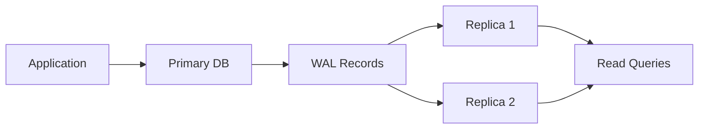

# How to Set Up Primary-Replica Streaming Replication in PostgreSQL

Author: [nawazdhandala](https://www.github.com/nawazdhandala)

Tags: PostgreSQL, Replication, High Availability, Streaming Replication, Database, DevOps

Description: Learn how to set up primary-replica streaming replication in PostgreSQL for high availability and read scaling. This guide covers configuration, monitoring, failover procedures, and common troubleshooting scenarios.

---

> Database downtime is expensive. A single primary database is a single point of failure. PostgreSQL streaming replication creates real-time copies of your database on standby servers, enabling automatic failover and read scaling. This guide walks you through setting up and managing a replicated PostgreSQL cluster.

---

## How Streaming Replication Works

PostgreSQL streaming replication works by continuously shipping Write-Ahead Log (WAL) records from the primary to replica servers:



The primary writes changes to WAL files. Replicas connect and stream these changes in real-time, typically staying within milliseconds of the primary.

---

## Setting Up the Primary Server

### Step 1: Configure postgresql.conf

On the primary server, enable replication settings:

```bash
# /etc/postgresql/15/main/postgresql.conf

# Enable WAL archiving and replication
wal_level = replica                    # Required for replication
max_wal_senders = 5                    # Max number of replicas
wal_keep_size = 1GB                    # Keep WAL for slow replicas
max_replication_slots = 5              # Prevent WAL removal before replica catches up

# Synchronous replication (optional, for zero data loss)
# synchronous_commit = on              # Wait for replica confirmation
# synchronous_standby_names = 'replica1'  # Name of sync replica

# Performance tuning for replication
wal_sender_timeout = 60s               # Timeout for inactive connections
wal_compression = on                   # Compress WAL for network efficiency
```

### Step 2: Configure pg_hba.conf

Allow replica connections:

```bash
# /etc/postgresql/15/main/pg_hba.conf

# Allow replication connections from replica servers
# TYPE  DATABASE        USER            ADDRESS                 METHOD
host    replication     replicator      10.0.0.0/24            scram-sha-256
host    replication     replicator      replica1.example.com   scram-sha-256
host    replication     replicator      replica2.example.com   scram-sha-256
```

### Step 3: Create Replication User

```sql
-- Connect to primary as superuser
CREATE ROLE replicator WITH REPLICATION LOGIN PASSWORD 'secure_password_here';

-- Grant necessary permissions
GRANT pg_read_all_data TO replicator;  -- For pg_basebackup
```

### Step 4: Create Replication Slots

Replication slots ensure WAL is retained until the replica has received it:

```sql
-- Create a physical replication slot for each replica
SELECT pg_create_physical_replication_slot('replica1_slot');
SELECT pg_create_physical_replication_slot('replica2_slot');

-- Verify slots were created
SELECT slot_name, slot_type, active FROM pg_replication_slots;
```

### Step 5: Restart Primary

```bash
sudo systemctl restart postgresql
```

---

## Setting Up the Replica Server

### Step 1: Stop PostgreSQL and Clear Data

```bash
# Stop PostgreSQL on replica
sudo systemctl stop postgresql

# Remove existing data directory
sudo rm -rf /var/lib/postgresql/15/main/*
```

### Step 2: Copy Data from Primary

Use pg_basebackup to create an initial copy:

```bash
# Run as postgres user
sudo -u postgres pg_basebackup \
    -h primary.example.com \
    -U replicator \
    -D /var/lib/postgresql/15/main \
    -Fp \                              # Plain format
    -Xs \                              # Stream WAL during backup
    -P \                               # Show progress
    -R \                               # Create standby.signal and connection info
    -S replica1_slot                   # Use replication slot

# This creates:
# - Full copy of the database
# - standby.signal file (marks this as a replica)
# - postgresql.auto.conf with connection info
```

### Step 3: Verify Configuration

Check the auto-generated configuration:

```bash
# /var/lib/postgresql/15/main/postgresql.auto.conf
cat /var/lib/postgresql/15/main/postgresql.auto.conf

# Should contain something like:
# primary_conninfo = 'user=replicator password=secure_password_here host=primary.example.com port=5432 sslmode=prefer'
# primary_slot_name = 'replica1_slot'
```

### Step 4: Configure Replica Settings

```bash
# /etc/postgresql/15/main/postgresql.conf on replica

# Replica-specific settings
hot_standby = on                       # Allow read queries on replica
hot_standby_feedback = on              # Prevent query conflicts
max_standby_streaming_delay = 30s      # Max delay before canceling conflicting queries
wal_receiver_timeout = 60s             # Timeout for primary connection
```

### Step 5: Start the Replica

```bash
sudo systemctl start postgresql
```

---

## Verifying Replication Status

### On the Primary

```sql
-- Check connected replicas
SELECT
    client_addr,
    state,
    sent_lsn,
    write_lsn,
    flush_lsn,
    replay_lsn,
    sync_state,
    pg_wal_lsn_diff(sent_lsn, replay_lsn) AS replication_lag_bytes
FROM pg_stat_replication;

-- Check replication slots
SELECT
    slot_name,
    active,
    restart_lsn,
    pg_wal_lsn_diff(pg_current_wal_lsn(), restart_lsn) AS retained_bytes
FROM pg_replication_slots;
```

### On the Replica

```sql
-- Check replica status
SELECT
    pg_is_in_recovery() AS is_replica,
    pg_last_wal_receive_lsn() AS received_lsn,
    pg_last_wal_replay_lsn() AS replayed_lsn,
    pg_last_xact_replay_timestamp() AS last_replay_time,
    NOW() - pg_last_xact_replay_timestamp() AS replication_lag;

-- Check connection to primary
SELECT * FROM pg_stat_wal_receiver;
```

---

## Monitoring Replication

### Create a Monitoring Script

```bash
#!/bin/bash
# check_replication.sh - Run on primary

psql -U postgres -d postgres -t -c "
SELECT json_build_object(
    'primary_lsn', pg_current_wal_lsn(),
    'replicas', (
        SELECT json_agg(json_build_object(
            'client_addr', client_addr,
            'state', state,
            'lag_bytes', pg_wal_lsn_diff(pg_current_wal_lsn(), replay_lsn),
            'lag_seconds', EXTRACT(EPOCH FROM (NOW() - backend_start))
        ))
        FROM pg_stat_replication
    )
);
"
```

### Prometheus Metrics

```sql
-- Create a view for Prometheus postgres_exporter
CREATE OR REPLACE VIEW replication_metrics AS
SELECT
    client_addr::text AS replica_address,
    state,
    COALESCE(pg_wal_lsn_diff(sent_lsn, replay_lsn), 0) AS lag_bytes,
    COALESCE(pg_wal_lsn_diff(pg_current_wal_lsn(), sent_lsn), 0) AS pending_bytes
FROM pg_stat_replication;
```

---

## Handling Failover

When the primary fails, you need to promote a replica.

### Manual Failover

```bash
# On the replica to be promoted
sudo -u postgres pg_ctl promote -D /var/lib/postgresql/15/main

# Or using pg_promote() function
psql -U postgres -c "SELECT pg_promote();"
```

After promotion:

```sql
-- Verify the replica is now primary
SELECT pg_is_in_recovery();  -- Should return false

-- Check that writes work
CREATE TABLE failover_test (id serial);
INSERT INTO failover_test DEFAULT VALUES;
DROP TABLE failover_test;
```

### Reconfiguring After Failover

After promoting a replica:

1. Update application connection strings to point to new primary
2. Rebuild old primary as a replica
3. Update DNS or load balancer

```bash
# Rebuild old primary as replica
sudo systemctl stop postgresql
sudo rm -rf /var/lib/postgresql/15/main/*

sudo -u postgres pg_basebackup \
    -h new-primary.example.com \
    -U replicator \
    -D /var/lib/postgresql/15/main \
    -Fp -Xs -P -R \
    -S old_primary_slot

sudo systemctl start postgresql
```

---

## Synchronous Replication

For zero data loss, configure synchronous replication:

```bash
# On primary - postgresql.conf
synchronous_commit = on
synchronous_standby_names = 'FIRST 1 (replica1, replica2)'
# FIRST 1 = wait for at least 1 replica to confirm
```

Trade-offs:
- Pro: Zero data loss on failover
- Con: Write latency increases (must wait for replica confirmation)
- Con: If all sync replicas fail, writes block

### Quorum-Based Sync Replication

For better availability:

```bash
# Wait for any 2 of 3 replicas
synchronous_standby_names = 'ANY 2 (replica1, replica2, replica3)'
```

---

## Replication Slot Management

Replication slots can accumulate WAL if a replica falls behind:

```sql
-- Check slot WAL retention
SELECT
    slot_name,
    pg_size_pretty(pg_wal_lsn_diff(pg_current_wal_lsn(), restart_lsn)) AS retained_wal
FROM pg_replication_slots;

-- Drop unused slot (frees WAL)
SELECT pg_drop_replication_slot('unused_slot');

-- Set maximum slot WAL retention (PostgreSQL 13+)
ALTER SYSTEM SET max_slot_wal_keep_size = '10GB';
SELECT pg_reload_conf();
```

---

## Troubleshooting Common Issues

### Replica Not Connecting

```bash
# Check replica logs
sudo tail -f /var/log/postgresql/postgresql-15-main.log

# Common issues:
# - Firewall blocking port 5432
# - Wrong credentials in primary_conninfo
# - pg_hba.conf not allowing replication connections
```

### Replica Falling Behind

```sql
-- On primary: Check lag
SELECT
    client_addr,
    pg_size_pretty(pg_wal_lsn_diff(pg_current_wal_lsn(), replay_lsn)) AS lag
FROM pg_stat_replication;

-- If lag is growing:
-- 1. Check replica disk I/O
-- 2. Check network bandwidth
-- 3. Increase wal_sender_timeout if needed
```

### Query Conflicts on Replica

```sql
-- On replica: Check for canceled queries
SELECT * FROM pg_stat_database_conflicts WHERE datname = 'mydb';

-- Solutions:
-- 1. Increase max_standby_streaming_delay
-- 2. Enable hot_standby_feedback
-- 3. Use longer running queries during low-write periods
```

### WAL Accumulation

```bash
# Check WAL directory size
du -sh /var/lib/postgresql/15/main/pg_wal/

# If growing, check for:
# - Inactive replication slots
# - Archive_command failures
# - Replica far behind
```

---

## Read Scaling with Replicas

Route read queries to replicas for better performance:

```python
# Python connection routing example
import psycopg2
from psycopg2 import pool
import random

class ReadWritePool:
    def __init__(self, primary_dsn, replica_dsns):
        self.primary_pool = pool.ThreadedConnectionPool(1, 10, primary_dsn)
        self.replica_pools = [
            pool.ThreadedConnectionPool(1, 10, dsn)
            for dsn in replica_dsns
        ]

    def get_write_connection(self):
        """Get connection to primary for writes"""
        return self.primary_pool.getconn()

    def get_read_connection(self):
        """Get connection to random replica for reads"""
        replica_pool = random.choice(self.replica_pools)
        return replica_pool.getconn()

    def execute_write(self, query, params=None):
        conn = self.get_write_connection()
        try:
            with conn.cursor() as cur:
                cur.execute(query, params)
            conn.commit()
        finally:
            self.primary_pool.putconn(conn)

    def execute_read(self, query, params=None):
        conn = self.get_read_connection()
        try:
            with conn.cursor() as cur:
                cur.execute(query, params)
                return cur.fetchall()
        finally:
            # Return to appropriate pool
            for rp in self.replica_pools:
                try:
                    rp.putconn(conn)
                    break
                except:
                    pass
```

---

## Conclusion

PostgreSQL streaming replication provides a robust foundation for high availability and read scaling. Key points to remember:

1. Always use replication slots to prevent WAL removal
2. Monitor replication lag continuously
3. Test failover procedures before you need them
4. Consider synchronous replication for critical data
5. Use replicas for read scaling to reduce primary load

With proper setup and monitoring, your PostgreSQL cluster can handle primary failures gracefully and scale to handle increased read traffic.

---

*Need to monitor your PostgreSQL replication? [OneUptime](https://oneuptime.com) provides database monitoring with replication lag tracking, failover alerting, and performance metrics for your PostgreSQL clusters.*

**Related Reading:**
- [How to Handle 10K Connections with PgBouncer](https://oneuptime.com/blog/post/2026-01-26-pgbouncer-connection-pooling/view)
- [How to Tune PostgreSQL for High Write Throughput](https://oneuptime.com/blog/post/2026-01-27-high-write-throughput-postgresql/view)
