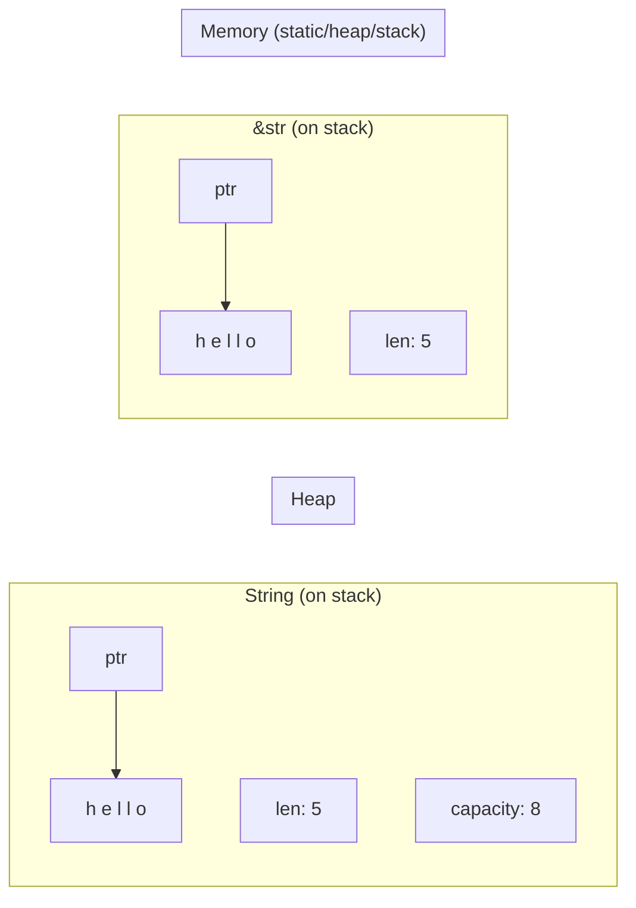

# How to Choose Between String and &str in Rust

Author: [nawazdhandala](https://www.github.com/nawazdhandala)

Tags: Rust, String, str, Ownership, Memory

Description: Learn when to use String versus &str in Rust. Understand ownership semantics, performance implications, and best practices for function parameters and return types.

---

The distinction between `String` and `&str` confuses many Rust newcomers. Both represent text, but they have different ownership semantics, memory layouts, and use cases. This guide clarifies when to use each type and why.

## Key Differences

| Aspect | `String` | `&str` |
|--------|----------|--------|
| Ownership | Owned, heap-allocated | Borrowed reference |
| Mutability | Can grow and modify | Immutable view |
| Size | Dynamic, stored on heap | Fixed, can point anywhere |
| Memory | Owns its buffer | Borrows existing data |

```rust
fn main() {
    // String: owned, heap-allocated, growable
    let mut owned = String::from("hello");
    owned.push_str(" world");  // Can modify

    // &str: borrowed slice, immutable view
    let borrowed: &str = "hello";  // Points to static memory
    let slice: &str = &owned[0..5];  // Points into String

    // String contains: pointer, length, capacity
    println!("String size: {} bytes", std::mem::size_of::<String>());  // 24

    // &str contains: pointer, length
    println!("&str size: {} bytes", std::mem::size_of::<&str>());  // 16
}
```

## Memory Layout



## Function Parameters: Prefer &str

For function parameters that only read text, use `&str`. This accepts both `String` and `&str` through deref coercion.

```rust
// Good: accepts both String and &str
fn process_text(text: &str) {
    println!("Processing: {}", text);
    println!("Length: {}", text.len());
}

// Less flexible: only accepts String
fn process_string(text: String) {
    println!("Processing: {}", text);
}

fn main() {
    let owned = String::from("owned string");
    let borrowed = "string literal";

    // &str parameter accepts both
    process_text(&owned);     // &String coerces to &str
    process_text(borrowed);   // &str directly

    // String parameter requires ownership or clone
    process_string(owned.clone());  // Must clone to keep owned
    process_string(borrowed.to_string());  // Must convert
}
```

## Return Types: Usually String

When a function creates new text, return `String` to give ownership to the caller.

```rust
// Return String when creating new data
fn create_greeting(name: &str) -> String {
    format!("Hello, {}!", name)
}

// Return String when concatenating
fn full_name(first: &str, last: &str) -> String {
    let mut result = String::with_capacity(first.len() + last.len() + 1);
    result.push_str(first);
    result.push(' ');
    result.push_str(last);
    result
}

// Return &str when returning a substring of the input
fn first_word(s: &str) -> &str {
    match s.find(' ') {
        Some(index) => &s[..index],
        None => s,
    }
}

fn main() {
    let greeting = create_greeting("Alice");
    println!("{}", greeting);

    let name = full_name("John", "Doe");
    println!("{}", name);

    let sentence = "Hello world";
    let word = first_word(sentence);
    println!("First word: {}", word);
}
```

## When to Use String

Use `String` when you need:

1. **Ownership**: Store text in a struct that outlives the input
2. **Mutation**: Modify the text content
3. **Dynamic content**: Build text at runtime
4. **Collections**: Store text in `Vec`, `HashMap`, etc.

```rust
// Struct that owns its data
struct User {
    name: String,  // Must own the name
    email: String,
}

impl User {
    fn new(name: &str, email: &str) -> Self {
        User {
            name: name.to_string(),
            email: email.to_string(),
        }
    }

    // Return &str for accessors
    fn name(&self) -> &str {
        &self.name
    }

    // Accept &str for setters
    fn set_name(&mut self, name: &str) {
        self.name = name.to_string();
    }
}

// Building text dynamically
fn build_html(items: &[&str]) -> String {
    let mut html = String::from("<ul>\n");
    for item in items {
        html.push_str("  <li>");
        html.push_str(item);
        html.push_str("</li>\n");
    }
    html.push_str("</ul>");
    html
}

// Storing in collections
fn word_count(text: &str) -> std::collections::HashMap<String, usize> {
    let mut counts = std::collections::HashMap::new();
    for word in text.split_whitespace() {
        *counts.entry(word.to_string()).or_insert(0) += 1;
    }
    counts
}
```

## When to Use &str

Use `&str` when you need:

1. **Read-only access**: No modification needed
2. **Function parameters**: Accept any string type
3. **Substrings**: Return parts of existing strings
4. **Static strings**: Compile-time string literals

```rust
// Read-only operations
fn count_vowels(text: &str) -> usize {
    text.chars()
        .filter(|c| "aeiouAEIOU".contains(*c))
        .count()
}

// Pattern matching on static strings
fn classify_status(code: u16) -> &'static str {
    match code {
        200..=299 => "success",
        400..=499 => "client error",
        500..=599 => "server error",
        _ => "unknown",
    }
}

// Extracting substrings
fn extract_domain(email: &str) -> Option<&str> {
    email.find('@').map(|i| &email[i + 1..])
}

fn main() {
    let text = "Hello, World!";
    println!("Vowels: {}", count_vowels(text));

    println!("Status: {}", classify_status(404));

    if let Some(domain) = extract_domain("user@example.com") {
        println!("Domain: {}", domain);
    }
}
```

## Cow: Best of Both Worlds

When you sometimes need to borrow and sometimes own, use `Cow` (Clone on Write):

```rust
use std::borrow::Cow;

// Returns borrowed when possible, owned when necessary
fn normalize_whitespace(input: &str) -> Cow<str> {
    if input.contains("  ") {
        // Need to modify, return owned
        let normalized: String = input
            .split_whitespace()
            .collect::<Vec<_>>()
            .join(" ");
        Cow::Owned(normalized)
    } else {
        // No modification needed, borrow
        Cow::Borrowed(input)
    }
}

fn escape_html(input: &str) -> Cow<str> {
    if input.contains(['<', '>', '&', '"', '\'']) {
        let escaped = input
            .replace('&', "&amp;")
            .replace('<', "&lt;")
            .replace('>', "&gt;")
            .replace('"', "&quot;")
            .replace('\'', "&#39;");
        Cow::Owned(escaped)
    } else {
        Cow::Borrowed(input)
    }
}

fn main() {
    let clean = "already clean";
    let messy = "too   many   spaces";

    // No allocation for clean input
    let result1 = normalize_whitespace(clean);
    println!("Clean: {} (borrowed: {})", result1, matches!(result1, Cow::Borrowed(_)));

    // Allocation only when needed
    let result2 = normalize_whitespace(messy);
    println!("Messy: {} (borrowed: {})", result2, matches!(result2, Cow::Borrowed(_)));
}
```

## Performance Considerations

```rust
// Avoid unnecessary allocations
fn inefficient(names: &[String]) {
    for name in names {
        // Bad: allocates new String every iteration
        let greeting = "Hello, ".to_string() + name;
        println!("{}", greeting);
    }
}

fn efficient(names: &[String]) {
    for name in names {
        // Good: no allocation, uses format! which is optimized
        println!("Hello, {}", name);
    }
}

// Pre-allocate when building strings
fn build_csv_slow(records: &[(&str, i32)]) -> String {
    let mut result = String::new();
    for (name, value) in records {
        result.push_str(name);  // May reallocate
        result.push(',');
        result.push_str(&value.to_string());
        result.push('\n');
    }
    result
}

fn build_csv_fast(records: &[(&str, i32)]) -> String {
    // Estimate capacity to avoid reallocations
    let capacity = records.iter()
        .map(|(name, _)| name.len() + 15)  // name + ",123456\n"
        .sum();

    let mut result = String::with_capacity(capacity);
    for (name, value) in records {
        result.push_str(name);
        result.push(',');
        result.push_str(&value.to_string());
        result.push('\n');
    }
    result
}
```

## Common Patterns Summary

```rust
struct Config {
    // Owned data for long-lived structs
    database_url: String,
    api_key: String,
}

impl Config {
    // Accept &str in constructors
    fn new(database_url: &str, api_key: &str) -> Self {
        Config {
            database_url: database_url.to_string(),
            api_key: api_key.to_string(),
        }
    }

    // Return &str from getters
    fn database_url(&self) -> &str {
        &self.database_url
    }
}

// Function signatures
fn analyze(text: &str) -> Analysis { /* ... */ }
fn transform(text: &str) -> String { /* ... */ }
fn extract<'a>(text: &'a str) -> &'a str { /* ... */ }
fn flexible(text: &str) -> Cow<str> { /* ... */ }
```

## Summary

| Situation | Use |
|-----------|-----|
| Function parameters (read-only) | `&str` |
| Function returns (new data) | `String` |
| Function returns (substring) | `&str` with lifetime |
| Struct fields | `String` |
| Static/constant strings | `&'static str` |
| Sometimes borrow, sometimes own | `Cow<str>` |

Choose `&str` for flexibility in parameters and `String` when you need ownership. This pattern follows Rust's principle of being explicit about ownership while remaining ergonomic through deref coercion.
