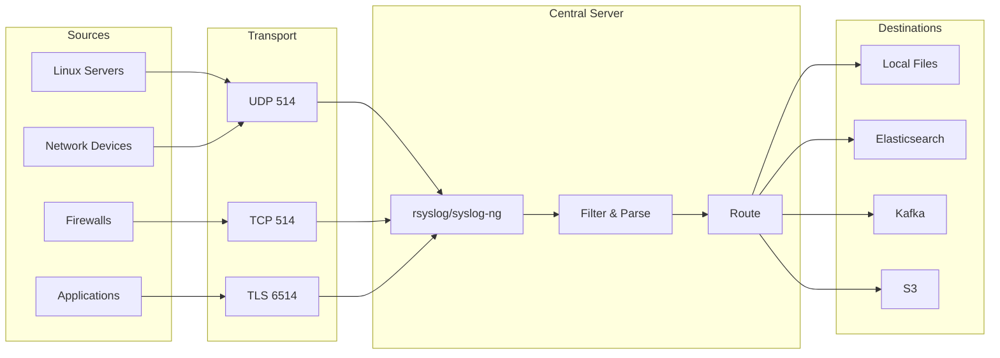

# How to Configure Syslog for Centralized Logging

Author: [nawazdhandala](https://www.github.com/nawazdhandala)

Tags: Syslog, rsyslog, syslog-ng, Centralized Logging, Linux, Network Devices, Log Management

Description: Learn how to configure syslog for centralized log collection from servers, network devices, and applications. This guide covers rsyslog and syslog-ng configuration, secure transport, and integration with modern log aggregators.

---

> Syslog is the universal language of system logging. Every Unix server, network router, firewall, and countless applications speak syslog. Configuring centralized syslog collection gives you visibility into your entire infrastructure.

Despite being decades old, syslog remains essential because it is ubiquitous. Your network switches, load balancers, and firewalls probably cannot run Fluentd or Promtail, but they can send syslog messages. A proper syslog infrastructure bridges the gap between legacy systems and modern observability.

---

## Understanding Syslog

Syslog messages have a standard structure:

```
<priority>timestamp hostname app-name[pid]: message
```

The priority combines facility (type of system) and severity (importance level):

**Facilities**: kern (0), user (1), mail (2), daemon (3), auth (4), syslog (5), lpr (6), news (7), local0-7 (16-23)

**Severities**: emergency (0), alert (1), critical (2), error (3), warning (4), notice (5), info (6), debug (7)



---

## Configuring rsyslog Server

rsyslog is the most common syslog implementation on Linux. Configure it as a central log collector:

```bash
# /etc/rsyslog.conf
# rsyslog central server configuration

#################
#### MODULES ####
#################

# Load UDP and TCP input modules
module(load="imudp")
module(load="imtcp")

# Enable TLS for secure transport
module(load="imtcp" StreamDriver.Name="gtls" StreamDriver.Mode="1" StreamDriver.Authmode="x509/name")

# Load output modules
module(load="omfile" DirCreateMode="0755" FileCreateMode="0644")
module(load="omelasticsearch")

###########################
#### NETWORK LISTENERS ####
###########################

# UDP listener (for legacy devices)
input(type="imudp" port="514" ruleset="remote")

# TCP listener (more reliable than UDP)
input(type="imtcp" port="514" ruleset="remote")

# TLS listener (encrypted transport)
input(type="imtcp" port="6514" ruleset="remote"
    StreamDriver.Name="gtls"
    StreamDriver.Mode="1"
    StreamDriver.Authmode="x509/name"
    PermittedPeer=["*.example.com"]
)

#####################
#### TEMPLATES ####
#####################

# Template for JSON output (for Elasticsearch)
template(name="json-template" type="list") {
    constant(value="{")
    constant(value="\"@timestamp\":\"")     property(name="timereported" dateFormat="rfc3339")
    constant(value="\",\"host\":\"")        property(name="hostname")
    constant(value="\",\"severity\":\"")    property(name="syslogseverity-text")
    constant(value="\",\"facility\":\"")    property(name="syslogfacility-text")
    constant(value="\",\"tag\":\"")         property(name="syslogtag" format="json")
    constant(value="\",\"message\":\"")     property(name="msg" format="json")
    constant(value="\"}")
    constant(value="\n")
}

# Template for file paths (organize by host and date)
template(name="RemoteLogPath" type="string"
    string="/var/log/remote/%HOSTNAME%/%PROGRAMNAME%.log")

# Template for daily rotation
template(name="DailyLogPath" type="string"
    string="/var/log/remote/%HOSTNAME%/%$YEAR%-%$MONTH%-%$DAY%/%PROGRAMNAME%.log")

#####################
#### RULESETS ####
#####################

ruleset(name="remote") {
    # Parse structured data if present
    action(type="mmpstrucdata")

    # Write to local files organized by host
    action(type="omfile" dynaFile="DailyLogPath")

    # Forward to Elasticsearch
    action(type="omelasticsearch"
        server="elasticsearch.example.com"
        serverport="9200"
        searchIndex="syslog"
        searchType="_doc"
        template="json-template"
        bulkmode="on"
        queue.type="linkedlist"
        queue.size="10000"
        queue.dequeuebatchsize="500"
        action.resumeretrycount="-1"
    )

    # Filter critical messages for immediate alerting
    if $syslogseverity <= 3 then {
        action(type="omfile" file="/var/log/critical.log")
    }
}

###################
#### INCLUDES ####
###################

# Include additional configuration files
$IncludeConfig /etc/rsyslog.d/*.conf
```

---

## Configuring syslog-ng Server

syslog-ng offers more flexible filtering and parsing:

```conf
# /etc/syslog-ng/syslog-ng.conf
# syslog-ng central server configuration

@version: 4.0
@include "scl.conf"

# Global options
options {
    # Performance tuning
    flush_lines(100);
    time_reopen(10);
    log_fifo_size(10000);

    # Chain hostnames for forwarded messages
    chain_hostnames(no);
    keep_hostname(yes);

    # Use DNS for hostname resolution
    use_dns(yes);
    dns_cache(yes);

    # Create directories as needed
    create_dirs(yes);
    dir_perm(0755);
    perm(0644);

    # Statistics
    stats_freq(3600);
};

# Source: Network inputs
source s_network {
    # UDP input
    udp(
        ip("0.0.0.0")
        port(514)
    );

    # TCP input
    tcp(
        ip("0.0.0.0")
        port(514)
        max-connections(100)
    );

    # TLS input
    tcp(
        ip("0.0.0.0")
        port(6514)
        tls(
            key-file("/etc/syslog-ng/certs/server.key")
            cert-file("/etc/syslog-ng/certs/server.crt")
            ca-dir("/etc/syslog-ng/certs/ca.d")
            peer-verify(required-trusted)
        )
    );
};

# Destination: Local files by host
destination d_hosts {
    file(
        "/var/log/remote/${HOST}/${PROGRAM}.log"
        create_dirs(yes)
        template("${ISODATE} ${HOST} ${PROGRAM}[${PID}]: ${MSG}\n")
    );
};

# Destination: JSON file for processing
destination d_json {
    file(
        "/var/log/syslog-json.log"
        template("$(format-json --scope rfc5424 --key ISODATE --key HOST)\n")
    );
};

# Destination: Elasticsearch
destination d_elasticsearch {
    elasticsearch-http(
        url("http://elasticsearch.example.com:9200/_bulk")
        index("syslog-${YEAR}.${MONTH}.${DAY}")
        type("")
        template("$(format-json --scope rfc5424 --key ISODATE)")
    );
};

# Destination: Kafka
destination d_kafka {
    kafka(
        bootstrap-servers("kafka1.example.com:9092,kafka2.example.com:9092")
        topic("syslog")
        template("$(format-json --scope rfc5424)")
    );
};

# Filter: Critical messages
filter f_critical {
    level(emerg..err);
};

# Filter: Authentication messages
filter f_auth {
    facility(auth, authpriv);
};

# Filter: Specific hosts
filter f_network_devices {
    host("^switch-" type(pcre)) or
    host("^router-" type(pcre)) or
    host("^fw-" type(pcre));
};

# Log paths
log {
    source(s_network);
    destination(d_hosts);
    destination(d_elasticsearch);
};

# Critical messages get extra handling
log {
    source(s_network);
    filter(f_critical);
    destination(d_kafka);
    flags(flow-control);
};

# Auth logs to separate file
log {
    source(s_network);
    filter(f_auth);
    destination { file("/var/log/remote-auth.log"); };
};
```

---

## Configuring Syslog Clients

Configure Linux servers to send logs to the central server:

```bash
# /etc/rsyslog.d/50-remote.conf
# Client configuration to send logs to central server

# Load TCP output module
module(load="omfwd")

# Queue configuration for reliability
$ActionQueueFileName fwdRule1
$ActionQueueMaxDiskSpace 1g
$ActionQueueSaveOnShutdown on
$ActionQueueType LinkedList
$ActionResumeRetryCount -1

# Forward all logs via TCP
*.* @@syslog.example.com:514

# Or use TLS for encryption
# *.* @@(o)syslog.example.com:6514

# Forward only important logs
*.err @@syslog.example.com:514
authpriv.* @@syslog.example.com:514
```

For syslog-ng clients:

```conf
# /etc/syslog-ng/conf.d/remote.conf
# syslog-ng client configuration

destination d_remote {
    tcp(
        "syslog.example.com"
        port(514)
        disk-buffer(
            mem-buf-size(10000)
            disk-buf-size(2000000000)
            reliable(yes)
            dir("/var/syslog-ng-buffer")
        )
    );
};

log {
    source(s_local);
    destination(d_remote);
};
```

---

## Configuring Network Devices

Most network devices support syslog. Here are examples for common platforms:

### Cisco IOS

```
! Enable logging
logging on
logging buffered 64000 debugging
logging console critical

! Set syslog server
logging host 10.0.0.100 transport tcp port 514

! Set source interface
logging source-interface Loopback0

! Include timestamps
service timestamps log datetime msec localtime show-timezone

! Set facility
logging facility local6
```

### Juniper Junos

```
system {
    syslog {
        host 10.0.0.100 {
            any notice;
            authorization info;
            interactive-commands any;
            port 514;
            source-address 10.0.1.1;
            structured-data;
        }
        time-format millisecond;
    }
}
```

### Palo Alto

```
set deviceconfig system logging syslog-server 10.0.0.100
set deviceconfig system logging syslog-server 10.0.0.100 transport TCP
set deviceconfig system logging syslog-server 10.0.0.100 port 514
set deviceconfig system logging syslog-server 10.0.0.100 format BSD
```

---

## Parsing and Enriching Syslog

Parse structured data from syslog messages:

```conf
# /etc/rsyslog.d/parse.conf
# Parsing rules for common log formats

# Load parsing modules
module(load="mmjsonparse")
module(load="mmpstrucdata")

# Parse JSON in message body
action(type="mmjsonparse")

# Template for parsed JSON
template(name="parsed-json" type="list") {
    constant(value="{")
    constant(value="\"@timestamp\":\"")     property(name="timereported" dateFormat="rfc3339")
    constant(value="\",\"host\":\"")        property(name="hostname")
    constant(value="\",\"program\":\"")     property(name="programname")
    constant(value="\",\"severity\":\"")    property(name="syslogseverity-text")
    constant(value="\",\"message\":\"")     property(name="msg" format="json")
    constant(value="\",\"parsed\":")        property(name="$!all-json")
    constant(value="}")
    constant(value="\n")
}

# Parse specific application logs
if $programname == 'nginx' then {
    # Parse nginx combined log format
    action(type="mmexternal" binary="/usr/local/bin/parse-nginx.py")
}
```

Python parser for nginx logs:

```python
#!/usr/bin/env python3
# /usr/local/bin/parse-nginx.py
# Parse nginx access logs for rsyslog

import sys
import json
import re

NGINX_PATTERN = re.compile(
    r'(?P<client_ip>\S+) - (?P<user>\S+) \[(?P<timestamp>[^\]]+)\] '
    r'"(?P<method>\S+) (?P<path>\S+) (?P<protocol>\S+)" '
    r'(?P<status>\d+) (?P<bytes>\d+) "(?P<referrer>[^"]*)" "(?P<user_agent>[^"]*)"'
)

for line in sys.stdin:
    try:
        data = json.loads(line)
        msg = data.get('msg', '')

        match = NGINX_PATTERN.match(msg)
        if match:
            data['nginx'] = match.groupdict()
            data['nginx']['status'] = int(data['nginx']['status'])
            data['nginx']['bytes'] = int(data['nginx']['bytes'])

        print(json.dumps(data))
    except Exception:
        print(line, end='')
```

---

## Secure Syslog Transport

Configure TLS encryption for syslog:

```bash
# Generate certificates for syslog-ng
# Create CA
openssl genrsa -out ca.key 4096
openssl req -new -x509 -days 3650 -key ca.key -out ca.crt \
    -subj "/CN=Syslog CA"

# Create server certificate
openssl genrsa -out server.key 2048
openssl req -new -key server.key -out server.csr \
    -subj "/CN=syslog.example.com"
openssl x509 -req -days 365 -in server.csr -CA ca.crt -CAkey ca.key \
    -CAcreateserial -out server.crt

# Create client certificate
openssl genrsa -out client.key 2048
openssl req -new -key client.key -out client.csr \
    -subj "/CN=client.example.com"
openssl x509 -req -days 365 -in client.csr -CA ca.crt -CAkey ca.key \
    -CAcreateserial -out client.crt
```

rsyslog TLS configuration:

```bash
# /etc/rsyslog.d/tls.conf
# TLS configuration for rsyslog

# Global TLS settings
global(
    DefaultNetstreamDriver="gtls"
    DefaultNetstreamDriverCAFile="/etc/rsyslog/certs/ca.crt"
    DefaultNetstreamDriverCertFile="/etc/rsyslog/certs/server.crt"
    DefaultNetstreamDriverKeyFile="/etc/rsyslog/certs/server.key"
)

# TLS listener
module(load="imtcp" StreamDriver.Name="gtls" StreamDriver.Mode="1" StreamDriver.AuthMode="x509/name")
input(type="imtcp" port="6514")
```

---

## Integration with Modern Systems

Forward syslog to modern log aggregators:

```bash
# /etc/rsyslog.d/forward.conf
# Forward to various destinations

# Forward to Kafka
module(load="omkafka")

action(type="omkafka"
    broker="kafka1.example.com:9092,kafka2.example.com:9092"
    topic="syslog"
    partitions.auto="on"
    confParam=[
        "socket.keepalive.enable=true",
        "compression.codec=snappy"
    ]
    template="json-template"
    queue.type="linkedlist"
    queue.size="100000"
)

# Forward to HTTP endpoint (like OneUptime)
module(load="omhttp")

action(type="omhttp"
    server="logs.oneuptime.com"
    serverport="443"
    usehttps="on"
    httpheaderkey="Authorization"
    httpheadervalue="Bearer YOUR_API_KEY"
    template="json-template"
    retry="on"
    retry.ruleset="retry"
)
```

---

## Monitoring Syslog Infrastructure

Monitor your syslog server health:

```bash
#!/bin/bash
# syslog-health-check.sh
# Monitor syslog server health

# Check rsyslog is running
if ! systemctl is-active --quiet rsyslog; then
    echo "CRITICAL: rsyslog is not running"
    exit 2
fi

# Check queue size
QUEUE_SIZE=$(rsyslogd -N1 2>&1 | grep -c "queue")
if [ "$QUEUE_SIZE" -gt 10000 ]; then
    echo "WARNING: Large queue size: $QUEUE_SIZE"
    exit 1
fi

# Check disk space for log storage
DISK_USAGE=$(df /var/log | tail -1 | awk '{print $5}' | tr -d '%')
if [ "$DISK_USAGE" -gt 90 ]; then
    echo "WARNING: Log disk usage at ${DISK_USAGE}%"
    exit 1
fi

# Check network listeners
if ! ss -tlnp | grep -q ':514'; then
    echo "CRITICAL: Syslog not listening on port 514"
    exit 2
fi

echo "OK: Syslog server healthy"
exit 0
```

---

## Summary

Syslog provides a universal foundation for centralized logging:

1. **Use rsyslog or syslog-ng** for flexible log collection
2. **Enable TLS** for secure transport over untrusted networks
3. **Parse and enrich** logs for better analysis
4. **Forward to modern systems** for long-term storage and analysis
5. **Monitor your syslog infrastructure** to ensure reliability

While newer protocols exist, syslog's ubiquity makes it essential for any comprehensive logging strategy. It bridges the gap between legacy infrastructure and modern observability platforms.

---

*Looking for syslog integration with modern observability? [OneUptime](https://oneuptime.com) provides native syslog ingestion that automatically parses and correlates your syslog data with application traces and metrics, giving you complete visibility across your infrastructure.*
