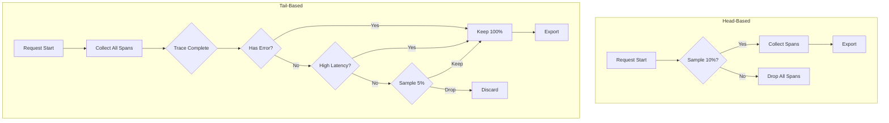

# How to Implement Tail-Based Sampling in OpenTelemetry

Author: [nawazdhandala](https://www.github.com/nawazdhandala)

Tags: OpenTelemetry, Sampling, Tracing, Observability, Performance, Cost Optimization, Collector

Description: Learn how to implement tail-based sampling in OpenTelemetry to keep interesting traces while reducing storage costs and maintaining observability quality.

---

Distributed tracing generates massive amounts of data. At scale, storing and analyzing every trace becomes prohibitively expensive. Head-based sampling, where you decide to sample before the trace completes, misses important events that happen later in the request lifecycle. Tail-based sampling solves this by making sampling decisions after the entire trace is available.

## Head-Based vs Tail-Based Sampling

Head-based sampling makes decisions at trace creation time. You might sample 10% of traces randomly. The problem is that the most interesting traces, those with errors or high latency, represent far less than 10% of traffic. Random sampling misses them.

Tail-based sampling waits until the trace completes, then examines its contents to decide whether to keep it. This lets you keep 100% of error traces while sampling routine successful requests at a much lower rate.



## Setting Up Tail Sampling in the Collector

Tail sampling happens in the OpenTelemetry Collector, not in your application code. This requires the `tailsamplingprocessor` from the collector-contrib distribution.

Here is a basic configuration:

```yaml
# otel-collector-config.yaml
receivers:
  otlp:
    protocols:
      grpc:
        endpoint: 0.0.0.0:4317

processors:
  # Tail sampling must receive complete traces
  tail_sampling:
    # How long to wait for spans before making a decision
    decision_wait: 10s
    # Maximum traces held in memory
    num_traces: 100000
    # Expected new traces per second (for memory allocation)
    expected_new_traces_per_sec: 1000

    policies:
      # Keep all traces with errors
      - name: errors-policy
        type: status_code
        status_code:
          status_codes: [ERROR]

      # Keep traces slower than 500ms
      - name: latency-policy
        type: latency
        latency:
          threshold_ms: 500

      # Sample 5% of remaining traces
      - name: probabilistic-policy
        type: probabilistic
        probabilistic:
          sampling_percentage: 5

exporters:
  otlphttp:
    endpoint: "https://your-backend.example.com"

service:
  pipelines:
    traces:
      receivers: [otlp]
      processors: [tail_sampling]
      exporters: [otlphttp]
```

## Policy Types and Combinations

The tail sampling processor supports multiple policy types. Understanding each helps you build effective sampling strategies.

### Status Code Policy

Keep traces based on their status:

```yaml
- name: keep-errors
  type: status_code
  status_code:
    status_codes: [ERROR]
```

### Latency Policy

Keep traces exceeding a duration threshold:

```yaml
- name: slow-traces
  type: latency
  latency:
    threshold_ms: 1000
    upper_threshold_ms: 10000  # Optional upper bound
```

### String Attribute Policy

Keep traces containing specific attribute values:

```yaml
- name: payment-service
  type: string_attribute
  string_attribute:
    key: service.name
    values: [payment-service, billing-service]
    enabled_regex_matching: false
```

### Numeric Attribute Policy

Filter based on numeric attributes:

```yaml
- name: large-responses
  type: numeric_attribute
  numeric_attribute:
    key: http.response_content_length
    min_value: 1000000  # 1MB
```

### Rate Limiting Policy

Cap the number of traces per second:

```yaml
- name: rate-limit
  type: rate_limiting
  rate_limiting:
    spans_per_second: 1000
```

### Composite Policy

Combine multiple conditions with AND logic:

```yaml
- name: critical-slow-errors
  type: composite
  composite:
    max_total_spans_per_second: 500
    policy_order: [error-filter, latency-filter]
    composite_sub_policy:
      - name: error-filter
        type: status_code
        status_code:
          status_codes: [ERROR]
      - name: latency-filter
        type: latency
        latency:
          threshold_ms: 2000
    rate_allocation:
      - policy: error-filter
        percent: 60
      - policy: latency-filter
        percent: 40
```

## Building a Production Sampling Strategy

Here is a comprehensive configuration that handles common production scenarios:

```yaml
processors:
  tail_sampling:
    decision_wait: 15s
    num_traces: 200000
    expected_new_traces_per_sec: 5000

    policies:
      # Priority 1: Keep all errors
      - name: all-errors
        type: status_code
        status_code:
          status_codes: [ERROR]

      # Priority 2: Keep traces from critical services
      - name: critical-services
        type: string_attribute
        string_attribute:
          key: service.name
          values:
            - payment-service
            - auth-service
            - order-service

      # Priority 3: Keep high-latency traces
      - name: high-latency
        type: latency
        latency:
          threshold_ms: 2000

      # Priority 4: Keep traces for specific endpoints
      - name: important-endpoints
        type: string_attribute
        string_attribute:
          key: http.route
          values:
            - "/api/v1/checkout"
            - "/api/v1/payment/process"
            - "/api/v1/order/submit"

      # Priority 5: Keep traces with specific user tiers
      - name: premium-users
        type: string_attribute
        string_attribute:
          key: user.tier
          values: [enterprise, premium]

      # Priority 6: Sample remaining traces probabilistically
      - name: baseline-sampling
        type: probabilistic
        probabilistic:
          sampling_percentage: 2
```

## Memory Management

Tail sampling requires holding traces in memory until all spans arrive. This creates memory pressure. Configure these parameters carefully:

```yaml
processors:
  # Memory limiter should come BEFORE tail sampling
  memory_limiter:
    check_interval: 1s
    limit_mib: 3000
    spike_limit_mib: 800

  tail_sampling:
    # Traces held in memory
    num_traces: 100000
    # Time to wait for spans
    decision_wait: 10s
    # Traces per second estimate
    expected_new_traces_per_sec: 2000
```

Calculate memory requirements:
- Average trace size: ~10KB (varies by span count and attributes)
- num_traces: 100000
- Approximate memory: 100000 * 10KB = 1GB

Add headroom for processing and the memory limiter spike limit.

## Handling Multi-Collector Deployments

Tail sampling requires all spans from a trace to reach the same collector instance. In a multi-instance deployment, you need trace-aware load balancing.

### Option 1: Load Balancer Exporter

Use the `loadbalancing` exporter to route spans by trace ID:

```yaml
# Agent collector config
exporters:
  loadbalancing:
    protocol:
      otlp:
        timeout: 1s
    resolver:
      dns:
        hostname: otel-gateway.observability.svc.cluster.local
        port: 4317

# Gateway collector config (runs tail sampling)
receivers:
  otlp:
    protocols:
      grpc:
        endpoint: 0.0.0.0:4317

processors:
  tail_sampling:
    # ... sampling config ...
```

### Option 2: Kafka with Partition Key

Route spans through Kafka using trace ID as the partition key:

```yaml
# Agent sends to Kafka
exporters:
  kafka:
    brokers:
      - kafka:9092
    topic: traces
    encoding: otlp_proto
    producer:
      # Use trace ID as partition key
      partition_strategy: trace_id

# Gateway reads from Kafka
receivers:
  kafka:
    brokers:
      - kafka:9092
    topic: traces
    encoding: otlp_proto
```

## Monitoring Tail Sampling

Track these metrics to ensure sampling works correctly:

```yaml
service:
  telemetry:
    metrics:
      level: detailed
```

Key metrics to watch:
- `otelcol_processor_tail_sampling_count_traces_sampled` - Traces kept per policy
- `otelcol_processor_tail_sampling_count_traces_dropped` - Traces discarded
- `otelcol_processor_tail_sampling_global_count_traces_sampled` - Total sampled
- `otelcol_processor_tail_sampling_sampling_decision_latency` - Decision time
- `otelcol_processor_tail_sampling_sampling_trace_dropped_too_early` - Spans arriving after decision

High values in `trace_dropped_too_early` indicate your `decision_wait` is too short.

## Common Pitfalls

### Decision Wait Too Short

If spans arrive after the sampling decision, they get dropped. Increase `decision_wait` but balance against memory usage.

### Missing Critical Policies

Always include an error policy first. Without it, you might sample out the very traces you need for debugging.

### Forgetting Baseline Sampling

A probabilistic baseline ensures you capture some normal traffic for comparison. Without it, your view becomes skewed toward anomalies.

### Ignoring Memory Limits

Tail sampling can consume significant memory. Always pair it with the memory limiter processor and monitor actual usage.

## Example: E-Commerce Application

Here is a complete configuration for an e-commerce application:

```yaml
processors:
  tail_sampling:
    decision_wait: 20s
    num_traces: 150000
    expected_new_traces_per_sec: 3000

    policies:
      # Keep all errors for debugging
      - name: errors
        type: status_code
        status_code:
          status_codes: [ERROR]

      # Keep failed payment attempts
      - name: payment-failures
        type: and
        and:
          and_sub_policy:
            - name: is-payment
              type: string_attribute
              string_attribute:
                key: service.name
                values: [payment-service]
            - name: has-error
              type: string_attribute
              string_attribute:
                key: payment.status
                values: [declined, failed, timeout]

      # Keep slow checkout flows
      - name: slow-checkout
        type: and
        and:
          and_sub_policy:
            - name: is-checkout
              type: string_attribute
              string_attribute:
                key: http.route
                values: ["/checkout/*"]
            - name: is-slow
              type: latency
              latency:
                threshold_ms: 3000

      # Sample everything else at 3%
      - name: baseline
        type: probabilistic
        probabilistic:
          sampling_percentage: 3
```

## Conclusion

Tail-based sampling dramatically improves the quality of your trace data while reducing costs. By keeping interesting traces and sampling routine ones, you maintain full visibility into problems while staying within budget. Start with a simple configuration, monitor the sampling metrics, and refine your policies based on what you actually need for debugging and analysis.
