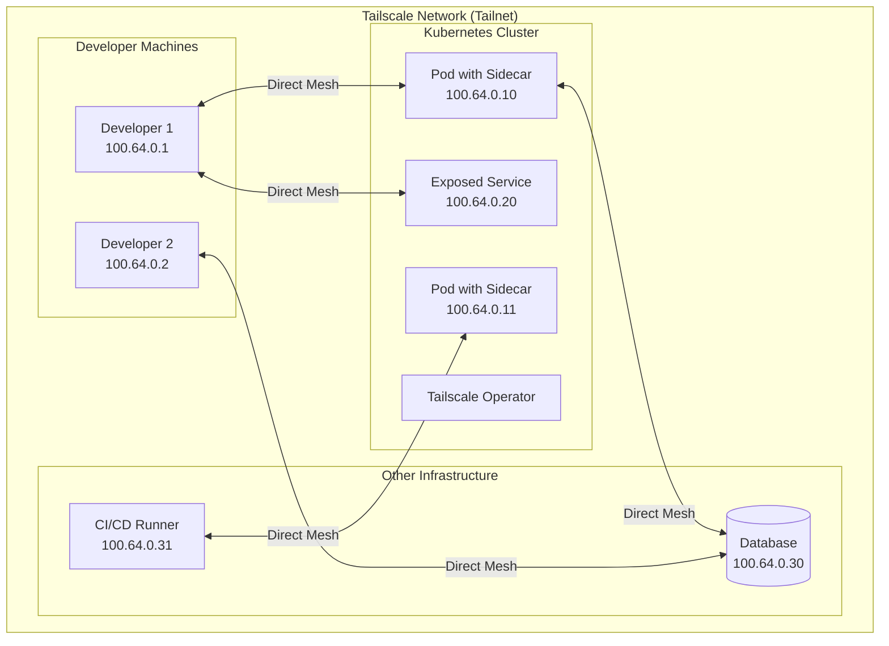

# How to Configure Tailscale for Secure Networking

Author: [nawazdhandala](https://www.github.com/nawazdhandala)

Tags: Tailscale, VPN, Security, Kubernetes, WireGuard, Zero Trust, Mesh Network

Description: Learn how to configure Tailscale for secure networking in Kubernetes environments. This guide covers deployment, ACL configuration, and integration patterns for zero-trust network access.

---

> Tailscale simplifies secure networking by building on WireGuard to create mesh VPNs without the complexity of traditional VPN infrastructure. In Kubernetes environments, it enables secure access to services without exposing them to the public internet.

Traditional VPN solutions require complex infrastructure, certificate management, and firewall rules. Tailscale eliminates this complexity by using identity-based networking with automatic key management and NAT traversal.

---

## Why Tailscale for Kubernetes

Tailscale addresses several Kubernetes networking challenges:

- **No public exposure**: Access internal services without LoadBalancers or Ingress
- **Identity-based access**: Use your existing identity provider for authorization
- **Automatic connectivity**: NAT traversal works across firewalls and networks
- **Mesh topology**: Direct connections between nodes without a central gateway

---

## Prerequisites

Before starting:

- Tailscale account (free tier available)
- Kubernetes cluster (v1.19+)
- kubectl with cluster admin access
- OAuth client configured in Tailscale Admin Console with device, auth key, and service permissions

---

## Architecture Overview


```mermaid
graph TB
    subgraph "Tailscale Network (Tailnet)"
        subgraph "Developer Machines"
            D1[Developer 1<br/>100.64.0.1]
            D2[Developer 2<br/>100.64.0.2]
        end

        subgraph "Kubernetes Cluster"
            OP[Tailscale Operator]
            P1[Pod with Sidecar<br/>100.64.0.10]
            P2[Pod with Sidecar<br/>100.64.0.11]
            SVC[Exposed Service<br/>100.64.0.20]
        end

        subgraph "Other Infrastructure"
            DB[(Database<br/>100.64.0.30)]
            CI[CI/CD Runner<br/>100.64.0.31]
        end

        D1 <-->|Direct Mesh| P1
        D1 <-->|Direct Mesh| SVC
        D2 <-->|Direct Mesh| DB
        P1 <-->|Direct Mesh| DB
        CI <-->|Direct Mesh| P2
    end
```

---

## Installing the Tailscale Operator

The Tailscale Kubernetes Operator automates Tailscale integration:

```yaml
# tailscale-operator-values.yaml

# Helm values for Tailscale Operator

# OAuth credentials for operator authentication
oauth:
  # Create in Tailscale Admin Console > Settings > OAuth clients
  clientId: "your-oauth-client-id"
  clientSecret: "your-oauth-client-secret"

# Operator configuration
operatorConfig:
  # Hostname for the operator device
  hostname: k8s

  # Default tags for created devices
  defaultTags:
  - tag:k8s-operator

  # Image settings
  image:
    repository: tailscale/k8s-operator
    # Leave empty to use the chart appVersion
    tag: ""

  # Resource limits
  resources:
    requests:
      cpu: 50m
      memory: 64Mi
    limits:
      cpu: 200m
      memory: 128Mi
```

Deploy the operator:

```bash
# Add Tailscale Helm repository
helm repo add tailscale https://pkgs.tailscale.com/helmcharts
helm repo update

# Install operator
helm install tailscale-operator tailscale/tailscale-operator \
  --namespace tailscale \
  --create-namespace \
  --values tailscale-operator-values.yaml \
  --wait

# Verify deployment
kubectl get pods -n tailscale
```

---

## Exposing Services via Tailscale

Expose a Kubernetes service on your Tailnet:

```yaml
# tailscale-service.yaml
# Service exposed via Tailscale instead of public LoadBalancer
apiVersion: v1
kind: Service
metadata:
  name: internal-api
  namespace: production
  annotations:
    # Tell operator to expose this service
    tailscale.com/expose: "true"
    # Hostname on your Tailnet
    tailscale.com/hostname: "internal-api"
    # Tags for ACL matching
    tailscale.com/tags: "tag:k8s-service,tag:api"
spec:
  selector:
    app: internal-api
  ports:
  - port: 8080
    targetPort: 8080
  # No need for LoadBalancer - Tailscale handles access
  type: ClusterIP
```

Apply and verify:

```bash
# Apply service
kubectl apply -f tailscale-service.yaml

# Check Tailscale device was created
kubectl get events -n production | grep tailscale

# The service is now accessible at internal-api.your-tailnet.ts.net
curl http://internal-api.your-tailnet.ts.net:8080/health
```

---

## Configuring Tailscale ACLs

Define access control in your Tailscale Admin Console:

```json
{
  "tagOwners": {
    "tag:k8s-operator": ["autogroup:admin"],
    "tag:k8s-service": ["tag:k8s-operator"],
    "tag:api": ["tag:k8s-operator"],
    "tag:database": ["tag:k8s-operator"],
    "tag:developer": ["autogroup:admin"],
    "tag:sre": ["autogroup:admin"],
    "tag:ci-runner": ["autogroup:admin"],
    "tag:k8s-api": ["tag:k8s-operator"],
    "tag:k8s-pod": ["autogroup:admin"],
    "tag:k8s-subnet-router": ["tag:k8s-operator"]
  },

  "acls": [
    {
      "action": "accept",
      "src": ["tag:developer"],
      "dst": [
        "tag:api:8080",
        "tag:k8s-service:80,443"
      ]
    },
    {
      "action": "accept",
      "src": ["tag:sre"],
      "dst": [
        "tag:k8s-service:*",
        "tag:database:5432"
      ]
    },
    {
      "action": "accept",
      "src": ["tag:k8s-service"],
      "dst": [
        "tag:database:5432,3306"
      ]
    },
    {
      "action": "accept",
      "src": ["tag:ci-runner"],
      "dst": [
        "tag:k8s-service:*"
      ]
    }
  ],

  "autoApprovers": {
    "services": {
      "svc:*": ["tag:k8s-api"]
    }
  },

  "grants": [
    {
      "src": ["group:engineering"],
      "dst": ["tag:k8s-api"],
      "ip": ["tcp:80", "tcp:443"]
    },
    {
      "src": ["group:engineering"],
      "dst": ["tag:k8s-api"],
      "app": {
        "tailscale.com/cap/kubernetes": [{
          "impersonate": {
            "groups": ["system:authenticated"]
          }
        }]
      }
    }
  ],

  "ssh": [
    {
      "action": "accept",
      "src": ["tag:sre"],
      "dst": ["tag:k8s-service"],
      "users": ["autogroup:nonroot", "root"]
    }
  ]
}
```

---

## Subnet Router for Cluster Access

Expose your entire cluster network via a subnet router:

```yaml
# subnet-router.yaml
# Tailscale Connector for subnet routing
apiVersion: tailscale.com/v1alpha1
kind: Connector
metadata:
  name: cluster-subnet-router
spec:
  replicas: 1

  # Hostname on Tailnet
  hostname: k8s-subnet-router

  # Subnets to advertise
  subnetRouter:
    advertiseRoutes:
    # Pod CIDR
    - "10.244.0.0/16"
    # Service CIDR
    - "10.96.0.0/12"

  # Tags for ACL matching
  tags:
  - tag:k8s-subnet-router

  # Exit node configuration (optional)
  exitNode: false
```

Alternatively, deploy as a DaemonSet for high availability:

```yaml
# tailscale-subnet-daemonset.yaml
apiVersion: apps/v1
kind: DaemonSet
metadata:
  name: tailscale-subnet-router
  namespace: tailscale
spec:
  selector:
    matchLabels:
      app: tailscale-subnet-router
  template:
    metadata:
      labels:
        app: tailscale-subnet-router
    spec:
      serviceAccountName: tailscale
      hostNetwork: true

      initContainers:
      # Enable IP forwarding
      - name: sysctler
        image: busybox:1.36
        securityContext:
          privileged: true
        command:
        - /bin/sh
        - -c
        - |
          sysctl -w net.ipv4.ip_forward=1
          sysctl -w net.ipv6.conf.all.forwarding=1

      containers:
      - name: tailscale
        image: tailscale/tailscale:stable
        securityContext:
          capabilities:
            add:
            - NET_ADMIN
        env:
        - name: TS_AUTHKEY
          valueFrom:
            secretKeyRef:
              name: tailscale-auth
              key: authkey
        - name: TS_KUBE_SECRET
          value: tailscale-state
        - name: TS_USERSPACE
          value: "false"
        - name: TS_ROUTES
          value: "10.244.0.0/16,10.96.0.0/12"
        - name: TS_EXTRA_ARGS
          value: "--advertise-tags=tag:k8s-subnet-router"
        volumeMounts:
        - name: dev-tun
          mountPath: /dev/net/tun
        - name: state
          mountPath: /var/lib/tailscale

      volumes:
      - name: dev-tun
        hostPath:
          path: /dev/net/tun
      - name: state
        emptyDir: {}
```

---

## Sidecar Pattern for Pod Connectivity

Add Tailscale to pods that need direct Tailnet access:

```yaml
# pod-with-tailscale-sidecar.yaml
apiVersion: v1
kind: Pod
metadata:
  name: app-with-tailscale
  namespace: production
spec:
  serviceAccountName: tailscale

  containers:
  # Main application
  - name: app
    image: myapp:1.0
    ports:
    - containerPort: 8080

  # Tailscale sidecar
  - name: tailscale
    image: tailscale/tailscale:stable
    securityContext:
      capabilities:
        add:
        - NET_ADMIN
    env:
    - name: TS_AUTHKEY
      valueFrom:
        secretKeyRef:
          name: tailscale-auth
          key: authkey
    - name: TS_KUBE_SECRET
      value: ""
    - name: TS_USERSPACE
      value: "true"
    - name: TS_EXTRA_ARGS
      value: "--hostname=myapp-pod --advertise-tags=tag:k8s-pod"
    resources:
      requests:
        cpu: 10m
        memory: 32Mi
      limits:
        cpu: 100m
        memory: 64Mi
```

---

## Kubernetes API Access via Tailscale

Access your cluster's API server securely:

```yaml
# api-server-proxy.yaml
# Expose Kubernetes API via the Tailscale API server proxy
apiVersion: tailscale.com/v1alpha1
kind: ProxyGroup
metadata:
  name: k8s-api
spec:
  type: kube-apiserver
  replicas: 2
  tags:
  - tag:k8s-api
  kubeAPIServer:
    mode: auth
```

Configure kubectl to use Tailscale:

```bash
# Enable impersonation RBAC for API server proxy pods
helm upgrade tailscale-operator tailscale/tailscale-operator \
  --namespace tailscale \
  --set-string apiServerProxyConfig.allowImpersonation="true" \
  --reuse-values

# Deploy the API server proxy
kubectl apply -f api-server-proxy.yaml
kubectl wait proxygroup k8s-api --for=condition=ProxyGroupReady=true

# Configure kubeconfig to use the Tailscale proxy URL
tailscale configure kubeconfig https://k8s-api.your-tailnet.ts.net

# Now kubectl works from any device on your Tailnet
kubectl get pods
```

---

## MagicDNS Integration

Enable MagicDNS for automatic DNS resolution:

```yaml
# dnsconfig.yaml
# Deploy a Tailscale nameserver for in-cluster MagicDNS resolution
apiVersion: tailscale.com/v1alpha1
kind: DNSConfig
metadata:
  name: ts-dns
spec:
  nameserver:
    image:
      repo: tailscale/k8s-nameserver
      tag: unstable
```

After applying the `DNSConfig`, forward your tailnet's `.ts.net` domain to the nameserver Service IP in CoreDNS:

```bash
kubectl apply -f dnsconfig.yaml
TS_DNS_IP=$(kubectl get dnsconfig ts-dns -o jsonpath='{.status.nameserver.ip}')

kubectl -n kube-system edit configmap coredns
```

Add a stub domain to the CoreDNS `Corefile`, replacing `TS_DNS_IP` with the nameserver IP from the previous command:

```text
your-tailnet.ts.net:53 {
    errors
    cache 30
    forward . TS_DNS_IP
}
```

---

## Monitoring Tailscale Connections

Track Tailscale health and connectivity:

```bash
#!/bin/bash
# tailscale-health-check.sh
# Monitor Tailscale status in cluster

echo "=== Tailscale Operator Status ==="
kubectl get pods -n tailscale

echo ""
echo "=== Exposed Services ==="
kubectl get services -A -o json | jq '.items[] | select(.metadata.annotations["tailscale.com/expose"] == "true") | {namespace: .metadata.namespace, name: .metadata.name, hostname: .metadata.annotations["tailscale.com/hostname"]}'

echo ""
echo "=== Tailscale Devices ==="
# Requires tailscale CLI on a connected device
tailscale status --json | jq '.Peer | to_entries[] | select(.value.Tags | contains(["tag:k8s-service"])) | {name: .value.HostName, ip: .value.TailscaleIPs[0], online: .value.Online}'

echo ""
echo "=== Connection Tests ==="
for svc in $(kubectl get services -A -o json | jq -r '.items[] | select(.metadata.annotations["tailscale.com/expose"] == "true") | .metadata.annotations["tailscale.com/hostname"]'); do
    echo -n "$svc: "
    if tailscale ping --timeout=5s $svc.your-tailnet.ts.net &> /dev/null; then
        echo "OK"
    else
        echo "FAILED"
    fi
done
```

---

## Best Practices

### Use Tags for Access Control

```yaml
annotations:
  # Use specific tags for granular ACL control
  tailscale.com/tags: "tag:production,tag:api,tag:external-facing"
```

### Separate Tailnets by Environment

Create separate Tailnets for production and non-production to ensure complete isolation.

### Enable Key Expiry

Review the Key Expiry settings in the Tailscale Admin Console. Tagged devices, including operator-managed Kubernetes proxies, have key expiry disabled by default, so plan a re-authentication process before enabling expiry for production infrastructure.

---

## Conclusion

Tailscale transforms Kubernetes networking by eliminating the complexity of traditional VPN solutions. With identity-based access control and automatic mesh connectivity, you get secure access to cluster resources without managing certificates or firewall rules.

Start by exposing a few internal services, then expand to subnet routing for full cluster access. The combination of Tailscale's simplicity with Kubernetes' flexibility creates a powerful platform for secure, distributed infrastructure.

---

*Need comprehensive monitoring for your Tailscale-connected infrastructure? [OneUptime](https://oneuptime.com) provides unified observability across your entire network, helping you track connectivity and performance regardless of where services are deployed.*
