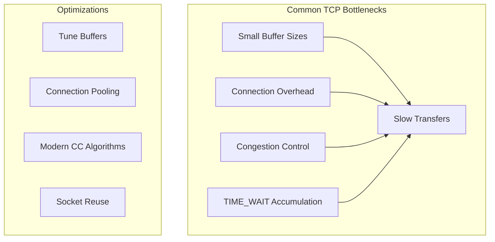
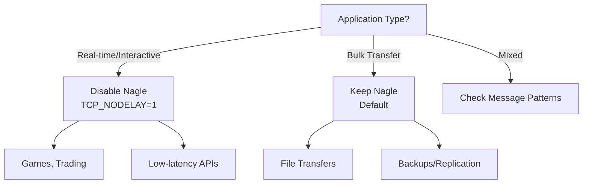

# How to Implement TCP Connection Optimization

Author: [nawazdhandala](https://www.github.com/nawazdhandala)

Tags: TCP, Networking, Performance, Linux, Optimization, DevOps

Description: A hands-on guide to optimizing TCP connections for high-performance applications, covering kernel tuning, connection pooling, keep-alive settings, and congestion control algorithms.

---

TCP is the backbone of most internet communication, but its default settings are often tuned for compatibility rather than performance. This guide covers practical TCP optimizations that can dramatically improve throughput, reduce latency, and handle more concurrent connections.

## Understanding TCP Performance Bottlenecks



## Linux Kernel TCP Tuning

### Buffer Size Optimization

TCP buffers control how much data can be in flight. Larger buffers allow higher throughput on high-latency links.

```bash
# /etc/sysctl.conf - TCP buffer tuning

# Default and maximum socket receive buffer
net.core.rmem_default = 262144
net.core.rmem_max = 16777216

# Default and maximum socket send buffer
net.core.wmem_default = 262144
net.core.wmem_max = 16777216

# TCP-specific buffer sizes (min, default, max)
# These override the core settings for TCP sockets
net.ipv4.tcp_rmem = 4096 262144 16777216
net.ipv4.tcp_wmem = 4096 262144 16777216

# Total memory for TCP buffers (in pages, page = 4KB)
net.ipv4.tcp_mem = 786432 1048576 1572864

# Apply changes
# sysctl -p
```

### Connection Handling Optimization

```bash
# /etc/sysctl.conf - Connection handling

# Maximum number of connections waiting to be accepted
net.core.somaxconn = 65535

# Maximum SYN backlog (half-open connections)
net.ipv4.tcp_max_syn_backlog = 65535

# Enable SYN cookies to protect against SYN floods
net.ipv4.tcp_syncookies = 1

# Reduce SYN-ACK retries for faster timeout of half-open connections
net.ipv4.tcp_synack_retries = 2

# Maximum number of TIME_WAIT sockets
net.ipv4.tcp_max_tw_buckets = 2000000
```

### TIME_WAIT Optimization

TIME_WAIT sockets can accumulate and exhaust resources on busy servers.

```bash
# /etc/sysctl.conf - TIME_WAIT handling

# Allow reuse of TIME_WAIT sockets for new connections
# when safe from a protocol standpoint
net.ipv4.tcp_tw_reuse = 1

# Reduce TIME_WAIT duration (default is 60 seconds)
# Note: This requires kernel 4.12+ with tcp_fin_timeout
net.ipv4.tcp_fin_timeout = 15

# Enable TCP timestamps (required for tcp_tw_reuse)
net.ipv4.tcp_timestamps = 1
```

## Congestion Control Algorithms

Modern congestion control algorithms significantly outperform the default.

```bash
# Check available congestion control algorithms
sysctl net.ipv4.tcp_available_congestion_control

# Check current algorithm
sysctl net.ipv4.tcp_congestion_control

# Set BBR (recommended for most use cases)
# BBR requires kernel 4.9+
sysctl -w net.ipv4.tcp_congestion_control=bbr

# Enable BBR permanently in /etc/sysctl.conf
net.ipv4.tcp_congestion_control = bbr
net.core.default_qdisc = fq
```

### Comparing Congestion Control Algorithms

```bash
#!/bin/bash
# benchmark-cc.sh - Compare congestion control algorithms

ALGORITHMS="cubic bbr reno"
TARGET="speedtest.example.com"
PORT=5201

for algo in $ALGORITHMS; do
    echo "Testing $algo..."
    sysctl -w net.ipv4.tcp_congestion_control=$algo

    # Run iperf3 test
    iperf3 -c $TARGET -p $PORT -t 30 -J > results_$algo.json

    # Extract bandwidth
    bandwidth=$(jq '.end.sum_received.bits_per_second' results_$algo.json)
    echo "$algo: $(echo "scale=2; $bandwidth/1000000000" | bc) Gbps"
done
```

## TCP Keep-Alive Configuration

Keep-alive detects dead connections and keeps connections alive through firewalls.

```bash
# /etc/sysctl.conf - Keep-alive settings

# Time before sending first keep-alive probe (seconds)
net.ipv4.tcp_keepalive_time = 60

# Interval between keep-alive probes
net.ipv4.tcp_keepalive_intvl = 10

# Number of probes before declaring connection dead
net.ipv4.tcp_keepalive_probes = 6
```

### Application-Level Keep-Alive (Python)

```python
import socket

def create_keepalive_socket():
    """Create a socket with TCP keep-alive enabled"""
    sock = socket.socket(socket.AF_INET, socket.SOCK_STREAM)

    # Enable keep-alive
    sock.setsockopt(socket.SOL_SOCKET, socket.SO_KEEPALIVE, 1)

    # Platform-specific keep-alive tuning (Linux)
    # Time before first probe
    sock.setsockopt(socket.IPPROTO_TCP, socket.TCP_KEEPIDLE, 60)
    # Interval between probes
    sock.setsockopt(socket.IPPROTO_TCP, socket.TCP_KEEPINTVL, 10)
    # Number of probes
    sock.setsockopt(socket.IPPROTO_TCP, socket.TCP_KEEPCNT, 6)

    return sock

# Usage
sock = create_keepalive_socket()
sock.connect(("api.example.com", 443))
```

## Connection Pooling

Creating new TCP connections is expensive. Connection pooling reuses existing connections.

### Python Connection Pool

```python
import urllib3
from urllib3.util.retry import Retry

def create_connection_pool():
    """Create an optimized HTTP connection pool"""

    # Retry configuration
    retries = Retry(
        total=3,
        backoff_factor=0.5,
        status_forcelist=[500, 502, 503, 504]
    )

    # Create pool manager with connection reuse
    pool = urllib3.PoolManager(
        num_pools=10,           # Number of host pools to cache
        maxsize=20,             # Max connections per host
        block=True,             # Block when pool is full
        retries=retries,
        timeout=urllib3.Timeout(connect=5.0, read=30.0),

        # Socket options for better performance
        socket_options=[
            (socket.SOL_SOCKET, socket.SO_KEEPALIVE, 1),
            (socket.IPPROTO_TCP, socket.TCP_NODELAY, 1),
        ]
    )

    return pool

# Usage
pool = create_connection_pool()
response = pool.request("GET", "https://api.example.com/data")
```

### Go Connection Pool with Custom Dialer

```go
package main

import (
    "net"
    "net/http"
    "time"
)

func createOptimizedClient() *http.Client {
    // Custom dialer with TCP optimizations
    dialer := &net.Dialer{
        Timeout:   30 * time.Second,
        KeepAlive: 30 * time.Second,

        // Control function for low-level socket options
        Control: func(network, address string, conn syscall.RawConn) error {
            return conn.Control(func(fd uintptr) {
                // Enable TCP_NODELAY (disable Nagle's algorithm)
                syscall.SetsockoptInt(int(fd), syscall.IPPROTO_TCP,
                    syscall.TCP_NODELAY, 1)

                // Set TCP_QUICKACK for faster ACKs
                syscall.SetsockoptInt(int(fd), syscall.IPPROTO_TCP,
                    12, 1) // TCP_QUICKACK = 12
            })
        },
    }

    // Transport with connection pooling
    transport := &http.Transport{
        DialContext:           dialer.DialContext,
        MaxIdleConns:          100,
        MaxIdleConnsPerHost:   20,
        MaxConnsPerHost:       50,
        IdleConnTimeout:       90 * time.Second,
        TLSHandshakeTimeout:   10 * time.Second,
        ExpectContinueTimeout: 1 * time.Second,

        // Disable HTTP/2 if you need fine-grained connection control
        // ForceAttemptHTTP2: false,
    }

    return &http.Client{
        Transport: transport,
        Timeout:   60 * time.Second,
    }
}
```

## TCP_NODELAY vs Nagle's Algorithm

Nagle's algorithm batches small packets to improve efficiency, but adds latency.

```python
import socket

# For latency-sensitive applications, disable Nagle
sock = socket.socket(socket.AF_INET, socket.SOCK_STREAM)
sock.setsockopt(socket.IPPROTO_TCP, socket.TCP_NODELAY, 1)

# For bulk transfers where latency is less critical,
# keep Nagle enabled (default)
```

### When to Disable Nagle



## Monitoring TCP Performance

```bash
#!/bin/bash
# tcp-stats.sh - Monitor TCP connection statistics

echo "=== TCP Connection States ==="
ss -s

echo -e "\n=== TIME_WAIT Sockets ==="
ss -tan state time-wait | wc -l

echo -e "\n=== Connection by State ==="
ss -tan | awk 'NR>1 {print $1}' | sort | uniq -c | sort -rn

echo -e "\n=== Retransmission Rate ==="
netstat -s | grep -E "(retransmit|timeout)"

echo -e "\n=== Buffer Usage ==="
cat /proc/net/sockstat

echo -e "\n=== Current Congestion Control ==="
sysctl net.ipv4.tcp_congestion_control
```

### Detailed Connection Analysis

```bash
# Watch TCP connections in real-time
watch -n 1 'ss -tin dst :443 | head -20'

# Show detailed socket info including buffer sizes
ss -tim

# Sample output interpretation:
# cubic wscale:7,7 rto:204 rtt:3.125/1.875 ato:40 mss:1460
# pmtu:1500 rcvmss:1460 advmss:1460 cwnd:10 bytes_sent:1234
# bytes_acked:1234 bytes_received:5678 segs_out:10 segs_in:8
# data_segs_out:5 data_segs_in:4 send 37.4Mbps lastrcv:8
# pacing_rate 74.8Mbps delivery_rate 37.4Mbps delivered:6
# busy:4ms rcv_space:29200 rcv_ssthresh:64088 minrtt:3
```

## Nginx TCP Optimization

```nginx
# /etc/nginx/nginx.conf

worker_processes auto;
worker_rlimit_nofile 65535;

events {
    worker_connections 65535;
    use epoll;
    multi_accept on;
}

http {
    # TCP optimizations
    sendfile on;
    tcp_nopush on;
    tcp_nodelay on;

    # Keep-alive settings
    keepalive_timeout 65;
    keepalive_requests 10000;

    # Upstream keep-alive
    upstream backend {
        server 10.0.1.100:8080;
        server 10.0.1.101:8080;

        keepalive 32;  # Keep 32 idle connections per worker
        keepalive_requests 1000;
        keepalive_timeout 60s;
    }

    server {
        listen 80 backlog=65535 reuseport;

        location /api/ {
            proxy_pass http://backend;
            proxy_http_version 1.1;
            proxy_set_header Connection "";
        }
    }
}
```

## Complete Sysctl Configuration

```bash
# /etc/sysctl.d/99-tcp-optimization.conf
# Complete TCP optimization for high-performance servers

# Buffer sizes
net.core.rmem_default = 262144
net.core.rmem_max = 16777216
net.core.wmem_default = 262144
net.core.wmem_max = 16777216
net.ipv4.tcp_rmem = 4096 262144 16777216
net.ipv4.tcp_wmem = 4096 262144 16777216

# Connection handling
net.core.somaxconn = 65535
net.ipv4.tcp_max_syn_backlog = 65535
net.core.netdev_max_backlog = 65535

# TIME_WAIT handling
net.ipv4.tcp_tw_reuse = 1
net.ipv4.tcp_fin_timeout = 15

# Keep-alive
net.ipv4.tcp_keepalive_time = 60
net.ipv4.tcp_keepalive_intvl = 10
net.ipv4.tcp_keepalive_probes = 6

# Congestion control (BBR)
net.ipv4.tcp_congestion_control = bbr
net.core.default_qdisc = fq

# Timestamps and window scaling
net.ipv4.tcp_timestamps = 1
net.ipv4.tcp_window_scaling = 1
net.ipv4.tcp_sack = 1

# Fast Open (reduce connection latency)
net.ipv4.tcp_fastopen = 3

# SYN flood protection
net.ipv4.tcp_syncookies = 1
net.ipv4.tcp_synack_retries = 2
```

## Benchmarking Your Changes

```bash
#!/bin/bash
# tcp-benchmark.sh - Benchmark TCP performance

echo "Before optimization baseline..."
iperf3 -c speedtest.example.com -t 30 -J > before.json

echo "Apply optimizations..."
sysctl -p /etc/sysctl.d/99-tcp-optimization.conf

echo "After optimization..."
iperf3 -c speedtest.example.com -t 30 -J > after.json

# Compare results
echo "=== Results ==="
echo "Before: $(jq '.end.sum_received.bits_per_second/1e9' before.json) Gbps"
echo "After: $(jq '.end.sum_received.bits_per_second/1e9' after.json) Gbps"
```

---

TCP optimization is not a one-size-fits-all approach. The right settings depend on your network conditions, application patterns, and hardware. Start with the basics, measure the impact, and adjust based on your specific workload.
